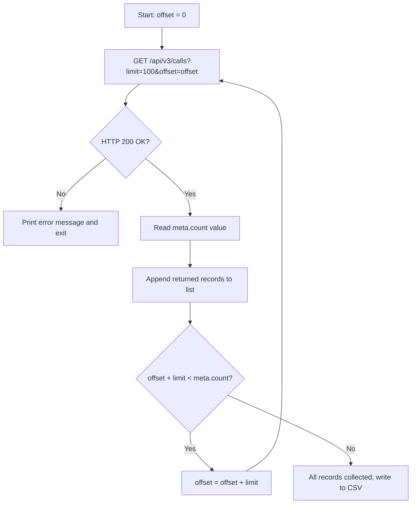

## Overview

In call centers and sales teams, every missed call can represent a lost business opportunity or an unhandled support ticket. To enable teams to follow up on these calls promptly, call records must be regularly reported and exported to internal CRM or reporting systems.

In this guide, we will step through using the Hipcall API to filter missed calls from the last 7 days by date and status parameters, iterate through all records using pagination, and build a working C# console application that exports the results directly to a CSV file.

## Before you start

Before getting started, make sure you have the following prerequisites in place:

- A valid **Hipcall API key** with permissions to read call detail records (CDRs).
- The **.NET 8 SDK** installed on your workstation or server (`dotnet --version` output should be `8.0` or higher).
- A few call records in your account to test pagination behavior.

Set your API key as an environment variable in your terminal session:

```bash
export HIPCALL_API_TOKEN="SFMyNTY.g2gDbQAAAC..."
```

## Filtering the calls you want

Hipcall API list endpoints utilize a flexible bracket filter syntax (`?field[operator]=value`).

To retrieve missed calls within a specific date range, we combine three core filters:
- `missing_call[eq]=true`: Returns only missed (unanswered) calls.
- `started_at[gte]`: Calls that started on or after the specified start date.
- `started_at[lte]`: Calls that started on or before the specified end date.

Example filter request:

```bash
curl -sS -H "Authorization: Bearer $HIPCALL_API_TOKEN" \
  "https://use.hipcall.com/api/v3/calls?missing_call%5Beq%5D=true&started_at%5Bgte%5D=2026-09-01T00%3A00%3A00Z&started_at%5Blte%5D=2026-09-08T23%3A59%3A59Z&limit=100"
```

| Filter | Operator | Value | Purpose |
|---|---|---|---|
| `missing_call` | `eq` | `true` | Returns only missed calls. |
| `started_at` | `gte` | `2026-09-01T00:00:00Z` | Calls on or after the specified timestamp. |
| `started_at` | `lte` | `2026-09-08T23:59:59Z` | Calls on or before the specified timestamp. |

Timestamps must always be sent in ISO 8601 UTC format (`YYYY-MM-DDTHH:mm:ssZ`). To ensure compatibility across different HTTP clients and proxies, encode the `[` and `]` characters in URLs as `%5B` and `%5D` respectively.

## Response structure and pagination logic

Hipcall list endpoints return a standard response envelope containing `data` and `meta` objects:

```json
{
  "data": [ ... ],
  "meta": {
    "count": 142,
    "offset": 0,
    "limit": 100
  }
}
```

| Field | Description |
|---|---|
| `data` | Array of call records returned for the current page. |
| `meta.count` | Total number of records matching the filter criteria. |
| `meta.offset` | Number of records skipped before this page. |
| `meta.limit` | Maximum records returned per page (default: 10, maximum: 100). |

The total page count is calculated using the formula `ceil(meta.count / meta.limit)`. To collect all records, increment `offset` by `limit` on each step within a loop:



## Complete script (C# Console Application)

The following C# application fetches missed calls from the last 7 days, collects all records across page boundaries, and writes them to a `missed-calls-YYYY-MM-DD.csv` file:

```csharp
using System.Net.Http.Headers;
using System.Text.Json;

string? token = Environment.GetEnvironmentVariable("HIPCALL_API_TOKEN");
if (string.IsNullOrWhiteSpace(token))
{
    Console.Error.WriteLine("Error: HIPCALL_API_TOKEN environment variable is not set.");
    return 1;
}

const string baseUrl = "https://use.hipcall.com/api/v3/calls";
const int pageSize = 100;
string csvFile = $"missed-calls-{DateTime.UtcNow:yyyy-MM-dd}.csv";

string from = DateTime.UtcNow.AddDays(-7).Date.ToString("yyyy-MM-ddT00:00:00Z");
string to = DateTime.UtcNow.Date.ToString("yyyy-MM-ddT23:59:59Z");

using var client = new HttpClient();
client.DefaultRequestHeaders.Authorization = new AuthenticationHeaderValue("Bearer", token);

var allCalls = new List<JsonElement>();
int offset = 0;
int totalCount;

do
{
    string url = $"{baseUrl}?missing_call%5Beq%5D=true"
               + $"&started_at%5Bgte%5D={Uri.EscapeDataString(from)}"
               + $"&started_at%5Blte%5D={Uri.EscapeDataString(to)}"
               + $"&limit={pageSize}&offset={offset}";

    HttpResponseMessage response = await client.GetAsync(url);
    string body = await response.Content.ReadAsStringAsync();

    if (!response.IsSuccessStatusCode)
    {
        Console.Error.WriteLine($"Error: {(int)response.StatusCode} {response.StatusCode}");
        Console.Error.WriteLine(body);
        return 1;
    }

    using JsonDocument doc = JsonDocument.Parse(body);
    JsonElement meta = doc.RootElement.GetProperty("meta");
    totalCount = meta.GetProperty("count").GetInt32();

    foreach (JsonElement call in doc.RootElement.GetProperty("data").EnumerateArray())
    {
        allCalls.Add(call.Clone());
    }

    offset += meta.GetProperty("limit").GetInt32();

} while (offset < totalCount);

using var writer = new StreamWriter(csvFile);
writer.WriteLine("date;caller_number;callee_number;duration_seconds");
foreach (JsonElement call in allCalls)
{
    string date = call.TryGetProperty("started_at", out var s) ? s.GetString() ?? "" : "";
    string caller = call.TryGetProperty("caller_number", out var c) ? c.GetString() ?? "" : "";
    string callee = call.TryGetProperty("callee_number", out var e) ? e.GetString() ?? "" : "";
    string dur = call.TryGetProperty("call_duration", out var d) ? d.ToString() : "0";
    writer.WriteLine($"\"{date}\";\"{caller}\";\"{callee}\";{dur}");
}

Console.WriteLine($"Completed. {allCalls.Count} missed calls exported to {csvFile}.");
return 0;
```

To run the script:

```bash
export HIPCALL_API_TOKEN="SFMyNTY.g2gDbQAAAC..."
dotnet run
```

### Key architectural details

- **Single HttpClient usage:** Creating a `new HttpClient()` inside a loop causes socket exhaustion under high request volume; a single `using var` instance avoids this issue.
- **Loop driven by total count:** Instead of waiting for an empty page, the loop uses `meta.count` from the initial response to calculate exactly how many pages to fetch.
- **Preserving error bodies:** When a request fails, the response body is printed to stderr so the descriptive error message returned by the API is never lost.

## When it fails

### 1. 401 Unauthorized
Your API token may be undefined, copied incorrectly, or expired:

```json
{
  "errors": {
    "detail": "Not authorized. Check your API token is valid and not expired."
  }
}
```

**Resolution:** Verify your API key status in the developer dashboard and redefine the environment variable in your terminal session.

### 2. 422 Unprocessable Entity
Returned when an unsupported filter field or an invalid parameter value is passed in the request:

```json
{
  "errors": {
    "started_at": ["#/started_at/invalid_param: Unexpected field: invalid_param"]
  }
}
```

Common mistakes and solutions:

| Error Cause | API Message | Fix |
|---|---|---|
| `limit=1000` (Upper limit 100) | `For 'limit': Value must be less than 100.` | Set `limit` to a maximum value of 100. |
| `started_at[eq]=...` | `Unexpected field: eq` | Use range operators `gte` and `lte` for dates. |
| Non-standard date format | `Invalid datetime format (expected ISO8601)` | Format timestamps as `2026-09-01T00:00:00Z`. |
| Numeric direction parameter (`direction[eq]=1`) | `Value must be a string.` | Use string values for direction: `inbound` or `outbound`. |

### 3. 429 Too Many Requests
Returned when you exceed the rate limit per minute (the standard limit is 60 requests per minute). Introduce short pauses between pagination requests and retry.

## Parameter reference

Parameters available when filtering on the `/api/v3/calls` endpoint:

| Parameter | Type | Required | Description |
|---|---|---|---|
| `limit` | integer | no | Records returned per page. Range: 1–100. Default: 10. |
| `offset` | integer | no | Number of records to skip. Default: 0. |
| `missing_call[eq]` | boolean | no | Set to `true` for missed calls, `false` for answered calls. |
| `started_at[gte]` | string | no | Start of the date range in ISO 8601 UTC format. |
| `started_at[lte]` | string | no | End of the date range in ISO 8601 UTC format. |
| `direction[eq]` | string | no | Call direction: `inbound` or `outbound`. |
| `direction[in]` | string | no | Multiple directions, comma-separated. |
| `sort` | string | no | Sort field and order. Format: `field.asc` or `field.desc`. The `/calls` endpoint supports `started_at`. |

## Next steps

- Visit the `/contacts` and `/companies` endpoints in the [Hipcall API Reference](https://use.hipcall.com/api-docs/) to explore other record types.
- Check out the outbound calling and number masking guide to speed up customer callback workflows.
- Share your integration questions on the [Hipcall Community](https://community.hipcall.com/) platform.
