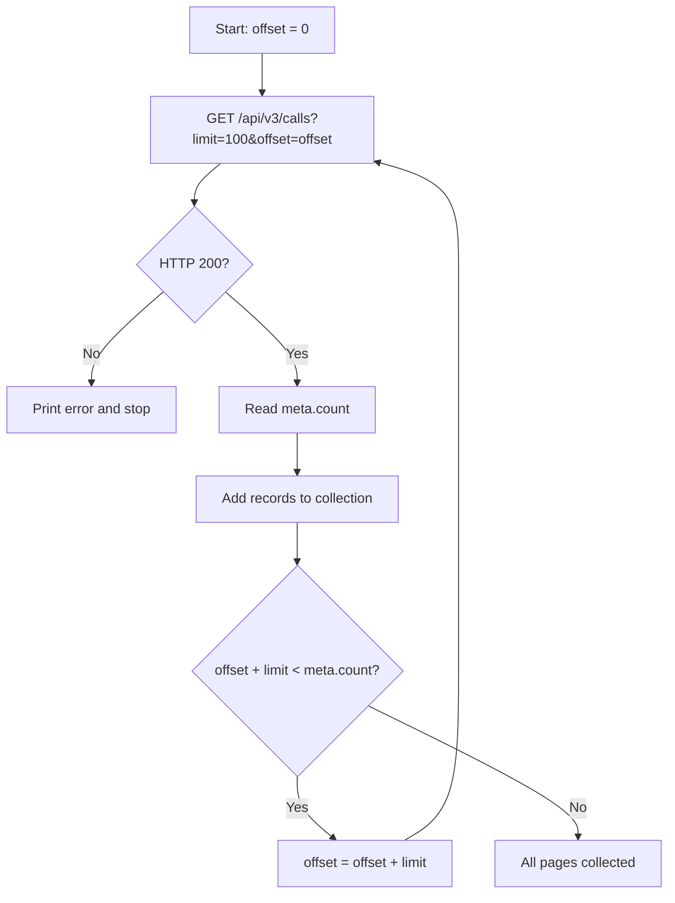

## Overview

This guide walks through exporting missed calls from the HipCall API to a CSV file. You will learn how to filter calls by date range and state, page through all records using the `meta` object, and handle common API errors. By the end, you will have a working C# console application that pulls the last seven days of missed calls and writes them to disk.

## Before you start

You need:

- A HipCall API key with access to the calls endpoint. If you do not have one, follow the guide at [/blog/how-to-get-a-hipcall-api-key/](/blog/how-to-get-a-hipcall-api-key/).
- .NET 8 or later installed (`dotnet --version` should print `8.0` or higher).
- At least 20–30 call records in your account. An empty account returns zero results and makes it harder to verify pagination.

Store your API key in an environment variable:

```bash
export HIPCALL_API_TOKEN="..."
```

## Understanding the response

All list endpoints in the HipCall API return the same standard structure:

```json
{
  "data": [ ... ],
  "meta": {
    "count": 142,
    "offset": 0,
    "limit": 10
  }
}
```

| Field | Meaning |
|---|---|
| `data` | An array of records for the current page. |
| `meta.count` | Total number of records matching your filters across all pages. |
| `meta.offset` | How many records were skipped before this page. |
| `meta.limit` | Maximum number of records per page (default: 10, maximum: 100). |

If `count` is 142 and `limit` is 100, the first page returns 100 records and the second page returns 42. The formula for total pages is:

```
total_pages = ceil(count / limit)
```

Requesting a `limit` above 100 does not silently cap the value. The API rejects it with a `422` error: `For 'limit': Value must be less than 100.`

## Filtering the calls you want

HipCall uses bracket syntax for filters:

```
?field[operator]=value
```

Combine the missing_call, started_at[gte], and started_at[lte] filters to pull missed calls within a specific date range:

```bash
curl -sS -H "Authorization: Bearer $HIPCALL_API_TOKEN" \
  "https://use.hipcall.com.tr/api/v3/calls?missing_call%5Beq%5D=true&started_at%5Bgte%5D=2026-09-01T00%3A00%3A00Z&started_at%5Blte%5D=2026-09-08T00%3A00%3A00Z&limit=100"
```

The three filters in plain text:

| Filter | Operator | Value | Purpose |
|---|---|---|---|
| `missing_call` | `eq` | `true` | Only missed (unanswered) calls. |
| `started_at` | `gte` | `2026-09-01T00:00:00Z` | Calls on or after this date. |
| `started_at` | `lte` | `2026-09-08T23:59:59Z` | Calls on or before this date. |

Dates must be in ISO 8601 UTC format. Sending a non-ISO value like `yesterday` returns a `422` error: `Invalid datetime format (expected ISO8601)`.

The brackets in filter names (`[` and `]`) must be URL-encoded as `%5B` and `%5D`. Some HTTP clients handle this automatically, but others (including the .NET `HttpClient`) may not. If the API ignores your filter, check whether the brackets reached the server unescaped.

### Direction filter

The `direction` filter accepts string values (`inbound`, `outbound`), not numbers. Sending `direction[eq]=1` returns `Value must be a string.`

To filter for multiple values at once, use the `in` operator with comma-separated values:

```bash
curl -sS -H "Authorization: Bearer $HIPCALL_API_TOKEN" \
  "https://use.hipcall.com.tr/api/v3/calls?direction%5Bin%5D=inbound,outbound"
```

## Paging through every result

The paging loop reads `meta.count` on the first response and increments `offset` by `limit` until all records are collected.



An alternative approach is to keep fetching pages until you receive an empty `data` array. However, this method is brittle: if a new call arrives between requests, the dataset shifts, and you might duplicate or skip records. Instead, use the `meta.count` value to determine exactly when to stop your pagination loop.

## The full example


```csharp
using System.Net.Http.Headers;
using System.Text.Json;

// Read the API key from an environment variable
string? token = Environment.GetEnvironmentVariable("HIPCALL_API_TOKEN");
if (string.IsNullOrWhiteSpace(token))
{
    Console.Error.WriteLine("Error: HIPCALL_API_TOKEN environment variable is not set.");
    return 1;
}

const string baseUrl = "https://use.hipcall.com.tr/api/v3/calls";
const int pageSize = 100;
string csvFile = $"missed-calls-{DateTime.UtcNow:yyyy-MM-dd}.csv";

// Calculate the date range for the last 7 days (UTC)
string from = DateTime.UtcNow.AddDays(-7).Date.ToString("yyyy-MM-ddT00:00:00Z");
string to = DateTime.UtcNow.Date.ToString("yyyy-MM-ddT00:00:00Z");

// Use a single HttpClient instance — do not create new ones inside the loop
using var client = new HttpClient();
client.DefaultRequestHeaders.Authorization =
    new AuthenticationHeaderValue("Bearer", token);

var allCalls = new List<JsonElement>();
int offset = 0;
int totalCount;

// Pagination loop: keep going until offset reaches meta.count
do
{
    // Brackets must be URL-encoded: [ → %5B, ] → %5D
    string url = $"{baseUrl}?missing_call%5Beq%5D=true"
               + $"&started_at%5Bgte%5D={Uri.EscapeDataString(from)}"
               + $"&started_at%5Blte%5D={Uri.EscapeDataString(to)}"
               + $"&limit={pageSize}&offset={offset}";
               
    HttpResponseMessage response = await client.GetAsync(url);
    string body = await response.Content.ReadAsStringAsync();

    // Print the response body on error — do not swallow it
    if (!response.IsSuccessStatusCode)
    {
        Console.Error.WriteLine($"Error: {(int)response.StatusCode} {response.StatusCode}");
        Console.Error.WriteLine(body);
        return 1;
    }

    using JsonDocument doc = JsonDocument.Parse(body);
    JsonElement meta = doc.RootElement.GetProperty("meta");
    totalCount = meta.GetProperty("count").GetInt32();

    foreach (JsonElement call in doc.RootElement.GetProperty("data").EnumerateArray())
        allCalls.Add(call.Clone());

    offset += meta.GetProperty("limit").GetInt32();

} while (offset < totalCount);

// Write collected records to a CSV file
using var writer = new StreamWriter(csvFile);
writer.WriteLine("date;caller_number;callee_number;duration_seconds");
foreach (JsonElement call in allCalls)
{
    string date = call.TryGetProperty("started_at", out var s) ? s.GetString() ?? "" : "";
    string caller = call.TryGetProperty("caller_number", out var c) ? c.GetString() ?? "" : "";
    string callee = call.TryGetProperty("callee_number", out var e) ? e.GetString() ?? "" : "";
    string dur = call.TryGetProperty("call_duration", out var d) ? d.ToString() : "0";
    writer.WriteLine($"\"{date}\";\"{caller}\";\"{callee}\";{dur}");
}

Console.WriteLine($"Done. {allCalls.Count} missed call(s) written to {csvFile}");
return 0;
```

Run it:

```bash
export HIPCALL_API_TOKEN="..."
dotnet run
```

Key design decisions:

- **Single `HttpClient` instance.** Creating a new `HttpClient` per request leaks sockets. The `using var` declaration keeps one instance alive for the entire run.
- **`meta.count`-based loop.** The loop reads the total count once and calculates when to stop, rather than waiting for an empty page.
- **Error body is printed, not swallowed.** `EnsureSuccessStatusCode()` throws an exception but hides the response body. Reading the body first gives the developer the actual error message from the API.

## When it fails

### 401 Unauthorized

The API key is missing, invalid, or expired.

```json
{
  "errors": {
    "detail": "Not authorized. Check your API token is valid and not expired."
  }
}
```

Delete the old key in the panel and create a new one.

### 422 Unprocessable Entity

A parameter has an invalid value or an unsupported filter was used.

```json
{
  "errors": {
    "started_at": ["#/started_at/yakin: Unexpected field: yakin"]
  }
}
```

Common causes:

| Mistake | Error message |
|---|---|
| `limit=1000` (above max) | `For 'limit': Value must be less than 100.` |
| `limit=0` or negative | `For 'limit': Value must be greater than 1.` |
| `started_at[eq]=...` (unsupported operator for dates) | `Unexpected field: eq` |
| `created_at[gte]=...` on `/contacts` (field not supported) | `Unexpected field: created_at` |
| Non-ISO date like `yesterday` | `Invalid datetime format (expected ISO8601)` |
| `direction[eq]=1` (number instead of string) | `Value must be a string.` |
| `sort=telefon_numarasi.asc` (invalid sort field) | `Invalid sort fields: ["telefon_numarasi.asc"]` |

The API never silently ignores an invalid filter. Every unsupported field, operator, or value returns a `422` error with a descriptive message. This is good: it prevents you from accidentally running an unfiltered query and processing incomplete data.

### 429 Too Many Requests

You exceeded the rate limit (60 requests per minute on the DEMO environment). Wait and retry.

## Parameter reference

| Parameter | Type | Required | Description |
|---|---|---|---|
| `limit` | integer | no | Records per page. Range: 1–100. Default: 10. |
| `offset` | integer | no | Number of records to skip. Default: 0. |
| `missing_call[eq]` | boolean | no | `true` for missed calls, `false` for answered calls. |
| `started_at[gte]` | string | no | Start of the date range. ISO 8601 UTC format. |
| `started_at[lte]` | string | no | End of the date range. ISO 8601 UTC format. |
| `direction[eq]` | string | no | Call direction: `inbound` or `outbound`. |
| `direction[in]` | string | no | Multiple directions, comma-separated. |
| `sort` | string | no | Sort field and direction. Format: `field.asc` or `field.desc`. The `/calls` endpoint supports `started_at`. |

## Next steps

Explore other list endpoints like [/api/v3/contacts](https://use.hipcall.com/api-docs/) and [/api/v3/companies](https://use.hipcall.com/api-docs/) to see which filters and sort fields each one supports.

Ask questions or share your integration experience in the [HipCall Community](https://community.hipcall.com/).
