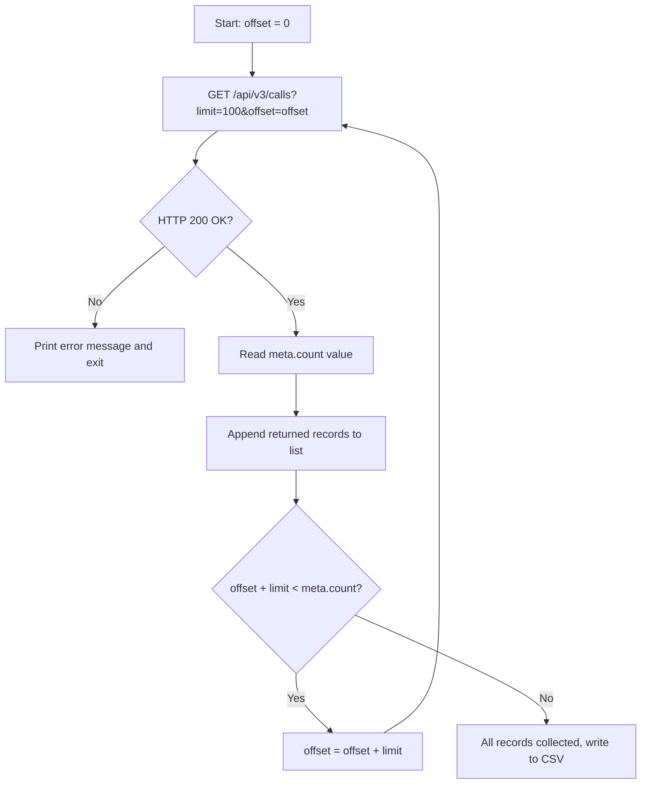

## Overview

Missed calls pile up fast in a busy call center. You can download a report from the web dashboard when you need a quick look, but if your CRM needs those records every morning at 8 AM, you need something that runs on its own.

The Hipcall API lets you pull call detail records using flexible filters and page through all of them. This guide shows how to pull missed calls, page through the results, and write them to a CSV file using a C# script.

## Before you start

Before getting started, make sure you have:

- A valid Hipcall API key that can read call records.
- The .NET 8 SDK installed on your workstation or server (`dotnet --version` should output `8.0` or higher).
- A few call records in your account to test pagination.

Set your API key as an environment variable in your terminal session:

```bash
export HIPCALL_API_TOKEN="SFMyNTY.g2gDbQAAAC..."
```

## Filtering calls by date and status

Hipcall API list endpoints use a bracket filter syntax (`?field[operator]=value`).

To get missed calls within a specific date range, combine three filters:
- `missing_call[eq]=true`: Returns only missed calls.
- `started_at[gte]`: Calls on or after the start date.
- `started_at[lte]`: Calls on or before the end date.

Example filter request:

```bash
curl -sS -H "Authorization: Bearer $HIPCALL_API_TOKEN" \
  "https://use.hipcall.com/api/v3/calls?missing_call%5Beq%5D=true&started_at%5Bgte%5D=2026-09-01T00%3A00%3A00Z&started_at%5Blte%5D=2026-09-08T23%3A59%3A59Z&limit=100"
```

| Filter | Operator | Value | Purpose |
|---|---|---|---|
| `missing_call` | `eq` | `true` | Returns only missed calls. |
| `started_at` | `gte` | `2026-09-01T00:00:00Z` | Calls on or after the specified timestamp. |
| `started_at` | `lte` | `2026-09-08T23:59:59Z` | Calls on or before the specified timestamp. |

Timestamps must always be in ISO 8601 UTC format (`YYYY-MM-DDTHH:mm:ssZ`). URL-encode the `[` and `]` characters as `%5B` and `%5D` to prevent issues with some HTTP clients.

## Response structure and pagination logic

Hipcall list endpoints return a `data` array and a `meta` object:

```json
{
  "data": [ ... ],
  "meta": {
    "count": 142,
    "offset": 0,
    "limit": 100
  }
}
```

| Field | Description |
|---|---|
| `data` | The call records for the current page. |
| `meta.count` | Total number of records matching the filter. |
| `meta.offset` | Number of records skipped before this page. |
| `meta.limit` | Maximum records returned per page (default: 10, max: 100). |

The total page count is `ceil(meta.count / meta.limit)`. If you have 142 records and a limit of 100, the first page returns 100 and the second returns 42. To collect all records, increment `offset` by `limit` in a loop:



If a new call arrives or is deleted while you are paging, the list shifts. You might see the same record twice or miss one on the next page.

## The full script

This C# console app fetches missed calls from the last 7 days, pages through all records, and writes them to a `missed-calls-YYYY-MM-DD.csv` file:

```csharp
using System.Net.Http.Headers;
using System.Text.Json;

string? token = Environment.GetEnvironmentVariable("HIPCALL_API_TOKEN");
if (string.IsNullOrWhiteSpace(token))
{
    Console.Error.WriteLine("Error: HIPCALL_API_TOKEN environment variable is not set.");
    return 1;
}

const string baseUrl = "https://use.hipcall.com/api/v3/calls";
const int pageSize = 100;
string csvFile = $"missed-calls-{DateTime.UtcNow:yyyy-MM-dd}.csv";

string from = DateTime.UtcNow.AddDays(-7).Date.ToString("yyyy-MM-ddT00:00:00Z");
string to = DateTime.UtcNow.Date.ToString("yyyy-MM-ddT23:59:59Z");

using var client = new HttpClient();
client.DefaultRequestHeaders.Authorization = new AuthenticationHeaderValue("Bearer", token);

var allCalls = new List<JsonElement>();
int offset = 0;
int totalCount;

do
{
    string url = $"{baseUrl}?missing_call%5Beq%5D=true"
               + $"&started_at%5Bgte%5D={Uri.EscapeDataString(from)}"
               + $"&started_at%5Blte%5D={Uri.EscapeDataString(to)}"
               + $"&limit={pageSize}&offset={offset}";

    HttpResponseMessage response = await client.GetAsync(url);
    string body = await response.Content.ReadAsStringAsync();

    if (!response.IsSuccessStatusCode)
    {
        Console.Error.WriteLine($"Error: {(int)response.StatusCode} {response.StatusCode}");
        Console.Error.WriteLine(body);
        return 1;
    }

    using JsonDocument doc = JsonDocument.Parse(body);
    JsonElement meta = doc.RootElement.GetProperty("meta");
    totalCount = meta.GetProperty("count").GetInt32();

    foreach (JsonElement call in doc.RootElement.GetProperty("data").EnumerateArray())
    {
        allCalls.Add(call.Clone());
    }

    offset += meta.GetProperty("limit").GetInt32();

} while (offset < totalCount);

using var writer = new StreamWriter(csvFile);
writer.WriteLine("date;caller_number;callee_number;duration_seconds");
foreach (JsonElement call in allCalls)
{
    string date = call.TryGetProperty("started_at", out var s) ? s.GetString() ?? "" : "";
    string caller = call.TryGetProperty("caller_number", out var c) ? c.GetString() ?? "" : "";
    string callee = call.TryGetProperty("callee_number", out var e) ? e.GetString() ?? "" : "";
    string dur = call.TryGetProperty("call_duration", out var d) ? d.ToString() : "0";
    writer.WriteLine($"\"{date}\";\"{caller}\";\"{callee}\";{dur}");
}

Console.WriteLine($"Completed. {allCalls.Count} missed calls exported to {csvFile}.");
return 0;
```

To run the application:

```bash
export HIPCALL_API_TOKEN="SFMyNTY.g2gDbQAAAC..."
dotnet run
```

### Notes on this code

- **Single HttpClient:** Create a single `HttpClient` and reuse it. Opening a new one per request inside a loop exhausts sockets.
- **Loop driven by meta.count:** The loop stops based on `meta.count`. Waiting for an empty page wastes an extra request and causes issues if records shift while paging.
- **Preserving error bodies:** When a request fails, print the full response body. Using only `EnsureSuccessStatusCode()` hides the API's error message.

## When it fails

### 401 Unauthorized

Your API token is missing, wrong, or expired:

```json
{
  "errors": {
    "detail": "Not authorized. Check your API token is valid and not expired."
  }
}
```

Verify your API key in the developer dashboard and redefine the environment variable.

### 422 Unprocessable Entity

The API rejected an unsupported filter field or an invalid value:

```json
{
  "errors": {
    "started_at": ["#/started_at/invalid_param: Unexpected field: invalid_param"]
  }
}
```

Common mistakes and solutions:

| Error Cause | API Message | Fix |
|---|---|---|
| `limit=1000` (max 100) | `For 'limit': Value must be less than 100.` | Set `limit` to 100 or less. |
| `started_at[eq]=...` | `Unexpected field: eq` | Use `gte` and `lte` for dates. |
| Non-standard date format | `Invalid datetime format (expected ISO8601)` | Format timestamps as `2026-09-01T00:00:00Z`. |
| Numeric direction (`direction[eq]=1`) | `Value must be a string.` | Use `inbound` or `outbound`. |

### 429 Too Many Requests

You exceeded the rate limit (60 requests per minute). Add a short pause between pagination requests and retry.

## Parameter reference

Parameters for the `/api/v3/calls` endpoint:

| Parameter | Type | Required | Description |
|---|---|---|---|
| `limit` | integer | no | Records per page. Range: 1–100. Default: 10. |
| `offset` | integer | no | Number of records to skip. Default: 0. |
| `missing_call[eq]` | boolean | no | Set to `true` for missed calls, `false` for answered calls. |
| `started_at[gte]` | string | no | Start of the date range in ISO 8601 UTC. |
| `started_at[lte]` | string | no | End of the date range in ISO 8601 UTC. |
| `direction[eq]` | string | no | `inbound` or `outbound`. |
| `direction[in]` | string | no | Multiple directions, comma-separated. |
| `sort` | string | no | Sort field and order, e.g. `started_at.desc`. |

## Next steps

- Visit the `/contacts` and `/companies` endpoints in the [Hipcall API Reference](https://use.hipcall.com/api-docs/).
- Read the outbound calling and number masking guide to set up customer callbacks.
- Ask questions in the [Hipcall Community](https://community.hipcall.com/).
