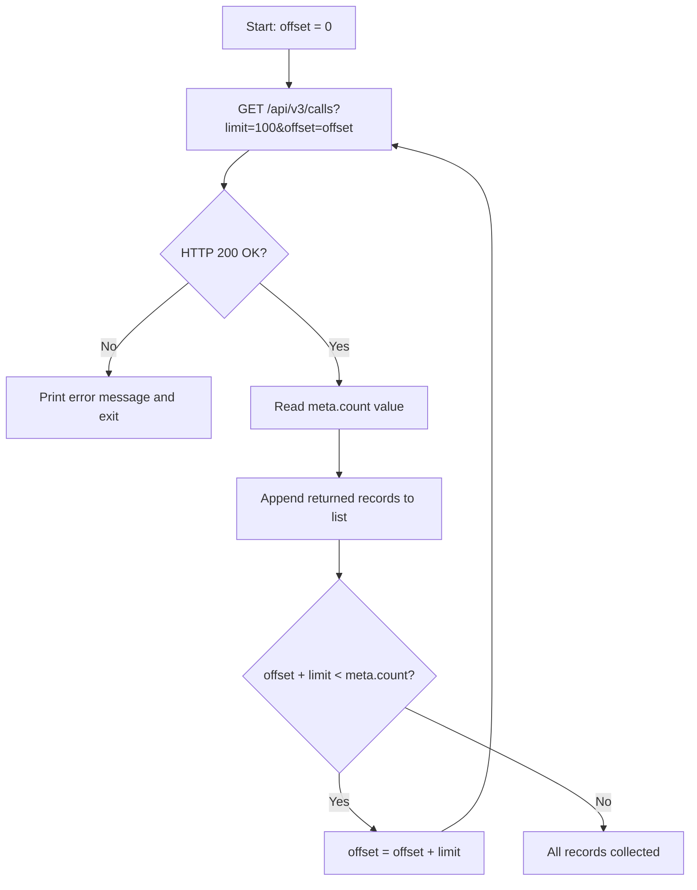

## Overview

Missed calls pile up in a busy call center. You can download a report from the web dashboard. However, if your CRM needs those records every morning at 8 AM, you need an automated script.

The Hipcall API lets you pull call detail records using flexible filters and page through all of them. This guide shows how to pull missed calls, page through the results, and parse the data using C#.

## Before you start

Before getting started, make sure you have:

- A valid Hipcall API key that can read call records.
- The .NET 8 SDK installed on your workstation or server (`dotnet --version` should output `8.0` or higher).
- A few call records in your account to test pagination.

Set your API key as an environment variable in your terminal session:

```bash
export HIPCALL_API_TOKEN="SFMyNTY.g2gDbQAAAC..."
```

## Filtering calls by date and status

Hipcall API list endpoints use a bracket filter syntax (`?field[operator]=value`).

To get missed calls within a specific date range, combine three filters:
- `missing_call[eq]=true`: Returns missed calls.
- `started_at[gte]`: Calls on or after the start date.
- `started_at[lte]`: Calls on or before the end date.

Example filter request:

```bash
curl -sS -H "Authorization: Bearer $HIPCALL_API_TOKEN" \
  "https://use.hipcall.com/api/v3/calls?missing_call%5Beq%5D=true&started_at%5Bgte%5D=2026-09-01T00%3A00%3A00Z&started_at%5Blte%5D=2026-09-08T23%3A59%3A59Z&limit=100"
```

| Filter | Operator | Value | Purpose |
|---|---|---|---|
| `missing_call` | `eq` | `true` | Returns missed calls. |
| `started_at` | `gte` | `2026-09-01T00:00:00Z` | Calls on or after the specified timestamp. |
| `started_at` | `lte` | `2026-09-08T23:59:59Z` | Calls on or before the specified timestamp. |

Timestamps must always be in ISO 8601 UTC format (`YYYY-MM-DDTHH:mm:ssZ`). URL-encode the `[` and `]` characters as `%5B` and `%5D` to prevent issues with some HTTP clients.

## Response structure and pagination logic

Hipcall list endpoints return a `data` array and a `meta` object:

```json
{
  "data": [
    {
      "id": 10582,
      "direction": "inbound",
      "caller_number": "+1234567890",
      "callee_number": "+1987654321",
      "started_at": "2026-09-05T14:32:10Z",
      "answered_at": null,
      "ended_at": "2026-09-05T14:32:45Z",
      "call_duration": 0,
      "missing_call": true,
      "status": "missed",
      "recording_url": null,
      "tags": ["support"]
    },
    {
      "id": 10583,
      "direction": "inbound",
      "caller_number": "+1555123456",
      "callee_number": "+1987654321",
      "started_at": "2026-09-06T09:15:00Z",
      "answered_at": null,
      "ended_at": "2026-09-06T09:15:20Z",
      "call_duration": 0,
      "missing_call": true,
      "status": "missed",
      "recording_url": null,
      "tags": []
    }
  ],
  "meta": {
    "count": 142,
    "offset": 0,
    "limit": 100
  }
}
```

| Field | Description |
|---|---|
| `data` | The call records for the current page. |
| `meta.count` | Total number of records matching the filter. |
| `meta.offset` | Number of records skipped before this page. |
| `meta.limit` | Maximum records returned per page (default: 10, max: 100). |

The total page count is `ceil(meta.count / meta.limit)`. If you have 142 records and a limit of 100, the first page returns 100 and the second returns 42. To collect all records, increment `offset` by `limit` in a loop:


```mermaid
flowchart TD
    A["Start: offset = 0"] --> B["GET /api/v3/calls?limit=100&offset=offset"]
    B --> C{HTTP 200 OK?}
    C -- No --> D["Print error message and exit"]
    C -- Yes --> E["Read meta.count value"]
    E --> F["Append returned records to list"]
    F --> G{"offset + limit < meta.count?"}
    G -- Yes --> H["offset = offset + limit"]
    H --> B
    G -- No --> I["All records collected"]
```

If a new call arrives or is deleted while you page, the list shifts. You might see the same record twice or miss one on the next page.

## C# pagination example

This C# example fetches missed calls, pages through the records, and extracts data from the JSON payload. It relies on `System.Net.Http` and `System.Text.Json` to handle HTTP requests and JSON parsing.

```csharp
using System;
using System.Collections.Generic;
using System.Net.Http;
using System.Net.Http.Headers;
using System.Text.Json;
using System.Threading.Tasks;

// Console app setup (environment variables, etc.) is omitted for clarity

const string baseUrl = "https://use.hipcall.com/api/v3/calls";
string fromDate = "2026-09-01T00:00:00Z";
string toDate = "2026-09-08T23:59:59Z";
int pageSize = 100;

using var client = new HttpClient();
client.DefaultRequestHeaders.Authorization = new AuthenticationHeaderValue("Bearer", "YOUR_API_TOKEN");
client.DefaultRequestHeaders.Accept.Add(new MediaTypeWithQualityHeaderValue("application/json"));

var allCalls = new List<JsonElement>();
int offset = 0;
int totalCount;

do
{
    string url = $"{baseUrl}?missing_call%5Beq%5D=true"
               + $"&started_at%5Bgte%5D={Uri.EscapeDataString(fromDate)}"
               + $"&started_at%5Blte%5D={Uri.EscapeDataString(toDate)}"
               + $"&limit={pageSize}&offset={offset}";

    HttpResponseMessage response = await client.GetAsync(url);
    string body = await response.Content.ReadAsStringAsync();

    if (!response.IsSuccessStatusCode)
    {
        throw new Exception($"API Error: {(int)response.StatusCode}\n{body}");
    }

    using JsonDocument doc = JsonDocument.Parse(body);
    JsonElement root = doc.RootElement;
    
    JsonElement meta = root.GetProperty("meta");
    totalCount = meta.GetProperty("count").GetInt32();
    int currentLimit = meta.GetProperty("limit").GetInt32();

    foreach (JsonElement call in root.GetProperty("data").EnumerateArray())
    {
        allCalls.Add(call.Clone());
    }

    offset += currentLimit;

} while (offset < totalCount);

// 'allCalls' now contains every record matching your filter
```

### Notes on this code

- **Single HttpClient:** This script uses one `HttpClient` instance. Opening a new one per request inside a loop exhausts sockets.
- **Loop driven by meta.count:** The loop stops based on `meta.count`. Waiting for an empty page wastes an extra request and causes issues if records shift while paging.
- **Dynamic limit increment:** It increments `offset` by the `meta.limit` returned in the response (`currentLimit`), ensuring it correctly matches the server's pagination state.
- **Preserving error bodies:** When a request fails, the code throws an exception with the full response body. Using `EnsureSuccessStatusCode()` hides the API's error message.

## When it fails

### 401 Unauthorized

Your API token is missing, wrong, or expired:

```json
{
  "errors": {
    "detail": "Not authorized. Check your API token is valid and not expired."
  }
}
```

Verify your API key in the developer dashboard and update your token.

### 422 Unprocessable Entity

The API rejected an unsupported filter field or an invalid value:

```json
{
  "errors": {
    "started_at": [
      "#/started_at/invalid_param: Unexpected field: invalid_param"
    ]
  }
}
```

Common mistakes and solutions:

| Error Cause | API Message | Fix |
|---|---|---|
| `limit=1000` (max 100) | `For 'limit': Value must be less than 100.` | Set `limit` to 100 or less. |
| `started_at[eq]=...` | `Unexpected field: eq` | Use `gte` and `lte` for dates. |
| Non-standard date format | `Invalid datetime format (expected ISO8601)` | Format timestamps as `2026-09-01T00:00:00Z`. |
| Numeric direction (`direction[eq]=1`) | `Value must be a string.` | Use `inbound` or `outbound`. |

### 429 Too Many Requests

You exceeded the rate limit (60 requests per minute). The API returns the following error:

```json
{
  "errors": {
    "detail": "Too many requests. Please try again later."
  }
}
```

Add a pause between pagination requests and retry.

## Parameter reference

Parameters for the `/api/v3/calls` endpoint:

| Parameter | Type | Required | Description |
|---|---|---|---|
| `limit` | integer | no | Records per page. Range: 1–100. Default: 10. |
| `offset` | integer | no | Number of records to skip. Default: 0. |
| `missing_call[eq]` | boolean | no | Set to `true` for missed calls, `false` for answered calls. |
| `started_at[gte]` | string | no | Start of the date range in ISO 8601 UTC. |
| `started_at[lte]` | string | no | End of the date range in ISO 8601 UTC. |
| `direction[eq]` | string | no | `inbound` or `outbound`. |
| `direction[in]` | string | no | Multiple directions, comma-separated. |
| `sort` | string | no | Sort field and order, e.g. `started_at.desc`. |

## Next steps

- Visit the `/contacts` and `/companies` endpoints in the [Hipcall API Reference](https://use.hipcall.com/api-docs/).
- Read the outbound calling and number masking guide to set up customer callbacks.
- Ask questions in the [Hipcall Community](https://community.hipcall.com/).
