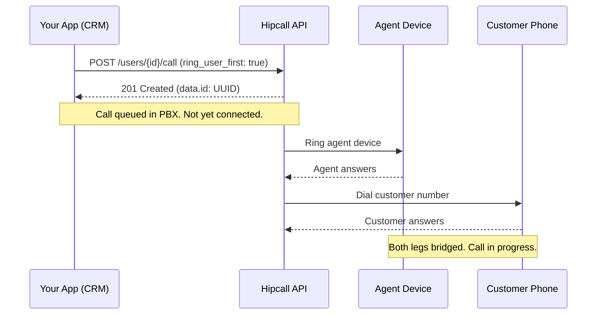

## Overview

In field services, online marketplaces, courier logistics, and human resources screening, connecting two parties while keeping their personal phone numbers private is a common business requirement. When a technician or delivery driver calls a customer directly from a mobile device, their personal phone number is exposed, and the customer's phone number is saved on an unmanaged personal handset. This creates privacy risks, compliance issues, and customer retention leaks.

With the Hipcall API, you can initiate outbound calls programmatically (click-to-call) from your CRM or internal application. By applying call masking parameters, both sides converse over your company PBX without either party seeing the other's personal phone number.

## Before you start

Before triggering calls through the API, ensure you have the following ready:

- **An API key:** Generate an API token in your Hipcall dashboard under Settings > Developer.
- **A registered device:** The originating agent must have an active, registered device (Hipcall web app, desktop client, or mobile SIP softphone) online.
- **An active outbound number:** You need a registered virtual number to present as the Caller ID. You can list your available numbers using `GET /api/v3/numbers`.

Set your API token as an environment variable in your terminal:

```bash
export HIPCALL_API_TOKEN="SFMyNTY.g2gDbQAAAC..."
```

## Initiating outbound calls via click-to-call

The standard method to initiate a call for an agent is sending an HTTP POST request to the `/users/{user_id}/call` endpoint. Provide the recipient's phone number in international E.164 format (`+44...`).

```bash
curl -X "POST" "https://use.hipcall.com/api/v3/users/4200/call" \
  -H "accept: application/json" \
  -H "Authorization: Bearer $HIPCALL_API_TOKEN" \
  -H "Content-Type: application/json" \
  -d '{
    "callee_number": "+442079460123",
    "ring_user_first": true
  }'
```

### Controlling the call sequence (ring_user_first)

The `ring_user_first` parameter is a mandatory boolean that determines which side rings first:

- **`true` (Recommended):** Hipcall rings the agent's application first. As soon as the agent answers, the PBX dials the customer. This sequence ensures the customer is not connected to a silent line before an agent is ready.
- **`false`:** The PBX attempts to dial the customer immediately while simultaneously connecting the agent. If the agent is unavailable or offline, the call drops without connection.

### Choosing your outbound caller ID (number_id)

You can select which registered corporate phone number appears on the recipient's phone screen using the `number_id` parameter:

```bash
curl -X "POST" "https://use.hipcall.com/api/v3/users/4200/call" \
  -H "accept: application/json" \
  -H "Authorization: Bearer $HIPCALL_API_TOKEN" \
  -H "Content-Type: application/json" \
  -d '{
    "callee_number": "+442079460123",
    "number_id": 943,
    "ring_user_first": true
  }'
```

Key rules regarding the `number_id` parameter:

1. **Default Outbound Number:** If you omit `number_id`, Hipcall falls back to the user's default number (`default_number`) configured in their profile. Users can change their default number under Settings > Profile.
2. **Parameter Distinction:** `callee_number` specifies the recipient you are dialing; `number_id` specifies the ID of your own registered number from which the call originates.
3. **Extension Calls:** In `/extensions/{extension_id}/call`, specifying `number_id` is mandatory, whereas in `/users/{user_id}/call`, it remains optional.

## Enabling call masking

To hide the destination phone number from the agent, pass `call_masking: true`. To replace placeholder zeros with a contextual identifier on the agent's screen, specify `call_masking_name`:

```bash
curl -X "POST" "https://use.hipcall.com/api/v3/users/4200/call" \
  -H "accept: application/json" \
  -H "Authorization: Bearer $HIPCALL_API_TOKEN" \
  -H "Content-Type: application/json" \
  -d '{
    "callee_number": "+442079460123",
    "call_masking": true,
    "call_masking_name": "Order #1042",
    "number_id": 943,
    "ring_user_first": true
  }'
```

### What both sides see

- **Agent Display:** When `call_masking: true` is set, the callee's real number is hidden. If `call_masking_name` is omitted, the screen shows `0000000000`. If specified (e.g., `"Order #1042"`), this label replaces the zeros. The agent never sees or copies the customer's personal number.
- **Customer Display:** The customer sees your corporate outbound number (`number_id`). The agent's personal phone or direct line is never transmitted.

### Real numbers in call detail records (CDR)

Call masking is strictly a presentation-layer feature for agent privacy. The underlying database and Call Detail Records (`GET /api/v3/calls`) retain complete, unmasked E.164 phone numbers for regulatory compliance, billing audits, and management analytics.

## Complete C# implementation

The following C# class uses a single `HttpClient` instance, reads the API token from the environment variable, supports masking and outbound number selection, and preserves API error bodies:

```csharp
using System.Net.Http.Headers;
using System.Text;
using System.Text.Json;

public sealed class HipcallClient
{
    private static readonly HttpClient s_httpClient = new();
    private const string BaseUrl = "https://use.hipcall.com/api/v3";
    private readonly string _apiToken;

    public HipcallClient()
    {
        _apiToken = Environment.GetEnvironmentVariable("HIPCALL_API_TOKEN")
            ?? throw new InvalidOperationException("HIPCALL_API_TOKEN environment variable is not set.");
    }

    public async Task<string> StartCallAsync(
        int userId,
        string calleeNumber,
        bool ringUserFirst = true,
        int? numberId = null,
        bool? callMasking = null,
        string? callMaskingName = null)
    {
        var body = new Dictionary<string, object>
        {
            ["callee_number"] = calleeNumber,
            ["ring_user_first"] = ringUserFirst
        };

        if (numberId.HasValue)
            body["number_id"] = numberId.Value;

        if (callMasking.HasValue)
            body["call_masking"] = callMasking.Value;

        if (!string.IsNullOrEmpty(callMaskingName))
            body["call_masking_name"] = callMaskingName;

        string json = JsonSerializer.Serialize(body);

        using var request = new HttpRequestMessage(HttpMethod.Post, $"{BaseUrl}/users/{userId}/call");
        request.Headers.Authorization = new AuthenticationHeaderValue("Bearer", _apiToken);
        request.Headers.Accept.Add(new MediaTypeWithQualityHeaderValue("application/json"));
        request.Content = new StringContent(json, Encoding.UTF8, "application/json");

        HttpResponseMessage response = await s_httpClient.SendAsync(request).ConfigureAwait(false);
        string responseBody = await response.Content.ReadAsStringAsync().ConfigureAwait(false);

        if (!response.IsSuccessStatusCode)
        {
            throw new InvalidOperationException($"API Error {(int)response.StatusCode}: {responseBody}");
        }

        using JsonDocument doc = JsonDocument.Parse(responseBody);
        return doc.RootElement
            .GetProperty("data")
            .GetProperty("id")
            .GetString() ?? throw new InvalidOperationException("API returned a null call ID.");
    }
}
```

To invoke the client in your application:

```csharp
var client = new HipcallClient();
string callId = await client.StartCallAsync(
    userId: 4200,
    calleeNumber: "+442079460123",
    ringUserFirst: true,
    numberId: 943,
    callMasking: true,
    callMaskingName: "Order #1042"
);

Console.WriteLine($"Call queued successfully. Call ID: {callId}");
```

### Key architectural details

- **Reused HttpClient instance:** Initializing a single `static readonly HttpClient` avoids socket exhaustion under high call initiation volume.
- **Preserving API error bodies:** When a non-200 response occurs, the full JSON payload is captured and exposed before an exception is raised, ensuring actionable feedback.
- **Optional parameter defaults:** Masking and caller ID parameters are optional; when left unspecified, user-level profile defaults take precedence.

## What the response means

When the API accepts your request, it returns an HTTP `201 Created` status code containing a call UUID:

```json
{
  "data": {
    "id": "19d354e6-2be8-4c4e-bd49-fd12545f71a4"
  }
}
```



Understand the exact boundaries of this response:

- **What it means:** The request payload was valid, authentication succeeded, and the PBX queued the call command in its telephony engine.
- **What it does not mean:** It does not mean the customer answered, that the customer's phone rang, or that the audio bridge connected. Even if the agent's device is offline or in airplane mode, the API still returns `201 Created` because the command was queued; the PBX then drops the call silently when it fails to reach the agent.

Do not mark calls as "connected" or "completed" in your CRM based solely on a `201 Created` response. Monitor Webhooks or poll `GET /api/v3/calls` to check `bridged_at` and `call_duration`.

## When it fails

### 422 Unprocessable Entity

Returned when mandatory fields are omitted. For example, omitting the required `ring_user_first` field:

```json
{
  "errors": {
    "ring_user_first": [
      "can't be blank"
    ]
  }
}
```

**Fix:** Ensure both mandatory fields, `callee_number` and `ring_user_first` (`true` or `false`), are present in your JSON payload.

### 404 Not Found

Returned when an invalid `user_id` or `extension_id` is supplied:

```json
{
  "errors": {
    "user_id": ["No result for user_id: 21212212"]
  }
}
```

**Fix:** Verify the user ID using `GET /api/v3/users` or extension ID using `GET /api/v3/extensions`.

### E.164 formatting and regional prefix resolution

If you pass a national number starting with a local trunk prefix (such as `020 7946 0123` in the UK) or a string formatted with spaces, the API does not reject the request; it returns `201 Created`.

The Hipcall PBX strips whitespaces and national trunk zeros. It resolves the number against the user and account `phone_prefix` and `locale` configuration (for instance, prepending `+44` for accounts configured with `phone_prefix: "GB"`). To prevent routing ambiguities across organizations operating across multiple regions, always pass fully qualified E.164 numbers (`+442079460123`) in production.

## Parameter reference

| Parameter | Type | Required | Description |
|---|---|---|---|
| `callee_number` | string | yes | Recipient phone number in E.164 format (e.g., `+442079460123`). |
| `ring_user_first` | boolean | yes | Rings the agent before dialing the recipient (`true`) or dials recipient directly (`false`). Mandatory field. |
| `number_id` | integer | no | ID of the registered outbound number displayed to the recipient. If omitted, uses the agent's default number. |
| `call_masking` | boolean | no | Masks the recipient number as `0000000000` on the agent's screen. |
| `call_masking_name` | string | no | Replaces the zeros with a custom label on the agent's screen (max 30 chars). |

## Next steps

- Build a webhook receiver to handle real-time call events like answers, bridges, and hangups.
- Review additional query parameters and filters in the [Hipcall API Reference](https://use.hipcall.com/api-docs/).
- Share your integration experiences or ask technical questions in the [Hipcall Community](https://community.hipcall.com/).
