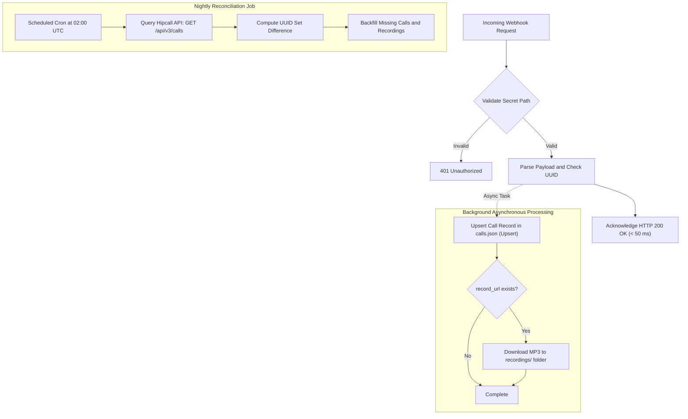

## Overview

Syncing call records through periodic API polling consumes rate limits and leaves data lagging behind active conversations.

Webhooks push events to your application instantly. When a call starts, connects, or ends, the Hipcall PBX sends an HTTP POST. Talk duration, disposition, and recording links reach your database the moment the call ends.

A production-ready webhook receiver needs four things:
- Respond in under 50 milliseconds to avoid timeouts.
- Secure the endpoint with a secret route token.
- Deduplicate events by UUID to handle network retries.
- Reconcile data nightly to cover server downtime.

This page covers configuring a webhook, building an ASP.NET Core Minimal API receiver, and downloading audio in the background.

## Before you start

You need:
- .NET 8 SDK (`dotnet --version` must show 8.0 or higher).
- A public HTTPS endpoint. For local testing, use ngrok to expose port 5080:
  ```bash
  ngrok http 5080
  ```
- Access to the Hipcall dashboard.
- A registered agent device to make test calls.

## Setting up the webhook

Create the webhook in the Hipcall dashboard:

1. Go to Settings > Integrations > Marketplace.
2. Select Webhooks.
3. Fill in the details:
   - Name: Provide an identifier like `Production CDR Receiver`.
   - URL: Enter your HTTPS URL with a secret path, like `https://your-server.example.com/hipcall/events/whsec_live_xxxxxxxxxxxxxxxx`.
   - Events: Check `call_init`, `call_bridged`, and `call_hangup`.
4. Check the Logs tab. Turn on Debug Mode to capture request bodies and status codes for two hours.

## Receiving your first event

Create an ASP.NET Core Minimal API project:

```bash
dotnet new web -n Hipcall.WebhookReceiver
cd Hipcall.WebhookReceiver
```

Start with a receiver that checks the secret token and prints the payload:

```csharp
using System.Text;

var builder = WebApplication.CreateBuilder(args);

builder.WebHost.ConfigureKestrel(serverOptions =>
{
    serverOptions.ListenAnyIP(5080);
});

var app = builder.Build();

var expectedSecret = Environment.GetEnvironmentVariable("HIPCALL_WEBHOOK_SECRET") ?? "whsec_live_xxxxxxxxxxxxxxxx";

app.MapPost("/hipcall/events/{secret?}", async (string? secret, HttpRequest request) =>
{
    if (string.IsNullOrEmpty(secret) || !string.Equals(secret, expectedSecret, StringComparison.Ordinal))
    {
        return Results.Unauthorized();
    }

    using var reader = new StreamReader(request.Body, Encoding.UTF8);
    var body = await reader.ReadToEndAsync();
    Console.WriteLine($"Webhook received:\n{body}");
    return Results.Ok();
});

app.Run();
```

Run it with `dotnet run` and make a test call.

### Payload structure

Hipcall sends `application/json` with a two-key envelope:

```json
{
  "event": "call_hangup",
  "data": {
    "uuid": "9a266251-d2a3-44fc-b422-9486ddf880c7",
    "direction": "outbound",
    "caller_number": "+442079460123",
    "callee_number": "+447700900123",
    "call_duration": 14,
    "missing_call": false,
    "hangup_by": "contact",
    "record_url": "https://storage.hipcall.com/recordings/1412/2026/09/21/9a266251-d2a3-44fc-b422-9486ddf880c7.mp3?X-Amz-Expires=604800...",
    "started_at": "2026-09-21T10:37:07Z",
    "answered_at": "2026-09-21T10:37:07Z",
    "ended_at": "2026-09-21T10:37:21Z"
  }
}
```

### Inspecting request headers

The raw HTTP headers look like this:

```http
Host: your-server.example.com
User-Agent: Hipcall-Webhook/1.0
Content-Type: application/json
Accept-Encoding: gzip
X-Forwarded-For: 31.192.211.2
X-Forwarded-Proto: https
```

Hipcall does not send HMAC signature headers (`X-Signature`).

## What each event carries

A single call triggers multiple events.

| Event | Trigger Point | Key Fields | Purpose |
|---|---|---|---|
| `call_init` | PBX starts the session | `uuid`, `direction`, `caller_number`, `started_at` | Tracks session start. |
| `call_bridged` | Agent connects | `uuid`, `direction`, `user_id`, `call_flow` | Confirms the agent channel. |
| `call_hangup` | Call ends | `uuid`, `call_duration`, `hangup_by`, `record_url` | Final summary and recording link. |

### Telephony sequence in click-to-call

When initiating an outbound call via click-to-call, the Hipcall softphone answers the agent's leg automatically. Because the agent connects instantly, `call_init` and `call_bridged` arrive within a second of each other, while the destination phone is still ringing.

### Call recording URL lifespan

The `data.record_url` in `call_hangup` is a temporary AWS S3 link valid for 7 days (`X-Amz-Expires=604800`).

Download the audio file asynchronously when the webhook arrives and store it in your own infrastructure. Do not save the temporary link to your database.

## Designing a reliable architecture

Apply these four patterns for a production receiver:



### 1. Respond quickly, defer heavy work

Hipcall expects a response within 15 seconds. If your receiver waits on audio downloads or database locks, the request times out.

The execution flow:
1. Validate the secret token.
2. Deserialize the JSON payload.
3. Queue the data.
4. Return HTTP 200 OK immediately (under 50 ms).
5. Write to disk and download audio in a background task.

### 2. Idempotency (Deduplication)

Network retries can deliver the same event twice. To prevent duplicate data:
- Use `data.uuid` as your deduplication key.
- Never deduplicate by timestamp or phone number.
- Upsert the existing record when new events arrive.

### 3. Nightly reconciliation

A live webhook receiver can miss events during server restarts or network outages.

To guarantee a complete archive:
- Run a background job nightly.
- Query the Hipcall API for the day's calls:
  ```http
  GET /api/v3/calls?started_at[gte]=...&started_at[lte]=...&limit=100
  ```
- Compare the API's UUIDs with your local database.
- Backfill missing calls and recordings.

### 4. Securing unsigned endpoints

Since requests lack HMAC headers, secure your endpoint in two ways:
1. Secret route path: Include an unpredictable token in the URL (`/hipcall/events/whsec_live_...`). Return 401 Unauthorized if it is missing or wrong.
2. IP whitelisting: Restrict inbound traffic at your proxy to Hipcall's IP address (`31.192.211.2`).

## The full example

This ASP.NET Core Minimal API implementation includes secret validation, idempotent storage, and asynchronous audio downloads.

```csharp
using System.Text;
using System.Text.Json;

var builder = WebApplication.CreateBuilder(args);

builder.WebHost.ConfigureKestrel(serverOptions =>
{
    serverOptions.ListenAnyIP(5080);
});

builder.Services.AddHttpClient();

var app = builder.Build();

var jsonOptions = new JsonSerializerOptions
{
    PropertyNamingPolicy = JsonNamingPolicy.SnakeCaseLower,
    PropertyNameCaseInsensitive = true,
    WriteIndented = true,
    Encoder = System.Text.Encodings.Web.JavaScriptEncoder.UnsafeRelaxedJsonEscaping
};

var expectedSecret = Environment.GetEnvironmentVariable("HIPCALL_WEBHOOK_SECRET") ?? "whsec_live_xxxxxxxxxxxxxxxx";
var baseDir = Directory.GetCurrentDirectory();
var callsFilePath = Path.Combine(baseDir, "calls.json");
var fileLock = new object();

Dictionary<string, CallRecord> storedCalls = new(StringComparer.OrdinalIgnoreCase);

if (File.Exists(callsFilePath))
{
    try
    {
        var existingJson = File.ReadAllText(callsFilePath);
        var existingList = JsonSerializer.Deserialize<List<CallRecord>>(existingJson, jsonOptions);
        if (existingList != null)
        {
            foreach (var call in existingList)
            {
                if (!string.IsNullOrEmpty(call.Uuid))
                {
                    storedCalls[call.Uuid] = call;
                }
            }
        }
    }
    catch
    {
    }
}

app.MapGet("/", () => Results.Ok("Hipcall Webhook Receiver is healthy."));

app.MapPost("/hipcall/events/{secret?}", async (string? secret, HttpRequest request, IHttpClientFactory httpClientFactory) =>
{
    if (string.IsNullOrEmpty(secret) || !string.Equals(secret, expectedSecret, StringComparison.Ordinal))
    {
        return Results.Unauthorized();
    }

    using var reader = new StreamReader(request.Body, Encoding.UTF8);
    var rawBody = await reader.ReadToEndAsync();

    if (string.IsNullOrWhiteSpace(rawBody))
    {
        return Results.Ok();
    }

    HipcallWebhookPayload? payload;
    try
    {
        payload = JsonSerializer.Deserialize<HipcallWebhookPayload>(rawBody, jsonOptions);
    }
    catch
    {
        return Results.Ok();
    }

    if (payload == null || string.IsNullOrEmpty(payload.Event))
    {
        return Results.Ok();
    }

    if (payload.Event != "call_hangup" && payload.Event != "call_init" && payload.Event != "call_bridged")
    {
        return Results.Ok();
    }

    var data = payload.Data;
    if (data == null || string.IsNullOrEmpty(data.Uuid))
    {
        return Results.Ok();
    }

    lock (fileLock)
    {
        var record = new CallRecord
        {
            Uuid = data.Uuid,
            Direction = data.Direction,
            CallerNumber = CallRecord.MaskNumber(data.CallerNumber),
            CalleeNumber = CallRecord.MaskNumber(data.CalleeNumber),
            CallDuration = data.CallDuration,
            MissingCall = data.MissingCall,
            HangupBy = data.HangupBy,
            RecordUrl = data.RecordUrl,
            StartedAt = data.StartedAt,
            AnsweredAt = data.AnsweredAt,
            EndedAt = data.EndedAt,
            LastEvent = payload.Event,
            UpdatedAt = DateTime.UtcNow.ToString("o")
        };

        storedCalls[data.Uuid] = record;

        try
        {
            var serialized = JsonSerializer.Serialize(storedCalls.Values.ToList(), jsonOptions);
            File.WriteAllText(callsFilePath, serialized);
        }
        catch
        {
        }
    }

    if (!string.IsNullOrEmpty(data.RecordUrl))
    {
        string audioUrl = data.RecordUrl;
        string callUuid = data.Uuid;
        _ = Task.Run(async () =>
        {
            try
            {
                var client = httpClientFactory.CreateClient();
                for (int attempt = 1; attempt <= 5; attempt++)
                {
                    await Task.Delay(attempt == 1 ? 2500 : 3000);
                    var response = await client.GetAsync(audioUrl);
                    if (response.IsSuccessStatusCode)
                    {
                        string recDir = Path.Combine(baseDir, "recordings");
                        Directory.CreateDirectory(recDir);
                        string filePath = Path.Combine(recDir, $"{callUuid}.mp3");
                        await using var fs = new FileStream(filePath, FileMode.Create, FileAccess.Write);
                        await response.Content.CopyToAsync(fs);
                        return;
                    }
                }
            }
            catch
            {
            }
        });
    }

    return Results.Ok();
});

app.Run();

public class HipcallWebhookPayload
{
    public string? Event { get; set; }
    public CallDataPayload? Data { get; set; }
}

public class CallDataPayload
{
    public string? Uuid { get; set; }
    public string? Direction { get; set; }
    public string? CallerNumber { get; set; }
    public string? CalleeNumber { get; set; }
    public int? CallDuration { get; set; }
    public bool? MissingCall { get; set; }
    public string? MissingCallReason { get; set; }
    public string? HangupBy { get; set; }
    public string? RecordUrl { get; set; }
    public string? StartedAt { get; set; }
    public string? AnsweredAt { get; set; }
    public string? EndedAt { get; set; }
}

public class CallRecord
{
    public string? Uuid { get; set; }
    public string? Direction { get; set; }
    public string? CallerNumber { get; set; }
    public string? CalleeNumber { get; set; }
    public int? CallDuration { get; set; }
    public bool? MissingCall { get; set; }
    public string? HangupBy { get; set; }
    public string? RecordUrl { get; set; }
    public string? StartedAt { get; set; }
    public string? AnsweredAt { get; set; }
    public string? EndedAt { get; set; }
    public string? LastEvent { get; set; }
    public string? UpdatedAt { get; set; }

    public static string? MaskNumber(string? number)
    {
        if (string.IsNullOrEmpty(number) || number.Length <= 6)
            return number;
        return number[..6] + new string('X', number.Length - 6);
    }
}
```

## When it fails

### 1. HTTP 500 response

If your server returns `500 Internal Server Error`:
- The telephone conversation continues. Webhook delivery does not affect telephony routing.
- Hipcall logs a `500` error.
- Hipcall does not retry failed requests. This is why you must return 200 immediately and reconcile missing data nightly.

### 2. Timeouts

If your receiver takes longer than 15 seconds, Hipcall terminates the TCP connection and drops the event.

### 3. Broken status

If your receiver returns four errors (non-200 status or 15-second timeouts) within one hour:
- Hipcall marks the integration as Broken.
- Hipcall stops sending webhooks until you reactivate it.
- To recover, open the integration in the dashboard, switch the status to Active, and save.

See the [Hipcall API Reference](https://use.hipcall.com/api-docs/) for more details. These rules apply to Hipcall Webhooks v1. A v2 specification aligned with Standard Webhooks is under development.

## Parameter reference

The `data` object contains these fields:

| Field | Type | Example | Description |
|---|---|---|---|
| `uuid` | string | `"9a266251-d2a3-44fc-b422-9486ddf880c7"` | Unique call session identifier. |
| `direction` | string | `"outbound"` | `"inbound"` or `"outbound"`. |
| `caller_number` | string | `"+442079460123"` | Originating phone number. |
| `callee_number` | string | `"+447700900123"` | Destination phone number. |
| `call_duration` | integer | `14` | Audio conversation duration in seconds. |
| `missing_call` | boolean | `false` | `true` if an inbound call was unanswered. |
| `hangup_by` | string | `"contact"` | Party terminating the call (`"user"`, `"contact"`, `"system"`). |
| `record_url` | string/null | `"https://storage.hipcall.com/..."` | Presigned AWS S3 audio download URL. |
| `started_at` | string | `"2026-09-21T10:37:07Z"` | UTC timestamp when session started. |
| `answered_at` | string/null | `"2026-09-21T10:37:07Z"` | UTC timestamp when call was answered. |
| `ended_at` | string/null | `"2026-09-21T10:37:21Z"` | UTC timestamp when session ended. |

## Next steps

- Add a message broker like RabbitMQ between the HTTP receiver and database workers.
- Move from `calls.json` to PostgreSQL with a unique constraint on `uuid`.
- Build the nightly reconciliation service using `GET /api/v3/calls`.
- Ask questions in the [Hipcall Community](https://community.hipcall.com/).
