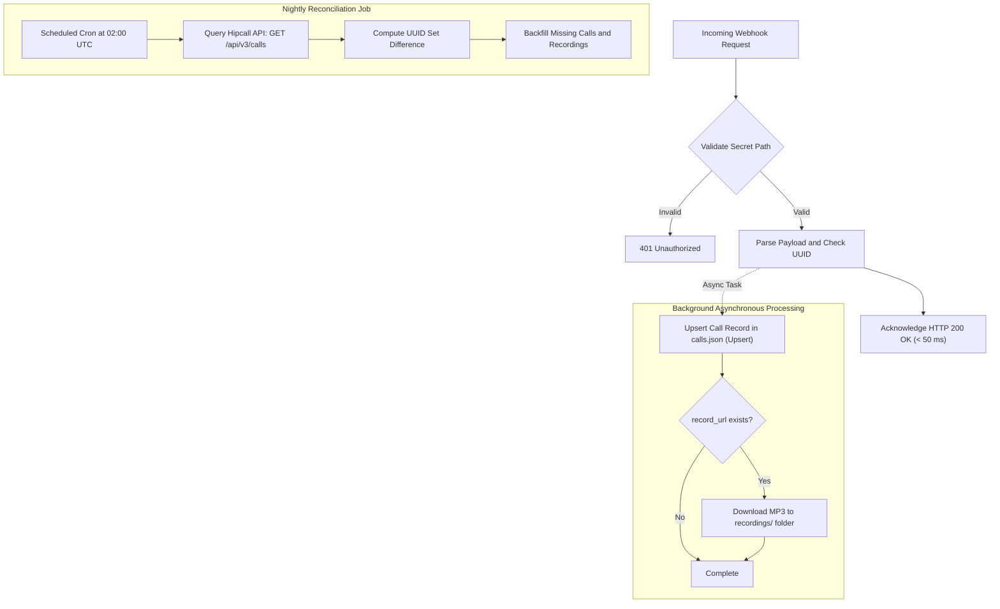

## Overview

Syncing call records into your data warehouse, CRM, or billing system through periodic polling consumes API rate limits and leaves your systems lagging tens of seconds behind active conversations.

Webhooks transform this ingestion pipeline into an instant, event-driven stream. Whenever a call initiates, connects to an agent, or wraps up, the Hipcall PBX delivers an HTTP POST request straight to your application. The moment a call ends, talk duration, termination disposition, and recording links flow directly into your database with zero lag.

Building a production-ready webhook receiver that runs reliably under high call volume requires four core engineering practices:
- **Acknowledging requests in under 50 milliseconds** to prevent dispatcher timeouts, offloading heavy tasks (audio archiving, database writes) to background queues.
- **Securing unsigned webhook endpoints** using an unpredictable secret route token.
- **Deduplicating events by UUID (idempotency)** to protect data integrity against network retries.
- **Backing real-time streaming with a nightly reconciliation worker** to guarantee zero data loss during server restarts or transient outages.

In this guide, you will configure a webhook in the Hipcall dashboard, build a robust ASP.NET Core Minimal API receiver implementing these patterns, and establish an automated background archiving pipeline for call audio.

## Before you start

Ensure you have the following prerequisites configured:

- **.NET 8 SDK** installed on your workstation or server (`dotnet --version` outputs `8.0` or higher).
- **A publicly accessible HTTPS endpoint.** For local development, install [ngrok](https://ngrok.com/) to expose port 5080:
  ```bash
  ngrok http 5080
  ```
- **Access to the Hipcall dashboard** with administrative permissions to configure integrations.
- **An active agent device** (Hipcall web phone or desktop application) to conduct test calls.

## Setting up the webhook

Configure your webhook integration in the Hipcall web dashboard:

1. Navigate to **Settings > Integrations > Marketplace**.
2. Select **Webhooks** from the integration catalog.
3. Fill in the integration details:
   - **Name (Required):** Provide an identifier such as `Production CDR Receiver`.
   - **URL (Required):** Enter your public HTTPS URL including a secret route path: `https://your-server.example.com/hipcall/events/whsec_live_xxxxxxxxxxxxxxxx`.
   - **Events:** Check the call events you want to subscribe to: `call_init`, `call_bridged`, and `call_hangup`.
4. Open the **Logs** tab. Webhook logging is controlled by **Debug Mode**. When activated during development, debug mode captures payload bodies and response status codes for up to two hours before automatically turning off and clearing log entries.

## Receiving your first event

Create an ASP.NET Core Minimal API project:

```bash
dotnet new web -n Hipcall.WebhookReceiver
cd Hipcall.WebhookReceiver
```

Start with a baseline receiver that validates the secret key configured in the dashboard and logs incoming payloads to the console:

```csharp
using System.Text;

var builder = WebApplication.CreateBuilder(args);

builder.WebHost.ConfigureKestrel(serverOptions =>
{
    serverOptions.ListenAnyIP(5080);
});

var app = builder.Build();

var expectedSecret = Environment.GetEnvironmentVariable("HIPCALL_WEBHOOK_SECRET") ?? "whsec_live_xxxxxxxxxxxxxxxx";

app.MapPost("/hipcall/events/{secret?}", async (string? secret, HttpRequest request) =>
{
    if (string.IsNullOrEmpty(secret) || !string.Equals(secret, expectedSecret, StringComparison.Ordinal))
    {
        return Results.Unauthorized();
    }

    using var reader = new StreamReader(request.Body, Encoding.UTF8);
    var body = await reader.ReadToEndAsync();
    Console.WriteLine($"Webhook received successfully:\n{body}");
    return Results.Ok();
});

app.Run();
```

Run the application with `dotnet run` and trigger a test call from the dashboard or your phone.

### Payload structure

Hipcall dispatches requests with `Content-Type: application/json`. Every payload uses a two-key envelope:

```json
{
  "event": "call_hangup",
  "data": {
    "uuid": "9a266251-d2a3-44fc-b422-9486ddf880c7",
    "direction": "outbound",
    "caller_number": "+442079460123",
    "callee_number": "+447700900123",
    "call_duration": 14,
    "missing_call": false,
    "hangup_by": "contact",
    "record_url": "https://storage.hipcall.com/recordings/1412/2026/09/21/9a266251-d2a3-44fc-b422-9486ddf880c7.mp3?X-Amz-Expires=604800...",
    "started_at": "2026-09-21T10:37:07Z",
    "answered_at": "2026-09-21T10:37:07Z",
    "ended_at": "2026-09-21T10:37:21Z"
  }
}
```

### Inspecting request headers

Examining the raw HTTP headers reveals:

```http
Host: your-server.example.com
User-Agent: Hipcall-Webhook/1.0
Content-Type: application/json
Accept-Encoding: gzip
X-Forwarded-For: 31.192.211.2
X-Forwarded-Proto: https
```

Notice that incoming webhook requests do not include cryptographic signature headers such as `X-Signature` or `X-Hub-Signature`.

## What each event carries

A single phone call triggers multiple webhook events across its lifecycle.

| Event | Trigger Point | Key Fields | Purpose |
|---|---|---|---|
| `call_init` | When the PBX initiates the call session | `uuid`, `direction`, `caller_number`, `started_at` | Tracks session initiation. |
| `call_bridged` | When the agent connects to the conference bridge | `uuid`, `direction`, `user_id`, `call_flow` | Confirms internal channel connection. |
| `call_hangup` | When either party terminates the call | `uuid`, `call_duration`, `hangup_by`, `record_url` | Primary accounting and recording summary. |

### Telephony sequence in click-to-call

When initiating an outbound call via click-to-call, the Hipcall softphone automatically answers the representative's leg. Because the agent connects immediately, `call_init` and `call_bridged` arrive within one to two seconds of each other while the destination handset is still ringing.

### Call recording URL lifespan and persistent storage

The `data.record_url` field in `call_hangup` points to a temporary presigned AWS S3 URL (`X-Amz-Expires=604800`, valid for 7 days).

The recommended approach for building an enterprise-grade call archive is to download the audio file asynchronously via a background worker when the webhook arrives and store it within your organization's own persistent storage (local disk, private S3 bucket, etc.) rather than saving the temporary link directly to the database.

## Designing a reliable architecture

When building a production-grade webhook receiver, four fundamental architectural principles apply:



### 1. Respond quickly, defer heavy work to the background

Hipcall expects a response within 15 seconds. If your receiver blocks the HTTP connection to download audio files or wait on database locks, the request risks timing out.

The recommended execution pipeline:
1. Validate the secret route token (around 1 ms).
2. Deserialize the JSON payload.
3. Queue the data in memory or a message broker.
4. **Return HTTP `200 OK` immediately** (< 50 ms).
5. Process disk writes and audio downloads in a background worker.

### 2. Idempotency (Deduplication)

Network blips or service updates can deliver the same call session more than once. To prevent data duplication:
- Always use the immutable `data.uuid` as your primary deduplication key.
- Never deduplicate by timestamp or phone number, as multiple calls can initiate in the exact same second.
- Implement an upsert pattern to update existing records when subsequent events arrive.

### 3. Nightly reconciliation

A system that relies exclusively on live webhooks can experience small data gaps over time due to server restarts, deployment rollouts, or network interruptions.

To guarantee an audit-proof, 100% complete archive:
- Deploy a scheduled background job (Windows Task Scheduler, cron, or a cloud worker) running nightly.
- Query the Hipcall REST API for the day's calls:
  ```http
  GET /api/v3/calls?started_at[gte]=...&started_at[lte]=...&sort=started_at.asc&limit=100
  ```
- Compare the UUID list returned by the API with your local database to calculate the set difference.
- Fetch and backfill any missing call metadata and audio recordings via the API to reconcile your archive down to the penny.

### 4. Securing unsigned endpoints

Because incoming requests do not include an HMAC signature header, secure your public endpoint using two complementary layers:
1. **Secret route path:** Place an unpredictable secret token inside your route path (`/hipcall/events/whsec_live_xxxxxxxxxxxxxxxx`) and immediately reject any request lacking this token with HTTP `401 Unauthorized`.
2. **IP whitelisting:** Restrict incoming traffic at your reverse proxy (Nginx or Cloudflare) to Hipcall's outbound IP address (`31.192.211.2`).

## The full example

Here is the complete, production-ready ASP.NET Core Minimal API implementation. It includes snake_case deserialization, secret token validation, unknown event resilience, idempotent storage, and asynchronous background audio downloads.

```csharp
using System.Text;
using System.Text.Json;

var builder = WebApplication.CreateBuilder(args);

builder.WebHost.ConfigureKestrel(serverOptions =>
{
    serverOptions.ListenAnyIP(5080);
});

builder.Services.AddHttpClient();

var app = builder.Build();

var jsonOptions = new JsonSerializerOptions
{
    PropertyNamingPolicy = JsonNamingPolicy.SnakeCaseLower,
    PropertyNameCaseInsensitive = true,
    WriteIndented = true,
    Encoder = System.Text.Encodings.Web.JavaScriptEncoder.UnsafeRelaxedJsonEscaping
};

var expectedSecret = Environment.GetEnvironmentVariable("HIPCALL_WEBHOOK_SECRET") ?? "whsec_live_xxxxxxxxxxxxxxxx";
var baseDir = Directory.GetCurrentDirectory();
var callsFilePath = Path.Combine(baseDir, "calls.json");
var fileLock = new object();

Dictionary<string, CallRecord> storedCalls = new(StringComparer.OrdinalIgnoreCase);

if (File.Exists(callsFilePath))
{
    try
    {
        var existingJson = File.ReadAllText(callsFilePath);
        var existingList = JsonSerializer.Deserialize<List<CallRecord>>(existingJson, jsonOptions);
        if (existingList != null)
        {
            foreach (var call in existingList)
            {
                if (!string.IsNullOrEmpty(call.Uuid))
                {
                    storedCalls[call.Uuid] = call;
                }
            }
        }
    }
    catch
    {
    }
}

app.MapGet("/", () => Results.Ok("Hipcall Webhook Receiver is healthy."));

app.MapPost("/hipcall/events/{secret?}", async (string? secret, HttpRequest request, IHttpClientFactory httpClientFactory) =>
{
    if (string.IsNullOrEmpty(secret) || !string.Equals(secret, expectedSecret, StringComparison.Ordinal))
    {
        return Results.Unauthorized();
    }

    using var reader = new StreamReader(request.Body, Encoding.UTF8);
    var rawBody = await reader.ReadToEndAsync();

    if (string.IsNullOrWhiteSpace(rawBody))
    {
        return Results.Ok();
    }

    HipcallWebhookPayload? payload;
    try
    {
        payload = JsonSerializer.Deserialize<HipcallWebhookPayload>(rawBody, jsonOptions);
    }
    catch
    {
        return Results.Ok();
    }

    if (payload == null || string.IsNullOrEmpty(payload.Event))
    {
        return Results.Ok();
    }

    if (payload.Event != "call_hangup" && payload.Event != "call_init" && payload.Event != "call_bridged")
    {
        return Results.Ok();
    }

    var data = payload.Data;
    if (data == null || string.IsNullOrEmpty(data.Uuid))
    {
        return Results.Ok();
    }

    lock (fileLock)
    {
        var record = new CallRecord
        {
            Uuid = data.Uuid,
            Direction = data.Direction,
            CallerNumber = CallRecord.MaskNumber(data.CallerNumber),
            CalleeNumber = CallRecord.MaskNumber(data.CalleeNumber),
            CallDuration = data.CallDuration,
            MissingCall = data.MissingCall,
            HangupBy = data.HangupBy,
            RecordUrl = data.RecordUrl,
            StartedAt = data.StartedAt,
            AnsweredAt = data.AnsweredAt,
            EndedAt = data.EndedAt,
            LastEvent = payload.Event,
            UpdatedAt = DateTime.UtcNow.ToString("o")
        };

        storedCalls[data.Uuid] = record;

        try
        {
            var serialized = JsonSerializer.Serialize(storedCalls.Values.ToList(), jsonOptions);
            File.WriteAllText(callsFilePath, serialized);
        }
        catch
        {
        }
    }

    if (!string.IsNullOrEmpty(data.RecordUrl))
    {
        string audioUrl = data.RecordUrl;
        string callUuid = data.Uuid;
        _ = Task.Run(async () =>
        {
            try
            {
                var client = httpClientFactory.CreateClient();
                for (int attempt = 1; attempt <= 5; attempt++)
                {
                    await Task.Delay(attempt == 1 ? 2500 : 3000);
                    var response = await client.GetAsync(audioUrl);
                    if (response.IsSuccessStatusCode)
                    {
                        string recDir = Path.Combine(baseDir, "recordings");
                        Directory.CreateDirectory(recDir);
                        string filePath = Path.Combine(recDir, $"{callUuid}.mp3");
                        await using var fs = new FileStream(filePath, FileMode.Create, FileAccess.Write);
                        await response.Content.CopyToAsync(fs);
                        return;
                    }
                }
            }
            catch
            {
            }
        });
    }

    return Results.Ok();
});

app.Run();

public class HipcallWebhookPayload
{
    public string? Event { get; set; }
    public CallDataPayload? Data { get; set; }
}

public class CallDataPayload
{
    public string? Uuid { get; set; }
    public string? Direction { get; set; }
    public string? CallerNumber { get; set; }
    public string? CalleeNumber { get; set; }
    public int? CallDuration { get; set; }
    public bool? MissingCall { get; set; }
    public string? MissingCallReason { get; set; }
    public string? HangupBy { get; set; }
    public string? RecordUrl { get; set; }
    public string? StartedAt { get; set; }
    public string? AnsweredAt { get; set; }
    public string? EndedAt { get; set; }
}

public class CallRecord
{
    public string? Uuid { get; set; }
    public string? Direction { get; set; }
    public string? CallerNumber { get; set; }
    public string? CalleeNumber { get; set; }
    public int? CallDuration { get; set; }
    public bool? MissingCall { get; set; }
    public string? HangupBy { get; set; }
    public string? RecordUrl { get; set; }
    public string? StartedAt { get; set; }
    public string? AnsweredAt { get; set; }
    public string? EndedAt { get; set; }
    public string? LastEvent { get; set; }
    public string? UpdatedAt { get; set; }

    public static string? MaskNumber(string? number)
    {
        if (string.IsNullOrEmpty(number) || number.Length <= 6)
            return number;
        return number[..6] + new string('X', number.Length - 6);
    }
}
```

## When it fails

Understanding failure states in Hipcall webhooks prevents silent outages:

### 1. HTTP 500 response and at-most-once delivery
If your server encounters an internal error and returns `500 Internal Server Error`:
- The telephone conversation continues uninterrupted; telephony routing is decoupled from webhook delivery.
- Hipcall logs `500` in the integration logs.
- Hipcall does not automatically retry failed requests (at-most-once delivery model). For this reason, acknowledging with HTTP 200 immediately after enqueuing the payload and reconciling missing events via the nightly job are essential.

### 2. Timeouts
If your receiver takes longer than 15 seconds to respond, Hipcall terminates the TCP connection and drops the event without recording a successful delivery.

### 3. Failed responses and "Broken" status
When your receiver returns four failed responses (any status code other than 200 or 15-second timeouts) within a rolling one-hour window:
- Hipcall protects PBX resources by automatically setting the integration status to **Broken**.
- When marked as Broken, Hipcall halts all subsequent webhook dispatches until manually reactivated.
- **How to recover:** Open the integration in the dashboard, click **Edit**, toggle the status switch back to **Active**, and click **Save**.

For further configuration details, consult the [Hipcall API Reference](https://use.hipcall.com/api-docs/). The specifications in this guide cover Hipcall Webhooks v1; an upcoming v2 specification aligned with [Standard Webhooks](https://www.standardwebhooks.com/) is currently under development.

## Parameter reference

The following fields are delivered inside the `data` object for call events:

| Field | Type | Example | Description |
|---|---|---|---|
| `uuid` | string | `"9a266251-d2a3-44fc-b422-9486ddf880c7"` | Unique, immutable call session identifier. |
| `direction` | string | `"outbound"` | Call direction (`"inbound"` or `"outbound"`). |
| `caller_number` | string | `"+442079460123"` | Originating phone number (E.164 formatted). |
| `callee_number` | string | `"+447700900123"` | Destination phone number (E.164 formatted). |
| `call_duration` | integer | `14` | Total billable audio conversation duration in seconds. |
| `missing_call` | boolean | `false` | Indicates an unanswered inbound call (`true`). |
| `hangup_by` | string | `"contact"` | Party terminating the call (`"user"`, `"contact"`, `"system"`). |
| `record_url` | string/null | `"https://storage.hipcall.com/..."` | Presigned AWS S3 audio download URL. |
| `started_at` | string | `"2026-09-21T10:37:07Z"` | UTC timestamp when session was initialized. |
| `answered_at` | string/null | `"2026-09-21T10:37:07Z"` | UTC timestamp when call was answered. |
| `ended_at` | string/null | `"2026-09-21T10:37:21Z"` | UTC timestamp when session ended. |

## Next steps

- Set up a durable message broker (such as RabbitMQ or AWS SQS) between the HTTP receiver and database workers to handle burst call volumes.
- Migrate from `calls.json` to PostgreSQL or SQL Server with a `UNIQUE` constraint on the `uuid` column.
- Implement the nightly reconciliation service using Hipcall's `GET /api/v3/calls` REST API and schedule it via Windows Task Scheduler or cron to guarantee zero data loss.
- Share your webhook receiver implementation or ask questions in the [Hipcall Community](https://community.hipcall.com/).
