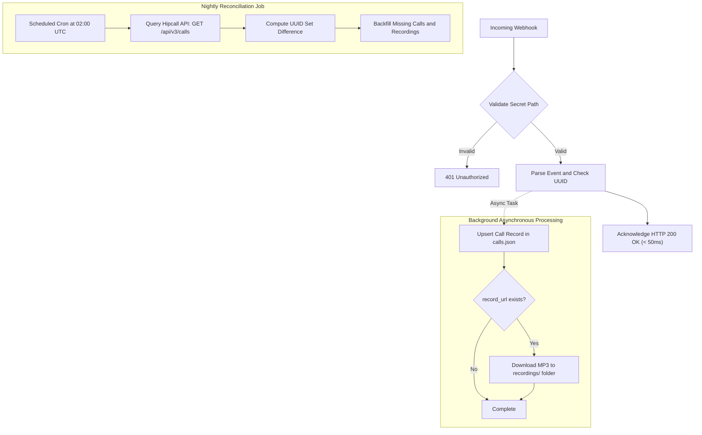

## Overview

Pushing call records into your data warehouse, CRM, or billing system usually starts with periodic polling. You query a list endpoint every few minutes and look for newly closed calls. While polling works for batch reporting, it introduces latency and consumes unnecessary API rate limits when no calls are active.

Webhooks reverse that model. When a call starts, bridges to an agent, or terminates, the Hipcall PBX dispatches an HTTP POST request directly to your server.

Receiving an HTTP request is straightforward. Building a production-grade webhook receiver requires solving three architectural realities:
1. Hipcall dispatches webhooks with an at-most-once delivery model without automatic retries.
2. Incoming webhook requests do not contain cryptographic HMAC signature headers (`X-Signature`).
3. Telephony dispatchers enforce strict HTTP timeouts (5 to 10 seconds).

This guide walks through configuring a webhook in the Hipcall dashboard, building an ASP.NET Core Minimal API receiver that responds within 50 milliseconds, processing call audio asynchronously, deduplicating incoming records by UUID, and pairing real-time ingestion with scheduled reconciliation to guarantee zero data loss.

## Before you start

Ensure you have the following prerequisites configured:

- **.NET 8 SDK** installed on your workstation or server.
- **A publicly accessible HTTPS endpoint.** For local development, install [ngrok](https://ngrok.com/) to expose port 5080:
  ```bash
  ngrok http 5080
  ```
- **Access to the Hipcall dashboard** with administrative permissions to configure integrations.
- **An active agent device** (Hipcall web phone or desktop application) to conduct test calls.

## Setting up the webhook

Configure your webhook integration in the Hipcall web dashboard:

1. Navigate to **Settings > Integrations > Marketplace (Ayarlar > Entegrasyonlar > Kataloğa Göz At)**.
2. Select **Webhooks (Web kancası)** from the integration catalog.
3. Fill in the integration details:
   - **Name (Zorunlu):** Provide an identifier such as `Production CDR Receiver`.
   - **URL (Zorunlu):** Enter your public HTTPS URL including a secret route path: `https://your-server.example.com/hipcall/events/whsec_live_9a8f2e4c1b0d`.
   - **Events:** Check the call events you want to subscribe to: `call_init`, `call_bridged`, and `call_hangup`.
4. Open the **Logs (Kayıtlar)** tab. Webhook logging is controlled by **Debug Mode (Hata Ayıklama Modu)**. When activated during development, debug mode captures payload bodies and response status codes for up to two hours before automatically turning off and clearing log entries.

## Receiving your first event

Create an ASP.NET Core Minimal API project:

```bash
dotnet new web -n Hipcall.WebhookReceiver
cd Hipcall.WebhookReceiver
```

Start with a baseline receiver that prints incoming headers and payloads to the console:

```csharp
var builder = WebApplication.CreateBuilder(args);

builder.WebHost.ConfigureKestrel(serverOptions =>
{
    serverOptions.ListenAnyIP(5080);
});

var app = builder.Build();

app.MapPost("/hipcall/events", async (HttpRequest request) =>
{
    using var reader = new StreamReader(request.Body);
    var body = await reader.ReadToEndAsync();
    Console.WriteLine(body);
    return Results.Ok();
});

app.Run();
```

Run the application with `dotnet run` and trigger a call.

### Payload structure

Hipcall dispatches requests with `Content-Type: application/json`. Every payload uses a two-key envelope:

```json
{
  "event": "call_hangup",
  "data": {
    "uuid": "9a266251-d2a3-44fc-b422-9486ddf880c7",
    "direction": "outbound",
    "caller_number": "+90850XXXXXXX",
    "callee_number": "+90530XXXXXXX",
    "call_duration": 14,
    "missing_call": false,
    "hangup_by": "contact",
    "record_url": "https://storage.hipcall.com.tr/recordings/1412/2026/09/21/9a266251-d2a3-44fc-b422-9486ddf880c7.mp3?X-Amz-Expires=604800...",
    "started_at": "2026-09-21T10:37:07Z",
    "answered_at": "2026-09-21T10:37:07Z",
    "ended_at": "2026-09-21T10:37:21Z"
  }
}
```

### Inspecting request headers

Examining the raw HTTP headers reveals:

```http
Host: your-server.example.com
User-Agent: mint/1.9.0
Content-Type: application/json
Accept-Encoding: gzip
X-Forwarded-For: 31.192.211.2
X-Forwarded-Proto: https
```

Notice that Hipcall does not include signature headers such as `X-Signature` or `X-Hub-Signature`. The dispatch client is Elixir's `mint/1.9.0`.

## What each event carries

A single phone call triggers multiple webhook events across its lifecycle.

| Event | Trigger Point | Key Fields | Purpose |
|---|---|---|---|
| `call_init` | When the PBX initiates the call session | `uuid`, `direction`, `caller_number`, `started_at` | Tracks session initiation. |
| `call_bridged` | When the agent connects to the conference bridge | `uuid`, `direction`, `user_id`, `call_flow` | Confirms internal channel connection. |
| `call_hangup` | When either party terminates the call | `uuid`, `call_duration`, `hangup_by`, `record_url` | Primary accounting and recording summary. |

### Telephony sequence in click-to-call

When initiating an outbound call via click-to-call, the Hipcall softphone automatically answers the representative's leg. Because the agent connects immediately, `call_init` and `call_bridged` arrive within one to two seconds of each other while the destination handset is still ringing.

### Call recording URL lifespan

The `data.record_url` field in `call_hangup` points to an AWS S3 presigned URL. Inspecting the query string parameters shows `X-Amz-Expires=604800`, meaning the link remains valid for seven days. 

Saving this temporary URL directly into your database creates broken links once the signature expires. Production systems must download the MP3 file to internal persistent storage during ingestion and reference your own permanent file path.

## Making it reliable

Building an enterprise-grade call archive on top of webhooks requires addressing delivery guarantees and authentication.



### 1. Respond quickly, defer heavy work

Hipcall enforces a strict HTTP timeout between 5 and 10 seconds. If your receiver blocks to download audio or write to a slow database table, the connection drops. Because Hipcall does not retry failed dispatches, that event is lost permanently.

Follow this execution pipeline:
1. Validate authentication token ($\sim 1\text{ ms}$).
2. Deserialize the JSON payload.
3. Queue the data in memory or message broker.
4. **Return HTTP `200 OK` immediately** ($< 50\text{ ms}$).
5. Process disk writes and audio downloads in a background worker.

### 2. Idempotency

Network retries or multi-event updates can deliver the same call session more than once.
- Always use `data.uuid` as the primary deduplication key.
- Never use timestamps or customer phone numbers for deduplication, as multiple calls can occur simultaneously.
- Apply an upsert pattern: update the existing record when subsequent events for the same UUID arrive.

### 3. Nightly reconciliation

A webhook receiver running alone will suffer minor data loss over time due to application restarts, deployment rollouts, and network blips.

To guarantee a complete archive:
- Deploy a scheduled job (Windows Task Scheduler, cron, or a background worker) that runs every night.
- Query the Hipcall REST API: `GET /api/v3/calls?started_at[gte]=...`.
- Calculate the set difference between the API's UUID list and your local database.
- Fetch and insert any missing call records and audio files.

### 4. Securing unsigned endpoints

Because Hipcall does not send HMAC signature headers, protect your public endpoint using two complementary strategies:

1. **Shared secret path:** Place an unpredictable secret token inside the URL path:
   ```
   POST /hipcall/events/whsec_live_9a8f2e4c1b0d
   ```
   Reject any request lacking this token with HTTP `401 Unauthorized`.
2. **IP whitelisting:** Restrict incoming traffic at your reverse proxy (Nginx or Cloudflare) to Hipcall's outbound IP address (`31.192.211.2`).

## The full example

Here is the complete, production-ready ASP.NET Core Minimal API implementation. It includes snake_case deserialization, secret token validation, unknown event resilience, idempotent storage, and asynchronous background audio downloads.

```csharp
using System.Text;
using System.Text.Json;

var builder = WebApplication.CreateBuilder(args);

builder.WebHost.ConfigureKestrel(serverOptions =>
{
    serverOptions.ListenAnyIP(5080);
});

builder.Services.AddHttpClient();

var app = builder.Build();

var jsonOptions = new JsonSerializerOptions
{
    PropertyNamingPolicy = JsonNamingPolicy.SnakeCaseLower,
    PropertyNameCaseInsensitive = true,
    WriteIndented = true,
    Encoder = System.Text.Encodings.Web.JavaScriptEncoder.UnsafeRelaxedJsonEscaping
};

var expectedSecret = Environment.GetEnvironmentVariable("HIPCALL_WEBHOOK_SECRET") ?? "whsec_live_9a8f2e4c1b0d";
var baseDir = Directory.GetCurrentDirectory();
var callsFilePath = Path.Combine(baseDir, "calls.json");
var fileLock = new object();

Dictionary<string, CallRecord> storedCalls = new(StringComparer.OrdinalIgnoreCase);

if (File.Exists(callsFilePath))
{
    try
    {
        var existingJson = File.ReadAllText(callsFilePath);
        var existingList = JsonSerializer.Deserialize<List<CallRecord>>(existingJson, jsonOptions);
        if (existingList != null)
        {
            foreach (var call in existingList)
            {
                if (!string.IsNullOrEmpty(call.Uuid))
                {
                    storedCalls[call.Uuid] = call;
                }
            }
        }
    }
    catch
    {
    }
}

app.MapGet("/", () => Results.Ok("Hipcall Webhook Receiver is healthy."));

app.MapPost("/hipcall/events/{secret?}", async (string? secret, HttpRequest request, IHttpClientFactory httpClientFactory) =>
{
    if (string.IsNullOrEmpty(secret) || !string.Equals(secret, expectedSecret, StringComparison.Ordinal))
    {
        return Results.Unauthorized();
    }

    using var reader = new StreamReader(request.Body, Encoding.UTF8);
    var rawBody = await reader.ReadToEndAsync();

    if (string.IsNullOrWhiteSpace(rawBody))
    {
        return Results.Ok();
    }

    HipcallWebhookPayload? payload;
    try
    {
        payload = JsonSerializer.Deserialize<HipcallWebhookPayload>(rawBody, jsonOptions);
    }
    catch
    {
        return Results.Ok();
    }

    if (payload == null || string.IsNullOrEmpty(payload.Event))
    {
        return Results.Ok();
    }

    if (payload.Event != "call_hangup" && payload.Event != "call_init" && payload.Event != "call_bridged")
    {
        return Results.Ok();
    }

    var data = payload.Data;
    if (data == null || string.IsNullOrEmpty(data.Uuid))
    {
        return Results.Ok();
    }

    lock (fileLock)
    {
        var record = new CallRecord
        {
            Uuid = data.Uuid,
            Direction = data.Direction,
            CallerNumber = CallRecord.MaskNumber(data.CallerNumber),
            CalleeNumber = CallRecord.MaskNumber(data.CalleeNumber),
            CallDuration = data.CallDuration,
            MissingCall = data.MissingCall,
            HangupBy = data.HangupBy,
            RecordUrl = data.RecordUrl,
            StartedAt = data.StartedAt,
            AnsweredAt = data.AnsweredAt,
            EndedAt = data.EndedAt,
            LastEvent = payload.Event,
            UpdatedAt = DateTime.UtcNow.ToString("o")
        };

        storedCalls[data.Uuid] = record;

        try
        {
            var serialized = JsonSerializer.Serialize(storedCalls.Values.ToList(), jsonOptions);
            File.WriteAllText(callsFilePath, serialized);
        }
        catch
        {
        }
    }

    if (!string.IsNullOrEmpty(data.RecordUrl))
    {
        string audioUrl = data.RecordUrl;
        string callUuid = data.Uuid;
        _ = Task.Run(async () =>
        {
            try
            {
                var client = httpClientFactory.CreateClient();
                for (int attempt = 1; attempt <= 5; attempt++)
                {
                    await Task.Delay(attempt == 1 ? 2500 : 3000);
                    var response = await client.GetAsync(audioUrl);
                    if (response.IsSuccessStatusCode)
                    {
                        string recDir = Path.Combine(baseDir, "recordings");
                        Directory.CreateDirectory(recDir);
                        string filePath = Path.Combine(recDir, $"{callUuid}.mp3");
                        await using var fs = new FileStream(filePath, FileMode.Create, FileAccess.Write);
                        await response.Content.CopyToAsync(fs);
                        return;
                    }
                }
            }
            catch
            {
            }
        });
    }

    return Results.Ok();
});

app.Run();

public class HipcallWebhookPayload
{
    public string? Event { get; set; }
    public CallDataPayload? Data { get; set; }
}

public class CallDataPayload
{
    public string? Uuid { get; set; }
    public string? Direction { get; set; }
    public string? CallerNumber { get; set; }
    public string? CalleeNumber { get; set; }
    public int? CallDuration { get; set; }
    public bool? MissingCall { get; set; }
    public string? MissingCallReason { get; set; }
    public string? HangupBy { get; set; }
    public string? RecordUrl { get; set; }
    public string? StartedAt { get; set; }
    public string? AnsweredAt { get; set; }
    public string? EndedAt { get; set; }
}

public class CallRecord
{
    public string? Uuid { get; set; }
    public string? Direction { get; set; }
    public string? CallerNumber { get; set; }
    public string? CalleeNumber { get; set; }
    public int? CallDuration { get; set; }
    public bool? MissingCall { get; set; }
    public string? HangupBy { get; set; }
    public string? RecordUrl { get; set; }
    public string? StartedAt { get; set; }
    public string? AnsweredAt { get; set; }
    public string? EndedAt { get; set; }
    public string? LastEvent { get; set; }
    public string? UpdatedAt { get; set; }

    public static string? MaskNumber(string? number)
    {
        if (string.IsNullOrEmpty(number) || number.Length <= 6)
            return number;
        return number[..6] + new string('X', number.Length - 6);
    }
}
```

## When it fails

Understanding failure states in Hipcall webhooks prevents silent outages:

### 1. Returning HTTP 500
If your server encounters an internal error and returns `500 Internal Server Error`:
- The telephone conversation continues uninterrupted; telephony routing is decoupled from webhook delivery.
- Hipcall logs `500` in the integration logs.
- **Hipcall does not retry the request.** The event is permanently dropped.

### 2. Timeouts
If your receiver takes longer than 5 to 10 seconds to respond, Hipcall terminates the TCP connection and drops the event without recording a successful delivery.

### 3. Consecutive failures and the "Broken" status
When your receiver returns two to three consecutive 500 errors or connection timeouts:
- Hipcall protects PBX resources by changing the integration status to **Broken ("Kırık")** with a red badge.
- When marked as Broken, Hipcall halts all further webhook dispatches.
- **How to recover:** Open the integration in the dashboard, click **Edit ("Düzenle")**, toggle the status switch back to **Active ("Aktif")**, and click **Save ("Kaydet")**.

## Parameter reference

The following fields are delivered inside the `data` object for call events:

| Field | Type | Example | Description |
|---|---|---|---|
| `uuid` | string | `"9a266251-d2a3-44fc-b422-9486ddf880c7"` | Unique, immutable call session identifier. |
| `direction` | string | `"outbound"` | Call direction (`"inbound"` or `"outbound"`). |
| `caller_number` | string | `"+90850XXXXXXX"` | Originating phone number (E.164 formatted). |
| `callee_number` | string | `"+90530XXXXXXX"` | Destination phone number (E.164 formatted). |
| `call_duration` | integer | `14` | Total billable audio conversation duration in seconds. |
| `missing_call` | boolean | `false` | Indicates an unanswered inbound call (`true`). |
| `hangup_by` | string | `"contact"` | Party terminating the call (`"user"`, `"contact"`, `"system"`). |
| `record_url` | string/null | `"https://storage.hipcall.com.tr/..."` | Presigned AWS S3 audio download URL. |
| `started_at` | string | `"2026-09-21T10:37:07Z"` | UTC timestamp when session was initialized. |
| `answered_at` | string/null | `"2026-09-21T10:37:07Z"` | UTC timestamp when call was answered. |
| `ended_at` | string/null | `"2026-09-21T10:37:21Z"` | UTC timestamp when session ended. |

## Next steps

- Set up a durable message broker (such as RabbitMQ or AWS SQS) between the HTTP receiver and database workers to handle burst call volumes.
- Migrate from `calls.json` to PostgreSQL or SQL Server with a `UNIQUE` constraint on the `uuid` column.
- Implement the nightly reconciliation service using Hipcall's `GET /api/v3/calls` REST API and schedule it via Windows Task Scheduler or cron to guarantee zero data loss.
