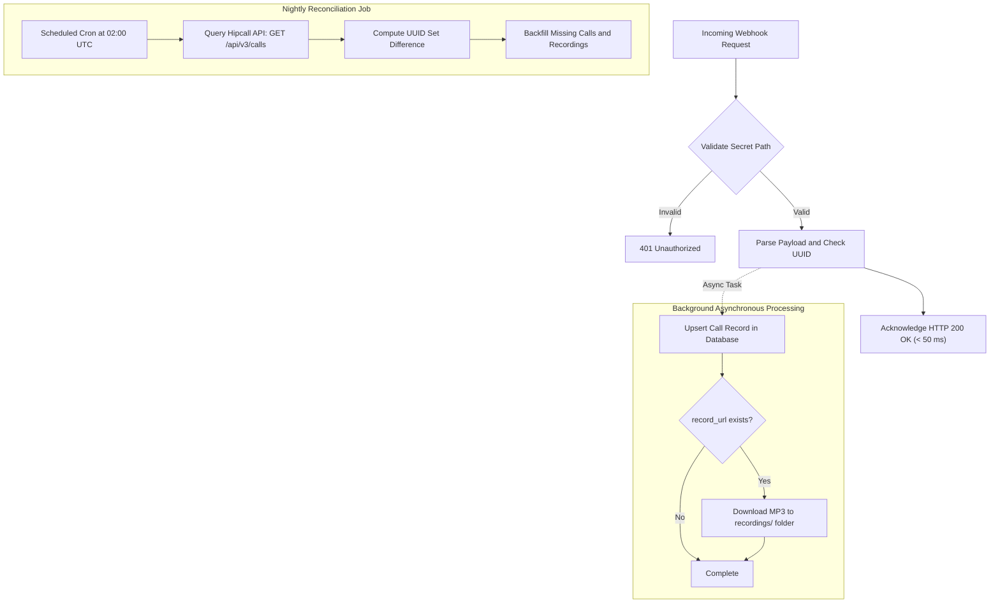

## Overview

Syncing call records through periodic API polling consumes rate limits and leaves data lagging behind active conversations.

Webhooks push events to your application instantly. When a call starts, connects, or ends, the Hipcall PBX sends an HTTP POST. Talk duration, disposition, and recording links reach your database the moment the call ends.

A production-ready webhook receiver needs four things:
- Respond in under 50 milliseconds to avoid timeouts.
- Secure the endpoint with a secret route token.
- Deduplicate events and reconciliation data by UUID.
- Reconcile data nightly to cover server downtime.

This page covers configuring a webhook, inspecting real payloads, and building an ASP.NET Core Minimal API receiver.

## Before you start

You need:
- .NET 8 SDK (`dotnet --version` must show 8.0 or higher).
- A public HTTPS endpoint. For local testing, use ngrok to expose port 5080:
  ```bash
  ngrok http 5080
  ```
- Access to the Hipcall dashboard.
- A registered agent device to make test calls.

## Setting up the webhook

Create the webhook in the Hipcall dashboard:

1. Go to Settings > Integrations > Marketplace.
2. Select Webhooks.
3. Fill in the details:
   - Name: Provide an identifier like `Production CDR Receiver`.
   - URL: Enter your HTTPS URL with a secret path, like `https://your-server.example.com/hipcall/events/whsec_live_xxxxxxxxxxxxxxxx`.
   - Events: Check `call_init`, `call_bridged`, and `call_hangup`.
4. Check the Logs tab. Turn on Debug Mode to capture request bodies and status codes for two hours.

## Payload structure and curl test

Hipcall sends `application/json`. The payload includes an `event` name and a nested `data` object containing the call details.

You can simulate a Hipcall `call_init` event locally using `curl`:

```bash
curl -X POST http://localhost:5080/hipcall/events/whsec_live_xxxxxxxxxxxxxxxx \
  -H "Content-Type: application/json" \
  -d '{
  "data": {
    "credited": null,
    "team_touch_at": null,
    "first_touch_duration": null,
    "contact_id": null,
    "callee_id": null,
    "answered_at": null,
    "voicemail_url": null,
    "caller_number": "+90850XXXXXXX",
    "missing_call_reason": null,
    "call_duration": null,
    "callback_time": null,
    "call_flow": [
      {
        "action": "init",
        "detail": {
          "id": null,
          "type": "contact"
        },
        "timestamp": 1790691203
      }
    ],
    "direction": "outbound",
    "callee_number": "+90530XXXXXXX",
    "voicemail_id": null,
    "callback_user_id": null,
    "callee_type": "contact",
    "ended_at": null,
    "missing_call": null,
    "channel_type": "number",
    "callback_cdr_uuid": null,
    "voicemail_type": null,
    "caller_id": null,
    "started_at": "2026-09-29T14:13:23Z",
    "bridged_at": null,
    "channel_id": 942,
    "caller_type": null,
    "user_id": 4200,
    "hangup_by": null,
    "uuid": "410c92c5-2b61-4dd2-aa75-d3601ae51277",
    "record_url": null,
    "number_id": 942,
    "company_id": 80719
  },
  "event": "call_init"
}'
```

### Inspecting request headers

The raw HTTP headers look like this:

```http
Host: your-server.example.com
User-Agent: mint/1.9.0
Content-Type: application/json
Accept-Encoding: gzip
X-Forwarded-For: 31.192.211.2
X-Forwarded-Proto: https
```

Hipcall does not send HMAC signature headers (`X-Signature`).

## What each event carries

A single call triggers multiple events.

| Event | Trigger Point | Key Fields | Purpose |
|---|---|---|---|
| `call_init` | PBX starts the session | `uuid`, `direction`, `caller_number`, `started_at` | Tracks session start. |
| `call_bridged` | Agent connects | `uuid`, `direction`, `user_id`, `call_flow` | Confirms the agent channel. |
| `call_hangup` | Call ends | `uuid`, `call_duration`, `hangup_by`, `record_url` | Final summary and recording link. |

### Telephony sequence in click-to-call

When initiating an outbound call via click-to-call, the Hipcall softphone answers the agent's leg automatically. Because the agent connects instantly, `call_init` and `call_bridged` arrive within a second of each other, while the destination phone is still ringing.

### Call recording URL lifespan

The `data.record_url` in `call_hangup` is a temporary AWS S3 link valid for 7 days (`X-Amz-Expires=604800`).

Download the audio file asynchronously when the webhook arrives and store it in your own infrastructure. Do not save the temporary link to your database.

## Designing a reliable architecture

Apply these four patterns for a production receiver:


```mermaid
flowchart TD
    A["Incoming Webhook Request"] --> B{"Validate Secret Path"}
    B -- "Invalid" --> C["401 Unauthorized"]
    B -- "Valid" --> D["Parse Payload and Check UUID"]
    D --> E["Acknowledge HTTP 200 OK (< 50 ms)"]

    subgraph BG ["Background Asynchronous Processing"]
        F["Upsert Call Record in Database"]
        F --> G{"record_url exists?"}
        G -- "Yes" --> H["Download MP3 to recordings/ folder"]
        G -- "No" --> I["Complete"]
        H --> I
    end

    D -.->|Async Task| F

    subgraph REC ["Nightly Reconciliation Job"]
        J["Scheduled Cron at 02:00 UTC"] --> K["Query Hipcall API: GET /api/v3/calls"]
        K --> L["Compute UUID Set Difference"]
        L --> M["Backfill Missing Calls and Recordings"]
    end
```

### 1. Respond quickly, defer heavy work

Hipcall expects a response within 15 seconds. If your receiver waits on audio downloads or database locks, the request times out.

The execution flow:
1. Validate the secret token.
2. Deserialize the JSON payload.
3. Queue the data.
4. Return HTTP 200 OK immediately (under 50 ms).
5. Write to disk and download audio in a background task.

### 2. Idempotency (Deduplication)

The `call_init`, `call_bridged`, and `call_hangup` events belonging to the same call will arrive at different times bearing the same `uuid`. Your system must process them as updates to the existing record, not as new records. Additionally, when you pull all calls of the day from the API during nightly reconciliation, the payload will include calls already recorded via webhook. To prevent duplicate data:
- Use `data.uuid` as your deduplication key.
- Never deduplicate by timestamp or phone number.
- Upsert the existing record when new events arrive.

### 3. Nightly reconciliation

A live webhook receiver can miss events during server restarts or network outages.

To guarantee a complete archive:
- Run a background job nightly.
- Query the Hipcall API for the day's calls:
  ```http
  GET /api/v3/calls?started_at[gte]=...&started_at[lte]=...&limit=100
  ```
- Compare the API's UUIDs with your local database.
- Backfill missing calls and recordings.

### 4. Securing unsigned endpoints

Since requests lack HMAC headers, secure your endpoint in two ways:
1. Secret route path: Include an unpredictable token in the URL (`/hipcall/events/whsec_live_...`). Return 401 Unauthorized if it is missing or wrong.
2. IP whitelisting: Restrict inbound traffic at your proxy to Hipcall's IP address (`31.192.211.2`).

## Minimal API receiver example

This compact ASP.NET Core Minimal API endpoint accepts the JSON payload, verifies the secret token, delegates processing to a background thread, and immediately returns `200 OK`. 

```csharp
using System;
using System.Text.Json;
using System.Threading.Tasks;
using Microsoft.AspNetCore.Builder;
using Microsoft.AspNetCore.Http;
using Microsoft.Extensions.DependencyInjection;

var builder = WebApplication.CreateBuilder(args);
builder.WebHost.ConfigureKestrel(options => options.ListenAnyIP(5080));
var app = builder.Build();

var expectedSecret = Environment.GetEnvironmentVariable("HIPCALL_WEBHOOK_SECRET") 
    ?? throw new InvalidOperationException("HIPCALL_WEBHOOK_SECRET environment variable is missing.");

var jsonOptions = new JsonSerializerOptions
{
    PropertyNamingPolicy = JsonNamingPolicy.SnakeCaseLower,
    PropertyNameCaseInsensitive = true
};

app.MapPost("/hipcall/events/{secret?}", async (string? secret, HttpRequest request) =>
{
    if (string.IsNullOrEmpty(secret) || !string.Equals(secret, expectedSecret, StringComparison.Ordinal))
    {
        return Results.Unauthorized();
    }

    HipcallWebhookPayload? payload;
    try
    {
        payload = await JsonSerializer.DeserializeAsync<HipcallWebhookPayload>(request.Body, jsonOptions);
    }
    catch
    {
        return Results.Ok();
    }

    if (payload?.Data?.Uuid != null)
    {
        // Defer database writes and audio downloads to a background worker
        _ = Task.Run(() => ProcessWebhookAsync(payload.Event, payload.Data.Uuid));
    }

    // Return HTTP 200 OK immediately
    return Results.Ok();
});

app.Run();

async Task ProcessWebhookAsync(string? eventName, string uuid)
{
    // Idempotent upsert logic and asynchronous tasks go here
    Console.WriteLine($"Processing {eventName} for {uuid} in background...");
    await Task.CompletedTask;
}

public class HipcallWebhookPayload
{
    public string? Event { get; set; }
    public CallDataPayload? Data { get; set; }
}

public class CallDataPayload
{
    public string? Uuid { get; set; }
    public string? Direction { get; set; }
    public string? CallerNumber { get; set; }
    public string? CalleeNumber { get; set; }
    public int? CallDuration { get; set; }
    public string? RecordUrl { get; set; }
    public string? HangupBy { get; set; }
    public string? VoicemailId { get; set; }
    public DateTime? StartedAt { get; set; }
    public DateTime? AnsweredAt { get; set; }
    public DateTime? BridgedAt { get; set; }
    public DateTime? EndedAt { get; set; }
}
```

## When it fails

### 1. HTTP 500 response

If your server returns `500 Internal Server Error`:
- The telephone conversation continues. Webhook delivery does not affect telephony routing.
- Hipcall logs a `500` error.
- Hipcall does not retry failed requests. Return 200 immediately and reconcile missing data nightly.

### 2. Timeouts

If your receiver takes longer than 15 seconds, Hipcall terminates the TCP connection and drops the event.

### 3. Broken status

If your receiver returns four errors (non-200 status or 15-second timeouts) within one hour:
- Hipcall marks the integration as Broken.
- Hipcall stops sending webhooks until you reactivate it.
- To recover, open the integration in the dashboard, switch the status to Active, and save.

See the [Hipcall API Reference](https://use.hipcall.com/api-docs/) for more details. These rules apply to Hipcall Webhooks v1. A v2 specification aligned with Standard Webhooks is under development.

## Parameter reference

The `data` object contains these fields:

| Field | Type | Example | Description |
|---|---|---|---|
| `uuid` | string | `"9a266251-d2a3-44fc-b422-9486ddf880c7"` | Unique call session identifier. |
| `direction` | string | `"outbound"` | `"inbound"` or `"outbound"`. |
| `caller_number` | string | `"+442079460123"` | Originating phone number. |
| `callee_number` | string | `"+447700900123"` | Destination phone number. |
| `call_duration` | integer | `14` | Audio conversation duration in seconds. |
| `missing_call` | boolean | `false` | `true` if an inbound call was unanswered. |
| `hangup_by` | string | `"contact"` | Party terminating the call (`"user"`, `"contact"`, `"system"`). |
| `record_url` | string/null | `"https://storage.hipcall.com/..."` | Presigned AWS S3 audio download URL. |
| `started_at` | string | `"2026-09-21T10:37:07Z"` | UTC timestamp when session started. |
| `answered_at` | string/null | `"2026-09-21T10:37:07Z"` | UTC timestamp when call was answered. |
| `ended_at` | string/null | `"2026-09-21T10:37:21Z"` | UTC timestamp when session ended. |

## Next steps

- Add a message broker like RabbitMQ between the HTTP receiver and database workers.
- Move to PostgreSQL with a unique constraint on `uuid`.
- Build the nightly reconciliation service using `GET /api/v3/calls`.
- Ask questions in the [Hipcall Community](https://community.hipcall.com/).
