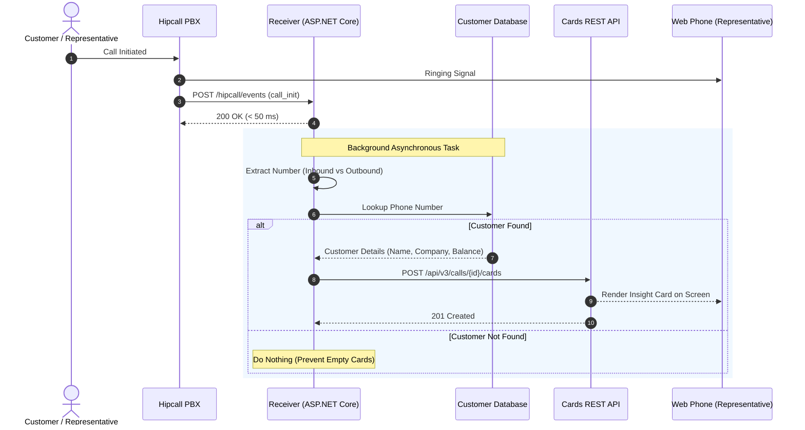

## Overview

When an incoming call rings and the screen shows only an unfamiliar number, the representative switches to the CRM tab and searches for it. That manual search takes about fifteen seconds. By the time the record loads, the caller has already started speaking.

Insight Card removes this delay. The moment a call starts, it displays the customer's name, company, open balance, and account owner inside the web phone. The data comes from your database; Hipcall surfaces it before the agent answers.

This page covers intercepting `call_init` webhooks with ASP.NET Core Minimal API, looking up the caller in a local CRM, and sending an Insight Card to the active call session.

## Before you start

Before implementing the integration, make sure you have:

- The .NET 8 SDK installed on your workstation or server (`dotnet --version` should output 8.0 or higher).
- A secure, publicly accessible HTTPS endpoint (such as an ngrok tunnel on port 5080) to receive incoming webhook events.
- A valid Personal Access Token generated in the Hipcall Developer Portal.
- An active Hipcall Web Phone session open in your browser to verify card rendering.

Set your API token in your terminal environment:

```bash
export HIPCALL_API_TOKEN="SFMyNTY.g2gDbQAAAC..."
```

## Insight Card structure and visual components

An Insight Card is rendered as a vertical stack of structured rows inside the active call window. Three core row types are supported:

| Row Type | Required Fields | Optional Fields | Description |
|---|---|---|---|
| `title` | `type`, `text` | `link` | The prominent card header. Setting `link` renders an external link icon that opens the CRM record in a new tab. |
| `shortText` | `type`, `text` | `label`, `link`, `ios`, `android` | Standard two-column data item. Displays a muted label on the left and bold text on the right (for company, tier, balance). |
| `user` | `type`, `label`, `user_id` | - | Resolves a Hipcall user ID to display the account owner's full name. |

Example payload for a structured customer card:

```json
{
  "card": [
    {
      "type": "title",
      "text": "Jane Doe",
      "link": "https://crm.example.com/customers/102"
    },
    {
      "type": "shortText",
      "label": "Company",
      "text": "Acme Global Ltd.",
      "link": "https://crm.example.com/customers/102"
    },
    {
      "type": "shortText",
      "label": "Segment",
      "text": "Enterprise"
    },
    {
      "type": "shortText",
      "label": "Balance",
      "text": "$14,250 (Open Invoice)"
    },
    {
      "type": "user",
      "label": "Account Owner",
      "user_id": 4200
    }
  ]
}
```

## Creating an Insight Card via the REST API

To attach a card to an active call session, send an HTTP POST request to `/api/v3/calls/{call_id}/cards`:

```bash
curl -X POST "https://use.hipcall.com/api/v3/calls/{call_id}/cards" \
  -H "Authorization: Bearer $HIPCALL_API_TOKEN" \
  -H "Content-Type: application/json" \
  -d '{
    "card": [
      {
        "type": "title",
        "text": "Acme CRM Customer Profile",
        "link": "https://crm.example.com/customer/101"
      },
      {
        "type": "shortText",
        "label": "Customer",
        "text": "Jane Doe"
      },
      {
        "type": "shortText",
        "label": "Status",
        "text": "VIP - Up to Date"
      }
    ]
  }'
```

On success, the API returns HTTP `201 Created` and renders the card inside the agent's web phone interface:


## Webhook integration and call lifecycle

To ensure the card is ready the moment the representative answers, the pipeline triggers on the `call_init` webhook event:



### Determining the customer number by call direction

The location of the target customer number depends on the `direction` parameter:

- **Inbound calls (`inbound`):** The caller is the external customer. Extract the number from `data.caller_number`.
- **Outbound calls (`outbound`):** The representative initiates the call. Extract the customer number from `data.callee_number`.

### Handling missing customers silently

Hipcall accepts empty card arrays (`{"card": []}`). However, posting an empty card causes the web phone to display an unnecessary blank box. If your database query finds no matching profile, do not send an HTTP request; acknowledge the webhook and complete the execution silently.

## Complete C# Minimal API implementation

The following ASP.NET Core Minimal API acknowledges incoming `call_init` webhooks within 50 ms, identifies the caller, queries local customer records, and posts the Insight Card asynchronously. It also preserves the API error body in case of failure.

```csharp
using System.Net.Http.Headers;
using System.Text;
using System.Text.Json;
using System.Text.Json.Serialization;

var builder = WebApplication.CreateBuilder(args);

builder.WebHost.ConfigureKestrel(serverOptions =>
{
    serverOptions.ListenAnyIP(5080);
});

var baseEndpoint = Environment.GetEnvironmentVariable("HIPCALL_API_ENDPOINT") ?? "https://use.hipcall.com/api/v3";

builder.Services.AddHttpClient("HipcallClient", client =>
{
    client.BaseAddress = new Uri(baseEndpoint.TrimEnd('/') + "/");
});

var app = builder.Build();

var jsonOptions = new JsonSerializerOptions
{
    PropertyNamingPolicy = JsonNamingPolicy.SnakeCaseLower,
    PropertyNameCaseInsensitive = true,
    DefaultIgnoreCondition = JsonIgnoreCondition.WhenWritingNull,
    WriteIndented = true,
    Encoder = System.Text.Encodings.Web.JavaScriptEncoder.UnsafeRelaxedJsonEscaping
};

var expectedSecret = Environment.GetEnvironmentVariable("HIPCALL_WEBHOOK_SECRET") ?? "whsec_live_xxxxxxxxxxxxxxxx";
var baseDir = Directory.GetCurrentDirectory();
var customersFilePath = Path.Combine(baseDir, "customers.json");

HashSet<string> processedCalls = [];

app.MapGet("/", () => Results.Ok(new { status = "running", service = "Hipcall.InsightCard" }));

app.MapPost("/hipcall/events/{secret?}", async (string? secret, HttpRequest request, IHttpClientFactory httpClientFactory) =>
{
    if (string.IsNullOrEmpty(secret) || !string.Equals(secret, expectedSecret, StringComparison.Ordinal))
    {
        return Results.Unauthorized();
    }

    using var reader = new StreamReader(request.Body, Encoding.UTF8);
    var rawBody = await reader.ReadToEndAsync();

    if (string.IsNullOrWhiteSpace(rawBody))
    {
        return Results.Ok();
    }

    HipcallWebhookPayload? payload = null;
    try
    {
        payload = JsonSerializer.Deserialize<HipcallWebhookPayload>(rawBody, jsonOptions);
    }
    catch (Exception ex)
    {
        Console.WriteLine($"Deserialization failed: {ex.Message}");
        return Results.Ok();
    }

    if (payload == null || string.IsNullOrEmpty(payload.Event) || payload.Data == null)
    {
        return Results.Ok();
    }

    if (payload.Event != "call_init" && payload.Event != "call_bridged")
    {
        return Results.Ok();
    }

    var data = payload.Data;
    if (string.IsNullOrEmpty(data.Uuid))
    {
        return Results.Ok();
    }

    lock (processedCalls)
    {
        if (processedCalls.Contains(data.Uuid))
        {
            return Results.Ok();
        }
        processedCalls.Add(data.Uuid);
    }

    string? targetPhoneNumber = string.Equals(data.Direction, "inbound", StringComparison.OrdinalIgnoreCase)
        ? data.CallerNumber
        : data.CalleeNumber;

    if (string.IsNullOrWhiteSpace(targetPhoneNumber))
    {
        return Results.Ok();
    }

    var currentCustomers = LoadCustomers(customersFilePath, jsonOptions);
    var matchedCustomer = FindCustomerByPhone(currentCustomers, targetPhoneNumber);
    if (matchedCustomer == null)
    {
        return Results.Ok();
    }

    _ = Task.Run(async () =>
    {
        try
        {
            var token = Environment.GetEnvironmentVariable("HIPCALL_API_TOKEN");
            if (string.IsNullOrWhiteSpace(token))
            {
                return;
            }

            var client = httpClientFactory.CreateClient("HipcallClient");
            var card = BuildInsightCard(matchedCustomer);
            var cardJson = JsonSerializer.Serialize(card, jsonOptions);
            using var cardContent = new StringContent(cardJson, Encoding.UTF8, "application/json");

            using var requestMessage = new HttpRequestMessage(HttpMethod.Post, $"calls/{data.Uuid}/cards")
            {
                Content = cardContent
            };
            requestMessage.Headers.Authorization = new AuthenticationHeaderValue("Bearer", token);

            var response = await client.SendAsync(requestMessage);
            if (!response.IsSuccessStatusCode)
            {
                var errorBody = await response.Content.ReadAsStringAsync();
                Console.WriteLine($"API Error: {response.StatusCode} - {errorBody}");
            }
        }
        catch (Exception ex)
        {
            Console.WriteLine($"Background task failed: {ex.Message}");
        }
    });

    return Results.Ok();
});

app.Run();

static List<CrmCustomer> LoadCustomers(string path, JsonSerializerOptions options)
{
    if (!File.Exists(path)) return [];
    try
    {
        var json = File.ReadAllText(path);
        return JsonSerializer.Deserialize<List<CrmCustomer>>(json, options) ?? [];
    }
    catch
    {
        return [];
    }
}

static CrmCustomer? FindCustomerByPhone(List<CrmCustomer> customers, string phone)
{
    var normalizedTarget = NormalizePhone(phone);
    return customers.FirstOrDefault(c => NormalizePhone(c.Phone) == normalizedTarget);
}

static string NormalizePhone(string? phone)
{
    if (string.IsNullOrWhiteSpace(phone)) return string.Empty;
    return new string(phone.Where(char.IsDigit).ToArray());
}

static InsightCardRoot BuildInsightCard(CrmCustomer customer)
{
    List<InsightCardItem> items =
    [
        new InsightCardItem { Type = "title", Text = customer.Name, Link = customer.CrmUrl },
        new InsightCardItem { Type = "shortText", Label = "Company", Text = customer.Company, Link = customer.CrmUrl },
        new InsightCardItem { Type = "shortText", Label = "Segment", Text = customer.Segment },
        new InsightCardItem { Type = "shortText", Label = "Balance", Text = customer.Balance }
    ];

    if (customer.AccountOwnerId.HasValue)
    {
        items.Add(new InsightCardItem { Type = "user", Label = "Account Owner", UserId = customer.AccountOwnerId.Value });
    }

    return new InsightCardRoot { Card = items };
}

public class CrmCustomer
{
    public string? Phone { get; set; }
    public string? Name { get; set; }
    public string? Company { get; set; }
    public string? Segment { get; set; }
    public string? Balance { get; set; }
    public string? CrmUrl { get; set; }
    public int? AccountOwnerId { get; set; }
}

public class InsightCardRoot
{
    public List<InsightCardItem> Card { get; set; } = [];
}

public class InsightCardItem
{
    public string Type { get; set; } = "shortText";
    public string? Label { get; set; }
    public string? Text { get; set; }
    public string? Link { get; set; }
    public int? UserId { get; set; }
}

public class HipcallWebhookPayload
{
    public string? Event { get; set; }
    public CallDataPayload? Data { get; set; }
}

public class CallDataPayload
{
    public string? Uuid { get; set; }
    public string? Direction { get; set; }
    public string? CallerNumber { get; set; }
    public string? CalleeNumber { get; set; }
}
```

## When it fails

### 1. HTTP 422 Unprocessable Entity and strict validation

The Insight Card API enforces strict schema validation on row objects. If attributes not defined for a row type (such as a `user_id` property on a `shortText` row) are included—even with `null` values—the API rejects the payload:

```text
HTTP 422 Unprocessable Entity
shortText type only allows fields: type, text, label, link, android, ios. Invalid fields found: user_id in card item 2
```

Configure your JSON serializer with `DefaultIgnoreCondition = JsonIgnoreCondition.WhenWritingNull`. This strips unassigned fields from outgoing payloads.

### 2. Posting cards to terminated calls

If a card request arrives after a call ends, Hipcall still returns HTTP 201 and attaches the card to the session history. The agent never sees it because the dialog is closed. Context must be pushed while the session is alive.

### 3. Latency budget considerations

Telephony ring times typically range from 5 to 15 seconds. Factoring in webhook transit (~150 ms) and the card API request (~200 ms), a 2-second database lookup yields an overall dispatch time of roughly 2.4 seconds, ensuring the card is ready before the representative picks up. Lookups exceeding 3 to 4 seconds cause cards to pop up after the conversation starts.

## Parameter reference

Supported Insight Card row types and their allowed attributes:

| Row Type | Supported Fields | Description |
|---|---|---|
| `title` | `type`, `text`, `link` | Card header with clickable external CRM link. |
| `shortText` | `type`, `text`, `label`, `link`, `ios`, `android` | Key-value data row, external URL, or mobile deep link. |
| `user` | `type`, `label`, `user_id` | Displays internal account owner via Hipcall user ID. |

## Next steps

- Transition from JSON file storage to an indexed PostgreSQL database or Redis cache for large customer datasets.
- Use Hipcall's `GET /api/v3/lookup/by_phone` endpoint as a fallback data source when an incoming caller does not match records in your primary CRM.
- Add `ios` and `android` deep link schemes to customer cards to let mobile agents open native CRM records directly.
- Share your integration feedback or custom Insight Card designs in the [Hipcall Community](https://community.hipcall.com/).
