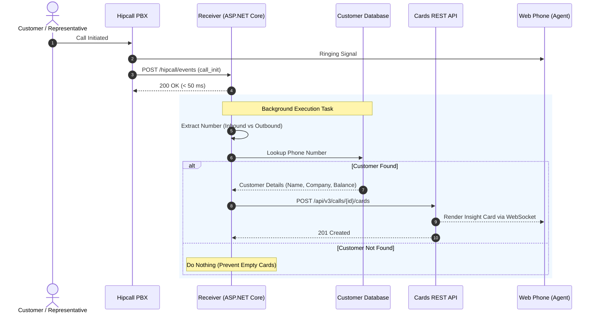

## Overview

When the phone rings, the agent's screen shows nothing more than an unfamiliar phone number. The representative scrambles to their CRM tab, pastes the number into a search box, and waits for customer records to load. That manual search takes roughly fifteen seconds—long after the caller has already said "Hello?".

Insight Card eliminates this fifteen-second blind spot. The moment a call starts, the customer's name, company, credit balance, and assigned account owner appear directly inside the Hipcall web phone interface. The data originates from your own internal database or CRM; Hipcall surfaces it in front of the representative before they pick up the handset.

In this guide, by setting up an ASP.NET Core webhook receiver, we cover identifying caller numbers during `call_init`, querying local customer data, formatting cards according to strict schema rules, and pushing context to the agent screen within a safe latency budget.

## Before you start

Before implementing the integration, make sure you have:

- **.NET 8 SDK** installed on your development machine or server.
- A secure, publicly accessible HTTPS endpoint (such as an ngrok tunnel on port 5080) to receive incoming webhook events.
- A valid **Personal Access Token** generated in the Hipcall Developer Portal.
- An active **Hipcall Web Phone** session open in your browser to verify card rendering.

## Anatomy of an Insight Card

An Insight Card is an array of structured rows rendered vertically inside the active call window. The Hipcall PBX enforces strict schema validation: each row type only permits its explicitly defined attributes.

| Row Type (`type`) | Required Fields | Optional Fields | Description |
|---|---|---|---|
| **`title`** | `type`, `text` | `link` | The prominent card header. If `link` is set, an external window icon appears on the right. |
| **`shortText`** | `type`, `text` | `label`, `link`, `ios`, `android` | Standard two-column data item. Displays a muted label on the left and bold text on the right. |
| **`user`** | `type`, `label`, `user_id` | - | Resolves a Hipcall user ID to the representative's full display name. |

```json
{
  "card": [
    {
      "type": "title",
      "text": "Mehmet Demir",
      "link": "https://crm.example.com/customers/102"
    },
    {
      "type": "shortText",
      "label": "Company",
      "text": "Demir Logistics Ltd.",
      "link": "https://crm.example.com/customers/102"
    },
    {
      "type": "shortText",
      "label": "Segment",
      "text": "Enterprise"
    },
    {
      "type": "shortText",
      "label": "Balance",
      "text": "14,250 USD (Open Invoice)"
    },
    {
      "type": "user",
      "label": "Account Owner",
      "user_id": 4200
    }
  ]
}
```

### Strict schema validation and the null field trap

Hipcall rejects payloads that contain unexpected keys. For example, if your C# model serializes a `shortText` row with a `user_id: null` attribute, the API fails with `422 Unprocessable Entity`:

```text
HTTP 422 Unprocessable Entity
shortText type only allows fields: type, text, label, link, android, ios. Invalid fields found: user_id in card item 2
```

Configure your JSON serializer with `DefaultIgnoreCondition = JsonIgnoreCondition.WhenWritingNull` so that unused properties are omitted entirely from outgoing payloads.

## Sending your first card manually

While a call is in progress, you can send an ad-hoc card using curl:

```bash
curl -X POST "https://use.hipcall.com.tr/api/v3/calls/{call_id}/cards" \
  -H "Authorization: Bearer YOUR_API_TOKEN" \
  -H "Content-Type: application/json" \
  -d '{
    "card": [
      {
        "type": "title",
        "text": "Acme CRM Customer Profile",
        "link": "https://crm.example.com/customer/101"
      },
      {
        "type": "shortText",
        "label": "Customer",
        "text": "Ahmet Yilmaz"
      },
      {
        "type": "shortText",
        "label": "Status",
        "text": "VIP - Up to Date"
      }
    ]
  }'
```

On success, the API returns HTTP `201 Created` and renders the card inside the agent's web phone interface:


## Wiring it to the call_init webhook

In automated pipelines, ingestion begins when the PBX dispatches a `call_init` event.



### Determining the customer number by call direction

The location of the target customer number depends on the `direction` parameter:

- **Inbound calls (`inbound`):** The caller is the external customer. Extract the number from `data.caller_number`.
- **Outbound calls (`outbound`):** The representative initiates the call. Extract the customer number from `data.callee_number`.

### Avoiding empty cards when no record exists

Hipcall accepts empty card arrays (`{"card": []}`). However, posting an empty card causes the web phone to display a blank container on the agent's screen. If your database query finds no matching profile, do not send an HTTP request; acknowledge the webhook and complete the execution silently.

## Timing matters

Insight Card implementations succeed or fail on latency management.

### 1. Rendering behavior upon call answer
During the ringing phase, the web phone displays a minimal dialing view. Once the call transitions to the `answered` state, the interface immediately renders any Insight Card associated with the session. Dispatching the card during `call_init` ensures the payload is pre-loaded on the server before the handset is picked up.

### 2. Posting cards to terminated calls
If a card request arrives after a call has ended, Hipcall still returns HTTP `200/201` and attaches the card to session history. However, the agent never sees it because the call dialog is closed. Never assume a `200 OK` response guarantees live visual delivery; context must be pushed while the session is alive.

### 3. Latency budget
Telephony ring times typically range from 5 to 15 seconds. Factoring in webhook transit (150 ms) and the card API request (200 ms), a 2-second database lookup yields an overall dispatch time of roughly 2.4 seconds. Keeping CRM query latency under 3 seconds ensures the card is ready the instant the agent answers.

## The full example

Here is the complete ASP.NET Core Minimal API implementation. It parses `call_init` events, handles call directions, queries local customer records, and posts cards in the background:

```csharp
using System.Diagnostics;
using System.Net.Http.Headers;
using System.Text;
using System.Text.Json;
using System.Text.Json.Serialization;

var builder = WebApplication.CreateBuilder(args);

builder.WebHost.ConfigureKestrel(serverOptions =>
{
    serverOptions.ListenAnyIP(5080);
});

var baseEndpoint = Environment.GetEnvironmentVariable("HIPCALL_API_ENDPOINT") ?? "https://use.hipcall.com.tr/api/v3";

builder.Services.AddHttpClient("HipcallClient", client =>
{
    client.BaseAddress = new Uri(baseEndpoint.TrimEnd('/') + "/");
});

var app = builder.Build();

var jsonOptions = new JsonSerializerOptions
{
    PropertyNamingPolicy = JsonNamingPolicy.SnakeCaseLower,
    PropertyNameCaseInsensitive = true,
    DefaultIgnoreCondition = JsonIgnoreCondition.WhenWritingNull,
    WriteIndented = true,
    Encoder = System.Text.Encodings.Web.JavaScriptEncoder.UnsafeRelaxedJsonEscaping
};

var expectedSecret = Environment.GetEnvironmentVariable("HIPCALL_WEBHOOK_SECRET") ?? "whsec_live_9a8f2e4c1b0d";
var baseDir = Directory.GetCurrentDirectory();
var customersFilePath = Path.Combine(baseDir, "customers.json");

HashSet<string> processedCalls = [];

app.MapGet("/", () => Results.Ok(new { status = "running", service = "Hipcall.InsightCard" }));

app.MapPost("/hipcall/events/{secret?}", async (string? secret, HttpRequest request, IHttpClientFactory httpClientFactory) =>
{
    using var reader = new StreamReader(request.Body, Encoding.UTF8);
    var rawBody = await reader.ReadToEndAsync();

    if (string.IsNullOrWhiteSpace(rawBody))
    {
        return Results.Ok();
    }

    HipcallWebhookPayload? payload;
    try
    {
        payload = JsonSerializer.Deserialize<HipcallWebhookPayload>(rawBody, jsonOptions);
    }
    catch
    {
        return Results.Ok();
    }

    if (payload == null || string.IsNullOrEmpty(payload.Event) || payload.Data == null)
    {
        return Results.Ok();
    }

    if (payload.Event != "call_init" && payload.Event != "call_bridged")
    {
        return Results.Ok();
    }

    var data = payload.Data;
    if (string.IsNullOrEmpty(data.Uuid))
    {
        return Results.Ok();
    }

    lock (processedCalls)
    {
        if (processedCalls.Contains(data.Uuid))
        {
            return Results.Ok();
        }
        processedCalls.Add(data.Uuid);
    }

    string? targetPhoneNumber = string.Equals(data.Direction, "inbound", StringComparison.OrdinalIgnoreCase)
        ? data.CallerNumber
        : data.CalleeNumber;

    if (string.IsNullOrWhiteSpace(targetPhoneNumber))
    {
        return Results.Ok();
    }

    var currentCustomers = LoadCustomers(customersFilePath, jsonOptions);
    var matchedCustomer = FindCustomerByPhone(currentCustomers, targetPhoneNumber);
    if (matchedCustomer == null)
    {
        return Results.Ok();
    }

    _ = Task.Run(async () =>
    {
        try
        {
            var token = Environment.GetEnvironmentVariable("HIPCALL_API_TOKEN");
            if (string.IsNullOrWhiteSpace(token))
            {
                return;
            }

            var client = httpClientFactory.CreateClient("HipcallClient");
            var card = BuildInsightCard(matchedCustomer);
            var cardJson = JsonSerializer.Serialize(card, jsonOptions);
            using var cardContent = new StringContent(cardJson, Encoding.UTF8, "application/json");

            using var requestMessage = new HttpRequestMessage(HttpMethod.Post, $"calls/{data.Uuid}/cards")
            {
                Content = cardContent
            };
            requestMessage.Headers.Authorization = new AuthenticationHeaderValue("Bearer", token);

            await client.SendAsync(requestMessage);
        }
        catch
        {
        }
    });

    return Results.Ok();
});

app.Run();

static List<CrmCustomer> LoadCustomers(string path, JsonSerializerOptions options)
{
    if (!File.Exists(path)) return [];
    try
    {
        var json = File.ReadAllText(path);
        return JsonSerializer.Deserialize<List<CrmCustomer>>(json, options) ?? [];
    }
    catch
    {
        return [];
    }
}

static CrmCustomer? FindCustomerByPhone(List<CrmCustomer> customers, string phone)
{
    var normalizedTarget = NormalizePhone(phone);
    return customers.FirstOrDefault(c => NormalizePhone(c.Phone) == normalizedTarget);
}

static string NormalizePhone(string? phone)
{
    if (string.IsNullOrWhiteSpace(phone)) return string.Empty;
    var digits = new string(phone.Where(char.IsDigit).ToArray());
    if (digits.StartsWith("90") && digits.Length == 12) return digits[2..];
    if (digits.StartsWith("0") && digits.Length == 11) return digits[1..];
    return digits;
}

static InsightCardRoot BuildInsightCard(CrmCustomer customer)
{
    List<InsightCardItem> items =
    [
        new InsightCardItem { Type = "title", Text = customer.Name, Link = customer.CrmUrl },
        new InsightCardItem { Type = "shortText", Label = "Company", Text = customer.Company, Link = customer.CrmUrl },
        new InsightCardItem { Type = "shortText", Label = "Segment", Text = customer.Segment },
        new InsightCardItem { Type = "shortText", Label = "Balance", Text = customer.Balance }
    ];

    if (customer.AccountOwnerId.HasValue)
    {
        items.Add(new InsightCardItem { Type = "user", Label = "Account Owner", UserId = customer.AccountOwnerId.Value });
    }

    return new InsightCardRoot { Card = items };
}

public class CrmCustomer
{
    public string? Phone { get; set; }
    public string? Name { get; set; }
    public string? Company { get; set; }
    public string? Segment { get; set; }
    public string? Balance { get; set; }
    public string? CrmUrl { get; set; }
    public int? AccountOwnerId { get; set; }
}

public class InsightCardRoot
{
    public List<InsightCardItem> Card { get; set; } = [];
}

public class InsightCardItem
{
    public string Type { get; set; } = "shortText";
    public string? Label { get; set; }
    public string? Text { get; set; }
    public string? Link { get; set; }
    public int? UserId { get; set; }
}

public class HipcallWebhookPayload
{
    public string? Event { get; set; }
    public CallDataPayload? Data { get; set; }
}

public class CallDataPayload
{
    public string? Uuid { get; set; }
    public string? Direction { get; set; }
    public string? CallerNumber { get; set; }
    public string? CalleeNumber { get; set; }
}
```

## When it fails

Common failure modes and how to resolve them:

### 1. HTTP 422 Unprocessable Entity
- Validate row types: only `title`, `shortText`, and `user` are accepted.
- Prevent schema pollution: Ensure rows do not include attributes belonging to other types (such as `user_id` on a `shortText` row).
- Verify the top-level `card` array exists.

### 2. The agent does not see the card
- The call may already be terminated: Completed calls accept cards into history but do not display them live.
- Check API token scope: Requests without valid Bearer authentication fail silently on the UI.
- Monitor execution duration: Database queries taking over 4 seconds cause cards to arrive after the conversation has begun.

## Next steps

- Replace JSON file lookups with an indexed PostgreSQL table or a Redis cache for larger customer directories.
- Use Hipcall's `GET /api/v3/lookup/by_phone` endpoint as a fallback data source when an incoming caller does not match records in your primary CRM.
- Add `ios` and `android` deep link schemes to customer cards to let mobile agents open native CRM records directly.
