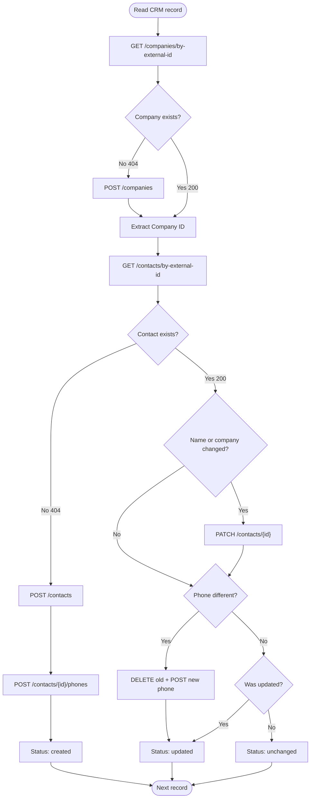

## Overview

The customer ID in your CRM does not have to match the contact ID in Hipcall. When synchronizing data between the two systems, you need a reliable matching field.

Matching by phone number might seem straightforward, but it leads to mapping failures when numbers change or formats differ.

The `external_id` field solves this. You write your own ID into the Hipcall record and query it directly. This page covers attaching your ID to contact and company records, understanding the strict update differences between `POST` and `PATCH`, and writing an idempotent C# synchronization script.

## Before you start

Ensure you have the following ready:

- .NET 9 SDK installed (`dotnet --version` should output 9.0 or higher).
- A valid Personal Access Token generated from the Hipcall Management Panel with permissions to create and update contacts and companies.
- A few test contacts and companies in your DEMO account to verify the creation and update flows.

Export your API token in your terminal:

```bash
export HIPCALL_API_TOKEN="..."
```

## Creating a contact with your ID

The smallest valid payload for `POST /api/v3/contacts` requires a single field: `first_name`. To tag the record with your CRM ID, include `external_id`:

```bash
curl -X POST "https://use.hipcall.com/api/v3/contacts" \
  -H "Authorization: Bearer $HIPCALL_API_TOKEN" \
  -H "Content-Type: application/json" \
  -d '{
    "first_name": "Jane",
    "last_name": "Doe",
    "external_id": "CUSTOMER-JANE-001",
    "company_id": 80679,
    "phones": [
      { "country": "GB", "number": "+44207XXXXXXX" }
    ]
  }'
```

On success, the API returns HTTP `201 Created` with the internal `id` alongside your payload. The `phones` and `emails` arrays are accepted during the creation phase:

```json
{
  "data": {
    "id": 194136,
    "user": null,
    "source": null,
    "external_id": "CUSTOMER-JANE-001",
    "full_name": null,
    "first_name": "Jane",
    "last_name": "Doe",
    "company": null,
    "custom_url": null,
    "linkedin_url": null,
    "emails": [],
    "life_cycle": null,
    "phones": [],
    "sector": null,
    "job_title": null,
    "custom_fields": {}
  }
}
```

If you attempt to create a second contact with the exact same `external_id`, the API returns `422 Unprocessable Entity`:

```json
{
  "errors": {
    "external_id": [
      "has already been taken"
    ]
  }
}
```

The uniqueness constraint on the `external_id` field prevents the creation of multiple contacts with the same ID. This ensures reliable matching during synchronization.

## Querying by external_id

Query your own identifier instead of the internal Hipcall ID:

```bash
curl -s "https://use.hipcall.com/api/v3/contacts/by-external-id/CUSTOMER-JANE-001" \
  -H "Authorization: Bearer $HIPCALL_API_TOKEN"
```

If the record exists, the API returns `200 OK` and the complete contact object:

```json
{
  "data": {
    "id": 194136,
    "user": null,
    "source": null,
    "external_id": "CUSTOMER-JANE-001",
    "full_name": "Jane Doe",
    "first_name": "Jane",
    "last_name": "Doe",
    "company": null,
    "custom_url": null,
    "linkedin_url": null,
    "emails": [],
    "life_cycle": null,
    "phones": [],
    "sector": null,
    "job_title": null,
    "custom_fields": {}
  }
}
```

If it does not exist, it returns `404 Not Found`. Your synchronization script will use these two responses to decide whether to create or update the record.

## Updating: field routing and sub-resources

The API separates scalar fields from arrays during update operations. Send a `PATCH` request to the main endpoint to update scalar fields like `first_name`, `last_name`, and `company_id`. Manage phones and emails through their dedicated sub-resource endpoints.

| Operation | Endpoint | Payload Format |
|---|---|---|
| Update name, company | `PATCH /api/v3/contacts/{id}` | `{ "first_name": "Jane", "company_id": 80679 }` |
| Add phone | `POST /api/v3/contacts/{id}/phones` | `{ "phones": [{ "country": "GB", "number": "+44207XXXXXXX" }] }` |
| Delete phone | `DELETE /api/v3/contacts/{id}/phones/%2B44207XXXXXXX` | (No payload) |
| Add email | `POST /api/v3/contacts/{id}/emails` | `{ "emails": ["name@company.com"] }` |
| Delete email | `DELETE /api/v3/contacts/{id}/emails/name%40company.com` | (No payload) |

Because `POST /api/v3/contacts` accepts `phones` and `emails` arrays during creation, you might expect `PATCH /api/v3/contacts/{id}` to accept them as well. However, if you include a `phones` array in a `PATCH` request, the API rejects it and returns `422 Unprocessable Entity` with an `"Unexpected field: phones"` error.

A contact can hold a maximum of six phone numbers. If you try to add a seventh, the API returns `422` with `"Contact already has 6 phone numbers"`. Attempting to add an already existing number also yields a `422` error.

## Custom fields

Manage custom field definitions from Settings > Directory > Custom Fields in the panel. The API accesses these fields via their `slug`. The slug is a machine-readable key derived from the field name (for example, `custom_field` for "Custom Field").

Read and write custom fields through the `custom_fields` object:

```json
{
  "custom_fields": {
    "stage": "startup",
    "account_manager": "John"
  }
}
```

Both `POST` and `PATCH` accept this object. If a field marked as mandatory in the panel is left blank during creation, the API rejects the request:

```json
{
  "errors": {
    "custom_fields": {
      "tier": ["can't be blank"]
    }
  }
}
```

## Companies and linking

Companies use the same `external_id` mechanism. Create a company with your ID, then link contacts to it using `company_id`:

```bash
curl -X POST "https://use.hipcall.com/api/v3/companies" \
  -H "Authorization: Bearer $HIPCALL_API_TOKEN" \
  -H "Content-Type: application/json" \
  -d '{ "name": "Acme Ltd.", "external_id": "COMPANY-77" }'
```

Query it with `GET /api/v3/companies/by-external-id/COMPANY-77`, then use the returned `id` as the `company_id` when creating or updating a contact.

When a company is deleted, the `company` field of its linked contacts is set to `null`. The contact records are not deleted.

The `/assign` sub-endpoint (`PATCH /api/v3/contacts/{id}/assign`) changes the ownership of the contact without requiring full update permissions. You can remove the assignment by sending `"assign_to_user_id": null`.

## Writing an idempotent sync

The sync reads a JSON file (your CRM export) and runs every record through this decision tree:



The input file (`crm_data.json`) contains the CRM records. Each record maps to a contact and optionally a company:

```json
[
  {
    "customerId": "CUSTOMER-JANE-001",
    "firstName": "Jane",
    "lastName": "Doe",
    "phone": "+44207XXXXXXX",
    "companyId": "4202"
  },
  {
    "customerId": "CUSTOMER-JOHN-002",
    "firstName": "John",
    "lastName": "Smith",
    "phone": "+44207XXXXXXX",
    "companyId": "4202"
  }
]
```

## C# Upsert Logic

The core logic of the upsert mechanism for a single contact looks like this in C#:

```csharp
var getResp = await client.GetAsync($"contacts/by-external-id/{record.CustomerId}");
if (getResp.IsSuccessStatusCode)
{
    // Contact exists. Compare fields and PATCH if different.
    var body = await getResp.Content.ReadFromJsonAsync<HipcallResponse<Contact>>();
    var contact = body?.Data ?? throw new Exception("Empty contact response.");
    contactId = contact.Id;

    var patchReq = new Dictionary<string, object>();
    if (contact.FirstName != record.FirstName)
        patchReq["first_name"] = record.FirstName ?? "";
    if (contact.LastName != record.LastName)
        patchReq["last_name"] = record.LastName ?? "";
    if (companyId.HasValue && contact.Company?.Id != companyId.Value)
        patchReq["company_id"] = companyId.Value;

    if (patchReq.Count > 0)
    {
        // Phones and emails are EXCLUDED here. PATCH rejects them.
        await client.PatchAsJsonAsync($"contacts/{contactId}", patchReq);
        status = "updated";
    }
}
else if (getResp.StatusCode == HttpStatusCode.NotFound)
{
    // Contact does not exist. Create it.
    var postReq = new Dictionary<string, object>
    {
        ["first_name"] = record.FirstName ?? "",
        ["last_name"] = record.LastName ?? "",
        ["external_id"] = record.CustomerId ?? ""
    };
    var postResp = await client.PostAsJsonAsync("contacts", postReq);
    // ...
    status = "created";
}
```

Phone numbers are managed separately through the sub-resource endpoint:

```csharp
if (!phoneExists)
{
    var phoneReq = new
    {
        phones = new[] { new { country = "GB", number = targetPhone } }
    };
    await client.PostAsJsonAsync($"contacts/{contactId}/phones", phoneReq);
}
```

The script logs the result for each record. If a record produces an error, the sync logs it and continues to the next record:

```text
--- Hipcall Contact & Company Sync Initiated (6 records) ---

Processing: [CUSTOMER-JANE-001] Jane Doe
   [=] No changes (Record up to date)
Status: unchanged

Processing: [CUSTOMER-JOHN-003] Johnn Smith
   [+] Details updated: Name ('John' -> 'Johnn')
Status: updated

Processing: [CUSTOMER-ERR-004]  Erroneous Record
ERROR (CUSTOMER-ERR-004): Contact creation failed: {"errors":{"first_name":["String length is smaller than minLength: 1"]}}

================ SUMMARY ================
Summary: 0 created, 1 updated, 4 unchanged, 1 error.
=========================================
```

Running the same data a second time produces no creations or updates:

```text
Summary: 0 created, 0 updated, 5 unchanged, 1 error.
```

Contact count before first run: 21. After first run: 25. After second run: 25. Zero duplicates produced.

## When it fails

| Status Code | Error Body | Cause | Resolution |
|---|---|---|---|
| `422` | `{"errors":{"external_id":["has already been taken"]}}` | You attempted to create a new contact with an existing `external_id`. | Query by `external_id` first, and update if it exists. |
| `422` | `{"errors":{"phones":["Unexpected field: phones"]}}` | You included `phones` in the payload of a `PATCH` request. | Use `POST /contacts/{id}/phones` to add numbers. |
| `422` | `{"errors":{"phones":["Contact already has 6 phone numbers"]}}` | The contact reached the six-phone limit. | Delete an old number before adding a new one. |
| `422` | `{"errors":{"first_name":["String length is smaller than minLength: 1"]}}` | The `first_name` is empty or missing. | Validate before dispatching. `first_name` is mandatory and must contain at least one character. |
| `422` | `{"errors":{"custom_fields":{"tier":["can't be blank"]}}}` | A mandatory custom field was not provided. | Include all required custom fields in the payload, or remove the requirement in the panel. |
| `404` | `{"errors":{"detail":"Not Found"}}` | The `external_id` does not match any record. | This is expected in an upsert flow. Proceed to create the record. |

## Next steps

- Add email synchronization (`POST /contacts/{id}/emails`) using the same sub-resource pattern.
- Run the sync script on a timer (for example, hourly) and verify that repeated executions produce zero duplicates.
