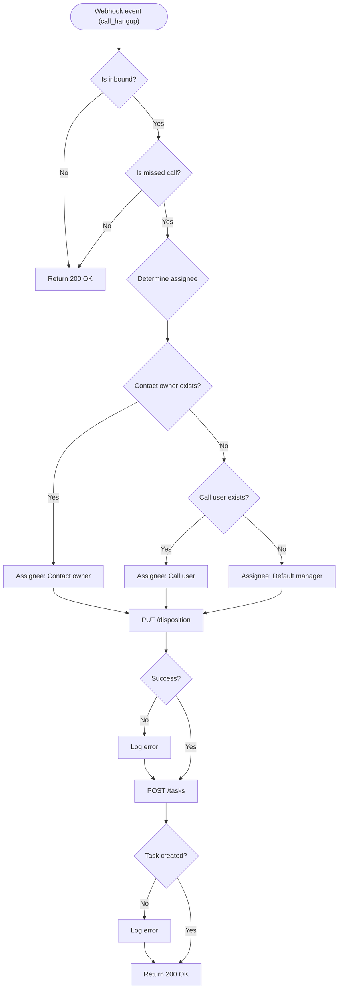

## Overview

A missed call is an expensive event for a call center. When a customer calls to place an order or report an issue and no one calls them back, the opportunity is lost. Teams often handle this manually by reviewing reports at the end of the day and distributing the list to agents. This introduces a 6-to-8-hour delay.

You can automate this workflow. When a call ends without an answer, the system assigns a disposition code and opens a follow-up task for the responsible agent immediately.

## Before you start

Make sure you have these ready:

- A working webhook receiver that listens for the `call_hangup` event.
- A disposition code created in your DEMO account. Go to Settings > Contact Center > Dispositions to create one.
- A test phone number you can call and leave unanswered.
- Your Personal Access Token configured in your environment.

## Telling a missed call from an answered one

To open tasks only for missed calls, you need to identify them accurately. The `call_hangup` webhook provides several fields, but relying on `missing_call` alone is not enough.

When a customer calls and leaves a voicemail, the `missing_call` field is `true`. The PBX usually creates a separate task for voicemails. If your webhook receiver also opens a task based on `missing_call == true`, you generate duplicate tasks for the same call.

To identify a genuine missed call, check both `missing_call` and `voicemail_id`:

| Scenario | `missing_call` | `missing_call_reason` | `bridged_at` | `voicemail_id` |
|---|---|---|---|---|
| Answered | `false` | `null` | Populated | `null` |
| Caller hung up | `true` | `"abandoned"` | `null` | `null` |
| Sent to voicemail | `true` | `"abandoned"` | `null` | Populated |

The correct condition for a missed call is `missing_call == true` AND `voicemail_id == null`.

You should process inbound calls only. When an agent makes an outbound call and the customer does not answer, the API leaves `missing_call` as `false`. Opening a task for a customer who did not answer your call creates unnecessary work for the agent.

## Writing the disposition

Use `PUT /api/v3/calls/{call_id}/disposition` to assign a outcome to the call.

The `GET /api/v3/dispositions` endpoint returns both an `id` and a `code` for each disposition. Always use the `code` in your integration. The `id` changes between development and production environments, while the `code` remains consistent.

The smallest valid request body requires only the `disposition_code`:

```json
{
  "disposition_code": "geri_arama_istendi"
}
```

If you send both `disposition_id` and `disposition_code`, the API returns `422 Unprocessable Entity` to prevent data mismatch. If you send neither, it returns `422` indicating the field cannot be blank.

## Opening the follow-up task

Use `POST /api/v3/tasks` to create a task. The `name` field is required.

To assign the task to an agent, send their user ID in the `assign_to_user_id` field. You can determine who should receive the task using this fallback strategy:

1. Check if the caller has an assigned owner in the CRM (`contact.user_id`).
2. Check if the call was ringing a specific user (`data.user_id`).
3. Fall back to a default manager ID configured in your app settings. This ensures no call is left unassigned.

To link the task directly to the caller's profile and company, provide `contact_ids` and `company_ids`. This associates the task with the contact and company pages in Hipcall.

Set the `due_date` in ISO 8601 format using UTC (`Z`). If you omit the timezone offset, the API throws an "Invalid format" error.

```json
{
  "name": "Callback: +90555XXXXXXX",
  "assign_to_user_id": 4200,
  "due_date": "2026-09-27T15:00:00Z",
  "contact_ids": [12345],
  "company_ids": [6789]
}
```

## Wiring it to the webhook

The webhook receiver evaluates the rules and runs the actions asynchronously so it can return `200 OK` immediately.



## C# Minimal API implementation

The following ASP.NET Core application handles the `call_hangup` webhook event. It evaluates incoming calls, assigns the disposition code for missed calls, resolves the responsible assignee, and creates a follow-up task linked to contact and company records:

```csharp
using System.Collections.Concurrent;
using System.Net.Http.Json;
using System.Text;
using System.Text.Json;

var builder = WebApplication.CreateBuilder(args);
builder.Services.AddHttpClient("HipcallClient", client =>
{
    client.BaseAddress = new Uri("https://use.hipcall.com.tr/api/v3/");
    client.DefaultRequestHeaders.Authorization =
        new System.Net.Http.Headers.AuthenticationHeaderValue("Bearer", Environment.GetEnvironmentVariable("HIPCALL_API_TOKEN"));
});

var app = builder.Build();

var jsonOptions = new JsonSerializerOptions
{
    PropertyNamingPolicy = JsonNamingPolicy.SnakeCaseLower,
    PropertyNameCaseInsensitive = true
};

var expectedSecret = Environment.GetEnvironmentVariable("HIPCALL_WEBHOOK_SECRET") ?? "whsec_live_secret";
var defaultManagerId = 4200;
var processedCalls = new ConcurrentDictionary<string, DateTime>();

app.MapPost("/hipcall/events/{secret?}", async (
    string? secret,
    HttpRequest request,
    IHttpClientFactory httpClientFactory,
    ILogger<Program> logger) =>
{
    if (string.IsNullOrEmpty(secret) || !string.Equals(secret, expectedSecret, StringComparison.Ordinal))
    {
        return Results.Unauthorized();
    }

    using var reader = new StreamReader(request.Body, Encoding.UTF8);
    var rawBody = await reader.ReadToEndAsync();
    if (string.IsNullOrWhiteSpace(rawBody))
    {
        return Results.Ok();
    }

    var payload = JsonSerializer.Deserialize<WebhookPayload>(rawBody, jsonOptions);
    if (payload?.Data == null || payload.Event != "call_hangup")
    {
        return Results.Ok();
    }

    var call = payload.Data;
    if (call.Direction != "inbound" || !call.MissingCall || call.VoicemailId != null)
    {
        return Results.Ok();
    }

    if (!processedCalls.TryAdd($"missed:{call.Uuid}", DateTime.UtcNow))
    {
        return Results.Ok();
    }

    _ = Task.Run(async () =>
    {
        var client = httpClientFactory.CreateClient("HipcallClient");

        try
        {
            var dispositionBody = new { disposition_code = "geri_arama_istendi" };
            var dispContent = new StringContent(JsonSerializer.Serialize(dispositionBody), Encoding.UTF8, "application/json");
            await client.PutAsync($"calls/{call.Uuid}/disposition", dispContent);
        }
        catch (Exception ex)
        {
            logger.LogError(ex, "Failed to write disposition: {Uuid}", call.Uuid);
        }

        try
        {
            int assigneeId = defaultManagerId;
            if (call.ContactId.HasValue)
            {
                var contactResp = await client.GetAsync($"contacts/{call.ContactId.Value}");
                if (contactResp.IsSuccessStatusCode)
                {
                    var contactData = await contactResp.Content.ReadFromJsonAsync<ContactResponse>(jsonOptions);
                    if (contactData?.Data?.UserId.HasValue == true)
                    {
                        assigneeId = contactData.Data.UserId.Value;
                    }
                }
            }
            else if (call.UserId.HasValue)
            {
                assigneeId = call.UserId.Value;
            }

            var taskBody = new Dictionary<string, object>
            {
                ["name"] = $"Callback: {call.CallerNumber} — Missed Call",
                ["description"] = $"Time: {call.StartedAt}\nRing duration: {call.CallDuration} s\nReason: {call.MissingCallReason}",
                ["assign_to_user_id"] = assigneeId,
                ["due_date"] = DateTime.UtcNow.AddMinutes(30).ToString("yyyy-MM-ddTHH:mm:ssZ")
            };

            if (call.ContactId.HasValue)
            {
                taskBody["contact_ids"] = new[] { call.ContactId.Value };
            }
            if (call.CompanyId.HasValue)
            {
                taskBody["company_ids"] = new[] { call.CompanyId.Value };
            }

            var taskContent = new StringContent(
                JsonSerializer.Serialize(new { data = taskBody }, jsonOptions),
                Encoding.UTF8,
                "application/json");

            await client.PostAsync("tasks", taskContent);
        }
        catch (Exception ex)
        {
            logger.LogError(ex, "Failed to create task: {Uuid}", call.Uuid);
        }
    });

    return Results.Ok();
});

app.Run();

record WebhookPayload(string Event, CallData? Data);
record CallData(string Uuid, string Direction, bool MissingCall, string? MissingCallReason, int? VoicemailId, string? CallerNumber, string? StartedAt, int? CallDuration, int? ContactId, int? CompanyId, int? UserId);
record ContactResponse(ContactData Data);
record ContactData(int Id, int? UserId);
```

## When it fails

| Status code | Error body | Cause | Fix |
|---|---|---|---|
| `422` | `{"errors":{"disposition_id":["provide either disposition_id or disposition_code, not both"]}}` | You sent both the ID and the code. | Send only `disposition_code`. |
| `422` | `{"errors":{"disposition_id":["can't be blank"]}}` | The request body was empty. | Include the `disposition_code` in the JSON body. |
| `422` | `{"errors":{"direction":["does not apply to this call"]}}` | You tried to apply an outbound disposition to an inbound call. | Ensure the disposition is configured for inbound or both directions. |
| `422` | `{"editable":false}` | The edit window has expired. | You cannot change the disposition of a call days after it ends. The account setting determines the time limit. |
| `400` | `{"errors":{"data":["#/data/name: Missing field: name"]}}` | You omitted the task name. | Add the `name` field to the task creation request. |

## Parameter reference

**POST /api/v3/tasks**

| Parameter | Type | Required | Description |
|---|---|---|---|
| `name` | string | yes | The title of the task. |
| `description` | string | no | The details of the task. |
| `assign_to_user_id` | integer | no | The user responsible for the task. |
| `due_date` | string | no | The deadline in UTC ISO 8601 format. |
| `contact_ids` | array | no | Array of contact IDs linked to this task. |
| `company_ids` | array | no | Array of company IDs linked to this task. |

## Next steps

- Tag short calls automatically to filter out misdials.
- Post caller summaries as comments when recognized contacts call.
