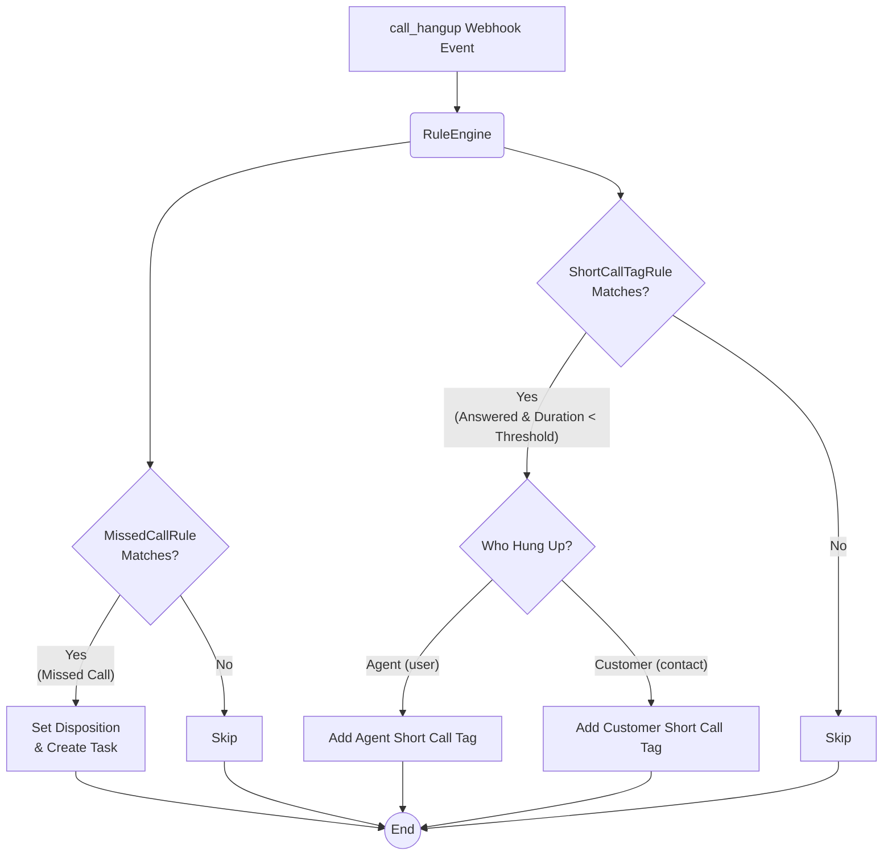

## Overview

An 8-second call that is marked as answered appears "successful" in reports. In reality, no business is discussed in 8 seconds. These calls indicate issues such as wrong numbers, audio problems, or agents hanging up early.

Detect short calls via webhooks and tag them so team leaders can filter problematic calls instead of searching for them one by one.

## Before you start

- Obtain an active Hipcall API token.
- Set up the infrastructure to receive the `call_hangup` webhook event.
- Go to Settings > Call Center > Tags in the Hipcall panel to create the necessary tags. Tags are not created via the API; you can only assign existing ones. Note down the tag ID values for configuration.

## Which duration field should you use?

The call record contains multiple time-related fields. Select the correct one to avoid inaccurate reports.

| Field | Measurement |
|---|---|
| `call_duration` | Total billable time, including announcements and ringing |
| `first_touch_duration` | Time from entering the system until the agent answers |
| `started_at` | The exact moment the call enters the system |
| `answered_at` | The moment the PBX or agent answers the call |
| `bridged_at` | The moment the customer and agent are connected |
| `ended_at` | The moment the call is disconnected |

Do not use `call_duration` to measure talk time. A call that rings for 45 seconds and goes unanswered has a `call_duration` of 45 seconds. A call where the customer listens to an announcement for 15 seconds and talks for 6 seconds has a `call_duration` of 21 seconds.

To calculate the actual talk time, take the difference between the `ended_at` and `bridged_at` timestamps.

## Who hung up and why does it matter?

When reviewing short calls, check who disconnected the call. You can retrieve this from the `hangup_by` field.

- **contact:** The customer hung up. This is a natural drop due to a wrong number or being busy.
- **user:** The agent hung up. This means the agent disconnected the line or there is a hardware issue. It is a red flag for a quality assurance manager.

Use two separate tags (e.g., `short-call-agent` and `short-call-customer`). Applying a single generic tag mixes customer errors with intentional agent hang-ups.

## Step 1: Adding a tag

Use the `POST /api/v3/calls/{call_id}/tags` endpoint to add a tag to a call. Send the `tag_id` value in the request body, not the tag name.

```csharp
var apiToken = Environment.GetEnvironmentVariable("HIPCALL_API_TOKEN") 
    ?? throw new InvalidOperationException("HIPCALL_API_TOKEN environment variable not found.");

client.DefaultRequestHeaders.Authorization = new System.Net.Http.Headers.AuthenticationHeaderValue("Bearer", apiToken);

var tagBody = new { tag_id = 5635 };
var tagContent = new StringContent(JsonSerializer.Serialize(tagBody), Encoding.UTF8, "application/json");

var response = await client.PostAsync($"calls/{callUuid}/tags", tagContent);
```

When successful, the API returns `200 OK` (or `201 Created`) with the assigned tag details:

```json
{
  "data": {
    "id": 5635,
    "name": "test-kisa-cagri-1",
    "description": "test",
    "color": "#ef4444",
    "color_name": "red"
  }
}
```

If you send a non-existent `tag_id`, the API returns `404 Not Found`. This endpoint is idempotent. Sending the same tag twice does not throw an error; it returns successfully but does not create a duplicate record.

## Step 2: Webhook rules

In the previous task, you wrote a rule to catch missed calls. Now, the same webhook endpoint (`call_hangup`) will evaluate two different rules side by side:



Before running the rule, verify that the call has `bridged_at` and `ended_at` values, and skip missed calls.

You can send the following `curl` command to your local webhook receiver to test your application with a mock `call_hangup` event where the conversation lasted six seconds:

```bash
curl -X POST http://localhost:5000/hipcall/events/whsec_live_xxxxxxxxxxxxxxxx \
  -H "Content-Type: application/json" \
  -d '{
  "data": {
    "credited": false,
    "team_touch_at": null,
    "first_touch_duration": 10,
    "contact_id": null,
    "callee_id": null,
    "answered_at": "2026-09-29T14:13:33Z",
    "voicemail_url": null,
    "caller_number": "+447700XXXXXX",
    "missing_call_reason": null,
    "call_duration": 12,
    "callback_time": null,
    "call_flow": [
      {
        "action": "hangup",
        "detail": {
          "hangup_by": "contact"
        },
        "timestamp": 1790691215
      },
      {
        "action": "bridge",
        "detail": {
          "id": 4200,
          "type": "user"
        },
        "timestamp": 1790691205
      },
      {
        "action": "init",
        "detail": {
          "id": null,
          "type": "contact"
        },
        "timestamp": 1790691203
      }
    ],
    "direction": "outbound",
    "callee_number": "+442079XXXXXX",
    "voicemail_id": null,
    "callback_user_id": null,
    "callee_type": "contact",
    "ended_at": "2026-09-29T14:13:35Z",
    "missing_call": false,
    "channel_type": "number",
    "callback_cdr_uuid": null,
    "voicemail_type": null,
    "caller_id": 4200,
    "started_at": "2026-09-29T14:13:23Z",
    "bridged_at": "2026-09-29T14:13:33Z",
    "channel_id": 942,
    "caller_type": "user",
    "user_id": 4200,
    "hangup_by": "contact",
    "uuid": "410c92c5-...masked...",
    "record_url": "https://storage.hipcall.com/recordings/...masked...",
    "number_id": 942,
    "company_id": 80719
  },
  "event": "call_hangup"
}'
```

Do not hardcode the threshold value and tag IDs. Using dynamic values allows changes without recompilation. Read them from the `appsettings.json` file:

```json
{
  "Hipcall": {
    "ShortCallThresholdSeconds": 10,
    "ShortCallAgentTagId": 5618,
    "ShortCallCustomerTagId": 5635
  }
}
```

## C# rule class

This rule class implements the `IPostCallRule` interface. It calculates the duration and, if it falls below the threshold, sends the appropriate tag to the API based on who hung up.

```csharp
using System;
using System.Threading;
using System.Threading.Tasks;
using Microsoft.Extensions.Logging;
using Microsoft.Extensions.Options;

public sealed class ShortCallTagRule : IPostCallRule
{
    public string RuleName => "ShortCallTagRule";

    private readonly HipcallApiClient _api;
    private readonly HipcallSettings _settings;
    private readonly ILogger<ShortCallTagRule> _logger;

    public ShortCallTagRule(
        HipcallApiClient api,
        IOptions<HipcallSettings> settings,
        ILogger<ShortCallTagRule> logger)
    {
        _api = api;
        _settings = settings.Value;
        _logger = logger;
    }

    public bool Matches(WebhookPayload payload)
    {
        if (payload.Data == null) return false;
        if (payload.Event != "call_hangup") return false;
        
        if (payload.Data.IsMissedCall) return false;
        if (string.IsNullOrEmpty(payload.Data.BridgedAt)) return false;

        return true;
    }

    public async Task ExecuteAsync(WebhookPayload payload, CancellationToken ct = default)
    {
        var call = payload.Data!;

        if (!DateTime.TryParse(call.BridgedAt, out var bridgedAt) || 
            !DateTime.TryParse(call.EndedAt, out var endedAt))
        {
            return;
        }

        var talkDurationSeconds = (endedAt - bridgedAt).TotalSeconds;

        if (talkDurationSeconds >= _settings.ShortCallThresholdSeconds)
        {
            return;
        }

        int tagId = call.HangupBy == "user" 
            ? _settings.ShortCallAgentTagId 
            : _settings.ShortCallCustomerTagId;

        if (tagId == 0) return;

        await _api.AddTagToCallAsync(call.Uuid, tagId, ct);
    }
}
```

Finally, to include this rule in your application's rule engine, add the following registration to your `Program.cs` file:

```csharp
builder.Services.AddSingleton<IPostCallRule, ShortCallTagRule>();
```

## When it fails

**404 Not Found**

```json
{
  "errors": {
    "detail": "Not Found"
  }
}
```
You sent a `tag_id` that does not exist in the panel. Verify that the tag is created in the panel and its ID is correctly defined in the configuration.

**422 Unprocessable Entity**

```json
{
  "errors": {
    "tag_id": [
      "Missing field: tag_id"
    ]
  }
}
```
You sent the name of the tag instead of the ID. Update the request body to include the numeric `tag_id` field.

## Parameter reference

| Parameter | Type | Required | Description |
|---|---|---|---|
| `tag_id` | integer | yes | The unique ID of the tag. This can be found in the URL on the tag edit screen in the panel. |

## Next steps

- Generate short call reports by agent to identify training needs.
- Monitor the volume of customer-initiated short calls to detect potential routing errors in your PBX menu (IVR).
- Analyze actual talk times over time to update your threshold value appropriately.
