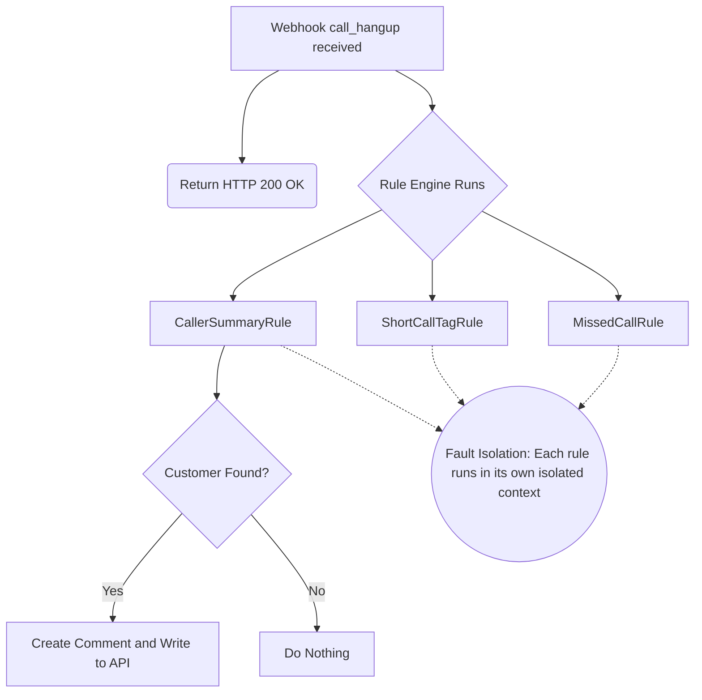

## Overview

When your agents answer a call, knowing exactly who the customer is, their open orders, or their current balance reduces call handling time. Hipcall allows you to add comments to every call record.

Match incoming calls from the webhook with your CRM database and write a caller summary into the call history as a comment.

## Before you start

- Obtain an authorized Hipcall API token to write call comments.
- Ensure your application can listen to incoming `call_hangup` or `call_bridged` webhook events.
- Your CRM system must have a service (or JSON export) that supports looking up customers by phone number.

## 3 ways to identify the caller

There are three different methods to find out who is on the other end of the line:

1. **`contact_id` from the webhook:** If the person is already registered in Hipcall, the call event sends you populated `contact_id` and `company_id` fields. You can fetch the `external_id` (your own system's ID) corresponding to this ID from the Hipcall API and query your CRM directly. Use this method first.
2. **Using `GET /api/v3/lookup/by_phone`:** If the person is empty on the call or you do not trust the records in Hipcall and want to query all numbers, you can use this search API.
3. **Phone lookup in your own CRM (Fallback):** If the webhook only provides a `caller_number` (e.g., `+447700XXXXXX`), you can search for the number in your database. However, numbers from the webhook always arrive in the **E.164 format**. If the numbers in your CRM are stored as `07700...` or with spaces, your application (C# code) must normalize the number before querying the database.

## Comments API and pitfalls

The Hipcall comments API works purely on a text basis. Design rules:

- **HTML is invalid:** Tags like `<br>` or `<b>` are rendered as plain text. Only use **Markdown** (`**bold**`, `*italic*`) and newline (`\n`) characters for visual hierarchy.
- **Who owns the comment?** The request you send to the API is assigned to the owner of the API key used. To prevent your automated summaries from mixing with agents' real notes, always place a clear header (e.g., `**CRM Summary:**`) at the very beginning of your comment.
- **Add a timestamp:** Call records are kept for years. To prevent an agent from mistaking the balance for current information when opening the record months later, add a textual date to the comment (e.g., `📅 As of 29/09/2026`).
- **Avoid sensitive data:** Comments are permanent. **Never** log sensitive information such as credit cards, passwords, passport numbers, or health data in the call history.

## What to include in the summary?

To help the agent manage the call quickly, include the following in the summary:

- **Name and Company:** So the agent can address the customer by name and establish the account context.
- **Open Orders and Support Tickets:** The customer is likely calling about a delayed order or an ongoing issue. If the agent knows this upfront, the customer does not have to repeat their problem.
- **Balance:** Knowing the financial status before providing sales or support reduces commercial risks.

**Keep it short and readable:** Comments should not exceed 3-5 lines and should be readable at a glance. Long texts will not be read during busy operations.

**Do not write comments for unknown callers:** If the caller's number is not in your CRM, do not write a "Not found in system" comment. Such a note provides no business value to the agent; it only pollutes the call history. Only write a comment if there is actionable information.

## Step 1: Catching the event (Webhook)

Your system receives a `call_hangup` event when a call disconnects. You can test your application by sending an example inbound event payload to your local server using the following `curl` command:

```bash
curl -X POST http://localhost:5000/hipcall/events/whsec_live_xxxxxxxxxxxxxxxx \
  -H "Content-Type: application/json" \
  -d '{
  "data": {
    "credited": false,
    "team_touch_at": null,
    "first_touch_duration": 10,
    "contact_id": null,
    "callee_id": null,
    "answered_at": "2026-09-29T14:13:33Z",
    "voicemail_url": null,
    "caller_number": "+447700XXXXXX",
    "missing_call_reason": null,
    "call_duration": 12,
    "callback_time": null,
    "call_flow": [
      {
        "action": "hangup",
        "detail": {
          "hangup_by": "contact"
        },
        "timestamp": 1790691215
      },
      {
        "action": "bridge",
        "detail": {
          "id": 4200,
          "type": "user"
        },
        "timestamp": 1790691205
      },
      {
        "action": "init",
        "detail": {
          "id": null,
          "type": "contact"
        },
        "timestamp": 1790691203
      }
    ],
    "direction": "inbound",
    "callee_number": "+442079XXXXXX",
    "voicemail_id": null,
    "callback_user_id": null,
    "callee_type": "contact",
    "ended_at": "2026-09-29T14:13:35Z",
    "missing_call": false,
    "channel_type": "number",
    "callback_cdr_uuid": null,
    "voicemail_type": null,
    "caller_id": 4200,
    "started_at": "2026-09-29T14:13:23Z",
    "bridged_at": "2026-09-29T14:13:33Z",
    "channel_id": 942,
    "caller_type": "user",
    "user_id": 4200,
    "hangup_by": "contact",
    "uuid": "410c92c5-...masked...",
    "record_url": "https://storage.hipcall.com/recordings/...masked...",
    "number_id": 942,
    "company_id": 80719
  },
  "event": "call_hangup"
}'
```

## Step 2: Writing data to the comment

Once you find the customer in the CRM, use the `uuid` of the call to send the request to the `POST /api/v3/calls/{call_id}/comments` endpoint.

```csharp
var apiToken = Environment.GetEnvironmentVariable("HIPCALL_API_TOKEN") 
    ?? throw new InvalidOperationException("HIPCALL_API_TOKEN environment variable not found.");

client.DefaultRequestHeaders.Authorization = new System.Net.Http.Headers.AuthenticationHeaderValue("Bearer", apiToken);

var commentBody = new { content = "**CRM Summary:**\n\nAdam S. - XYZ Ltd." };
var jsonContent = new StringContent(JsonSerializer.Serialize(commentBody), Encoding.UTF8, "application/json");

var response = await client.PostAsync($"calls/{callUuid}/comments", jsonContent);
```

When the request is successful, the API returns the information of the creator and the comment id (`200 OK` or `201 Created`):

```json
{
  "data": {
    "id": 122409,
    "user": {
      "id": 4200,
      "email": "agent@example.com",
      "full_name": "Agent Name",
      "first_name": "Agent",
      "last_name": "Name"
    },
    "content": "**CRM Summary:**\n\nAdam S. - XYZ Ltd."
  }
}
```

## Rule engine and isolation

Your different business rules (sending SMS for missed calls, tagging short calls, adding summaries) can run on the same webhook (e.g., `call_hangup`). The following diagram illustrates how three different rules run independently and asynchronously on the same webhook.



The failure of one rule (e.g., the SMS service not responding) should not prevent other rules from running. Isolate your rules in an asynchronous loop using `try-catch` blocks.

```csharp
// RuleEngine.cs
public async Task ProcessPayloadAsync(WebhookPayload payload, CancellationToken ct = default)
{
    foreach (var rule in _rules)
    {
        if (rule.Matches(payload))
        {
            try
            {
                await rule.ExecuteAsync(payload, ct);
            }
            catch (Exception ex)
            {
                // The loop continues with other rules even if one fails
                _logger.LogError(ex, "Rule failed: {RuleName}", rule.RuleName);
            }
        }
    }
}
```
## C# application code

The main building blocks of your application are below. It includes an example rule that retrieves CRM data from a mock JSON file and creates the comment.

**1. Mock CRM Data (`customers.json`)**

```json
[
  {
    "Phone": "+447700XXXXXX",
    "FirstName": "Adam",
    "LastName": "S.",
    "Company": "XYZ Ltd",
    "OpenOrders": 1,
    "OpenTickets": 0,
    "Balance": 1250.50
  }
]
```

**2. Hipcall API Client (`HipcallApiClient.cs`)**

```csharp
public async Task<bool> WriteCommentAsync(string callUuid, string content, CancellationToken ct = default)
{
    var body = new { content };
    var jsonContent = new StringContent(JsonSerializer.Serialize(body), Encoding.UTF8, "application/json");

    var response = await _http.PostAsync($"calls/{callUuid}/comments", jsonContent, ct);
    
    if (response.IsSuccessStatusCode)
    {
        return true;
    }

    var errorBody = await response.Content.ReadAsStringAsync(ct);
    _logger.LogError("Failed to write comment: {Status} - {Body}", (int)response.StatusCode, errorBody);
    
    return false;
}
```

**3. Summary Rule Class (`CallerSummaryRule.cs`)**

```csharp
using System;
using System.Text;
using System.Threading;
using System.Threading.Tasks;
using Microsoft.Extensions.Logging;

public sealed class CallerSummaryRule : IPostCallRule
{
    public string RuleName => "CallerSummaryRule";

    private readonly HipcallApiClient _api;
    private readonly LocalCrmService _crm;
    private readonly ILogger<CallerSummaryRule> _logger;

    public CallerSummaryRule(HipcallApiClient api, LocalCrmService crm, ILogger<CallerSummaryRule> logger)
    {
        _api = api;
        _crm = crm;
        _logger = logger;
    }

    public bool Matches(WebhookPayload payload)
    {
        if (payload.Data == null) return false;
        if (payload.Event != "call_hangup") return false;
        if (!payload.Data.IsInbound) return false;

        return true;
    }

    public async Task ExecuteAsync(WebhookPayload payload, CancellationToken ct = default)
    {
        var call = payload.Data!;
        CrmCustomer? customer = null;

        if (!string.IsNullOrEmpty(call.CallerNumber))
        {
            customer = _crm.FindByPhone(call.CallerNumber);
        }

        if (customer == null)
        {
            _logger.LogInformation("Customer not found in CRM, skipping comment.");
            return;
        }

        var summary = BuildSummary(customer);

        await _api.WriteCommentAsync(call.Uuid, summary, ct);
        _logger.LogInformation("Summary written — UUID: {Uuid}", call.Uuid);
    }

    private static string BuildSummary(CrmCustomer customer)
    {
        var sb = new StringBuilder();
        sb.AppendLine("**CRM Summary:**\n");
        sb.AppendLine($"- **Customer:** {customer.FirstName} {customer.LastName}");
        
        if (!string.IsNullOrEmpty(customer.Company))
            sb.AppendLine($"- **Company:** {customer.Company}");
            
        sb.AppendLine($"- **Open Orders:** {customer.OpenOrders}");
        sb.AppendLine($"- **Open Tickets:** {customer.OpenTickets}");
        
        var dateStr = DateTime.UtcNow.ToString("dd/MM/yyyy HH:mm");
        sb.AppendLine($"- **Balance:** £{customer.Balance} (📅 As of {dateStr})");

        return sb.ToString();
    }
}
```

## When it fails

**404 Not Found**

```json
{
  "errors": {
    "detail": "Not Found"
  }
}
```
You sent an invalid or deleted call UUID. Check the UUID format you sent in the URL path.

**422 Unprocessable Entity**

```json
{
  "errors": {
    "content": [
      "Shorter than minimum length 1."
    ]
  }
}
```
The comment body (content field) is left empty or not sent. Make sure you construct the JSON body correctly.

## Parameter reference

| Parameter | Type | Required | Description |
|---|---|---|---|
| `content` | string | yes | The text of the comment to add. Only supports Markdown format and newline (\n) characters. HTML is not supported. |

## Next steps

Congratulations, you have fully integrated your call center with a CRM! You can now tag short calls, track missed calls, and summarize callers. Explore the [Hipcall API Documentation](https://www.hipcall.com/developers/) for more integration ideas.
