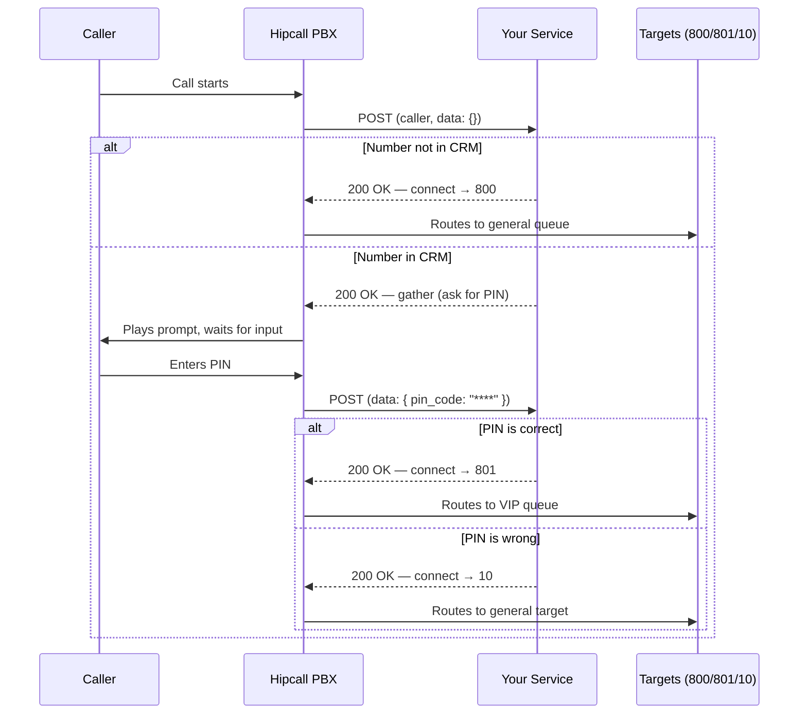

## Overview

Standard PBX menus follow static rules: "Press 1 for sales, press 2 for support." When you need to route a call differently based on who the caller is or what their CRM record looks like, those menus fall short.

Hipcall's External Management feature sends a POST request to your web service on every incoming call. Your service identifies the caller, optionally asks for a PIN, and tells Hipcall where to route the call. The entire call flow is controlled by your code.

## Before you start

- Go to **Settings > Developer > External managers** in the Hipcall dashboard and create a new record. You will be asked for a name, an extension number, a webhook URL, and a default target (where the call goes if your service does not respond).
- Your service must be reachable over the internet. During development, you can use ngrok or a similar tunnelling tool.
- Optionally, enable **Web service authentication** to activate Basic Auth. Hipcall will then send requests with an `Authorization: Basic <Base64>` header.
- After creating the record, go to **Settings > Phone system > Phone numbers**, find the number you want to test, and assign your external management record as its **Working hours target**.
- To troubleshoot during development, open the **Logs** tab on your external management record and enable "Debug Mode." This mode stays active for up to 2 hours and deletes the logs when it expires.

## How External Management works

When a call comes in, the conversation between the Hipcall PBX and your service follows these steps:



Your service always returns HTTP `200 OK`. The actions in the JSON body determine where the call goes, not the HTTP status code.

## Step 1: Understanding the incoming request

Hipcall sends a POST request to your service at each step of the call. The payload looks like this:

```json
{
  "caller": "+447700XXXXXX",
  "callee": "44203XXXXXXX",
  "uuid": "beee****-****-****-****-********f3c",
  "direction": "inbound",
  "external_manager_id": 99,
  "call_flow": [
    {
      "action": "init",
      "detail": {
        "id": 99,
        "type": "external_manager"
      },
      "timestamp": 1790789254
    }
  ],
  "data": {}
}
```

On the first request, the `data` object is empty. When your service returns a `gather` action to request keypad input, Hipcall sends the entered value back inside `data` on the second request:

```json
{
  "caller": "+447700XXXXXX",
  "callee": "44203XXXXXXX",
  "uuid": "efa3****-****-****-****-********bd98",
  "direction": "inbound",
  "external_manager_id": 99,
  "call_flow": [
    {
      "action": "init",
      "detail": {
        "id": 99,
        "type": "external_manager"
      },
      "timestamp": 1790789779
    }
  ],
  "data": {
    "pin_code": "****"
  }
}
```

### Request fields

| Field | Type | Description |
|---|---|---|
| `caller` | string | The caller's number (E.164 format). |
| `callee` | string | The dialled Hipcall number. |
| `uuid` | string | A unique identifier for this call. |
| `direction` | string | The call direction. `inbound` for incoming calls. |
| `external_manager_id` | integer | The ID of the triggered external management record. |
| `call_flow` | array | An array describing the current step of the call. |
| `data` | object | Context data. Empty on the first request; contains entered values after a `gather`. |

## Step 2: Learning the response contract

The JSON your service returns must have `"version": "1"` at the top level and actions inside a `"seq"` array.

### Routing to a target (connect)

To route the call to an extension, use the `connect` action. Set `destination` to the extension's dial number shown in the dashboard (not its internal ID):

```json
{
  "seq": [
    {
      "action": "connect",
      "args": {
        "destination": "800"
      }
    }
  ],
  "version": "1"
}
```

### Requesting keypad input (gather)

To play a sound file and wait for the caller to press keys, use the `gather` action. The `variable_name` field determines under which key the entered value will appear in the `data` object on the next request:

```json
{
  "seq": [
    {
      "action": "gather",
      "args": {
        "ask": "https://storage.hipcall.com/audio/en/8000/ivr/ivr-please_enter_pin_followed_by_pound.wav",
        "max_digits": 4,
        "min_digits": 1,
        "variable_name": "pin_code"
      }
    }
  ],
  "version": "1"
}
```

### Sequential actions

You can add multiple actions to the `seq` array to execute them in order. For example, play a hold announcement and then connect the call:

```json
{
  "seq": [
    {
      "action": "play",
      "args": {
        "url": "https://storage.hipcall.com/audio/en/8000/ivr/ivr-please_hold_while_party_contacted.wav"
      }
    },
    {
      "action": "connect",
      "args": {
        "destination": "800"
      }
    }
  ],
  "version": "1"
}
```

## Step 3: Preparing the CRM data

Your service needs a data source to identify callers. This example uses a local JSON file (`crm.json`). In production, this data would come from a database or a CRM API.

```json
[
  {
    "external_id": "CRM-2",
    "phone": "+447700XXXXXX",
    "first_name": "James",
    "last_name": "W.",
    "company": "Acme Ltd.",
    "balance": 0.0,
    "open_orders": 0,
    "open_tickets": 2,
    "pin": "0000"
  },
  {
    "external_id": "CRM-3",
    "phone": "+447911XXXXXX",
    "first_name": "Sarah",
    "last_name": "M.",
    "company": "Demo Corp.",
    "balance": 340.50,
    "open_orders": 3,
    "open_tickets": 1,
    "pin": "1111"
  }
]
```

## Step 4: Writing the service

The following ASP.NET Core Minimal API application evaluates the incoming call against CRM data and handles three scenarios:

1. **Number not in CRM:** The call is routed to the general queue (800).
2. **Number in CRM, correct PIN:** The call is routed to the VIP queue (801).
3. **Number in CRM, wrong PIN:** The call is routed to a general target (10).

```csharp
using Microsoft.AspNetCore.Mvc;
using System.Text.Json;
using System.Text.Json.Serialization;

var builder = WebApplication.CreateBuilder(args);
var app = builder.Build();

var crmFilePath = Path.Combine(builder.Environment.ContentRootPath, "crm.json");
List<CrmRecord> crmData = new();

try
{
    if (File.Exists(crmFilePath))
    {
        var json = File.ReadAllText(crmFilePath);
        crmData = JsonSerializer.Deserialize<List<CrmRecord>>(json,
            new JsonSerializerOptions { PropertyNameCaseInsensitive = true }) ?? new List<CrmRecord>();
        Console.WriteLine($"{crmData.Count} customer records loaded.");
    }
    else
    {
        Console.WriteLine("Warning: crm.json file not found!");
    }
}
catch (Exception ex)
{
    Console.WriteLine($"Error loading crm.json: {ex.Message}");
}

app.MapPost("/hipcall/external-management", async (HttpContext context) =>
{
    try
    {
        using var reader = new StreamReader(context.Request.Body);
        var body = await reader.ReadToEndAsync();

        Console.WriteLine($"\n--- INCOMING REQUEST ---");
        Console.WriteLine(body);

        var options = new JsonSerializerOptions { PropertyNameCaseInsensitive = true };
        var request = JsonSerializer.Deserialize<HipcallRequest>(body, options);

        if (request == null || string.IsNullOrEmpty(request.Caller))
        {
            Console.WriteLine("Invalid request or missing caller number.");
            return GetConnectResponse("800");
        }

        CrmRecord? customer = null;

        if (!string.IsNullOrEmpty(request.ContactExternalId))
        {
            customer = crmData.FirstOrDefault(c => c.ExternalId == request.ContactExternalId);
        }

        if (customer == null)
        {
            customer = crmData.FirstOrDefault(c => c.Phone == request.Caller);
        }

        if (customer == null)
        {
            Console.WriteLine("Customer not found. Routing to general queue (800).");
            return GetConnectResponse("800");
        }

        string? pinCode = null;
        if (request.Data.ValueKind == JsonValueKind.Object)
        {
            if (request.Data.TryGetProperty("pin_code", out var pinElement))
            {
                pinCode = pinElement.GetString();
            }
        }

        if (string.IsNullOrEmpty(pinCode))
        {
            Console.WriteLine($"Customer found ({customer.FirstName} {customer.LastName}). Requesting PIN.");
            return GetGatherResponse(
                "https://s3.amazonaws.com/freecodecamp/simonSound1.mp3",
                "pin_code");
        }
        else
        {
            if (pinCode == customer.Pin)
            {
                Console.WriteLine("PIN correct. Routing to VIP queue (801).");
                return GetConnectResponse("801");
            }
            else
            {
                Console.WriteLine("PIN incorrect. Routing to general target (10).");
                return GetConnectResponse("10");
            }
        }
    }
    catch (Exception ex)
    {
        Console.WriteLine($"Error processing request: {ex.Message}");
        return GetConnectResponse("800");
    }
});

IResult GetConnectResponse(string destination)
{
    var response = new HipcallResponse
    {
        Seq = new List<object>
        {
            new
            {
                action = "connect",
                args = new { destination = destination }
            }
        },
        Version = "1"
    };

    Console.WriteLine("--- OUTGOING RESPONSE (Connect) ---");
    Console.WriteLine(JsonSerializer.Serialize(response));
    return Results.Json(response);
}

IResult GetGatherResponse(string askUrl, string variableName)
{
    var response = new HipcallResponse
    {
        Seq = new List<object>
        {
            new
            {
                action = "gather",
                args = new
                {
                    ask = askUrl,
                    max_digits = 4,
                    min_digits = 1,
                    variable_name = variableName
                }
            }
        },
        Version = "1"
    };

    Console.WriteLine("--- OUTGOING RESPONSE (Gather) ---");
    Console.WriteLine(JsonSerializer.Serialize(response));
    return Results.Json(response);
}

app.Run();

public record CrmRecord(
    [property: JsonPropertyName("external_id")] string ExternalId,
    [property: JsonPropertyName("phone")] string Phone,
    [property: JsonPropertyName("first_name")] string FirstName,
    [property: JsonPropertyName("last_name")] string LastName,
    [property: JsonPropertyName("company")] string Company,
    [property: JsonPropertyName("balance")] decimal Balance,
    [property: JsonPropertyName("open_orders")] int OpenOrders,
    [property: JsonPropertyName("open_tickets")] int OpenTickets,
    [property: JsonPropertyName("pin")] string Pin
);

public record HipcallRequest(
    [property: JsonPropertyName("caller")] string Caller,
    [property: JsonPropertyName("callee")] string Callee,
    [property: JsonPropertyName("uuid")] string Uuid,
    [property: JsonPropertyName("direction")] string Direction,
    [property: JsonPropertyName("external_manager_id")] int ExternalManagerId,
    [property: JsonPropertyName("contact_external_id")] string? ContactExternalId,
    [property: JsonPropertyName("data")] JsonElement Data
);

public record HipcallResponse
{
    [JsonPropertyName("seq")]
    public List<object> Seq { get; init; } = new();

    [JsonPropertyName("version")]
    public string Version { get; init; } = "1";
}
```

To test your application, send a simulated first-call request for a caller that exists in your CRM:

```bash
curl -X POST http://localhost:5262/hipcall/external-management \
  -H "Content-Type: application/json" \
  -d '{
  "caller": "+447700XXXXXX",
  "callee": "44203XXXXXXX",
  "uuid": "beee****-****-****-****-********f3c",
  "direction": "inbound",
  "external_manager_id": 99,
  "call_flow": [
    {
      "action": "init",
      "detail": {
        "id": 99,
        "type": "external_manager"
      },
      "timestamp": 1790789254
    }
  ],
  "data": {}
}'
```

To simulate the second request that Hipcall sends after the caller enters a PIN:

```bash
curl -X POST http://localhost:5262/hipcall/external-management \
  -H "Content-Type: application/json" \
  -d '{
  "caller": "+447700XXXXXX",
  "callee": "44203XXXXXXX",
  "uuid": "efa3****-****-****-****-********bd98",
  "direction": "inbound",
  "external_manager_id": 99,
  "call_flow": [
    {
      "action": "init",
      "detail": {
        "id": 99,
        "type": "external_manager"
      },
      "timestamp": 1790789779
    }
  ],
  "data": {
    "pin_code": "9999"
  }
}'
```

## Safety net: What happens when your service fails

Hipcall provides a safety net when communicating with your service. Understanding these behaviours saves time during debugging.

### Timeout

If your service does not respond within 15 seconds, Hipcall routes the call to the default target you configured. The caller hears the standard ringing tone during this period.

### Server error (5xx)

When your service returns a `500 Internal Server Error`, Hipcall does not drop the call. It routes the call to the default target and logs the error in the dashboard.

### Invalid JSON

Even if your service returns `200 OK`, Hipcall cannot process the response if the JSON body is empty (`{}`), uses a different key instead of `seq`, or is structurally broken. The dashboard logs show a `422 Unprocessable Entity` with an `Invalid payload format` message. The call is routed to the default target.

### State management and restarts

Notice that we didn't use a list or a `Dictionary` (in-memory state) in our C# code to track the call steps. Hipcall's External Management design allows you to build completely stateless applications. All the state information you need (`uuid`, `caller`, and `data`) is sent to you by Hipcall on every request.

Thanks to this architecture, if your server crashes or restarts while waiting for the caller to enter their PIN after sending a `gather` command, the call **does not drop**. When the user finishes dialling, Hipcall sends the second request, and your freshly started server reads the value from the `data` object and connects the call seamlessly. This allows your application to be updated with zero downtime and scale horizontally (Load Balancer) without losing ongoing calls.

## When it fails

**422 Unprocessable Entity — Invalid payload format**

```json
{
  "errors": {
    "detail": "Invalid payload format"
  }
}
```
The JSON returned by your service is missing the `seq` array or the `version` field, or they are named incorrectly. Verify that your response JSON matches the `{"seq": [...], "version": "1"}` structure.

**Timeout**

Hipcall routes the call to the default target after 15 seconds without a response. A timeout entry appears in the dashboard logs. Check your service's response time; if it makes external calls (database, CRM API), keep them asynchronous and time-bounded.

**Empty gather loop**

If the `ask` URL in a `gather` action points to an unreachable audio file, Hipcall cannot play the prompt and returns with an empty `data`. If your code sees the empty PIN and sends another `gather` command, this loop repeats many times per second. Make sure the audio file at the `ask` URL is accessible and does not return a 404.

## Parameter reference

### Request parameters (Hipcall → Service)

| Parameter | Type | Description |
|---|---|---|
| `caller` | string | The caller's number (E.164). |
| `callee` | string | The dialled Hipcall number. |
| `uuid` | string | A unique identifier for this call. |
| `direction` | string | The call direction (`inbound`). |
| `external_manager_id` | integer | The ID of the external management record. |
| `call_flow` | array | The current step information for the call. |
| `data` | object | Keypad input and context data. |

### Response parameters (Service → Hipcall)

| Parameter | Type | Required | Description |
|---|---|---|---|
| `version` | string | yes | Contract version. Always `"1"`. |
| `seq` | array | yes | Actions array. Executed in order. |
| `seq[].action` | string | yes | Action type: `connect`, `gather`, or `play`. |
| `seq[].args.destination` | string | yes for connect | The target extension number. |
| `seq[].args.ask` | string | yes for gather | The URL of the audio file to play. |
| `seq[].args.variable_name` | string | yes for gather | The key under which the entered value appears in `data`. |
| `seq[].args.max_digits` | integer | no | Maximum number of digits to accept. |
| `seq[].args.min_digits` | integer | no | Minimum number of digits to accept. |

## Next steps

- Route calls to different queues based on customer segments (balance, open support tickets, VIP status).
- Use the `gather` action to ask callers for an order number or account code, and display this information on the agent's Insight Card.
- Explore the [Hipcall API Documentation](https://www.hipcall.com/developers/) for more integration ideas.
