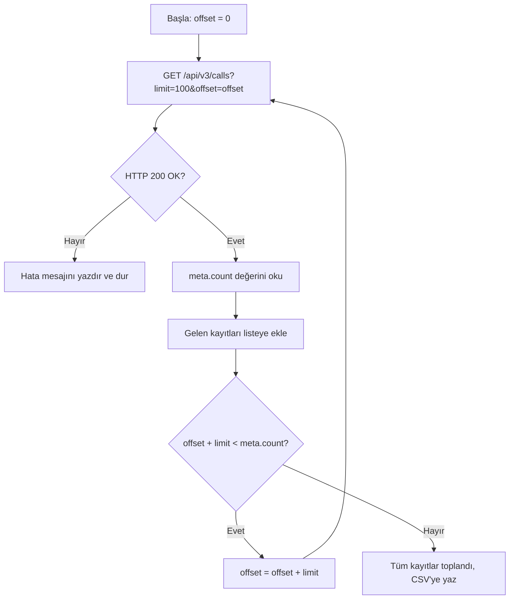

## Genel bakış

Çağrı merkezlerinde cevapsız çağrılar hızla birikir. Yönetim panelinden rapor indirmek anlık incelemeler için yeterlidir, ancak CRM uygulamanız bu kayıtlara her sabah ihtiyaç duyuyorsa kendi başına çalışan bir araç gerekir.

Hipcall API, çağrı kayıtlarını filtrelemenize ve tüm sayfaları dolaşmanıza olanak tanır. Bu rehberde cevapsız çağrıları çekmeyi, tüm sayfaları okumayı ve bir C# betiğiyle CSV dosyasına yazmayı anlatıyoruz.

## Başlamadan önce

Çalışmaya başlamadan önce şunları hazırlayın:

- Çağrı kayıtlarını okuma yetkisine sahip geçerli bir Hipcall API anahtarı.
- Bilgisayarınızda veya sunucunuzda kurulu .NET 8 SDK (`dotnet --version` çıktısı `8.0` veya üstü olmalı).
- Sayfalama mantığını test edebilmek için hesabınızda birkaç çağrı kaydı.

API anahtarınızı terminal oturumunuzda ortam değişkeni olarak tanımlayın:

```bash
export HIPCALL_API_TOKEN="SFMyNTY.g2gDbQAAAC..."
```

## Çağrıları tarih ve duruma göre filtreleme

Hipcall listeleme endpoint'lerinde köşeli parantez filtre söz dizimi kullanılır (`?alan[operatör]=değer`).

Belirli bir tarih aralığındaki cevapsız çağrıları çekmek için üç temel filtreyi birleştirin:
- `missing_call[eq]=true`: Yalnızca cevapsız çağrıları getirir.
- `started_at[gte]`: Başlangıç tarihinden sonra başlayan çağrılar.
- `started_at[lte]`: Bitiş tarihinden önce başlayan çağrılar.

Örnek filtreleme isteği:

```bash
curl -sS -H "Authorization: Bearer $HIPCALL_API_TOKEN" \
  "https://use.hipcall.com.tr/api/v3/calls?missing_call%5Beq%5D=true&started_at%5Bgte%5D=2026-09-01T00%3A00%3A00Z&started_at%5Blte%5D=2026-09-08T23%3A59%3A59Z&limit=100"
```

| Filtre | Operatör | Değer | İşlevi |
|---|---|---|---|
| `missing_call` | `eq` | `true` | Yalnızca cevapsız çağrıları listeler. |
| `started_at` | `gte` | `2026-09-01T00:00:00Z` | Belirtilen tarih ve sonrasındaki çağrılar. |
| `started_at` | `lte` | `2026-09-08T23:59:59Z` | Belirtilen tarih ve öncesindeki çağrılar. |

Tarih değerlerini her zaman ISO 8601 UTC formatında (`YYYY-MM-DDTHH:mm:ssZ`) gönderin. URL içindeki `[` ve `]` karakterlerini HTTP istemcilerinde sorun yaşamamak için `%5B` ve `%5D` olarak kodlayın.

## Cevap yapısı ve sayfalama mantığı

Hipcall liste endpoint'leri standart olarak `data` dizisi ve `meta` nesnesi döner:

```json
{
  "data": [ ... ],
  "meta": {
    "count": 142,
    "offset": 0,
    "limit": 100
  }
}
```

| Alan | Anlamı |
|---|---|
| `data` | Geçerli sayfada dönen çağrı kayıtları. |
| `meta.count` | Filtreye uyan toplam kayıt sayısı. |
| `meta.offset` | Bu sayfadan önce atlanan kayıt sayısı. |
| `meta.limit` | Sayfa başına dönen maksimum kayıt sayısı (varsayılan: 10, üst sınır: 100). |

Toplam sayfa sayısı `ceil(meta.count / meta.limit)` formülüyle bulunur. 142 kayıt ve 100'lük limit için ilk sayfa 100, ikinci sayfa 42 kayıt döner. Tüm kayıtları toplamak için döngü içinde `offset` değerini `limit` kadar artırın:



Siz sayfaları çekerken sisteme yeni bir çağrı eklenir veya silinirse liste kayar. İkinci sayfada aynı kaydı tekrar görebilir veya bir kaydı atlayabilirsiniz.

## Betiğin tamamı

Aşağıdaki C# konsol uygulaması son 7 günün cevapsız çağrılarını çeker, sayfalama sınırlarına takılmadan tüm veriyi toplar ve `missed-calls-YYYY-MM-DD.csv` dosyasına yazar:

```csharp
using System.Net.Http.Headers;
using System.Text.Json;

string? token = Environment.GetEnvironmentVariable("HIPCALL_API_TOKEN");
if (string.IsNullOrWhiteSpace(token))
{
    Console.Error.WriteLine("Hata: HIPCALL_API_TOKEN çevre değişkeni tanımlı değil.");
    return 1;
}

const string baseUrl = "https://use.hipcall.com.tr/api/v3/calls";
const int pageSize = 100;
string csvFile = $"missed-calls-{DateTime.UtcNow:yyyy-MM-dd}.csv";

string from = DateTime.UtcNow.AddDays(-7).Date.ToString("yyyy-MM-ddT00:00:00Z");
string to = DateTime.UtcNow.Date.ToString("yyyy-MM-ddT23:59:59Z");

using var client = new HttpClient();
client.DefaultRequestHeaders.Authorization = new AuthenticationHeaderValue("Bearer", token);

var allCalls = new List<JsonElement>();
int offset = 0;
int totalCount;

do
{
    string url = $"{baseUrl}?missing_call%5Beq%5D=true"
               + $"&started_at%5Bgte%5D={Uri.EscapeDataString(from)}"
               + $"&started_at%5Blte%5D={Uri.EscapeDataString(to)}"
               + $"&limit={pageSize}&offset={offset}";

    HttpResponseMessage response = await client.GetAsync(url);
    string body = await response.Content.ReadAsStringAsync();

    if (!response.IsSuccessStatusCode)
    {
        Console.Error.WriteLine($"Hata: {(int)response.StatusCode} {response.StatusCode}");
        Console.Error.WriteLine(body);
        return 1;
    }

    using JsonDocument doc = JsonDocument.Parse(body);
    JsonElement meta = doc.RootElement.GetProperty("meta");
    totalCount = meta.GetProperty("count").GetInt32();

    foreach (JsonElement call in doc.RootElement.GetProperty("data").EnumerateArray())
    {
        allCalls.Add(call.Clone());
    }

    offset += meta.GetProperty("limit").GetInt32();

} while (offset < totalCount);

using var writer = new StreamWriter(csvFile);
writer.WriteLine("date;caller_number;callee_number;duration_seconds");
foreach (JsonElement call in allCalls)
{
    string date = call.TryGetProperty("started_at", out var s) ? s.GetString() ?? "" : "";
    string caller = call.TryGetProperty("caller_number", out var c) ? c.GetString() ?? "" : "";
    string callee = call.TryGetProperty("callee_number", out var e) ? e.GetString() ?? "" : "";
    string dur = call.TryGetProperty("call_duration", out var d) ? d.ToString() : "0";
    writer.WriteLine($"\"{date}\";\"{caller}\";\"{callee}\";{dur}");
}

Console.WriteLine($"İşlem tamamlandı. {allCalls.Count} adet cevapsız çağrı {csvFile} dosyasına yazıldı.");
return 0;
```

Uygulamayı çalıştırmak için:

```bash
export HIPCALL_API_TOKEN="SFMyNTY.g2gDbQAAAC..."
dotnet run
```

### Kod hakkında notlar

- **Tek HttpClient kullanımı:** Her HTTP isteği için döngü içinde `new HttpClient()` açmayın. Tek bir `using var` örneği soket sızıntısını engeller.
- **meta.count ile döngü:** Döngü boş sayfa beklemek yerine `meta.count` değerine bakarak durmalıdır. Boş sayfa beklemek fazladan istek atmanıza ve veriler değişirse eksik sonuç almanıza yol açar.
- **Hata gövdesini koruma:** İstek başarısız olduğunda hata gövdesini yazdırın. Sadece `EnsureSuccessStatusCode()` kullanırsanız API'nin açıklayıcı mesajını kaybedersiniz.

## Hata aldığınızda

### 401 Unauthorized

API anahtarınız tanımlanmamış, yanlış kopyalanmış veya geçerlilik süresi dolmuş:

```json
{
  "errors": {
    "detail": "Not authorized. Check your API token is valid and not expired."
  }
}
```

Yönetim panelinden API anahtarınızı kontrol edin ve terminalde çevre değişkenini yeniden tanımlayın.

### 422 Unprocessable Entity

Desteklenmeyen bir filtre alanı veya geçersiz bir değer gönderdiniz:

```json
{
  "errors": {
    "started_at": ["#/started_at/gecersiz: Unexpected field: gecersiz"]
  }
}
```

Sık yapılan hatalar ve çözümleri:

| Hata Nedeni | API Mesajı | Düzeltme |
|---|---|---|
| `limit=1000` (üst sınır 100) | `For 'limit': Value must be less than 100.` | `limit` değerini maksimum 100 olarak belirleyin. |
| `started_at[eq]=...` | `Unexpected field: eq` | Tarihler için `gte` ve `lte` operatörlerini kullanın. |
| Geçersiz tarih formatı | `Invalid datetime format (expected ISO8601)` | Tarihleri `2026-09-01T00:00:00Z` formatında gönderin. |
| Sayısal yön (`direction[eq]=1`) | `Value must be a string.` | Yön için `inbound` veya `outbound` metinlerini kullanın. |

### 429 Too Many Requests

Dakikada 60 istek sınırını aştınız. İstekler arasına kısa bekleme süreleri ekleyin ve tekrar deneyin.

## Parametre listesi

`/api/v3/calls` endpoint'inde filtreleme yaparken kullanabileceğiniz parametreler:

| Parametre | Tip | Zorunlu | Açıklama |
|---|---|---|---|
| `limit` | integer | hayır | Sayfa başına kayıt sayısı. Aralık: 1–100. Varsayılan: 10. |
| `offset` | integer | hayır | Atlanacak kayıt sayısı. Varsayılan: 0. |
| `missing_call[eq]` | boolean | hayır | `true` cevapsız çağrılar, `false` cevaplanmış çağrılar. |
| `started_at[gte]` | string | hayır | Tarih aralığının başlangıcı, ISO 8601 UTC. |
| `started_at[lte]` | string | hayır | Tarih aralığının sonu, ISO 8601 UTC. |
| `direction[eq]` | string | hayır | Çağrı yönü: `inbound` veya `outbound`. |
| `direction[in]` | string | hayır | Birden fazla yön, virgülle ayrılmış. |
| `sort` | string | hayır | Sıralama alanı ve yönü, ör. `started_at.desc`. |

## Sonraki adımlar

- Diğer kayıt türlerini incelemek için [Hipcall API Referansı](https://use.hipcall.com.tr/api-docs/) sayfasındaki `/contacts` ve `/companies` endpoint'lerini ziyaret edin.
- Müşteri geri araması kurmak için giden arama ve numara maskeleme rehberine göz atın.
- Sorularınızı [Hipcall Topluluk](https://community.hipcall.com/) platformunda paylaşın.
