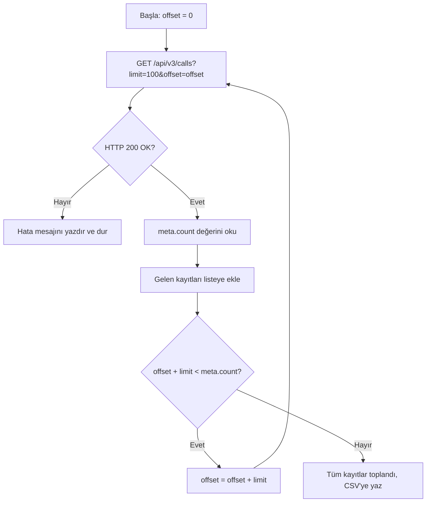

## Genel bakış

Çağrı merkezlerinde ve satış ekiplerinde cevapsız kalan her çağrı, kaybedilmiş bir iş fırsatı veya yanıtlanamamış bir destek talebi anlamına gelebilir. Ekiplerin bu çağrılara hızla geri dönüş yapabilmesi için çağrı verilerinin düzenli olarak raporlanması ve CRM sistemlerine aktarılması gerekir.

Bu rehberde, Hipcall API'sini kullanarak son 7 gün içindeki cevapsız çağrıları tarih ve durum parametrelerine göre filtrelemeyi, sayfalama yapısını kullanarak tüm kayıtları eksiksiz dolaşmayı ve sonuçları doğrudan bir CSV dosyasına aktaran çalışan bir C# konsol uygulaması oluşturmayı adım adım uygulayacağız.

## Başlamadan önce

Çalışmaya başlamadan önce şu gereksinimleri hazırlayın:

- Çağrı kayıtlarını okuma yetkisine sahip geçerli bir **Hipcall API anahtarı**.
- Bilgisayarınızda veya sunucunuzda kurulu **.NET 8 SDK** (`dotnet --version` çıktısı `8.0` veya üstü olmalıdır).
- Sayfalama mantığını test edebilmek için hesabınızda birkaç çağrı kaydının bulunması önerilir.

API anahtarınızı terminal oturumunuzda ortam değişkeni olarak tanımlayın:

```bash
export HIPCALL_API_TOKEN="SFMyNTY.g2gDbQAAAC..."
```

## İstediğiniz çağrıları filtrelemek

Hipcall API listeleme endpoint'lerinde esnek bir köşeli parantez filtre söz dizimi (`?alan[operatör]=değer`) kullanılır. 

Belirli bir tarih aralığındaki cevapsız çağrıları listelemek için üç temel filtreyi bir arada kullanırız:
- `missing_call[eq]=true`: Yalnızca cevapsız (karşılanmamış) çağrıları getirir.
- `started_at[gte]`: Belirtilen başlangıç tarihinden sonra başlayan çağrılar.
- `started_at[lte]`: Belirtilen bitiş tarihinden önce başlayan çağrılar.

Örnek filtreleme isteği:

```bash
curl -sS -H "Authorization: Bearer $HIPCALL_API_TOKEN" \
  "https://use.hipcall.com.tr/api/v3/calls?missing_call%5Beq%5D=true&started_at%5Bgte%5D=2026-09-01T00%3A00%3A00Z&started_at%5Blte%5D=2026-09-08T23%3A59%3A59Z&limit=100"
```

| Filtre | Operatör | Değer | İşlevi |
|---|---|---|---|
| `missing_call` | `eq` | `true` | Yalnızca cevapsız çağrıları listeler. |
| `started_at` | `gte` | `2026-09-01T00:00:00Z` | Belirtilen tarih ve sonrasındaki çağrılar. |
| `started_at` | `lte` | `2026-09-08T23:59:59Z` | Belirtilen tarih ve öncesindeki çağrılar. |

Tarih değerleri mutlaka ISO 8601 UTC formatında (`YYYY-MM-DDTHH:mm:ssZ`) gönderilmelidir. URL içindeki `[` ve `]` karakterleri bazı HTTP istemcilerinde sorun oluşturmaması için sırasıyla `%5B` ve `%5D` olarak kodlanmalıdır.

## Cevap yapısı ve sayfalama mantığı

Hipcall liste endpoint'leri standart olarak `data` ve `meta` nesnelerinden oluşan bir yapı döner:

```json
{
  "data": [ ... ],
  "meta": {
    "count": 142,
    "offset": 0,
    "limit": 100
  }
}
```

| Alan | Anlamı |
|---|---|
| `data` | Geçerli sayfada döndürülen çağrı kayıtları dizisi. |
| `meta.count` | Filtre kriterlerine uyan toplam kayıt sayısı. |
| `meta.offset` | Bu sayfadan önce atlanan kayıt sayısı. |
| `meta.limit` | Sayfa başına döndürülen maksimum kayıt sayısı (varsayılan: 10, üst sınır: 100). |

Toplam sayfa sayısı `ceil(meta.count / meta.limit)` formülüyle hesaplanır (örneğin 142 kayıt için 100'lük limit ile ilk sayfa 100, ikinci sayfa 42 kayıt döner). Tüm kayıtları toplamak için `offset` değerini her adımda `limit` kadar artırarak döngü kurarız:



## Betiğin tamamı (C# Konsol Uygulaması)

Aşağıdaki C# betiği son 7 günün cevapsız çağrılarını çeker, sayfalama sınırlarına takılmadan tüm veriyi toplar ve `missed-calls-YYYY-MM-DD.csv` dosyasına yazar:

```csharp
using System.Net.Http.Headers;
using System.Text.Json;

string? token = Environment.GetEnvironmentVariable("HIPCALL_API_TOKEN");
if (string.IsNullOrWhiteSpace(token))
{
    Console.Error.WriteLine("Hata: HIPCALL_API_TOKEN çevre değişkeni tanımlı değil.");
    return 1;
}

const string baseUrl = "https://use.hipcall.com.tr/api/v3/calls";
const int pageSize = 100;
string csvFile = $"missed-calls-{DateTime.UtcNow:yyyy-MM-dd}.csv";

string from = DateTime.UtcNow.AddDays(-7).Date.ToString("yyyy-MM-ddT00:00:00Z");
string to = DateTime.UtcNow.Date.ToString("yyyy-MM-ddT23:59:59Z");

using var client = new HttpClient();
client.DefaultRequestHeaders.Authorization = new AuthenticationHeaderValue("Bearer", token);

var allCalls = new List<JsonElement>();
int offset = 0;
int totalCount;

do
{
    string url = $"{baseUrl}?missing_call%5Beq%5D=true"
               + $"&started_at%5Bgte%5D={Uri.EscapeDataString(from)}"
               + $"&started_at%5Blte%5D={Uri.EscapeDataString(to)}"
               + $"&limit={pageSize}&offset={offset}";

    HttpResponseMessage response = await client.GetAsync(url);
    string body = await response.Content.ReadAsStringAsync();

    if (!response.IsSuccessStatusCode)
    {
        Console.Error.WriteLine($"Hata: {(int)response.StatusCode} {response.StatusCode}");
        Console.Error.WriteLine(body);
        return 1;
    }

    using JsonDocument doc = JsonDocument.Parse(body);
    JsonElement meta = doc.RootElement.GetProperty("meta");
    totalCount = meta.GetProperty("count").GetInt32();

    foreach (JsonElement call in doc.RootElement.GetProperty("data").EnumerateArray())
    {
        allCalls.Add(call.Clone());
    }

    offset += meta.GetProperty("limit").GetInt32();

} while (offset < totalCount);

using var writer = new StreamWriter(csvFile);
writer.WriteLine("date;caller_number;callee_number;duration_seconds");
foreach (JsonElement call in allCalls)
{
    string date = call.TryGetProperty("started_at", out var s) ? s.GetString() ?? "" : "";
    string caller = call.TryGetProperty("caller_number", out var c) ? c.GetString() ?? "" : "";
    string callee = call.TryGetProperty("callee_number", out var e) ? e.GetString() ?? "" : "";
    string dur = call.TryGetProperty("call_duration", out var d) ? d.ToString() : "0";
    writer.WriteLine($"\"{date}\";\"{caller}\";\"{callee}\";{dur}");
}

Console.WriteLine($"İşlem tamamlandı. {allCalls.Count} adet cevapsız çağrı {csvFile} dosyasına yazıldı.");
return 0;
```

Betiği çalıştırmak için:

```bash
export HIPCALL_API_TOKEN="SFMyNTY.g2gDbQAAAC..."
dotnet run
```

### Önemli mimari detaylar

- **Tek HttpClient kullanımı:** Her HTTP isteği için döngü içinde `new HttpClient()` oluşturulmaz; tek bir `using var` örneği soket sızıntısını engeller.
- **Kayıt sayısına dayalı döngü:** Döngü boş sayfa beklemez, ilk yanıtta gelen `meta.count` değerini baz alarak kaç sayfa okunacağını kesin olarak hesaplar.
- **Hata gövdesini koruma:** İstek başarısız olduğunda hata gövdesi konsola yazdırılır; böylece API'nin döndürdüğü açıklayıcı hata mesajı kaybolmaz.

## Hata aldığınızda

### 1. 401 Unauthorized
API anahtarınız tanımlanmamış, yanlış kopyalanmış veya geçerlilik süresi dolmuş olabilir.

```json
{
  "errors": {
    "detail": "Not authorized. Check your API token is valid and not expired."
  }
}
```

**Çözüm:** Yönetim panelinden API anahtarınızın aktifliğini kontrol edin ve terminalde çevre değişkenini yeniden tanımlayın.

### 2. 422 Unprocessable Entity
İstekte desteklenmeyen bir filtre alanı veya geçersiz bir parametre değeri iletildiğinde döner:

```json
{
  "errors": {
    "started_at": ["#/started_at/gecersiz: Unexpected field: gecersiz"]
  }
}
```

Sık yapılan hatalar ve çözümleri:

| Hata Nedeni | API Mesajı | Düzeltme |
|---|---|---|
| `limit=1000` (Üst limit 100) | `For 'limit': Value must be less than 100.` | `limit` değerini maksimum 100 olarak belirleyin. |
| `started_at[eq]=...` | `Unexpected field: eq` | Tarihlerde aralık belirten `gte` ve `lte` operatörlerini kullanın. |
| Standart dışı tarih formatı | `Invalid datetime format (expected ISO8601)` | Tarihleri `2026-09-01T00:00:00Z` formatında gönderin. |
| Sayısal yön parametresi (`direction[eq]=1`) | `Value must be a string.` | Yön için metin kullanın: `inbound` veya `outbound`. |

### 3. 429 Too Many Requests
Dakika başına istek kotasını aştığınızda döner (Standart limit dakikada 60 istektir). İstekleriniz arasına kısa gecikmeler ekleyerek işlemi tekrarlayın.

## Parametre listesi

`/api/v3/calls` endpoint'inde filtreleme yaparken kullanabileceğiniz parametreler:

| Parametre | Tip | Zorunlu | Açıklama |
|---|---|---|---|
| `limit` | integer | hayır | Sayfa başına kayıt sayısı. Aralık: 1–100. Varsayılan: 10. |
| `offset` | integer | hayır | Atlanacak kayıt sayısı. Varsayılan: 0. |
| `missing_call[eq]` | boolean | hayır | `true` cevapsız çağrılar, `false` cevaplanmış çağrılar. |
| `started_at[gte]` | string | hayır | Tarih aralığının başlangıcı. ISO 8601 UTC formatında. |
| `started_at[lte]` | string | hayır | Tarih aralığının sonu. ISO 8601 UTC formatında. |
| `direction[eq]` | string | hayır | Çağrı yönü: `inbound` veya `outbound`. |
| `direction[in]` | string | hayır | Birden fazla yön, virgülle ayrılmış. |
| `sort` | string | hayır | Sıralama alanı ve yönü. Format: `alan.asc` veya `alan.desc`. `/calls` endpoint'i `started_at` alanını destekler. |

## Sonraki adımlar

- Diğer kayıt türlerini incelemek için [Hipcall API Referansı](https://use.hipcall.com.tr/api-docs/) sayfasındaki `/contacts` ve `/companies` endpoint'lerini ziyaret edin.
- Geri arama süreçlerini hızlandırmak için giden arama ve numara maskeleme rehberine göz atın.
- Entegrasyon sorularınız için [Hipcall Topluluk](https://community.hipcall.com/) platformunda sorularınızı paylaşın.
