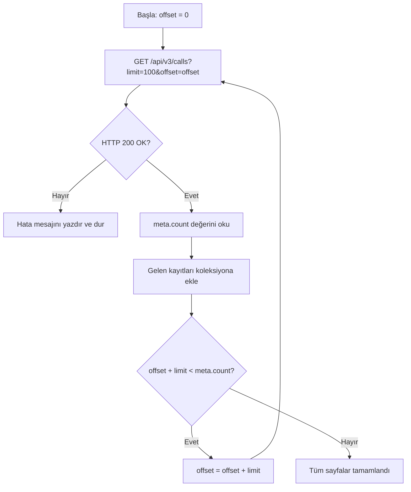

## Genel bakış

Bu rehberde HipCall API üzerinden cevapsız çağrıları çekip bir CSV dosyasına aktarmayı anlatıyoruz. Çağrıları tarih aralığına ve duruma göre filtrelemeyi, `meta` nesnesini kullanarak tüm sayfaları dolaşmayı ve sık karşılaşılan API hatalarını ele almayı öğreneceksiniz. Sonuç olarak, son yedi günün cevapsız çağrılarını çekip diske yazan çalışır bir C# konsol uygulaması elde edeceksiniz.

## Başlamadan önce

Gerekenler:

- Çağrı (calls) endpoint'ine erişimi olan bir HipCall API anahtarı. Anahtarınız yoksa [/blog/hipcall-api-anahtari-nasil-alinir/](/blog/hipcall-api-anahtari-nasil-alinir/) rehberini takip edin.
- .NET 8 veya üstü kurulu olmalı (`dotnet --version` komutu `8.0` veya üstünü göstermeli).
- Hesabınızda en az 20–30 çağrı kaydı bulunmalı. Boş hesaplar sıfır sonuç döndürür ve sayfalamayı doğrulamayı zorlaştırır.

API anahtarınızı ortam değişkenine kaydedin:

```bash
export HIPCALL_API_TOKEN="..."
```

## Cevabın yapısını anlamak

Liste endpoint'lerinde data ve meta alanlarını içeren bir cevap yapısı kullanılmaktadır.

```json
{
  "data": [ ... ],
  "meta": {
    "count": 142,
    "offset": 0,
    "limit": 10
  }
}
```

| Alan | Anlamı |
|---|---|
| `data` | Mevcut sayfadaki kayıtların dizisi. |
| `meta.count` | Filtrelerinize uyan toplam kayıt sayısı (tüm sayfalar dahil). |
| `meta.offset` | Bu sayfadan önce atlanan kayıt sayısı. |
| `meta.limit` | Sayfa başına döndürülen maksimum kayıt sayısı (varsayılan: 10, üst sınır: 100). |

`count` 142 ve `limit` 100 ise, ilk sayfa 100, ikinci sayfa 42 kayıt döndürür. Toplam sayfa formülü:

```text
toplam_sayfa = ceil(count / limit)
```

100'ün üzerinde bir `limit` değeri göndermek, değeri sessizce 100'e düşürmez. API isteği `422` hatasıyla reddeder: `For 'limit': Value must be less than 100.`

## İstediğiniz çağrıları filtrelemek

HipCall filtreleri köşeli parantez söz dizimi kullanır:

```
?alan[operatör]=değer
```

Belirli bir tarih aralığındaki cevapsız çağrıları almak için missing_call, started_at[gte] ve started_at[lte] filtrelerini birlikte kullanabilirsiniz.

```bash
curl -sS -H "Authorization: Bearer $HIPCALL_API_TOKEN" \
  "https://use.hipcall.com.tr/api/v3/calls?missing_call%5Beq%5D=true&started_at%5Bgte%5D=2026-09-01T00%3A00%3A00Z&started_at%5Blte%5D=2026-09-08T00%3A00%3A00Z&limit=100"
```

Üç filtrenin açık hâli:

| Filtre | Operatör | Değer | Amaç |
|---|---|---|---|
| `missing_call` | `eq` | `true` | Yalnızca cevapsız (cevaplanmamış) çağrılar. |
| `started_at` | `gte` | `2026-09-01T00:00:00Z` | Bu tarih ve sonrasındaki çağrılar. |
| `started_at` | `lte` | `2026-09-08T23:59:59Z` | Bu tarih ve öncesindeki çağrılar. |

Tarihler ISO 8601 UTC formatında olmalıdır. `dün` gibi ISO dışı bir değer göndermek `422` hatası döndürür: `Invalid datetime format (expected ISO8601)`.

Filtre adlarındaki köşeli parantezler (`[` ve `]`) URL'de `%5B` ve `%5D` olarak kodlanmalıdır. Bazı HTTP istemcileri bunu otomatik yapar, ancak .NET `HttpClient` dahil pek çoğu yapmaz. API filtrenizi yok sayıyorsa, parantezlerin sunucuya kodlanmadan (çıplak) ulaşıp ulaşmadığını kontrol edin.

### Yön filtresi

`direction` filtresi sayı değil, metin değeri alır (`inbound`, `outbound`). `direction[eq]=1` göndermek `Value must be a string.` hatasını döndürür.

Birden fazla değeri aynı anda filtrelemek için `in` operatörünü virgülle ayrılmış değerlerle kullanın:

```bash
curl -sS -H "Authorization: Bearer $HIPCALL_API_TOKEN" \
  "https://use.hipcall.com.tr/api/v3/calls?direction%5Bin%5D=inbound,outbound"
```

## Tüm sayfaları dolaşmak

Sayfalama döngüsü ilk cevapta `meta.count` değerini okur ve tüm kayıtlar toplanana kadar `offset` değerini `limit` kadar artırır.



Alternatif bir yaklaşım, boş bir `data` dizisi gelene kadar istek atmaya devam etmektir. Bu yöntem daha kırılgandır: iki istek arasında yeni bir çağrı gelirse veri kümesi kayar ve bir kaydı tekrarlayabilir veya atlayabilirsiniz. `meta.count` değeri kullanılarak sayfalama döngüsünün ne zaman sonlandırılacağı belirlenir.

## Betiğin tamamı


```csharp
using System.Net.Http.Headers;
using System.Text.Json;

// API anahtarını ortam değişkeninden oku
string? token = Environment.GetEnvironmentVariable("HIPCALL_API_TOKEN");
if (string.IsNullOrWhiteSpace(token))
{
    Console.Error.WriteLine("Error: HIPCALL_API_TOKEN environment variable is not set.");
    return 1;
}

const string baseUrl = "https://use.hipcall.com.tr/api/v3/calls";
const int pageSize = 100;
string csvFile = $"missed-calls-{DateTime.UtcNow:yyyy-MM-dd}.csv";

// Son 7 günün tarih aralığını hesapla (UTC)
string from = DateTime.UtcNow.AddDays(-7).Date.ToString("yyyy-MM-ddT00:00:00Z");
string to = DateTime.UtcNow.Date.ToString("yyyy-MM-ddT00:00:00Z");

// Tek bir HttpClient örneği kullan — döngü içinde new HttpClient() açma
using var client = new HttpClient();
client.DefaultRequestHeaders.Authorization =
    new AuthenticationHeaderValue("Bearer", token);

var allCalls = new List<JsonElement>();
int offset = 0;
int totalCount;

// Sayfalama döngüsü: meta.count'a ulaşana kadar devam et
do
{
    // Köşeli parantezler URL-encoded olmalı: [ → %5B, ] → %5D
    string url = $"{baseUrl}?missing_call%5Beq%5D=true"
               + $"&started_at%5Bgte%5D={Uri.EscapeDataString(from)}"
               + $"&started_at%5Blte%5D={Uri.EscapeDataString(to)}"
               + $"&limit={pageSize}&offset={offset}";

    HttpResponseMessage response = await client.GetAsync(url);
    string body = await response.Content.ReadAsStringAsync();

    // Hata durumunda cevap gövdesini yazdır, yutma
    if (!response.IsSuccessStatusCode)
    {
        Console.Error.WriteLine($"Error: {(int)response.StatusCode} {response.StatusCode}");
        Console.Error.WriteLine(body);
        return 1;
    }

    using JsonDocument doc = JsonDocument.Parse(body);
    JsonElement meta = doc.RootElement.GetProperty("meta");
    totalCount = meta.GetProperty("count").GetInt32();

    foreach (JsonElement call in doc.RootElement.GetProperty("data").EnumerateArray())
        allCalls.Add(call.Clone());

    offset += meta.GetProperty("limit").GetInt32();

} while (offset < totalCount);

// Toplanan kayıtları CSV dosyasına yaz
using var writer = new StreamWriter(csvFile);
writer.WriteLine("date;caller_number;callee_number;duration_seconds");
foreach (JsonElement call in allCalls)
{
    string date = call.TryGetProperty("started_at", out var s) ? s.GetString() ?? "" : "";
    string caller = call.TryGetProperty("caller_number", out var c) ? c.GetString() ?? "" : "";
    string callee = call.TryGetProperty("callee_number", out var e) ? e.GetString() ?? "" : "";
    string dur = call.TryGetProperty("call_duration", out var d) ? d.ToString() : "0";
    writer.WriteLine($"\"{date}\";\"{caller}\";\"{callee}\";{dur}");
}

Console.WriteLine($"Done. {allCalls.Count} missed call(s) written to {csvFile}");
return 0;
```

Çalıştırmak için:

```bash
export HIPCALL_API_TOKEN="..."
dotnet run
```

Önemli tasarım kararları:

- **Tek `HttpClient` örneği.** Her istek için yeni bir `HttpClient` oluşturmak soket sızıntısına yol açar. `using var` bildirimi tüm çalışma boyunca tek bir örneği canlı tutar.
- **`meta.count` tabanlı döngü.** Döngü toplam kayıt sayısını bir kez okur ve ne zaman duracağını buna göre hesaplar; boş sayfa beklemek yerine bu yöntemi tercih eder.
- **Hata gövdesi yazdırılır, yutulmaz.** `EnsureSuccessStatusCode()` istisna fırlatır ama cevaptaki hata mesajını gizler. Önce gövdeyi okumak, developer'a API'nin döndürdüğü gerçek hata metnini gösterir.

## Hata aldığınızda

### 401 Unauthorized

API anahtarı eksik, geçersiz veya süresi dolmuş.

```json
{
  "errors": {
    "detail": "Not authorized. Check your API token is valid and not expired."
  }
}
```

Panelden eski anahtarı silin ve yenisini oluşturun.

### 422 Unprocessable Entity

Bir parametre geçersiz bir değer içeriyor veya desteklenmeyen bir filtre kullanılmış.

```json
{
  "errors": {
    "started_at": ["#/started_at/yakin: Unexpected field: yakin"]
  }
}
```

Sık karşılaşılan durumlar:

| Hata | Hata mesajı |
|---|---|
| `limit=1000` (üst sınır aşımı) | `For 'limit': Value must be less than 100.` |
| `limit=0` veya negatif değer | `For 'limit': Value must be greater than 1.` |
| `started_at[eq]=...` (tarih için desteklenmeyen operatör) | `Unexpected field: eq` |
| `/contacts` üzerinde `created_at[gte]=...` (desteklenmeyen alan) | `Unexpected field: created_at` |
| `dün` gibi ISO dışı tarih | `Invalid datetime format (expected ISO8601)` |
| `direction[eq]=1` (metin yerine sayı) | `Value must be a string.` |
| `sort=telefon_numarasi.asc` (geçersiz sıralama alanı) | `Invalid sort fields: ["telefon_numarasi.asc"]` |

API geçersiz bir filtreyi asla sessizce yok saymaz. Desteklenmeyen her alan, operatör veya değer, açıklayıcı bir mesajla `422` hatası döndürür. Bu iyi bir şeydir: filtresiz bir sorgu çalıştırıp eksik veriyle işlem yapmanızı önler.

### 429 Too Many Requests

Hız sınırını aştınız (DEMO ortamında dakikada 60 istek). Bekleyin ve tekrar deneyin.

## Parametre listesi

| Parametre | Tip | Zorunlu | Açıklama |
|---|---|---|---|
| `limit` | integer | hayır | Sayfa başına kayıt sayısı. Aralık: 1–100. Varsayılan: 10. |
| `offset` | integer | hayır | Atlanacak kayıt sayısı. Varsayılan: 0. |
| `missing_call[eq]` | boolean | hayır | `true` cevapsız çağrılar, `false` cevaplanmış çağrılar. |
| `started_at[gte]` | string | hayır | Tarih aralığının başlangıcı. ISO 8601 UTC formatında. |
| `started_at[lte]` | string | hayır | Tarih aralığının sonu. ISO 8601 UTC formatında. |
| `direction[eq]` | string | hayır | Çağrı yönü: `inbound` veya `outbound`. |
| `direction[in]` | string | hayır | Birden fazla yön, virgülle ayrılmış. |
| `sort` | string | hayır | Sıralama alanı ve yönü. Format: `alan.asc` veya `alan.desc`. `/calls` endpoint'i `started_at` alanını destekler. |

## Sonraki adımlar

[/api/v3/contacts](https://use.hipcall.com/api-docs/) ve [/api/v3/companies](https://use.hipcall.com/api-docs/) gibi diğer liste endpoint'lerini inceleyerek her birinin hangi filtreleri ve sıralama alanlarını desteklediğini görün.

Sorularınızı veya entegrasyon deneyimlerinizi [HipCall Community](https://community.hipcall.com/) forumunda paylaşın.
