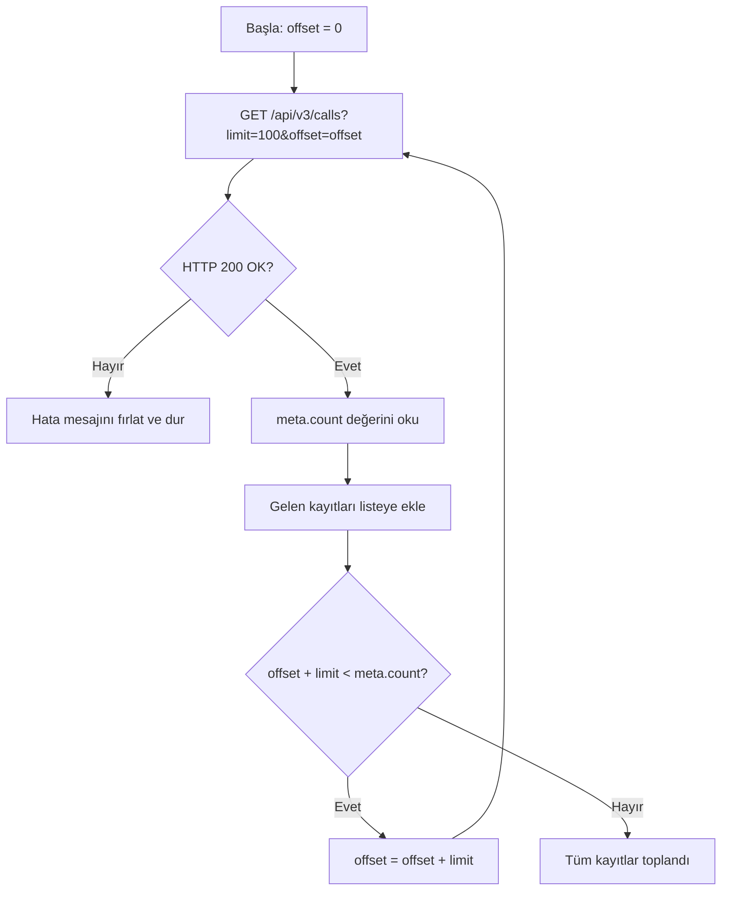

## Genel bakış

Çağrı merkezlerinde cevapsız çağrılar birikir. Yönetim panelinden rapor indirmek mümkündür, ancak CRM uygulamanız bu kayıtlara her sabah ihtiyaç duyuyorsa kendi başına çalışan bir araç gerekir.

Hipcall API, çağrı kayıtlarını filtrelemenize ve tüm sayfaları dolaşmanıza olanak tanır. Bu rehberde cevapsız çağrıları çekmeyi, tüm sayfaları okumayı ve JSON verisini bir C# kodu ile işlemeyi anlatıyoruz.

## Başlamadan önce

Çalışmaya başlamadan önce şunları hazırlayın:

- Çağrı kayıtlarını okuma yetkisine sahip geçerli bir Hipcall API anahtarı.
- Bilgisayarınızda veya sunucunuzda kurulu .NET 8 SDK (`dotnet --version` çıktısı `8.0` veya üstü olmalı).
- Sayfalama mantığını test edebilmek için hesabınızda birkaç çağrı kaydı.

API anahtarınızı terminal oturumunuzda ortam değişkeni olarak tanımlayın:

```bash
export HIPCALL_API_TOKEN="SFMyNTY.g2gDbQAAAC..."
```

## Çağrıları tarih ve duruma göre filtreleme

Hipcall listeleme endpoint'lerinde köşeli parantez filtre söz dizimi kullanılır (`?alan[operatör]=değer`).

Belirli bir tarih aralığındaki cevapsız çağrıları çekmek için üç temel filtreyi birleştirin:
- `missing_call[eq]=true`: Cevapsız çağrıları getirir.
- `started_at[gte]`: Başlangıç tarihinden sonra başlayan çağrılar.
- `started_at[lte]`: Bitiş tarihinden önce başlayan çağrılar.

Örnek filtreleme isteği:

```bash
curl -sS -H "Authorization: Bearer $HIPCALL_API_TOKEN" \
  "https://use.hipcall.com.tr/api/v3/calls?missing_call%5Beq%5D=true&started_at%5Bgte%5D=2026-09-01T00%3A00%3A00Z&started_at%5Blte%5D=2026-09-08T23%3A59%3A59Z&limit=100"
```

| Filtre | Operatör | Değer | İşlevi |
|---|---|---|---|
| `missing_call` | `eq` | `true` | Cevapsız çağrıları listeler. |
| `started_at` | `gte` | `2026-09-01T00:00:00Z` | Belirtilen tarih ve sonrasındaki çağrılar. |
| `started_at` | `lte` | `2026-09-08T23:59:59Z` | Belirtilen tarih ve öncesindeki çağrılar. |

Tarih değerlerini her zaman ISO 8601 UTC formatında (`YYYY-MM-DDTHH:mm:ssZ`) gönderin. URL içindeki `[` ve `]` karakterlerini HTTP istemcilerinde sorun yaşamamak için `%5B` ve `%5D` olarak kodlayın.

## Cevap yapısı ve sayfalama mantığı

Hipcall liste endpoint'leri standart olarak `data` dizisi ve `meta` nesnesi döner:

```json
{
  "data": [
    {
      "id": 10582,
      "direction": "inbound",
      "caller_number": "+905551234567",
      "callee_number": "+902129876543",
      "started_at": "2026-09-05T14:32:10Z",
      "answered_at": null,
      "ended_at": "2026-09-05T14:32:45Z",
      "call_duration": 0,
      "missing_call": true,
      "status": "missed",
      "recording_url": null,
      "tags": ["destek"]
    },
    {
      "id": 10583,
      "direction": "inbound",
      "caller_number": "+905321112233",
      "callee_number": "+902129876543",
      "started_at": "2026-09-06T09:15:00Z",
      "answered_at": null,
      "ended_at": "2026-09-06T09:15:20Z",
      "call_duration": 0,
      "missing_call": true,
      "status": "missed",
      "recording_url": null,
      "tags": []
    }
  ],
  "meta": {
    "count": 142,
    "offset": 0,
    "limit": 100
  }
}
```

| Alan | Anlamı |
|---|---|
| `data` | Geçerli sayfada dönen çağrı kayıtları. |
| `meta.count` | Filtreye uyan toplam kayıt sayısı. |
| `meta.offset` | Bu sayfadan önce atlanan kayıt sayısı. |
| `meta.limit` | Sayfa başına dönen maksimum kayıt sayısı (varsayılan: 10, üst sınır: 100). |

Toplam sayfa sayısı `ceil(meta.count / meta.limit)` formülüyle bulunur. 142 kayıt ve 100 limit için ilk sayfa 100, ikinci sayfa 42 kayıt döner. Tüm kayıtları toplamak için döngü içinde `offset` değerini `limit` kadar artırın:


```mermaid
flowchart TD
    A["Başla: offset = 0"] --> B["GET /api/v3/calls?limit=100&offset=offset"]
    B --> C{HTTP 200 OK?}
    C -- Hayır --> D["Hata mesajını fırlat ve dur"]
    C -- Evet --> E["meta.count değerini oku"]
    E --> F["Gelen kayıtları listeye ekle"]
    F --> G{"offset + limit < meta.count?"}
    G -- Evet --> H["offset = offset + limit"]
    H --> B
    G -- Hayır --> I["Tüm kayıtlar toplandı"]
```

Siz sayfaları çekerken sisteme yeni bir çağrı eklenir veya silinirse liste kayar. İkinci sayfada aynı kaydı tekrar görebilir veya bir kaydı atlayabilirsiniz.

## Sayfalama mantığının C# örneği

Aşağıdaki C# sınıfı cevapsız çağrıları çeker, sayfalama sınırlarına takılmadan tüm veriyi toplar ve JSON formatından okur. Kendi bağımsız HTTP istemcisiyle çalışır.

```csharp
using System;
using System.Collections.Generic;
using System.Net.Http;
using System.Net.Http.Headers;
using System.Text.Json;
using System.Threading.Tasks;

// Konsol uygulaması yapılandırması (çevre değişkenleri vb.) sadeleştirme amacıyla atlanmıştır.

const string baseUrl = "https://use.hipcall.com.tr/api/v3/calls";
string fromDate = "2026-09-01T00:00:00Z";
string toDate = "2026-09-08T23:59:59Z";
int pageSize = 100;

using var client = new HttpClient();
client.DefaultRequestHeaders.Authorization = new AuthenticationHeaderValue("Bearer", "API_ANAHTARINIZ");
client.DefaultRequestHeaders.Accept.Add(new MediaTypeWithQualityHeaderValue("application/json"));

var allCalls = new List<JsonElement>();
int offset = 0;
int totalCount;

do
{
    string url = $"{baseUrl}?missing_call%5Beq%5D=true"
               + $"&started_at%5Bgte%5D={Uri.EscapeDataString(fromDate)}"
               + $"&started_at%5Blte%5D={Uri.EscapeDataString(toDate)}"
               + $"&limit={pageSize}&offset={offset}";

    HttpResponseMessage response = await client.GetAsync(url);
    string body = await response.Content.ReadAsStringAsync();

    if (!response.IsSuccessStatusCode)
    {
        throw new Exception($"API Hatası: {(int)response.StatusCode}\n{body}");
    }

    using JsonDocument doc = JsonDocument.Parse(body);
    JsonElement root = doc.RootElement;
    
    JsonElement meta = root.GetProperty("meta");
    totalCount = meta.GetProperty("count").GetInt32();
    int currentLimit = meta.GetProperty("limit").GetInt32();

    foreach (JsonElement call in root.GetProperty("data").EnumerateArray())
    {
        allCalls.Add(call.Clone());
    }

    offset += currentLimit;

} while (offset < totalCount);

// 'allCalls' listesi artık filtreye uyan tüm çağrı kayıtlarını içerir
```

### Kod hakkında notlar

- **Tek HttpClient kullanımı:** Sınıf örneği içinde tek bir `HttpClient` oluşturun. Her HTTP isteği için döngü içinde yenisini açmak soket sızıntısına yol açar.
- **meta.count ile döngü:** Döngü boş sayfa beklemek yerine `meta.count` değerine bakarak durmalıdır. Boş sayfa beklemek fazladan istek atmanıza ve veriler değişirse eksik sonuç almanıza yol açar.
- **Dinamik limit artışı:** Sayfa `offset` değerini, doğrudan API'den gelen `meta.limit` (`currentLimit`) kadar artırır. Böylece sunucu yanıtıyla her zaman tam uyumlu çalışır.
- **Hata gövdesini koruma:** İstek başarısız olduğunda hata gövdesini saklayın. `EnsureSuccessStatusCode()` kullanırsanız API'nin açıklayıcı mesajını kaybedersiniz.

## Hata aldığınızda

### 401 Unauthorized

API anahtarınız tanımlanmamış, yanlış kopyalanmış veya geçerlilik süresi dolmuş:

```json
{
  "errors": {
    "detail": "Not authorized. Check your API token is valid and not expired."
  }
}
```

Yönetim panelinden API anahtarınızı kontrol edin ve token bilginizi güncelleyin.

### 422 Unprocessable Entity

Desteklenmeyen bir filtre alanı veya geçersiz bir değer gönderdiniz:

```json
{
  "errors": {
    "started_at": [
      "#/started_at/invalid_param: Unexpected field: invalid_param"
    ]
  }
}
```

Sık yapılan hatalar ve çözümleri:

| Hata Nedeni | API Mesajı | Düzeltme |
|---|---|---|
| `limit=1000` (üst sınır 100) | `For 'limit': Value must be less than 100.` | `limit` değerini maksimum 100 olarak belirleyin. |
| `started_at[eq]=...` | `Unexpected field: eq` | Tarihler için `gte` ve `lte` operatörlerini kullanın. |
| Geçersiz tarih formatı | `Invalid datetime format (expected ISO8601)` | Tarihleri `2026-09-01T00:00:00Z` formatında gönderin. |
| Sayısal yön (`direction[eq]=1`) | `Value must be a string.` | Yön için `inbound` veya `outbound` metinlerini kullanın. |

### 429 Too Many Requests

Dakikada 60 istek sınırını aştınız. API aşağıdaki hatayı döner:

```json
{
  "errors": {
    "detail": "Too many requests. Please try again later."
  }
}
```

İstekler arasına kısa bekleme süreleri ekleyin ve tekrar deneyin.

## Parametre listesi

`/api/v3/calls` endpoint'inde filtreleme yaparken kullanabileceğiniz parametreler:

| Parametre | Tip | Zorunlu | Açıklama |
|---|---|---|---|
| `limit` | integer | hayır | Sayfa başına kayıt sayısı. Aralık: 1–100. Varsayılan: 10. |
| `offset` | integer | hayır | Atlanacak kayıt sayısı. Varsayılan: 0. |
| `missing_call[eq]` | boolean | hayır | `true` cevapsız çağrılar, `false` cevaplanmış çağrılar. |
| `started_at[gte]` | string | hayır | Tarih aralığının başlangıcı, ISO 8601 UTC. |
| `started_at[lte]` | string | hayır | Tarih aralığının sonu, ISO 8601 UTC. |
| `direction[eq]` | string | hayır | Çağrı yönü: `inbound` veya `outbound`. |
| `direction[in]` | string | hayır | Birden fazla yön, virgülle ayrılmış. |
| `sort` | string | hayır | Sıralama alanı ve yönü, ör. `started_at.desc`. |

## Sonraki adımlar

- Diğer kayıt türlerini incelemek için [Hipcall API Referansı](https://use.hipcall.com.tr/api-docs/) sayfasındaki `/contacts` ve `/companies` endpoint'lerini ziyaret edin.
- Müşteri geri araması kurmak için giden arama ve numara maskeleme rehberine göz atın.
- Sorularınızı [Hipcall Topluluk](https://community.hipcall.com/) platformunda paylaşın.
