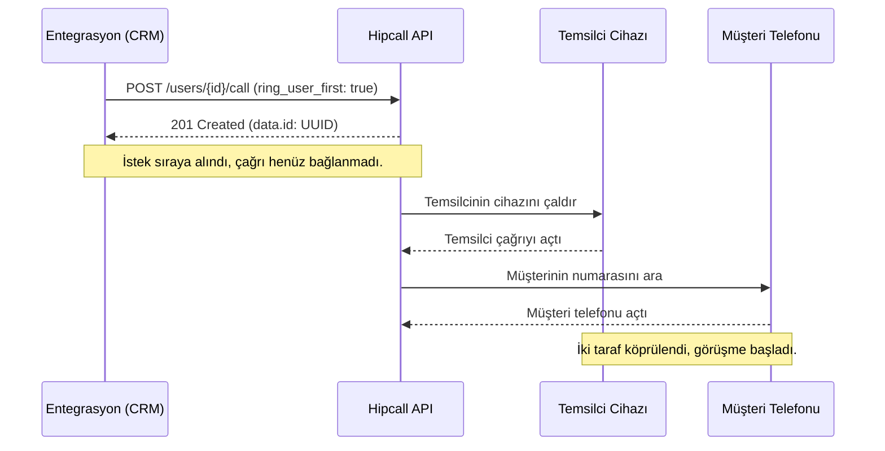

## Genel bakış

Bir kurye müşteriye teslimat hakkında aramak istiyor. Kişisel telefonundan ararsa müşteri kuryenin numarasını görür ve teslimat bittikten sonra da arayabilir. Aynı durum pazar yerlerinde, emlakta, saha hizmetlerinde de geçerli: iki kişinin konuşması gerekiyor ama hiçbiri diğerinin numarasını elinde tutmamalı.

Hipcall bunu tek bir API çağrısıyla halleder. Uygulamanız bir HTTP POST gönderir, santral iki tarafı şirket numarası üzerinden bağlar ve hiçbir taraf diğerinin gerçek numarasını görmez.

Bu sayfada çağrı başlatmayı, maskelemeyi açmayı, müşterinin göreceği şirket numarasını seçmeyi ve API yanıtının gerçekte ne söylediğini anlatıyoruz.

## Başlamadan önce

Üç şeye ihtiyacınız var:

- Bir API anahtarı. Henüz yoksa [Hipcall API anahtarı nasıl alınır?](/tr/developers/hipcall-api-anahtari-nasil-alinir/) yazısına bakın.
- Temsilci için kayıtlı bir cihaz. Temsilcinin Hipcall uygulaması (web, masaüstü veya mobil) çevrimiçi olmalı. Cihaz kapalıysa API isteği kabul eder ama çağrı bağlanmaz.
- En az bir dış numara. Mevcut numaralarınızı `GET /api/v3/numbers` ile listeleyebilirsiniz.

API anahtarını tanımlayın:

```bash
export HIPCALL_API_TOKEN="SFMyNTY.g2gDbQAAAC..."
```

## Çağrı başlatma

`/users/{user_id}/call` endpoint'ine müşterinin E.164 formatındaki numarasıyla POST gönderin:

```bash
curl -X "POST" "https://use.hipcall.com.tr/api/v3/users/4200/call" \
  -H "accept: application/json" \
  -H "Authorization: Bearer $HIPCALL_API_TOKEN" \
  -H "Content-Type: application/json" \
  -d '{
    "callee_number": "+90530XXXXXXX",
    "ring_user_first": true
  }'
```

### Hangi taraf önce çalar (ring_user_first)

`ring_user_first` zorunlu bir parametredir. Sırayı belirler:

- `true` (önerilen): Önce temsilcinin uygulaması çalar. Temsilci açtığında santral müşteriyi arar. Müşteri boş hatta düşmez.
- `false`: Santral müşteriyi hemen arar. Temsilci hazır değilse çağrı düşer.

### Müşterinin göreceği numara (number_id)

`number_id`, müşterinin telefonunda hangi şirket numarasının görüneceğini belirler:

```bash
curl -X "POST" "https://use.hipcall.com.tr/api/v3/users/4200/call" \
  -H "accept: application/json" \
  -H "Authorization: Bearer $HIPCALL_API_TOKEN" \
  -H "Content-Type: application/json" \
  -d '{
    "callee_number": "+90530XXXXXXX",
    "number_id": 943,
    "ring_user_first": true
  }'
```

`number_id` göndermezseniz API temsilcinin profilindeki varsayılan numarayı kullanır. Kullanılabilir numaraları `GET /api/v3/numbers` ile listeleyebilirsiniz.

Sık karıştırılan iki kavram: `callee_number` aradığınız kişidir, `number_id` ise karşı tarafın ekranında görünecek olan sizin numaranızdır.

`/extensions/{extension_id}/call` üzerinden arama yaparken `number_id` zorunludur. `/users/{user_id}/call` üzerinden ise isteğe bağlıdır.

API, `05551112233` gibi ülke kodu olmayan numaraları da kabul edebilir. Bu durumlarda numarayı, kullanıcının veya hesabın bağlı olduğu varsayılan ülkeye (örneğin Türkiye) göre yorumlar. Ancak üretim ortamında her zaman tam E.164 formatı (`+90...`) kullanın. Birden fazla ülkeyi kapsayan hesaplarda yönlendirme karışıklığını ve hatalı aramaları önler.

## Maskelemeyi açma

Müşteri numarasını temsilciden gizlemek için `call_masking: true` ekleyin. Sıfırlar yerine bir etiket göstermek için `call_masking_name` kullanın:

```bash
curl -X "POST" "https://use.hipcall.com.tr/api/v3/users/4200/call" \
  -H "accept: application/json" \
  -H "Authorization: Bearer $HIPCALL_API_TOKEN" \
  -H "Content-Type: application/json" \
  -d '{
    "callee_number": "+90530XXXXXXX",
    "call_masking": true,
    "call_masking_name": "Siparis #1042",
    "number_id": 943,
    "ring_user_first": true
  }'
```

### Her taraf ne görür

- Temsilci, `call_masking_name` belirtmediyseniz `0000000000` görür, belirttiyseniz verdiğiniz etiketi (örneğin "Siparis #1042") görür. Gerçek numara temsilcinin ekranında hiç görünmez.
- Müşteri, `number_id` ile seçtiğiniz şirket numarasını görür. Temsilcinin kişisel numarası müşteriye iletilmez.

### Çağrı kayıtlarında gerçek numara durur

Maskeleme sadece temsilcinin çağrı sırasında gördüğü ekranı etkiler. Çağrı kayıtlarında (`GET /api/v3/calls`) gerçek numaralar tam olarak tutulur. Bu bilinçli bir tasarım kararıdır: faturalandırma, yasal uyum ve raporlama gerçek veriye ihtiyaç duyar.

## 201 yanıtı ne anlama gelir

API isteğinizi kabul ettiğinde `201 Created` ve bir çağrı ID'si döner:

```json
{
  "data": {
    "id": "19d354e6-2be8-4c4e-bd49-fd12545f71a4"
  }
}
```



En önemli nokta şu: 201, santralin komutu kabul ettiği anlamına gelir. Müşterinin telefonunun çaldığını ya da birinin açtığını garanti etmez. Temsilcinin cihazı kapalı olsa bile 201 alırsınız. Santral temsilciye ulaşmaya çalışır, başarısız olur ve çağrıyı sessizce düşürür.

CRM'inizde bir çağrıyı "bağlandı" olarak işaretlemek için bu yanıtı tek başına kullanmayın. Webhook'ları dinleyin veya `GET /api/v3/calls` üzerinden `bridged_at` ve `call_duration` alanlarını kontrol edin.

## Betiğin tamamı

Bu sınıf çağrı endpoint'ini sarar. Tek bir `HttpClient` kullanır, token'ı ortam değişkeninden okur ve hata durumunda API mesajını korur:

```csharp
using System.Net.Http.Headers;
using System.Text;
using System.Text.Json;

public sealed class HipcallClient
{
    private static readonly HttpClient s_httpClient = new();
    private const string BaseUrl = "https://use.hipcall.com.tr/api/v3";
    private readonly string _apiToken;

    public HipcallClient()
    {
        _apiToken = Environment.GetEnvironmentVariable("HIPCALL_API_TOKEN")
            ?? throw new InvalidOperationException("HIPCALL_API_TOKEN ortam değişkeni tanımlı değil.");
    }

    public async Task<string> StartCallAsync(
        int userId,
        string calleeNumber,
        bool ringUserFirst = true,
        int? numberId = null,
        bool? callMasking = null,
        string? callMaskingName = null)
    {
        var body = new Dictionary<string, object>
        {
            ["callee_number"] = calleeNumber,
            ["ring_user_first"] = ringUserFirst
        };

        if (numberId.HasValue)
            body["number_id"] = numberId.Value;

        if (callMasking.HasValue)
            body["call_masking"] = callMasking.Value;

        if (!string.IsNullOrEmpty(callMaskingName))
            body["call_masking_name"] = callMaskingName;

        string json = JsonSerializer.Serialize(body);

        using var request = new HttpRequestMessage(HttpMethod.Post, $"{BaseUrl}/users/{userId}/call");
        request.Headers.Authorization = new AuthenticationHeaderValue("Bearer", _apiToken);
        request.Headers.Accept.Add(new MediaTypeWithQualityHeaderValue("application/json"));
        request.Content = new StringContent(json, Encoding.UTF8, "application/json");

        HttpResponseMessage response = await s_httpClient.SendAsync(request).ConfigureAwait(false);
        string responseBody = await response.Content.ReadAsStringAsync().ConfigureAwait(false);

        if (!response.IsSuccessStatusCode)
        {
            throw new InvalidOperationException($"API Hatası {(int)response.StatusCode}: {responseBody}");
        }

        using JsonDocument doc = JsonDocument.Parse(responseBody);
        return doc.RootElement
            .GetProperty("data")
            .GetProperty("id")
            .GetString() ?? throw new InvalidOperationException("API geçerli bir çağrı ID'si döndürmedi.");
    }
}
```

Kullanımı:

```csharp
var client = new HipcallClient();
string callId = await client.StartCallAsync(
    userId: 4200,
    calleeNumber: "+90530XXXXXXX",
    ringUserFirst: true,
    numberId: 943,
    callMasking: true,
    callMaskingName: "Siparis #1042"
);

Console.WriteLine($"Çağrı kuyruğa alındı. Çağrı ID: {callId}");
```

### Kod hakkında notlar

- Uygulama ömrü boyunca tek bir static `HttpClient` kullanılır. Her çağrı için yenisini açmak soketleri tüketir.
- API hata döndürdüğünde yanıt gövdesi istisnaya eklenir. Bu olmadan neyin yanlış gittiğini anlatan detayı kaybedersiniz.
- Maskeleme ve `number_id` opsiyonel parametrelerdir. Gönderilmezse kullanıcının profil ayarları geçerli olur.

## Hata aldığınızda

### 422 Unprocessable Entity

Zorunlu bir alan eksik. Örneğin `ring_user_first` gönderilmemiş:

```json
{
  "errors": {
    "ring_user_first": [
      "can't be blank"
    ]
  }
}
```

İstek gövdesinde hem `callee_number` hem `ring_user_first` bulunmalıdır.

### 404 Not Found

Kullanıcı veya dahili ID'si sistemde yok:

```json
{
  "errors": {
    "user_id": ["No result for user_id: 21212212"]
  }
}
```

ID'yi `GET /api/v3/users` veya `GET /api/v3/extensions` ile doğrulayın.

### Temsilci cihazı çevrimdışı (sessiz düşme)

Temsilcinin Hipcall uygulaması kapalıysa veya bağlantısı kesilmişse:

- API komutu kuyruğa aldığı için yine `201 Created` döner.
- Santral temsilciye ulaşmaya çalışır, yanıt alamayınca müşterinin numarasını hiç aramadan çağrıyı sonlandırır.
- Nedenini anlamak için webhook akışındaki `call_hangup` olayında `hangup_by: "system"` değerini kontrol edin veya paneldeki günlüklerden temsilci cihazının durumunu inceleyin.

## Parametre listesi

| Parametre | Tip | Zorunlu | Açıklama |
|---|---|---|---|
| `callee_number` | string | evet | E.164 formatında hedef telefon numarası (ör. `+90530XXXXXXX`). |
| `ring_user_first` | boolean | evet | Önce temsilciyi çaldırır (`true`, önerilir) veya müşteriyi doğrudan arar (`false`). |
| `number_id` | integer | hayır | Müşteriye gösterilecek şirket numarası ID'si. Belirtilmezse varsayılan numara kullanılır. |
| `call_masking` | boolean | hayır | Müşteri numarasını temsilci ekranında `0000000000` olarak gösterir. |
| `call_masking_name` | string | hayır | Sıfırlar yerine gösterilecek etiket (en fazla 30 karakter). |

## Sonraki adımlar

- Çağrılar bağlandığında veya kapandığında bildirim almak için webhook alıcısı kurun.
- Diğer parametreleri görmek için [Hipcall API Referansı](https://use.hipcall.com.tr/api-docs/) sayfasına bakın.
- Sorularınızı [Hipcall Topluluk](https://community.hipcall.com/) forumunda paylaşın.
