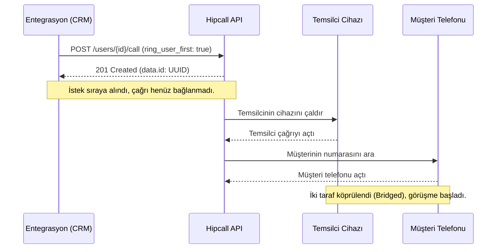

## Genel bakış

Saha hizmetleri, pazar yerleri, kurye teslimatları ve insan kaynakları süreçlerinde iki tarafın birbiriyle görüşürken şahsi telefon numaralarını gizli tutması kritik bir güvenlik ve gizlilik gereksinimidir. Bir teknik servis veya kurye personeli müşteriyi şahsi cep telefonundan aradığında kendi numarası müşteriye görünür; müşteri geri aradığında da çalışanın kişisel cihazına doğrudan ulaşır. Benzer şekilde müşterinin telefon numarası personelin kişisel cihazında saklı kalarak kurumsal veri güvenliği ve KVKK uyum riskleri oluşturur.

Hipcall API, bu süreci kendi uygulamanız veya CRM sisteminiz üzerinden tek bir HTTP POST isteğiyle programatik çağrıya (click-to-call) dönüştürür. Numara maskeleme parametreleri sayesinde iki taraf da kişisel numaralarını görmeden kurumsal santral köprüsü üzerinden görüşür.

Bu rehberde şu mimari adımları uyguluyoruz:
- CRM uygulamanızdan dış arama başlatma ve santralin varsayılan dış numara mantığını yönetme.
- `call_masking` ve `call_masking_name` parametreleriyle temsilci ekranında müşteri numarasını gizleyip sipariş bağlamını gösterme.
- `ring_user_first` parametresiyle çağrı sırasını kontrol ederek temsilci hazır olmadan müşterinin hatta beklemesini engelleme.
- Asenkron çalışan HTTP 201 yanıtının teknik sınırlarını yönetme ve temsilci çevrimdışı olduğunda çağrı düşmelerini doğru tespit etme.

## Başlamadan önce

API üzerinden çağrı başlatmak için şu ön koşulları tamamlayın:

- **API anahtarı:** Hipcall panelinizde Ayarlar > Geliştirici menüsünden bir API anahtarı oluşturun.
- **Kayıtlı bir cihaz:** Çağrının çıkacağı kullanıcının veya dahilinin Hipcall web, masaüstü veya mobil uygulamasında kayıtlı (çevrimiçi) olması gerekir.
- **Kurumsal dış numara:** Müşteriye arayan numara olarak gösterilecek aktif bir dış numaranız bulunmalıdır. Mevcut dış numaralarınızı `GET /api/v3/numbers` endpoint'i ile listeleyebilirsiniz.

API anahtarınızı terminal oturumunuzda ortam değişkeni olarak tanımlayın:

```bash
export HIPCALL_API_TOKEN="SFMyNTY.g2gDbQAAAC..."
```

## Click-to-call ile çağrı başlatma

Numara maskeleme, Hipcall'ın click-to-call altyapısı üzerine inşa edilmiş bir parametredir. Temsilci adına dış arama başlatmanın standart yolu `/users/{user_id}/call` endpoint'ine HTTP POST isteği göndermektir. Aranacak müşteri numarasını uluslararası E.164 formatında (`+90...`) belirtin:

```bash
curl -X "POST" "https://use.hipcall.com.tr/api/v3/users/4200/call" \
  -H "accept: application/json" \
  -H "Authorization: Bearer $HIPCALL_API_TOKEN" \
  -H "Content-Type: application/json" \
  -d '{
    "callee_number": "+90530XXXXXXX",
    "ring_user_first": true
  }'
```

### Çağrı sırasını yönetme (ring_user_first)

`ring_user_first` zorunlu bir boolean parametredir ve santralin çağrıyı başlatma sırasını kontrol eder:

- **`true` (Önerilen):** Önce temsilcinin Hipcall uygulaması çalar. Temsilci çağrıyı yanıtladığı anda santral müşterinin telefonunu aramaya başlar. Bu yöntem, temsilci hatta hazır olmadan müşterinin telefonu açıp boş hatta beklemesini engeller.
- **`false`:** Santral temsilcinin cihazını çaldırmadan doğrudan müşterinin numarasını aramaya başlar ve temsilciyi hazır kabul eder. Temsilcinin internet bağlantısı kopmuşsa çağrı şebekede sessizce düşer.

### Arayan kurumsal numarayı belirleme (number_id)

Müşterinin telefon ekranında hangi şirket numarasının (Caller ID) görüneceğini `number_id` parametresi ile seçebilirsiniz:

```bash
curl -X "POST" "https://use.hipcall.com.tr/api/v3/users/4200/call" \
  -H "accept: application/json" \
  -H "Authorization: Bearer $HIPCALL_API_TOKEN" \
  -H "Content-Type: application/json" \
  -d '{
    "callee_number": "+90530XXXXXXX",
    "number_id": 943,
    "ring_user_first": true
  }'
```

`number_id` parametresi ile ilgili temel kurallar:

1. **Varsayılan Davranış:** `number_id` göndermezseniz, temsilcinin Hipcall profilinde tanımlı olan varsayılan dış numara (`default_number`) kullanılır. Kullanıcılar varsayılan numaralarını panelde Ayarlar > Profil altından değiştirebilir.
2. **Kavram Ayrımı:** `callee_number` aramak istediğiniz hedef kişiyi, `number_id` ise santralin aramayı başlatırken karşı tarafa göstereceği kendi kayıtlı numaranızın ID'sini ifade eder.
3. **Dahili Aramaları:** `/extensions/{extension_id}/call` endpoint'i üzerinden çağrı başlatırken `number_id` parametresinin iletilmesi zorunludur; `/users/{user_id}/call` endpoint'inde ise isteğe bağlıdır.
4. **Numara Formatı (E.164):** Hipcall santrali `callee_number` alanındaki boşlukları veya baştaki yerel çıkış kodunu (`0`) otomatik temizleyebilse de, çok lokasyonlu hesaplarda arama karışıklıklarını önlemek için daima tam E.164 formatı (`+90...`) kullanın.

## Numara maskelemeyi etkinleştirme

Müşterinin telefon numarasını temsilcinin ekranından gizlemek için isteğe `call_masking: true` parametresini ekleyin. Temsilcinin ekranında anlamsız sıfırlar yerine çağrının içeriğini belirten bir etiket göstermek için `call_masking_name` alanını kullanın:

```bash
curl -X "POST" "https://use.hipcall.com.tr/api/v3/users/4200/call" \
  -H "accept: application/json" \
  -H "Authorization: Bearer $HIPCALL_API_TOKEN" \
  -H "Content-Type: application/json" \
  -d '{
    "callee_number": "+90530XXXXXXX",
    "call_masking": true,
    "call_masking_name": "Siparis #1042",
    "number_id": 943,
    "ring_user_first": true
  }'
```

### Maskelenmiş çağrının görünümü

- **Temsilci Ekranı:** `call_masking: true` olduğunda temsilcinin ekranındaki gerçek numara gizlenir. `call_masking_name` belirtilmemişse ekranda `0000000000` metni görünür; belirtilmişse (örneğin `"Siparis #1042"`) sıfırların yerini bu etiket alır. Temsilci müşterinin telefon numarasını kopyalayamaz veya göremez.
- **Müşteri Ekranı:** Müşteri tarafında temsilcinin şahsi numarası hiçbir zaman iletilmez. Müşterinin telefonunda `number_id` ile belirlenen kurumsal dış numara görünür.

### Çağrı kayıtlarında (CDR) gerçek numara

Numara maskeleme işlemi kullanıcı arayüzü düzeyinde uygulanır. Faturalandırma, yasal telekom zorunlulukları ve şirket yöneticilerinin raporlama ihtiyaçları için santral veri tabanındaki çağrı kayıtlarında (`GET /api/v3/calls`) gerçek E.164 numaralar eksiksiz olarak tutulur.

## C# ile çağrı başlatma uygulaması

Aşağıdaki sınıf, tek bir `HttpClient` kullanarak ortam değişkeninden API anahtarını okur, maskeleme ve kurumsal numara seçimini destekler ve hata durumlarında API cevap gövdesini korur:

```csharp
using System.Net.Http.Headers;
using System.Text;
using System.Text.Json;

public sealed class HipcallClient
{
    private static readonly HttpClient s_httpClient = new();
    private const string BaseUrl = "https://use.hipcall.com.tr/api/v3";
    private readonly string _apiToken;

    public HipcallClient()
    {
        _apiToken = Environment.GetEnvironmentVariable("HIPCALL_API_TOKEN")
            ?? throw new InvalidOperationException("HIPCALL_API_TOKEN ortam değişkeni tanımlı değil.");
    }

    public async Task<string> StartCallAsync(
        int userId,
        string calleeNumber,
        bool ringUserFirst = true,
        int? numberId = null,
        bool? callMasking = null,
        string? callMaskingName = null)
    {
        var body = new Dictionary<string, object>
        {
            ["callee_number"] = calleeNumber,
            ["ring_user_first"] = ringUserFirst
        };

        if (numberId.HasValue)
            body["number_id"] = numberId.Value;

        if (callMasking.HasValue)
            body["call_masking"] = callMasking.Value;

        if (!string.IsNullOrEmpty(callMaskingName))
            body["call_masking_name"] = callMaskingName;

        string json = JsonSerializer.Serialize(body);

        using var request = new HttpRequestMessage(HttpMethod.Post, $"{BaseUrl}/users/{userId}/call");
        request.Headers.Authorization = new AuthenticationHeaderValue("Bearer", _apiToken);
        request.Headers.Accept.Add(new MediaTypeWithQualityHeaderValue("application/json"));
        request.Content = new StringContent(json, Encoding.UTF8, "application/json");

        HttpResponseMessage response = await s_httpClient.SendAsync(request).ConfigureAwait(false);
        string responseBody = await response.Content.ReadAsStringAsync().ConfigureAwait(false);

        if (!response.IsSuccessStatusCode)
        {
            throw new InvalidOperationException($"API Hatası {(int)response.StatusCode}: {responseBody}");
        }

        using JsonDocument doc = JsonDocument.Parse(responseBody);
        return doc.RootElement
            .GetProperty("data")
            .GetProperty("id")
            .GetString() ?? throw new InvalidOperationException("API geçerli bir çağrı ID'si döndürmedi.");
    }
}
```

Betiği projenizde çağırmak için:

```csharp
var client = new HipcallClient();
string callId = await client.StartCallAsync(
    userId: 4200,
    calleeNumber: "+90530XXXXXXX",
    ringUserFirst: true,
    numberId: 943,
    callMasking: true,
    callMaskingName: "Siparis #1042"
);

Console.WriteLine($"Çağrı kuyruğa alındı. Çağrı ID: {callId}");
```

### Önemli mimari detaylar

- **Tek HttpClient kullanımı:** Her çağrı isteği için yeni bir HTTP istemcisi oluşturulmaz; `static readonly HttpClient` soket tükenmesini engeller.
- **Hata gövdesini koruma:** HTTP başarısızlık durumunda istisna fırlatılmadan önce API gövdesi okunarak hata mesajı geliştiriciye eksiksiz aktarılır.
- **Opsiyonel parametre esnekliği:** Maskeleme ve `number_id` parametreleri isteğe bağlıdır; değer verilmediğinde varsayılan kullanıcı profili ayarları devreye girer.

## Asenkron çağrı akışı ve HTTP 201 yanıtı

İstek söz dizimi ve yetkilendirme geçerli olduğunda API `201 Created` durum kodu ve bir çağrı UUID'si döndürür:

```json
{
  "data": {
    "id": "19d354e6-2be8-4c4e-bd49-fd12545f71a4"
  }
}
```



Bu cevabın teknik sınırlarını doğru yorumlamak gerekir:

- **Doğrulanan durum:** İstek parametrelerinin geçerli olduğunu, kimlik doğrulamasının onaylandığını ve santralin arama talimatını motor kuyruğuna aldığını gösterir.
- **Garanti edilmeyen durum:** Müşterinin telefonunun çaldığını, müşterinin çağrıyı yanıtladığını veya ses köprüsünün kurulduğunu garanti etmez. Temsilcinin cihazı kapalı veya uçak modunda olsa dahi API `201 Created` yanıtı döner; ancak santral temsilciye ulaşamadığında çağrı arka planda sessizce düşer.

Bu nedenle CRM uygulamanızda bir çağrıyı "bağlandı" olarak işaretlemek için HTTP 201 kodunu baz almayın. Durum takibi için Webhook bildirimlerini dinleyin veya `GET /api/v3/calls` üzerinden `bridged_at` ve `call_duration` alanlarını kontrol edin.

## Hata aldığınızda

### 422 Unprocessable Entity

Zorunlu alanlar eksik olduğunda döner. Örneğin zorunlu olan `ring_user_first` parametresi gönderilmediğinde:

```json
{
  "errors": {
    "ring_user_first": [
      "can't be blank"
    ]
  }
}
```

**Çözüm:** İstek gövdesinde `callee_number` ve `ring_user_first` (`true` veya `false`) zorunlu alanlarının eksiksiz iletildiğinden emin olun.

### 404 Not Found

Sistemde karşılığı bulunmayan bir kullanıcı veya dahili ID'si girildiğinde oluşur:

```json
{
  "errors": {
    "user_id": ["No result for user_id: 21212212"]
  }
}
```

**Çözüm:** `GET /api/v3/users` veya `GET /api/v3/extensions` endpoint'lerini çağırarak ilgili kullanıcının `id` değerini doğrulayın.

### Temsilci cihazı çevrimdışı olduğunda (Sessiz çağrı sonlanması)

Temsilcinin Hipcall web telefonu veya mobil uygulaması kapalıysa ya da internet bağlantısı kesilmişse:
- API çağrı başlatma talimatını kuyruğa aldığı için yine HTTP `201 Created` yanıtı döner.
- Santral temsilcinin cihazına sinyal gönderir; yanıt alamadığında müşterinin numarasını hiç aramadan çağrı oturumunu sonlandırır.
- **Teşhis:** Çağrının neden bağlanmadığını anlamak için Webhook akışındaki `call_hangup` olayında `hangup_by: "system"` değerini kontrol edin veya panelde entegrasyon günlüklerinden temsilci bacağının durumunu inceleyin.

## Parametre listesi

| Parametre | Tip | Zorunlu | Açıklama |
|---|---|---|---|
| `callee_number` | string | evet | E.164 formatında hedef telefon numarası (ör. `+90530XXXXXXX`). |
| `ring_user_first` | boolean | evet | Önce temsilcinin cihazını çaldırır (`true` önerilir) veya doğrudan müşteriyi arar (`false`). Zorunlu alandır. |
| `number_id` | integer | hayır | Müşteriye gösterilecek kayıtlı kurumsal dış numara ID'si. Belirtilmezse kullanıcının varsayılan numarası kullanılır. |
| `call_masking` | boolean | hayır | Aranan müşteri numarasını temsilci ekranında `0000000000` olarak gizler. |
| `call_masking_name` | string | hayır | Temsilci ekranındaki sıfırların yerine gösterilecek bağlam etiketi (en fazla 30 karakter). |

## Sonraki adımlar

- Çağrı bittiğinde tetiklenen olayları anlık yakalamak için Webhook alıcıları rehberini inceleyin.
- Diğer arama parametrelerini ve filtreleri görmek için [Hipcall API Referansı](https://use.hipcall.com.tr/api-docs/) sayfasını ziyaret edin.
- Entegrasyon deneyimlerinizi paylaşmak veya sorularınızı iletmek için [Hipcall Topluluk](https://community.hipcall.com/) platformunda sorularınızı paylaşın.
