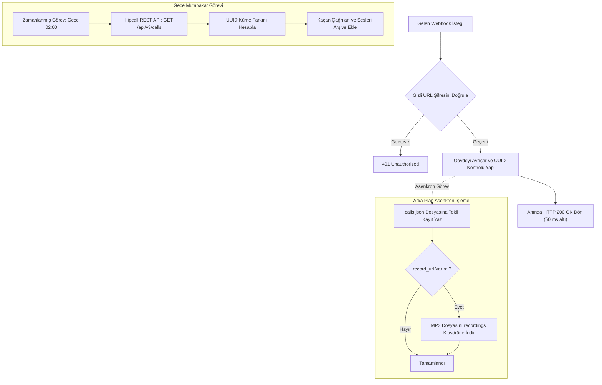

## Genel bakış

Çağrı kayıtlarını veri ambarınıza, CRM yazılımınıza veya muhasebe sisteminize aktarırken ilk akla gelen yöntem periyodik yoklamadır (polling). Belirli aralıklarla liste endpoint'ine istek atarak yeni kapanan çağrıları ararsınız. Bu yöntem toplu raporlama için uygun olsa da gecikmeye yol açar ve çağrı olmayan anlarda API kota sınırlarını tüketir.

Webhook mimarisi bu süreci tersine çevirir. Bir çağrı başladığında, temsilciye bağlandığında veya kapandığında Hipcall santrali doğrudan sunucunuza bir HTTP POST isteği gönderir.

Gelen bir HTTP isteğini karşılamak işin başlangıcıdır. Üretim ortamında çalışan güvenilir bir webhook alıcısı kurmak üç teknik gerçeği yönetmeyi gerektirir:
1. Hipcall webhook istekleri otomatik tekrar deneme mekanizması bulunmayan en fazla bir kez (at-most-once) iletim modeliyle çalışır.
2. Gelen isteklerde HMAC imza başlığı (`X-Signature`) bulunmaz.
3. Santral dağıtıcısı 5 ila 10 saniye arasında katı bir HTTP zaman aşımı uygular.

Bu rehberde Hipcall panelinde webhook yapılandırmayı, 50 milisaniye altında yanıt veren bir ASP.NET Core Minimal API alıcısı kurmayı, ses kayıtlarını arka planda asenkron indirmeyi, çağrıları UUID ile tekilleştirmeyi ve sıfır veri kaybı için canlı akışı gece mutabakatıyla desteklemeyi ele alıyoruz.

## Başlamadan önce

Çalışmaya başlamadan önce şu gereksinimleri hazırlayın:

- Bilgisayarınızda veya sunucunuzda **.NET 8 SDK** kurulu olmalıdır.
- **Dışarıdan erişilebilir bir HTTPS adresi.** Yerel geliştirme için [ngrok](https://ngrok.com/) aracılığıyla 5080 portunu dış dünyaya açın:
  ```bash
  ngrok http 5080
  ```
- Hipcall panelinde entegrasyon ekleme yetkisine sahip bir hesap.
- Test aramaları yapabilmek için çevrim içi durumda olan **kayıtlı bir temsilci cihazı** (Hipcall web telefonu veya masaüstü uygulaması).

## Webhook kurulumu

Webhook entegrasyonunu Hipcall web panelinde oluşturun:

1. **Ayarlar > Entegrasyonlar > Kataloğa Göz At (Settings > Integrations > Marketplace)** sayfasına gidin.
2. Entegrasyon kataloğundan **Web kancası (Webhook)** seçeneğini belirleyin.
3. Gerekli alanları doldurun:
   - **Ad (Zorunlu):** Entegrasyon için tanımlayıcı bir isim girin (Örn: `Çağrı Kaydı Alıcısı`).
   - **URL (Zorunlu):** Gizli yol parçasını içeren genel HTTPS adresinizi yazın: `https://your-server.example.com/hipcall/events/whsec_live_9a8f2e4c1b0d`.
   - **Olaylar:** Abone olmak istediğiniz çağrı olaylarını seçin: `call_init`, `call_bridged` ve `call_hangup`.
4. **Kayıtlar (Logs)** sekmesini açın. Webhook isteklerinin loglanması **Hata Ayıklama Modu (Debug Mode)** ile yönetilir. Geliştirme esnasında açıldığında, sistem iki saat boyunca istek gövdelerini ve durum kodlarını kaydeder; ardından log tutmayı otomatik kapatıp günlükleri temizler.

## İlk olayı alma

Yeni bir ASP.NET Core Minimal API projesi oluşturun:

```bash
dotnet new web -n Hipcall.WebhookReceiver
cd Hipcall.WebhookReceiver
```

Gelen başlıkları ve gövdeyi konsola yazdıran temel bir alıcıyla başlayın:

```csharp
var builder = WebApplication.CreateBuilder(args);

builder.WebHost.ConfigureKestrel(serverOptions =>
{
    serverOptions.ListenAnyIP(5080);
});

var app = builder.Build();

app.MapPost("/hipcall/events", async (HttpRequest request) =>
{
    using var reader = new StreamReader(request.Body);
    var body = await reader.ReadToEndAsync();
    Console.WriteLine(body);
    return Results.Ok();
});

app.Run();
```

Uygulamayı `dotnet run` komutuyla başlatın ve bir test araması gerçekleştirin.

### Gövde yapısı

Hipcall istekleri `Content-Type: application/json` başlığıyla gönderir. Tüm olaylar iki anahtarlı standart bir zarf yapısı taşır:

```json
{
  "event": "call_hangup",
  "data": {
    "uuid": "9a266251-d2a3-44fc-b422-9486ddf880c7",
    "direction": "outbound",
    "caller_number": "+90850XXXXXXX",
    "callee_number": "+90530XXXXXXX",
    "call_duration": 14,
    "missing_call": false,
    "hangup_by": "contact",
    "record_url": "https://storage.hipcall.com.tr/recordings/1412/2026/09/21/9a266251-d2a3-44fc-b422-9486ddf880c7.mp3?X-Amz-Expires=604800...",
    "started_at": "2026-09-21T10:37:07Z",
    "answered_at": "2026-09-21T10:37:07Z",
    "ended_at": "2026-09-21T10:37:21Z"
  }
}
```

### İstek başlıklarının incelenmesi

Gelen HTTP başlıkları incelendiğinde şu yapı görülür:

```http
Host: your-server.example.com
User-Agent: mint/1.9.0
Content-Type: application/json
Accept-Encoding: gzip
X-Forwarded-For: 31.192.211.2
X-Forwarded-Proto: https
```

Başlıklarda `X-Signature` veya `X-Hub-Signature` gibi bir imza başlığı yer almaz. İstekleri gönderen istemci Elixir tabanlı `mint/1.9.0` kütüphanesidir.

## Olayların taşıdığı veriler

Tek bir çağrı oturumu yaşam döngüsü boyunca birden fazla webhook olayı tetikler.

| Olay | Tetiklenme Anı | Öne Çıkan Alanlar | Kullanım Amacı |
|---|---|---|---|
| `call_init` | Santralde çağrı oturumu başladığında | `uuid`, `direction`, `caller_number`, `started_at` | Çağrı başlangıcını tespit etme. |
| `call_bridged` | Temsilci santral köprüsüne bağlandığında | `uuid`, `direction`, `user_id`, `call_flow` | Temsilci bacağının bağlandığını teyit etme. |
| `call_hangup` | Çağrı taraflardan biri tarafından kapatıldığında | `uuid`, `call_duration`, `hangup_by`, `record_url` | Muhasebeleştirme ve ses arşivi oluşturma. |

### Tıklayıp arama (Click-to-Call) akışı

API veya panel üzerinden click-to-call ile arama başlatıldığında Hipcall web telefonu temsilci bacağını otomatik yanıtlar. Temsilci anında santral köprüsüne bağlandığı için, karşı tarafın telefonu henüz çalarken `call_init` ve `call_bridged` olayları 1-2 saniye arayla peş peşe ulaşır.

### Ses kaydı bağlantısının geçerlilik süresi

`call_hangup` olayında dönen `data.record_url` alanı AWS S3 üzerinde geçici imzalanmış bir Presigned URL'dir. URL parametreleri incelendiğinde `X-Amz-Expires=604800` değeri görülür; bu da bağlantının 7 gün boyunca geçerli olduğunu gösterir.

Bu geçici bağlantıyı doğrudan veritabanına kaydetmek, imza süresi dolduğunda veya santral kayıtları temizlendiğinde kırık bağlantılara yol açar. Güvenilir sistemler webhook anında ses dosyasını indirerek kurumun kendi kalıcı depolama alanına arşivler ve kendi dosya yolunu saklar.

## Teslimat güvenilirliğini sağlama

Webhook mimarisinde eksiksiz bir arşiv oluşturmak teslimat garantilerini ve uç nokta güvenliğini doğru kurmayı gerektirir.



### 1. Hızlı cevap verin, ağır işleri sonraya bırakın

Hipcall alıcıdan 5 ila 10 saniye içinde yanıt bekler. Alıcı HTTP isteğini bekletip ses kaydı indirmeye veya ağır veritabanı kilitlerine girdiğinde bağlantı zaman aşımına uğrar. Hipcall başarısız istekleri tekrar denemediği için o çağrı kaydı tamamen kaybolur.

İşlem sırası şu şekilde olmalıdır:
1. Gizli anahtar doğrulamasını gerçekleştirin ($\sim 1\text{ ms}$).
2. JSON gövdesini çözün.
3. Veriyi belleğe veya iş kuyruğuna alın.
4. **Anında HTTP `200 OK` cevabı dönün** ($< 50\text{ ms}$).
5. Dosya yazma ve ses indirme işlemlerini arka plan görevinde tamamlayın.

### 2. Tekilleştirme (Idempotency)

Ağ dalgalanmaları nedeniyle aynı olayın iki kez ulaşması veya mutabakat servisinin mevcut bir çağrıyı yeniden getirmesi mümkündür.
- Tekilleştirme anahtarı olarak daima `data.uuid` alanını kullanın.
- Birden fazla çağrı aynı saniyede başlayabileceği için asla zaman damgası veya telefon numarası üzerinden tekilleştirme yapmayın.
- Var olan kaydı güncelleme (upsert) yaklaşımını uygulayın.

### 3. Gece mutabakatı (Reconciliation)

Yalnızca webhook dinleyen bir alıcı, sunucu yeniden başlatmaları veya ağ kesintileri nedeniyle zaman içinde fire verir.

Eksiksiz arşiv sağlamak için:
- Her gece çalışan zamanlanmış bir arka plan görevi (Windows Görev Zamanlayıcısı veya cron) kurun.
- Hipcall REST API'sine istek atın: `GET /api/v3/calls?started_at[gte]=...`.
- API'den gelen UUID listesi ile yerel veritabanınızdaki UUID listesinin küme farkını alın.
- Eksik kalan çağrıları ve ses kayıtlarını API üzerinden çekerek arşive dahil edin.

### 4. İmzasız uç noktaları koruma

Hipcall HMAC imza başlığı iletmediği için alıcı adresinizi iki yöntemle koruyun:

1. **Gizli URL yolu:** URL rotasına tahmin edilemez bir anahtar yerleştirin:
   ```
   POST /hipcall/events/whsec_live_9a8f2e4c1b0d
   ```
   Bu anahtarı taşımayan tüm istekleri doğrudan HTTP `401 Unauthorized` ile reddedin.
2. **IP beyaz listesi:** Güvenlik duvarınızda (Nginx veya Cloudflare) gelen istekleri yalnızca Hipcall santralinin çıkış IP adresine (`31.192.211.2`) izin verecek şekilde sınırlandırın.

## Örnek uygulamanın tamamı

Aşağıda snake_case model eşlemesi, gizli anahtar doğrulaması, tanınmayan olay toleransı, tekilleştirilmiş dosya kaydı ve asenkron ses indirme özelliklerini içeren eksiksiz ASP.NET Core Minimal API kodu yer almaktadır:

```csharp
using System.Text;
using System.Text.Json;

var builder = WebApplication.CreateBuilder(args);

builder.WebHost.ConfigureKestrel(serverOptions =>
{
    serverOptions.ListenAnyIP(5080);
});

builder.Services.AddHttpClient();

var app = builder.Build();

var jsonOptions = new JsonSerializerOptions
{
    PropertyNamingPolicy = JsonNamingPolicy.SnakeCaseLower,
    PropertyNameCaseInsensitive = true,
    WriteIndented = true,
    Encoder = System.Text.Encodings.Web.JavaScriptEncoder.UnsafeRelaxedJsonEscaping
};

var expectedSecret = Environment.GetEnvironmentVariable("HIPCALL_WEBHOOK_SECRET") ?? "whsec_live_9a8f2e4c1b0d";
var baseDir = Directory.GetCurrentDirectory();
var callsFilePath = Path.Combine(baseDir, "calls.json");
var fileLock = new object();

Dictionary<string, CallRecord> storedCalls = new(StringComparer.OrdinalIgnoreCase);

if (File.Exists(callsFilePath))
{
    try
    {
        var existingJson = File.ReadAllText(callsFilePath);
        var existingList = JsonSerializer.Deserialize<List<CallRecord>>(existingJson, jsonOptions);
        if (existingList != null)
        {
            foreach (var call in existingList)
            {
                if (!string.IsNullOrEmpty(call.Uuid))
                {
                    storedCalls[call.Uuid] = call;
                }
            }
        }
    }
    catch
    {
    }
}

app.MapGet("/", () => Results.Ok("Hipcall Webhook Receiver aktif."));

app.MapPost("/hipcall/events/{secret?}", async (string? secret, HttpRequest request, IHttpClientFactory httpClientFactory) =>
{
    if (string.IsNullOrEmpty(secret) || !string.Equals(secret, expectedSecret, StringComparison.Ordinal))
    {
        return Results.Unauthorized();
    }

    using var reader = new StreamReader(request.Body, Encoding.UTF8);
    var rawBody = await reader.ReadToEndAsync();

    if (string.IsNullOrWhiteSpace(rawBody))
    {
        return Results.Ok();
    }

    HipcallWebhookPayload? payload;
    try
    {
        payload = JsonSerializer.Deserialize<HipcallWebhookPayload>(rawBody, jsonOptions);
    }
    catch
    {
        return Results.Ok();
    }

    if (payload == null || string.IsNullOrEmpty(payload.Event))
    {
        return Results.Ok();
    }

    if (payload.Event != "call_hangup" && payload.Event != "call_init" && payload.Event != "call_bridged")
    {
        return Results.Ok();
    }

    var data = payload.Data;
    if (data == null || string.IsNullOrEmpty(data.Uuid))
    {
        return Results.Ok();
    }

    lock (fileLock)
    {
        var record = new CallRecord
        {
            Uuid = data.Uuid,
            Direction = data.Direction,
            CallerNumber = CallRecord.MaskNumber(data.CallerNumber),
            CalleeNumber = CallRecord.MaskNumber(data.CalleeNumber),
            CallDuration = data.CallDuration,
            MissingCall = data.MissingCall,
            HangupBy = data.HangupBy,
            RecordUrl = data.RecordUrl,
            StartedAt = data.StartedAt,
            AnsweredAt = data.AnsweredAt,
            EndedAt = data.EndedAt,
            LastEvent = payload.Event,
            UpdatedAt = DateTime.UtcNow.ToString("o")
        };

        storedCalls[data.Uuid] = record;

        try
        {
            var serialized = JsonSerializer.Serialize(storedCalls.Values.ToList(), jsonOptions);
            File.WriteAllText(callsFilePath, serialized);
        }
        catch
        {
        }
    }

    if (!string.IsNullOrEmpty(data.RecordUrl))
    {
        string audioUrl = data.RecordUrl;
        string callUuid = data.Uuid;
        _ = Task.Run(async () =>
        {
            try
            {
                var client = httpClientFactory.CreateClient();
                for (int attempt = 1; attempt <= 5; attempt++)
                {
                    await Task.Delay(attempt == 1 ? 2500 : 3000);
                    var response = await client.GetAsync(audioUrl);
                    if (response.IsSuccessStatusCode)
                    {
                        string recDir = Path.Combine(baseDir, "recordings");
                        Directory.CreateDirectory(recDir);
                        string filePath = Path.Combine(recDir, $"{callUuid}.mp3");
                        await using var fs = new FileStream(filePath, FileMode.Create, FileAccess.Write);
                        await response.Content.CopyToAsync(fs);
                        return;
                    }
                }
            }
            catch
            {
            }
        });
    }

    return Results.Ok();
});

app.Run();

public class HipcallWebhookPayload
{
    public string? Event { get; set; }
    public CallDataPayload? Data { get; set; }
}

public class CallDataPayload
{
    public string? Uuid { get; set; }
    public string? Direction { get; set; }
    public string? CallerNumber { get; set; }
    public string? CalleeNumber { get; set; }
    public int? CallDuration { get; set; }
    public bool? MissingCall { get; set; }
    public string? MissingCallReason { get; set; }
    public string? HangupBy { get; set; }
    public string? RecordUrl { get; set; }
    public string? StartedAt { get; set; }
    public string? AnsweredAt { get; set; }
    public string? EndedAt { get; set; }
}

public class CallRecord
{
    public string? Uuid { get; set; }
    public string? Direction { get; set; }
    public string? CallerNumber { get; set; }
    public string? CalleeNumber { get; set; }
    public int? CallDuration { get; set; }
    public bool? MissingCall { get; set; }
    public string? HangupBy { get; set; }
    public string? RecordUrl { get; set; }
    public string? StartedAt { get; set; }
    public string? AnsweredAt { get; set; }
    public string? EndedAt { get; set; }
    public string? LastEvent { get; set; }
    public string? UpdatedAt { get; set; }

    public static string? MaskNumber(string? number)
    {
        if (string.IsNullOrEmpty(number) || number.Length <= 6)
            return number;
        return number[..6] + new string('X', number.Length - 6);
    }
}
```

## Hata aldığınızda

Hipcall webhook altyapısındaki hata durumlarını tanımak beklenmeyen kesintilerin önüne geçer:

### 1. HTTP 500 dönüldüğünde
Sunucunuz iç hata verip `500 Internal Server Error` döndüğünde:
- Telefon görüşmesi kesintiye uğramaz; santraldeki arama akışı ile webhook dağıtımı birbirinden bağımsızdır.
- Hipcall entegrasyon kayıtlarına `500` yazar.
- **Hipcall isteği tekrar denemez.** Olay kalıcı olarak düşer.

### 2. Zaman aşımı durumunda
Alıcınızın yanıt süresi 5 ila 10 saniyeyi aştığında Hipcall TCP bağlantısını sonlandırır ve olayı başarısız kabul ederek düşürür.

### 3. Ardışık hatalar ve "Kırık" durumu
Alıcınız arka arkaya iki veya üç kez 500 hatası döndüğünde ya da zaman aşımına uğradığında:
- Hipcall santral kaynaklarını korumak amacıyla entegrasyon durumunu kırmızı rozetle **Kırık** durumuna getirir.
- Durum Kırık olduğunda santral sonraki webhook isteklerini göndermeyi tamamen durdurur.
- **Eski hâline döndürme:** Panelde entegrasyonu açın, **Düzenle** butonuna tıklayın, durum anahtarını tekrar **Aktif** yapıp **Kaydet** butonuna basın.

## Parametre listesi

Çağrı olaylarında `data` nesnesi içinde iletilen temel alanlar:

| Parametre | Tip | Örnek | Açıklama |
|---|---|---|---|
| `uuid` | string | `"9a266251-d2a3-44fc-b422-9486ddf880c7"` | Çağrının sistem genelindeki tekil kimliği. |
| `direction` | string | `"outbound"` | Çağrı yönü (`"inbound"` veya `"outbound"`). |
| `caller_number` | string | `"+90850XXXXXXX"` | Arayan tarafın numarası (E.164 formatında). |
| `callee_number` | string | `"+90530XXXXXXX"` | Aranan hedef numara (E.164 formatında). |
| `call_duration` | integer | `14` | Toplam konuşma süresi (saniye cinsinden). |
| `missing_call` | boolean | `false` | Gelen yanıtsız çağrılarda `true`. |
| `hangup_by` | string | `"contact"` | Çağrıyı sonlandıran taraf (`"user"`, `"contact"`, `"system"`). |
| `record_url` | string/null | `"https://storage.hipcall.com.tr/..."` | AWS S3 ses indirme bağlantısı. |
| `started_at` | string | `"2026-09-21T10:37:07Z"` | Çağrının santralde başladığı an (UTC). |
| `answered_at` | string/null | `"2026-09-21T10:37:07Z"` | Çağrının yanıtlandığı an (UTC). |
| `ended_at` | string/null | `"2026-09-21T10:37:21Z"` | Çağrının kapandığı an (UTC). |

## Sonraki adımlar

- Ani çağrı yoğunluklarında HTTP alıcısı ile veritabanı arasına RabbitMQ veya Redis Streams gibi bir mesaj kuyruğu yerleştirin.
- Dosya tabanlı `calls.json` yapısından PostgreSQL veya SQL Server veritabanına geçin ve `uuid` kolonuna `UNIQUE` indeks ekleyin.
- Hipcall'ın `GET /api/v3/calls` REST API'sini kullanan gece mutabakat servisini Windows Görev Zamanlayıcısı'na (Task Scheduler) bağlayarak sıfır veri kaybını garanti altına alın.
