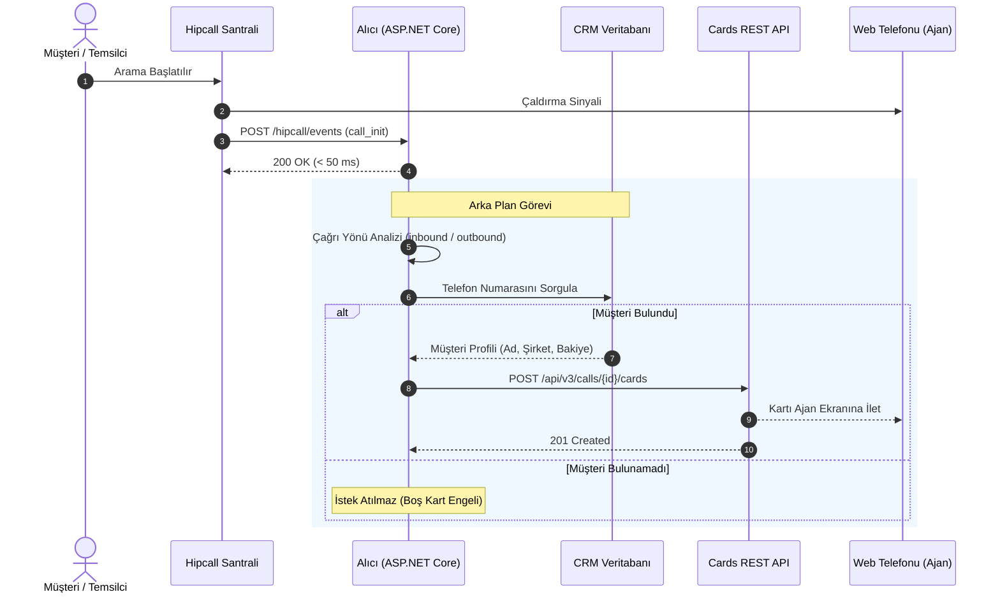

## Genel bakış

Telefon çalmaya başladığında ajanın ekranında beliren tek bilgi yabancı bir telefon numarasıdır. Ajan panik halinde CRM sekmesine geçer, numarayı arama kutusuna yapıştırır ve kayıtları tarar. Bu arama ve bağlam kurma telaşı ortalama on beş saniye sürerken, hattın diğer ucundaki müşteri çoktan "Alo?" demiştir.

Insight Card mimarisi bu on beş saniyelik kör noktayı ortadan kaldırır. Çağrı başladığı milisaniyede müşterinin adı, şirketi, açık bakiye durumu ve hesap yöneticisi doğrudan web telefonunun arayüzünde belirir. Veri kurumun kendi veritabanından veya CRM sisteminden gelir; Hipcall bu veriyi temsilcinin önüne hazır getirir.

Bu rehberde bir ASP.NET Core webhook alıcısı kurarak, `call_init` anında telefon numarasını tespit etmeyi, yerel CRM'de sorgulamayı, katı şema kurallarına uygun bir Insight Card oluşturup ajanın ekranına basmayı ve canlı çağrı zamanlama sınırlarını ele alıyoruz.

## Başlamadan önce

Çalışmaya başlamadan önce şu gereksinimlerin hazır olduğundan emin olun:

- Bilgisayarınızda veya sunucunuzda **.NET 8 SDK** kurulu olmalıdır.
- Webhook bildirimlerini alabilmek için dışarıdan erişilebilir güvenli bir HTTPS uç noktası (yerel geliştirme ortamında test etmek için ngrok veya benzeri bir tünel).
- Hipcall Yönetim Panelinde oluşturulmuş geçerli bir **API Anahtarı (Personal Access Token)**.
- Canlı testleri gözlemleyebilmek için tarayıcınızda açık bir **Hipcall Web Telefonu** (temsilci ekranı).

## Kartın anatomisi ve desteklenen satır tipleri

Insight Card, dikey olarak sıralanan bilgi satırlarından oluşur. Hipcall santrali kart gövdesinde katı şema doğrulaması uygular; her satır tipi yalnızca kendisine tanımlı alanları barındırabilir.

| Satır Tipi (`type`) | Zorunlu Alanlar | İsteğe Bağlı Alanlar | İşlevi ve Görünümü |
|---|---|---|---|
| **`title`** | `type`, `text` | `link` | Kartın en üstündeki ana başlıktır. Link tanımlanırsa sağında dış bağlantı ikonu yer alır. |
| **`shortText`** | `type`, `text` | `label`, `link`, `ios`, `android` | İki sütunlu temel veri satırıdır. Sol tarafta soluk gri etiket, sağ tarafta koyu renkli değer görünür. |
| **`user`** | `type`, `label`, `user_id` | - | Hipcall kullanıcı kimliğini paneldeki temsilcinin adıyla eşleştirir. |

```json
{
  "card": [
    {
      "type": "title",
      "text": "Mehmet Demir",
      "link": "https://crm.example.com/customers/102"
    },
    {
      "type": "shortText",
      "label": "Şirket",
      "text": "Demir Lojistik Ltd.",
      "link": "https://crm.example.com/customers/102"
    },
    {
      "type": "shortText",
      "label": "Segment",
      "text": "Kurumsal"
    },
    {
      "type": "shortText",
      "label": "Bakiye",
      "text": "14.250 TL (Açık Fatura)"
    },
    {
      "type": "user",
      "label": "Müşteri Yöneticisi",
      "user_id": 4200
    }
  ]
}
```

### Katı şema doğrulaması ve null alan tuzağı

Hipcall Insight Card API'si beklenmeyen alanlara karşı son derece hassastır. Örneğin bir `shortText` satırı oluştururken C# modelindeki `user_id` alanı `null` olarak JSON çıktısına basılırsa, API tüm kartı `422 Unprocessable Entity` durum koduyla reddeder:

```text
HTTP 422 Unprocessable Entity
shortText type only allows fields: type, text, label, link, android, ios. Invalid fields found: user_id in card item 2
```

Bu nedenle JSON serileştiricide null değerlerin çıktıda yer almaması garanti altına alınmalıdır.

## İlk kartı elle gönderme

Aktif bir çağrınız devam ederken terminalden curl veya C# HttpClient ile tek seferlik kart basabilirsiniz:

```bash
curl -X POST "https://use.hipcall.com.tr/api/v3/calls/{call_id}/cards" \
  -H "Authorization: Bearer YOUR_API_TOKEN" \
  -H "Content-Type: application/json" \
  -d '{
    "card": [
      {
        "type": "title",
        "text": "Acme CRM Müşteri Kartı",
        "link": "https://crm.example.com/customer/101"
      },
      {
        "type": "shortText",
        "label": "Müşteri",
        "text": "Ahmet Yılmaz"
      },
      {
        "type": "shortText",
        "label": "Durum",
        "text": "VIP - Düzenli Ödeyen"
      }
    ]
  }'
```

İstek başarılı olduğunda API HTTP `201 Created` yanıtı döner ve web telefonu arayüzünde kart kutucuğu belirir:


## call_init webhook'u ile kartı otomatik basma

Uçtan uca otomasyonda akış santralin `call_init` bildirimini göndermesiyle başlar.



### Çağrı yönüne göre numara tespiti

Santralden gelen webhook gövdesinde müşteri numarasının hangi alanda yer aldığı çağrının yönüne (`direction`) bağlıdır:

- **Gelen çağrılarda (`inbound`):** Arayan taraf dışarıdaki müşteri olduğu için hedef numara `data.caller_number` alanındadır.
- **Giden çağrılarda (`outbound`):** Temsilci dışarıyı aradığı için hedef numara `data.callee_number` alanındadır.

### Müşteri bulunamadığında boş kart basmama kuralı

Hipcall API'si teknik olarak `{"card": []}` boş dizisini kabul eder. Ancak CRM'de bulunamayan bir numara için boş kart basmak, ajanın karşısına içi boş gri bir panel çıkararak dikkatini dağıtır. Müşteri veri tabanında eşleşmediğinde hiçbir HTTP isteği gönderilmemeli, işlem sessizce tamamlanmalıdır.

## Zamanlama: Kartın en zor tarafı

Insight Card geliştiricilerinin en sık karşılaştığı durum zamanlama bütçesidir.

### 1. Karşı taraf açtığı anda görünme davranışı
Canlı testlerimizde web telefonunun çaldırma esnasında minimalist arama ekranını koruduğunu, çağrı yanıtlandığı (`answered`) milisaniyede Insight Card bileşenini render ettiğini tespit ettik. Kartı `call_init` anında basmak, karşı taraf telefonu açtığı anda verinin ekranda hazır bulunmasını sağlar.

### 2. Çağrı bittikten sonra kart basılması ve HTTP 200 yanılgısı
Çağrı sonlandıktan sonra API'ye kart gönderildiğinde sistem HTTP `200/201` döner ve kartı geçmişe kaydeder. Ancak çağrı kapandığı için ajan bu kartı canlı ekranda göremez. API'nin başarılı dönmesi, kartın ajan tarafından görüldüğü anlamına gelmez; kart canlı görüşme anında iletilmelidir.

### 3. Süre bütçesi (Latency Budget)
Ortalama telefon çalma süresi 5 ila 15 saniyedir. Webhook geliş süresi (150 ms) ve kart POST süresi (200 ms) hesaba katıldığında, CRM sorgunuz 2 saniye sürse bile toplam gecikme yaklaşık 2.4 saniyede kalır ve kart telefon açılmadan önce santralde hazır hale gelir. CRM sorgularının 3 saniyenin altında kalması ideal kullanıcı deneyimini korur.

## Örnek uygulamanın tamamı

Aşağıda gelen `call_init` olayını yakalayan, çağrı yönüne göre numarayı ayıran, yerel `customers.json` CRM veritabanında arama yapan ve arka planda kart basan Minimal API uygulaması yer almaktadır:

```csharp
using System.Diagnostics;
using System.Net.Http.Headers;
using System.Text;
using System.Text.Json;
using System.Text.Json.Serialization;

var builder = WebApplication.CreateBuilder(args);

builder.WebHost.ConfigureKestrel(serverOptions =>
{
    serverOptions.ListenAnyIP(5080);
});

var baseEndpoint = Environment.GetEnvironmentVariable("HIPCALL_API_ENDPOINT") ?? "https://use.hipcall.com.tr/api/v3";

builder.Services.AddHttpClient("HipcallClient", client =>
{
    client.BaseAddress = new Uri(baseEndpoint.TrimEnd('/') + "/");
});

var app = builder.Build();

var jsonOptions = new JsonSerializerOptions
{
    PropertyNamingPolicy = JsonNamingPolicy.SnakeCaseLower,
    PropertyNameCaseInsensitive = true,
    DefaultIgnoreCondition = JsonIgnoreCondition.WhenWritingNull,
    WriteIndented = true,
    Encoder = System.Text.Encodings.Web.JavaScriptEncoder.UnsafeRelaxedJsonEscaping
};

var expectedSecret = Environment.GetEnvironmentVariable("HIPCALL_WEBHOOK_SECRET") ?? "whsec_live_9a8f2e4c1b0d";
var baseDir = Directory.GetCurrentDirectory();
var customersFilePath = Path.Combine(baseDir, "customers.json");

HashSet<string> processedCalls = [];

app.MapGet("/", () => Results.Ok(new { status = "running", service = "Hipcall.InsightCard" }));

app.MapPost("/hipcall/events/{secret?}", async (string? secret, HttpRequest request, IHttpClientFactory httpClientFactory) =>
{
    using var reader = new StreamReader(request.Body, Encoding.UTF8);
    var rawBody = await reader.ReadToEndAsync();

    if (string.IsNullOrWhiteSpace(rawBody))
    {
        return Results.Ok();
    }

    HipcallWebhookPayload? payload;
    try
    {
        payload = JsonSerializer.Deserialize<HipcallWebhookPayload>(rawBody, jsonOptions);
    }
    catch
    {
        return Results.Ok();
    }

    if (payload == null || string.IsNullOrEmpty(payload.Event) || payload.Data == null)
    {
        return Results.Ok();
    }

    if (payload.Event != "call_init" && payload.Event != "call_bridged")
    {
        return Results.Ok();
    }

    var data = payload.Data;
    if (string.IsNullOrEmpty(data.Uuid))
    {
        return Results.Ok();
    }

    lock (processedCalls)
    {
        if (processedCalls.Contains(data.Uuid))
        {
            return Results.Ok();
        }
        processedCalls.Add(data.Uuid);
    }

    string? targetPhoneNumber = string.Equals(data.Direction, "inbound", StringComparison.OrdinalIgnoreCase)
        ? data.CallerNumber
        : data.CalleeNumber;

    if (string.IsNullOrWhiteSpace(targetPhoneNumber))
    {
        return Results.Ok();
    }

    var currentCustomers = LoadCustomers(customersFilePath, jsonOptions);
    var matchedCustomer = FindCustomerByPhone(currentCustomers, targetPhoneNumber);
    if (matchedCustomer == null)
    {
        return Results.Ok();
    }

    _ = Task.Run(async () =>
    {
        try
        {
            var token = Environment.GetEnvironmentVariable("HIPCALL_API_TOKEN");
            if (string.IsNullOrWhiteSpace(token))
            {
                return;
            }

            var client = httpClientFactory.CreateClient("HipcallClient");
            var card = BuildInsightCard(matchedCustomer);
            var cardJson = JsonSerializer.Serialize(card, jsonOptions);
            using var cardContent = new StringContent(cardJson, Encoding.UTF8, "application/json");

            using var requestMessage = new HttpRequestMessage(HttpMethod.Post, $"calls/{data.Uuid}/cards")
            {
                Content = cardContent
            };
            requestMessage.Headers.Authorization = new AuthenticationHeaderValue("Bearer", token);

            await client.SendAsync(requestMessage);
        }
        catch
        {
        }
    });

    return Results.Ok();
});

app.Run();

static List<CrmCustomer> LoadCustomers(string path, JsonSerializerOptions options)
{
    if (!File.Exists(path)) return [];
    try
    {
        var json = File.ReadAllText(path);
        return JsonSerializer.Deserialize<List<CrmCustomer>>(json, options) ?? [];
    }
    catch
    {
        return [];
    }
}

static CrmCustomer? FindCustomerByPhone(List<CrmCustomer> customers, string phone)
{
    var normalizedTarget = NormalizePhone(phone);
    return customers.FirstOrDefault(c => NormalizePhone(c.Phone) == normalizedTarget);
}

static string NormalizePhone(string? phone)
{
    if (string.IsNullOrWhiteSpace(phone)) return string.Empty;
    var digits = new string(phone.Where(char.IsDigit).ToArray());
    if (digits.StartsWith("90") && digits.Length == 12) return digits[2..];
    if (digits.StartsWith("0") && digits.Length == 11) return digits[1..];
    return digits;
}

static InsightCardRoot BuildInsightCard(CrmCustomer customer)
{
    List<InsightCardItem> items =
    [
        new InsightCardItem { Type = "title", Text = customer.Name, Link = customer.CrmUrl },
        new InsightCardItem { Type = "shortText", Label = "Şirket", Text = customer.Company, Link = customer.CrmUrl },
        new InsightCardItem { Type = "shortText", Label = "Segment", Text = customer.Segment },
        new InsightCardItem { Type = "shortText", Label = "Bakiye", Text = customer.Balance }
    ];

    if (customer.AccountOwnerId.HasValue)
    {
        items.Add(new InsightCardItem { Type = "user", Label = "Müşteri Yöneticisi", UserId = customer.AccountOwnerId.Value });
    }

    return new InsightCardRoot { Card = items };
}

public class CrmCustomer
{
    public string? Phone { get; set; }
    public string? Name { get; set; }
    public string? Company { get; set; }
    public string? Segment { get; set; }
    public string? Balance { get; set; }
    public string? CrmUrl { get; set; }
    public int? AccountOwnerId { get; set; }
}

public class InsightCardRoot
{
    public List<InsightCardItem> Card { get; set; } = [];
}

public class InsightCardItem
{
    public string Type { get; set; } = "shortText";
    public string? Label { get; set; }
    public string? Text { get; set; }
    public string? Link { get; set; }
    public int? UserId { get; set; }
}

public class HipcallWebhookPayload
{
    public string? Event { get; set; }
    public CallDataPayload? Data { get; set; }
}

public class CallDataPayload
{
    public string? Uuid { get; set; }
    public string? Direction { get; set; }
    public string? CallerNumber { get; set; }
    public string? CalleeNumber { get; set; }
}
```

## Hata aldığınızda

Entegrasyon sırasında karşılaşılabilecek durumlar:

### 1. HTTP 422 Unprocessable Entity
- Satır tiplerini kontrol edin: Yalnızca `title`, `shortText` ve `user` tiplerine izin verilir.
- Katı şema ihlalini önleyin: `shortText` nesnelerinde `user_id` alanı null dahi olsa yer almamalıdır.
- Kart gövdesinde `card` dizisinin bulunduğunu teyit edin.

### 2. Ajan kartı ekranda göremiyor
- Ajan telefonu kapatmış olabilir: Bitmiş çağrılara kart basıldığında API başarılı dönse de ekranda render gerçekleşmez.
- `HIPCALL_API_TOKEN` yetkisini doğrulayın: API yetkisiz isteklerde kart oluşturmaz.
- Süre bütçesini inceleyin: CRM sorgunuz 4 saniyeyi aşıyorsa kart geç kalıyor olabilir.

## Sonraki adımlar

- Çok sayıda müşteri kaydı için JSON dosyası yerine Redis önbelleği veya PostgreSQL indeksli arama altyapısına geçin.
- Kendi CRM'inizde bulunmayan numaralar için Hipcall'ın `GET /api/v3/lookup/by_phone` rehber sorgusunu ikincil kaynak (fallback) olarak devreye alın.
- Mobil temsilciler için `ios` ve `android` deep link parametrelerini tanımlayarak tek dokunuşla yerel CRM uygulamasının açılmasını sağlayın.
