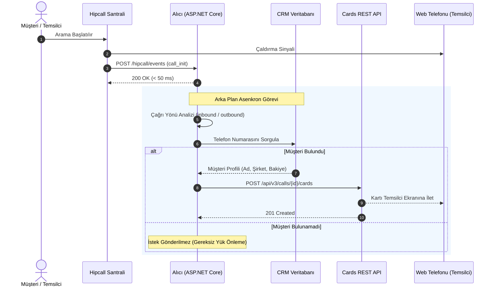

## Genel bakış

Temsilci çalan telefonu açtığında ekranda sadece bir numara görürse, CRM sekmesine geçip bu numarayı araması ortalama on beş saniye sürer. Bu sırada müşteri konuşmaya başlamıştır.

Insight Card bu gecikmeyi çözer. Çağrı başladığı an müşterinin adını, şirketini, bakiyesini ve hesap yöneticisini uygulamanızdan alıp web telefonuna yansıtır.

Bu sayfada ASP.NET Core Minimal API ile `call_init` olayını dinlemeyi, numarayı veritabanında sorgulamayı ve canlı çağrı oturumuna Insight Card göndermeyi anlatıyoruz.

## Başlamadan önce

Çalışmaya başlamadan önce şu gereksinimlerin hazır olduğundan emin olun:

- Bilgisayarınızda veya sunucunuzda .NET 8 SDK kurulu olmalıdır (`dotnet --version` çıktısı 8.0 veya üstü).
- Webhook bildirimlerini alabilmek için dışarıdan erişilebilir güvenli bir HTTPS uç noktası (yerel ortamda test etmek için ngrok veya benzeri bir tünel).
- Hipcall Yönetim Panelinde oluşturulmuş geçerli bir API Anahtarı (Personal Access Token).
- Canlı testleri gözlemleyebilmek için tarayıcınızda açık bir Hipcall Web Telefonu (temsilci oturumu).

API anahtarınızı terminal oturumunuzda ortam değişkeni olarak tanımlayın:

```bash
export HIPCALL_API_TOKEN="SFMyNTY.g2gDbQAAAC..."
```

## Insight Card yapısı ve görsel bileşenler

Insight Card, temsilcinin web telefonu arayüzünde dikey bir bilgi kartı olarak render edilen satırlardan oluşur. Kart tasarımında üç temel bileşen kullanılır:

| Satır Tipi | Zorunlu Alanlar | İsteğe Bağlı Alanlar | İşlevi ve Görünümü |
|---|---|---|---|
| `title` | `type`, `text` | `link` | Kartın en üstündeki ana başlıktır. Link tanımlandığında sağında dış bağlantı ikonu yer alır ve tıklandığında CRM kaydını yeni sekmede açar. |
| `shortText` | `type`, `text` | `label`, `link`, `ios`, `android` | İki sütunlu temel veri satırıdır. Sol tarafta soluk gri etiket, sağ tarafta koyu renkli değer görünür. Şirket, bakiye, segment gibi bilgileri taşır. |
| `user` | `type`, `label`, `user_id` | - | Hipcall kullanıcı kimliğini paneldeki temsilcinin adıyla eşleştirerek hesap yöneticisini ekranda gösterir. |

Ekrana basılacak zengin ve yapılandırılmış bir kart örneği:

```json
{
  "card": [
    {
      "type": "title",
      "text": "Mehmet Demir",
      "link": "https://crm.example.com/customers/102"
    },
    {
      "type": "shortText",
      "label": "Şirket",
      "text": "Demir Lojistik Ltd.",
      "link": "https://crm.example.com/customers/102"
    },
    {
      "type": "shortText",
      "label": "Segment",
      "text": "Kurumsal"
    },
    {
      "type": "shortText",
      "label": "Bakiye",
      "text": "14.250 TL (Açık Fatura)"
    },
    {
      "type": "user",
      "label": "Müşteri Yöneticisi",
      "user_id": 4200
    }
  ]
}
```

## Insight Card API'si ile kart oluşturma

Aktif bir çağrı oturumuna kart göndermek için `/api/v3/calls/{call_id}/cards` endpoint'ine HTTP POST isteği gönderilir:

```bash
curl -X POST "https://use.hipcall.com.tr/api/v3/calls/{call_id}/cards" \
  -H "Authorization: Bearer $HIPCALL_API_TOKEN" \
  -H "Content-Type: application/json" \
  -d '{
    "card": [
      {
        "type": "title",
        "text": "Acme CRM Müşteri Kartı",
        "link": "https://crm.example.com/customer/101"
      },
      {
        "type": "shortText",
        "label": "Müşteri",
        "text": "Ahmet Yılmaz"
      },
      {
        "type": "shortText",
        "label": "Durum",
        "text": "VIP - Düzenli Ödeyen"
      }
    ]
  }'
```

İstek başarılı olduğunda API HTTP `201 Created` yanıtı döner ve web telefonu arayüzünde kart kutucuğu belirir:


## Webhook entegrasyonu ve çağrı döngüsü

Kartın temsilci telefonu açtığı anda ekranda hazır olması için, çağrının başladığı an tetiklenen `call_init` webhook olayı kullanılır:



### Çağrı yönüne göre numara tespiti

Gelen webhook gövdesinde müşteri numarasının konumu çağrının yönüne (`direction`) bağlıdır:

- **Gelen çağrılarda (`inbound`):** Arayan taraf dışarıdaki müşteri olduğu için aranan numara `data.caller_number` alanındadır.
- **Giden çağrılarda (`outbound`):** Temsilci dışarıyı aradığı için müşteri numarası `data.callee_number` alanındadır.

### Müşteri bulunamadığında sessiz tamamlama

CRM veritabanında eşleşmeyen bir telefon numarası için boş bir kart dizisi (`{"card": []}`) göndermek, temsilcinin ekranında gereksiz gri bir kutu açar. Eşleşme sağlanamadığında hiçbir HTTP isteği gönderilmemeli, arka plan işlemi sessizce sonlandırılmalıdır.

## C# Minimal API uygulaması

Aşağıdaki ASP.NET Core Minimal API uygulaması, gelen `call_init` webhook'unu 50 ms altında onaylar, numarayı belirler, `customers.json` dosyasından müşteriyi bulur ve Insight Card'ı çağrı oturumuna asenkron gönderir. Olası bir hata durumunda API yanıt gövdesini kaybetmemek için konsola loglar.

```csharp
using System.Net.Http.Headers;
using System.Text;
using System.Text.Json;
using System.Text.Json.Serialization;

var builder = WebApplication.CreateBuilder(args);

builder.WebHost.ConfigureKestrel(serverOptions =>
{
    serverOptions.ListenAnyIP(5080);
});

var baseEndpoint = Environment.GetEnvironmentVariable("HIPCALL_API_ENDPOINT") ?? "https://use.hipcall.com.tr/api/v3";

builder.Services.AddHttpClient("HipcallClient", client =>
{
    client.BaseAddress = new Uri(baseEndpoint.TrimEnd('/') + "/");
});

var app = builder.Build();

var jsonOptions = new JsonSerializerOptions
{
    PropertyNamingPolicy = JsonNamingPolicy.SnakeCaseLower,
    PropertyNameCaseInsensitive = true,
    DefaultIgnoreCondition = JsonIgnoreCondition.WhenWritingNull,
    WriteIndented = true,
    Encoder = System.Text.Encodings.Web.JavaScriptEncoder.UnsafeRelaxedJsonEscaping
};

var expectedSecret = Environment.GetEnvironmentVariable("HIPCALL_WEBHOOK_SECRET") ?? "whsec_live_xxxxxxxxxxxxxxxx";
var baseDir = Directory.GetCurrentDirectory();
var customersFilePath = Path.Combine(baseDir, "customers.json");

HashSet<string> processedCalls = [];

app.MapGet("/", () => Results.Ok(new { status = "running", service = "Hipcall.InsightCard" }));

app.MapPost("/hipcall/events/{secret?}", async (string? secret, HttpRequest request, IHttpClientFactory httpClientFactory) =>
{
    if (string.IsNullOrEmpty(secret) || !string.Equals(secret, expectedSecret, StringComparison.Ordinal))
    {
        return Results.Unauthorized();
    }

    using var reader = new StreamReader(request.Body, Encoding.UTF8);
    var rawBody = await reader.ReadToEndAsync();

    if (string.IsNullOrWhiteSpace(rawBody))
    {
        return Results.Ok();
    }

    HipcallWebhookPayload? payload = null;
    try
    {
        payload = JsonSerializer.Deserialize<HipcallWebhookPayload>(rawBody, jsonOptions);
    }
    catch (Exception ex)
    {
        Console.WriteLine($"Deserialization failed: {ex.Message}");
        return Results.Ok();
    }

    if (payload == null || string.IsNullOrEmpty(payload.Event) || payload.Data == null)
    {
        return Results.Ok();
    }

    if (payload.Event != "call_init" && payload.Event != "call_bridged")
    {
        return Results.Ok();
    }

    var data = payload.Data;
    if (string.IsNullOrEmpty(data.Uuid))
    {
        return Results.Ok();
    }

    lock (processedCalls)
    {
        if (processedCalls.Contains(data.Uuid))
        {
            return Results.Ok();
        }
        processedCalls.Add(data.Uuid);
    }

    string? targetPhoneNumber = string.Equals(data.Direction, "inbound", StringComparison.OrdinalIgnoreCase)
        ? data.CallerNumber
        : data.CalleeNumber;

    if (string.IsNullOrWhiteSpace(targetPhoneNumber))
    {
        return Results.Ok();
    }

    var currentCustomers = LoadCustomers(customersFilePath, jsonOptions);
    var matchedCustomer = FindCustomerByPhone(currentCustomers, targetPhoneNumber);
    if (matchedCustomer == null)
    {
        return Results.Ok();
    }

    _ = Task.Run(async () =>
    {
        try
        {
            var token = Environment.GetEnvironmentVariable("HIPCALL_API_TOKEN");
            if (string.IsNullOrWhiteSpace(token))
            {
                return;
            }

            var client = httpClientFactory.CreateClient("HipcallClient");
            var card = BuildInsightCard(matchedCustomer);
            var cardJson = JsonSerializer.Serialize(card, jsonOptions);
            using var cardContent = new StringContent(cardJson, Encoding.UTF8, "application/json");

            using var requestMessage = new HttpRequestMessage(HttpMethod.Post, $"calls/{data.Uuid}/cards")
            {
                Content = cardContent
            };
            requestMessage.Headers.Authorization = new AuthenticationHeaderValue("Bearer", token);

            var response = await client.SendAsync(requestMessage);
            if (!response.IsSuccessStatusCode)
            {
                var errorBody = await response.Content.ReadAsStringAsync();
                Console.WriteLine($"API Error: {response.StatusCode} - {errorBody}");
            }
        }
        catch (Exception ex)
        {
            Console.WriteLine($"Background task failed: {ex.Message}");
        }
    });

    return Results.Ok();
});

app.Run();

static List<CrmCustomer> LoadCustomers(string path, JsonSerializerOptions options)
{
    if (!File.Exists(path)) return [];
    try
    {
        var json = File.ReadAllText(path);
        return JsonSerializer.Deserialize<List<CrmCustomer>>(json, options) ?? [];
    }
    catch
    {
        return [];
    }
}

static CrmCustomer? FindCustomerByPhone(List<CrmCustomer> customers, string phone)
{
    var normalizedTarget = NormalizePhone(phone);
    return customers.FirstOrDefault(c => NormalizePhone(c.Phone) == normalizedTarget);
}

static string NormalizePhone(string? phone)
{
    if (string.IsNullOrWhiteSpace(phone)) return string.Empty;
    var digits = new string(phone.Where(char.IsDigit).ToArray());
    if (digits.StartsWith("90") && digits.Length == 12) return digits[2..];
    if (digits.StartsWith("0") && digits.Length == 11) return digits[1..];
    return digits;
}

static InsightCardRoot BuildInsightCard(CrmCustomer customer)
{
    List<InsightCardItem> items =
    [
        new InsightCardItem { Type = "title", Text = customer.Name, Link = customer.CrmUrl },
        new InsightCardItem { Type = "shortText", Label = "Şirket", Text = customer.Company, Link = customer.CrmUrl },
        new InsightCardItem { Type = "shortText", Label = "Segment", Text = customer.Segment },
        new InsightCardItem { Type = "shortText", Label = "Bakiye", Text = customer.Balance }
    ];

    if (customer.AccountOwnerId.HasValue)
    {
        items.Add(new InsightCardItem { Type = "user", Label = "Müşteri Yöneticisi", UserId = customer.AccountOwnerId.Value });
    }

    return new InsightCardRoot { Card = items };
}

public class CrmCustomer
{
    public string? Phone { get; set; }
    public string? Name { get; set; }
    public string? Company { get; set; }
    public string? Segment { get; set; }
    public string? Balance { get; set; }
    public string? CrmUrl { get; set; }
    public int? AccountOwnerId { get; set; }
}

public class InsightCardRoot
{
    public List<InsightCardItem> Card { get; set; } = [];
}

public class InsightCardItem
{
    public string Type { get; set; } = "shortText";
    public string? Label { get; set; }
    public string? Text { get; set; }
    public string? Link { get; set; }
    public int? UserId { get; set; }
}

public class HipcallWebhookPayload
{
    public string? Event { get; set; }
    public CallDataPayload? Data { get; set; }
}

public class CallDataPayload
{
    public string? Uuid { get; set; }
    public string? Direction { get; set; }
    public string? CallerNumber { get; set; }
    public string? CalleeNumber { get; set; }
}
```

## Hata aldığınızda

### 1. HTTP 422 Unprocessable Entity ve katı şema kuralı

Hipcall Insight Card API'si satır nesnelerinde tanımlı olmayan yabancı alanlara karşı katı doğrulama uygular. Örneğin `shortText` tipindeki bir satıra C# modelinde tanımlı olan `user_id` alanı `null` olarak dahi serileştirilirse API tüm kartı reddeder:

```text
HTTP 422 Unprocessable Entity
shortText type only allows fields: type, text, label, link, android, ios. Invalid fields found: user_id in card item 2
```

Çözüm olarak JSON serileştiricide `DefaultIgnoreCondition = JsonIgnoreCondition.WhenWritingNull` ayarını kullanın. Bu sayede kullanılmayan alanlar JSON çıktısından tamamen çıkarılır.

### 2. Çağrı kapandıktan sonra kart basılması

Çağrı bittikten sonra API'ye kart gönderildiğinde sistem HTTP 201 döner ve kartı geçmişe iliştirir. Ancak çağrı penceresi kapandığı için temsilci bu kartı canlı ekranda göremez. Kart canlı görüşme devam ederken iletilmelidir.

### 3. Gecikme payı (Latency budget)

Telefon çalma süresi genellikle 5 ila 15 saniyedir. Webhook iletimi (~150 ms) ve kart POST isteği (~200 ms) hesaba katıldığında, CRM sorgunuz 2 saniye sürse bile toplam gecikme yaklaşık 2.4 saniyede kalır. CRM sorgularının 3-4 saniyeyi aşması kartın görüşme başladıktan sonra ekrana gelmesine yol açar.

## Parametre listesi

Insight Card satır tipleri ve desteklenen alanlar:

| Satır Tipi | Desteklenen Alanlar | Açıklama |
|---|---|---|
| `title` | `type`, `text`, `link` | Kart başlığı ve tıklandığında açılacak CRM bağlantısı. |
| `shortText` | `type`, `text`, `label`, `link`, `ios`, `android` | Etiket-değer ikilisi, harici web bağlantısı veya mobil deep link. |
| `user` | `type`, `label`, `user_id` | Hipcall kullanıcı ID'si üzerinden hesap yöneticisi gösterimi. |

## Sonraki adımlar

- Çok sayıda müşteri kaydı için JSON dosyası yerine Redis önbelleği veya PostgreSQL kullanın.
- CRM'inizde bulunmayan numaralar için Hipcall'ın `GET /api/v3/lookup/by_phone` sorgusunu ikincil kaynak olarak kullanın.
- Mobil temsilciler için `ios` ve `android` deep link parametreleri tanımlayarak CRM uygulamasının açılmasını sağlayın.
- Entegrasyon deneyimlerinizi [Hipcall Topluluk](https://community.hipcall.com/) platformunda paylaşın.
