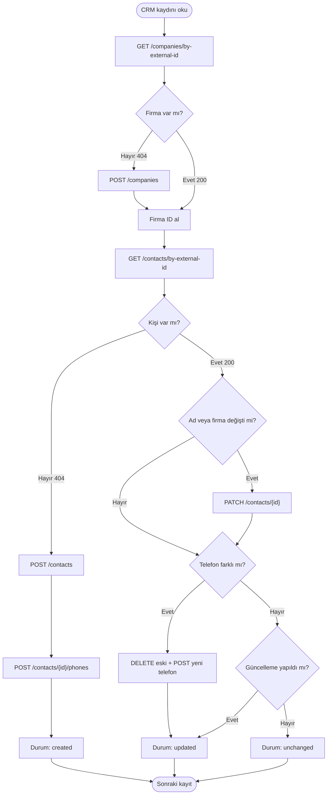

## Genel bakış

CRM'nizdeki müşteri ID'si ile Hipcall'daki kişi ID'si aynı olmak zorunda değildir. Bu nedenle iki sistem arasında senkronizasyon kurarken ortak bir eşleştirme alanına ihtiyaç duyarsınız.

Telefon numarasıyla eşleştirme basit görünse de numara değişikliği veya farklı formatlarda kayıt gibi durumlarda eşleştirme sorunlarına yol açabilir.

`external_id` bu sorunu ortadan kaldırır. Kendi ID'nizi Hipcall kaydına yazar, doğrudan onunla sorgularsınız. Bu sayfada kişi ve firma kayıtlarına kendi ID'nizi eklemeyi, `POST` ile `PATCH` arasındaki güncelleme farklarını ve tekrar çalıştırıldığında kopya üretmeyen bir C# senkron uygulaması yazmayı anlatıyoruz.

## Başlamadan önce

Şunların hazır olduğundan emin olun:

- .NET 9 SDK kurulu olmalı (`dotnet --version` çıktısı 9.0 veya üstü).
- Hipcall Yönetim Panelinden oluşturulmuş geçerli bir API anahtarı (Personal Access Token). Anahtarın kişi ve firma oluşturma/güncelleme yetkisi olmalı.
- DEMO hesabınızda birkaç test kişisi ve firması. Hem oluşturma hem güncelleme akışını doğrulamak için gerekiyor.

API anahtarınızı terminalde tanımlayın:

```bash
export HIPCALL_API_TOKEN="..."
```

## Kendi ID'nizle kişi oluşturma

`POST /api/v3/contacts` için gereken en küçük gövde tek bir alandır: `first_name`. Kaydı CRM'deki ID'nizle etiketlemek için `external_id` ekleyin:

```bash
curl -X POST "https://use.hipcall.com.tr/api/v3/contacts" \
  -H "Authorization: Bearer $HIPCALL_API_TOKEN" \
  -H "Content-Type: application/json" \
  -d '{
    "first_name": "Can",
    "last_name": "Kaya",
    "external_id": "MUSTERI-CAN-001",
    "company_id": 80679,
    "phones": [
      { "country": "TR", "number": "+90555XXXXXXX" }
    ]
  }'
```

Cevap dahili bir `id` ile birlikte yeni kaydı döner. `phones` ve `emails` dizileri oluşturma sırasında gövdede kabul edilir.

Aynı `external_id` ile ikinci bir kişi oluşturmayı denerseniz API `422` döner:

```json
{
  "errors": {
    "external_id": [
      "has already been taken"
    ]
  }
}
```

external_id alanındaki benzersizlik kısıtlaması, aynı ID ile birden fazla kişi oluşturulmasını engeller. Bu nedenle senkronizasyon sırasında kayıtları bu alan üzerinden güvenilir şekilde eşleştirebilirsiniz.

## external_id ile sorgulama

Hipcall dahili ID'si yerine kendi tanımlayıcınızla sorgulayın:

```bash
curl -s "https://use.hipcall.com.tr/api/v3/contacts/by-external-id/MUSTERI-CAN-001" \
  -H "Authorization: Bearer $HIPCALL_API_TOKEN"
```

Kayıt varsa `200 OK` ve tam kişi nesnesi döner. Yoksa `404 Not Found` döner. Senkron uygulamanız bu iki cevapla oluştur/güncelle kararı verir.

## Güncelleme: hangi alan nereye gider

API güncelleme işlemlerinde skaler alanlar ile dizileri birbirinden ayırır. `first_name`, `last_name` ve `company_id` gibi alanları güncellemek için ana endpoint'e `PATCH` isteği gönderin. Telefon ve e-postaları ise kendi endpoint'leri üzerinden alt kaynaklar olarak yönetin.

| İşlem | Endpoint | Gövde formatı |
|---|---|---|
| Ad, firma güncelleme | `PATCH /api/v3/contacts/{id}` | `{ "first_name": "Can", "company_id": 80679 }` |
| Telefon ekleme | `POST /api/v3/contacts/{id}/phones` | `{ "phones": [{ "country": "TR", "number": "+90555XXXXXXX" }] }` |
| Telefon silme | `DELETE /api/v3/contacts/{id}/phones/%2B90555XXXXXXX` | (gövde yok) |
| E-posta ekleme | `POST /api/v3/contacts/{id}/emails` | `{ "emails": ["ad@sirket.com"] }` |
| E-posta silme | `DELETE /api/v3/contacts/{id}/emails/ad%40sirket.com` | (gövde yok) |

`POST /api/v3/contacts` oluşturma sırasında `phones` ve `emails` dizilerini kabul ettiği için `PATCH /api/v3/contacts/{id}` isteğinin de aynı dizileri kabul etmesini bekleyebilirsiniz. Ancak bir `PATCH` isteğine `phones` dizisi eklerseniz, API bunu reddeder ve `422 Unprocessable Entity` ile `"Unexpected field: phones"` hatası döner.

Bir kişiye en fazla altı telefon numarası eklenebilir. Yedinci numara eklenmeye çalışıldığında API `422` ve `"Contact already has 6 phone numbers"` döner. Zaten kayıtlı bir numara tekrar eklenmeye çalışıldığında da `422` döner.

## Özel alanlar (custom fields)

Özel alan tanımları panelde Ayarlar > Rehber > Özel Alanlar menüsünden yönetilir. API bu alanlara `slug` ile erişir. Slug, alan adından türetilen makine okunabilir anahtardır (örneğin "Özel Alan" için `ozel_alan`).

Özel alanları `custom_fields` nesnesi üzerinden okuyun ve yazın:

```json
{
  "custom_fields": {
    "aşama": "girişim",
    "muhasebe_yöneticisi": "Ahmet"
  }
}
```

Hem `POST` hem `PATCH` bu nesneyi kabul eder. Panelde zorunlu olarak işaretlenmiş bir alan oluşturma sırasında boş geçilirse API isteği reddeder:

```json
{
  "errors": {
    "custom_fields": {
      "tier": ["can't be blank"]
    }
  }
}
```

## Firmalar ve aralarındaki bağlantı

Firmalar da aynı `external_id` düzenini kullanır. Kendi ID'nizle firma oluşturun, ardından kişileri `company_id` ile firmaya bağlayın:

```bash
curl -X POST "https://use.hipcall.com.tr/api/v3/companies" \
  -H "Authorization: Bearer $HIPCALL_API_TOKEN" \
  -H "Content-Type: application/json" \
  -d '{ "name": "Acme Ltd.", "external_id": "FIRMA-77" }'
```

`GET /api/v3/companies/by-external-id/FIRMA-77` ile sorgulayın, dönen `id` değerini kişi oluştururken veya güncellerken `company_id` olarak kullanın.

Bir firma silindiğinde, ona bağlı kişilerin `company` alanı `null` olur. Kişi kayıtları silinmez.

`/assign` alt endpoint'i (`PATCH /api/v3/contacts/{id}/assign`) tam güncelleme yetkisi gerektirmeden kişinin sahipliğini değiştirir. `"assign_to_user_id": null` göndererek atamayı kaldırabilirsiniz.

## Idempotent senkron yazma

Senkron, bir JSON dosyasını (CRM dışa aktarımınızı) okur ve her kaydı şu karar ağacından geçirir:



Girdi dosyası (`crm_data.json`) CRM'deki kayıtları içerir. Her kayıt bir kişiye ve isteğe bağlı olarak bir firmaya karşılık gelir:

```json
[
  {
    "customerId": "MUSTERI-CAN-001",
    "firstName": "Can",
    "lastName": "Kaya",
    "phone": "+90555XXXXXXX",
    "companyId": "4202"
  },
  {
    "customerId": "MUSTERI-AYSE-002",
    "firstName": "Ayse",
    "lastName": "Y.",
    "phone": "+90555XXXXXXX",
    "companyId": "4202"
  }
]
```

## Uygulamanın tamamı

C# konsol uygulamasının tam kodu `submissions/06-kisi-firma-senkronu/Hipcall.ContactSync/` dizinindedir. Tek bir kişi için upsert mantığının özü şöyledir:

```csharp
var getResp = await client.GetAsync($"contacts/by-external-id/{record.CustomerId}");
if (getResp.IsSuccessStatusCode)
{
    // Kişi var. Alanları karşılaştır, farklıysa PATCH ile güncelle.
    var body = await getResp.Content.ReadFromJsonAsync<HipcallResponse<Contact>>();
    var contact = body?.Data ?? throw new Exception("Boş kişi cevabı.");
    contactId = contact.Id;

    var patchReq = new Dictionary<string, object>();
    if (contact.FirstName != record.FirstName)
        patchReq["first_name"] = record.FirstName ?? "";
    if (contact.LastName != record.LastName)
        patchReq["last_name"] = record.LastName ?? "";
    if (companyId.HasValue && contact.Company?.Id != companyId.Value)
        patchReq["company_id"] = companyId.Value;

    if (patchReq.Count > 0)
    {
        // Telefonlar ve e-postalar buraya DAHİL EDİLMEZ. PATCH onları reddeder.
        await client.PatchAsJsonAsync($"contacts/{contactId}", patchReq);
        status = "updated";
    }
}
else if (getResp.StatusCode == HttpStatusCode.NotFound)
{
    // Kişi yok. Oluştur.
    var postReq = new Dictionary<string, object>
    {
        ["first_name"] = record.FirstName ?? "",
        ["last_name"] = record.LastName ?? "",
        ["external_id"] = record.CustomerId ?? ""
    };
    var postResp = await client.PostAsJsonAsync("contacts", postReq);
    // ...
    status = "created";
}
```

Telefon numaraları alt kaynak endpoint'i üzerinden ayrıca yönetilir:

```csharp
if (!phoneExists)
{
    var phoneReq = new
    {
        phones = new[] { new { country = "TR", number = targetPhone } }
    };
    await client.PostAsJsonAsync($"contacts/{contactId}/phones", phoneReq);
}
```

Her kayıt sonucunu yazdırır. Bir kayıt hata verirse senkron bunu loglar ve sonraki kayıtla devam eder:

```text
--- Hipcall Contact & Company Sync Başlatılıyor (6 kayıt) ---

İşleniyor: [MUSTERI-CAN-001] Can Kaya
   [=] Değişiklik yok (Kayıt güncel)
Durum: unchanged

İşleniyor: [MUSTERI-MEHMET-003] Mehmetii Demir
   [+] Bilgiler güncellendi: Ad ('Mehmeti' -> 'Mehmetii')
Durum: updated

İşleniyor: [MUSTERI-HATA-004]  Hatalı Kayıt
HATA (MUSTERI-HATA-004): Kişi oluşturma hatası: {"errors":{"first_name":["String length is smaller than minLength: 1"]}}

================ ÖZET ================
Özet: 0 oluşturuldu, 1 güncellendi, 4 değişmedi, 1 hata.
======================================
```

Aynı veri ikinci kez çalıştırıldığında oluşturma veya güncelleme yapılmaz:

```text
Özet: 0 oluşturuldu, 0 güncellendi, 5 değişmedi, 1 hata.
```

İlk çalıştırma öncesi kayıt sayısı: 21. İlk çalıştırma sonrası: 25. İkinci çalıştırma sonrası: 25. Kopya kayıt yok.

## Hata aldığınızda

| Durum kodu | Hata gövdesi | Neden | Çözüm |
|---|---|---|---|
| `422` | `{"errors":{"external_id":["has already been taken"]}}` | Zaten var olan bir `external_id` ile yeni kişi oluşturmaya çalıştınız. | Önce `external_id` ile sorgulayın, varsa güncelleyin. |
| `422` | `{"errors":{"phones":["Unexpected field: phones"]}}` | `PATCH` isteğinin gövdesine `phones` eklediniz. | Numara eklemek için `POST /contacts/{id}/phones` kullanın. |
| `422` | `{"errors":{"phones":["Contact already has 6 phone numbers"]}}` | Kişi altı telefon sınırına ulaştı. | Yeni numara eklemeden önce eski bir numarayı silin. |
| `422` | `{"errors":{"first_name":["String length is smaller than minLength: 1"]}}` | `first_name` boş veya eksik. | Göndermeden önce doğrulayın. `first_name` zorunludur ve en az bir karakter içermelidir. |
| `422` | `{"errors":{"custom_fields":{"tier":["can't be blank"]}}}` | Zorunlu bir özel alan sağlanmadı. | Gerekli tüm özel alanları gövdeye ekleyin veya panelden zorunluluğu kaldırın. |
| `404` | `{"errors":{"detail":"Not Found"}}` | `external_id` herhangi bir kayıtla eşleşmiyor. | Upsert akışında bu beklenen bir durumdur. Kaydı oluşturun. |

## Sonraki adımlar

- Aynı alt kaynak desenini kullanarak e-posta senkronizasyonu ekleyin (`POST /contacts/{id}/emails`).
- Senkronu bir zamanlayıcıyla çalıştırın (örneğin saatte bir) ve tekrarlanan çalıştırmaların sıfır kopya ürettiğini doğrulayın.

