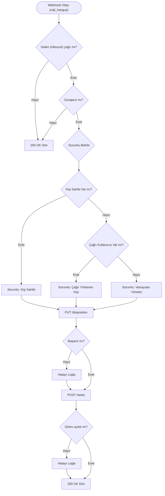

## Genel bakış

Cevapsız çağrı, bir çağrı merkezi için maliyetli bir olaydır. Müşteri sipariş vermek veya sorun bildirmek için aradığında kimse geri dönmezse fırsat kaçar. Ekipler bu süreci genellikle gün sonunda raporları inceleyip listeyi temsilcilere dağıtarak yönetir. Bu yöntem 6-8 saatlik bir gecikme yaratır.

Bu iş akışını otomatikleştirebilirsiniz. Bir çağrı cevapsız kapandığında, sistem otomatik olarak bir sonuç kodu atar ve saniyeler içinde sorumlu temsilciye bir takip görevi açar.

## Başlamadan önce

Aşağıdakileri hazırlayın:

- `call_hangup` olayını dinleyen çalışan bir webhook alıcısı.
- DEMO hesabınızda oluşturulmuş bir çağrı sonuç kodu. Ayarlar > Çağrı Merkezi > Çağrı Sonuç Kodları menüsünden oluşturabilirsiniz.
- Arayıp cevapsız bırakabileceğiniz bir test telefon numarası.
- Ortam değişkenlerinize eklenmiş Personal Access Token (Kişisel Erişim Anahtarı).

## Cevapsız çağrıyı cevaplanmıştan ayırma

Yalnızca cevapsız çağrılara görev açmak için onları doğru tespit etmelisiniz. `call_hangup` webhook'u çeşitli alanlar sunar, ancak tek başına `missing_call` alanına güvenmek yeterli değildir.

Aşağıdaki `curl` komutu ile uygulamanızı test etmek için sahte bir `call_hangup` olayını yerel sunucunuza gönderebilirsiniz:

```bash
curl -X POST http://localhost:5000/hipcall/events/whsec_live_xxxxxxxxxxxxxxxx \
  -H "Content-Type: application/json" \
  -d '{
  "data": {
    "credited": false,
    "team_touch_at": null,
    "first_touch_duration": 10,
    "contact_id": null,
    "callee_id": null,
    "answered_at": "2026-09-29T14:13:33Z",
    "voicemail_url": null,
    "caller_number": "+90850XXXXXXX",
    "missing_call_reason": null,
    "call_duration": 12,
    "callback_time": null,
    "call_flow": [
      {
        "action": "hangup",
        "detail": {
          "hangup_by": "contact"
        },
        "timestamp": 1790691215
      },
      {
        "action": "bridge",
        "detail": {
          "id": 4200,
          "type": "user"
        },
        "timestamp": 1790691205
      },
      {
        "action": "init",
        "detail": {
          "id": null,
          "type": "contact"
        },
        "timestamp": 1790691203
      }
    ],
    "direction": "outbound",
    "callee_number": "+90530XXXXXXX",
    "voicemail_id": null,
    "callback_user_id": null,
    "callee_type": "contact",
    "ended_at": "2026-09-29T14:13:35Z",
    "missing_call": false,
    "channel_type": "number",
    "callback_cdr_uuid": null,
    "voicemail_type": null,
    "caller_id": 4200,
    "started_at": "2026-09-29T14:13:23Z",
    "bridged_at": "2026-09-29T14:13:33Z",
    "channel_id": 942,
    "caller_type": "user",
    "user_id": 4200,
    "hangup_by": "contact",
    "uuid": "410c92c5-...masked...",
    "record_url": "https://storage.hipcall.com.tr/recordings/...masked...",
    "number_id": 942,
    "company_id": 80719
  },
  "event": "call_hangup"
}'
```

Müşteri arayıp sesli mesaj bıraktığında `missing_call` alanı `true` döner. Santral genellikle sesli mesajlar için ayrı bir görev oluşturur. Webhook alıcınız da `missing_call == true` koşuluna bakarak görev açarsa, aynı çağrı için iki farklı görev yaratmış olursunuz.

Gerçek bir cevapsız çağrıyı tespit etmek için hem `missing_call` hem de `voicemail_id` alanlarını kontrol edin:

| Senaryo | `missing_call` | `missing_call_reason` | `bridged_at` | `voicemail_id` |
|---|---|---|---|---|
| Cevaplanmış | `false` | `null` | Dolu | `null` |
| Müşteri kapattı | `true` | `"abandoned"` | `null` | `null` |
| Sesli mesaja düştü | `true` | `"abandoned"` | `null` | Dolu |

Cevapsız çağrı için doğru koşul `missing_call == true` VE `voicemail_id == null` şeklindedir.

İşlemleri yalnızca gelen çağrılar için yapmalısınız. Bir temsilci dış arama yaptığında ve müşteri telefonu açmadığında, API `missing_call` alanını `false` bırakır. Aramanızı açmayan bir müşteri için görev oluşturmak temsilcinize gereksiz iş yükü çıkarır.

## Sonuç kodunu yazma

Çağrıya bir sonuç atamak için `PUT /api/v3/calls/{call_id}/disposition` endpoint'ini kullanın.

`GET /api/v3/dispositions` endpoint'i her sonuç kodu için hem `id` hem de `code` değeri döndürür. Entegrasyonunuzda her zaman `code` değerini kullanın. `id` değeri geliştirme ve üretim ortamları arasında değişiklik gösterirken, `code` sabit kalır.

Geçerli en küçük istek gövdesi yalnızca `disposition_code` alanını gerektirir:

```csharp
var dispositionBody = new { disposition_code = "geri_arama_istendi" };
var dispContent = new StringContent(JsonSerializer.Serialize(dispositionBody), Encoding.UTF8, "application/json");
var response = await client.PutAsync($"calls/{call.Uuid}/disposition", dispContent);
```

İşlem başarılı olduğunda API `200 OK` döner ve atanan kodun detaylarını verir:

```json
{
  "data": {
    "code": "geri_arama_istendi",
    "name": "Geri Arama İstendi",
    "disposition_id": 495,
    "edit_window_minutes": 15,
    "editable_until": "2026-09-25T11:50:43Z",
    "editable": true
  }
}
```

Hem `disposition_id` hem de `disposition_code` gönderirseniz, API veri uyuşmazlığını önlemek için `422 Unprocessable Entity` döner. Hiçbirini göndermezseniz, alanın boş olamayacağını belirten bir `422` hatası alırsınız.

## Takip görevini açma

Görev oluşturmak için `POST /api/v3/tasks` endpoint'ini kullanın. `name` alanı zorunludur.

```csharp
var taskBody = new Dictionary<string, object>
{
    ["name"] = $"Geri Arama: {call.CallerNumber} — Cevapsız Çağrı",
    ["assign_to_user_id"] = 4200,
    ["due_date"] = DateTime.UtcNow.AddMinutes(30).ToString("yyyy-MM-ddTHH:mm:ssZ"),
    ["contact_ids"] = new[] { 12345 },
    ["company_ids"] = new[] { 6789 }
};

var taskContent = new StringContent(JsonSerializer.Serialize(new { data = taskBody }), Encoding.UTF8, "application/json");
var response = await client.PostAsync("tasks", taskContent);
```

İşlem başarılı olduğunda API `201 Created` döner:

```json
{
  "data": {
    "id": 273905,
    "name": "Geri Arama: +90555XXXXXXX — Cevapsız Çağrı",
    "priority": null,
    "done": false,
    "description": null,
    "companies": [{"id": 6789, "name": "Örnek Firma A.Ş."}],
    "contacts": [{"id": 12345, "name": "Ahmet Y."}],
    "done_at": null,
    "due_date": "2026-09-27T15:00:00Z",
    "assign_to_user_id": 4200
  }
}
```

Görevi bir temsilciye atamak için kullanıcı kimliğini `assign_to_user_id` alanında gönderin. Görevi kimin alması gerektiğini şu yedekleme stratejisiyle belirleyebilirsiniz:

1. Arayan kişinin CRM'de atanmış bir sahibi olup olmadığını kontrol edin (`contact.user_id`).
2. Çağrının belirli bir kullanıcıya çalıp çalmadığına bakın (`data.user_id`).
3. Uygulama ayarlarınızda yapılandırdığınız varsayılan bir yönetici kimliğine atayın. Bu yöntem hiçbir çağrının sahipsiz kalmamasını sağlar.

Son tarihi (`due_date`) UTC (`Z`) kullanarak ISO 8601 formatında ayarlayın. Saat dilimi farkını belirtmezseniz API "Invalid format" hatası fırlatır.

## Webhook ile entegre etme

Webhook alıcısı, anında `200 OK` dönebilmek için kuralları değerlendirir ve aksiyonları asenkron olarak çalıştırır.



## Minimal API alıcı örneği

Aşağıdaki ASP.NET Core uygulaması, `call_hangup` webhook olayını karşılar. Koşulları kontrol ederek cevapsız çağrıyı ayıklar, sonuç kodunu atar, sorumlu kullanıcıyı belirler ve çağrıyı müşteri/firma kayıtlarıyla ilişkilendirerek takip görevini oluşturur:

```csharp
using System;
using System.Collections.Concurrent;
using System.Collections.Generic;
using System.IO;
using System.Net.Http;
using System.Net.Http.Json;
using System.Text;
using System.Text.Json;
using System.Threading.Tasks;
using Microsoft.AspNetCore.Builder;
using Microsoft.AspNetCore.Http;
using Microsoft.Extensions.DependencyInjection;
using Microsoft.Extensions.Logging;

var builder = WebApplication.CreateBuilder(args);

var apiToken = Environment.GetEnvironmentVariable("HIPCALL_API_TOKEN") 
    ?? throw new InvalidOperationException("HIPCALL_API_TOKEN ortam değişkeni bulunamadı.");
    
builder.Services.AddHttpClient("HipcallClient", client =>
{
    client.BaseAddress = new Uri("https://use.hipcall.com.tr/api/v3/");
    client.DefaultRequestHeaders.Authorization = new System.Net.Http.Headers.AuthenticationHeaderValue("Bearer", apiToken);
});

var app = builder.Build();

var jsonOptions = new JsonSerializerOptions
{
    PropertyNamingPolicy = JsonNamingPolicy.SnakeCaseLower,
    PropertyNameCaseInsensitive = true
};

var expectedSecret = Environment.GetEnvironmentVariable("HIPCALL_WEBHOOK_SECRET") 
    ?? throw new InvalidOperationException("HIPCALL_WEBHOOK_SECRET ortam değişkeni bulunamadı.");

var defaultManagerId = 4200;
var processedCalls = new ConcurrentDictionary<string, DateTime>();

app.MapPost("/hipcall/events/{secret?}", async (
    string? secret,
    HttpRequest request,
    IHttpClientFactory httpClientFactory,
    ILogger<Program> logger) =>
{
    if (string.IsNullOrEmpty(secret) || !string.Equals(secret, expectedSecret, StringComparison.Ordinal))
    {
        return Results.Unauthorized();
    }

    using var reader = new StreamReader(request.Body, Encoding.UTF8);
    var rawBody = await reader.ReadToEndAsync();
    if (string.IsNullOrWhiteSpace(rawBody))
    {
        return Results.Ok();
    }

    var payload = JsonSerializer.Deserialize<WebhookPayload>(rawBody, jsonOptions);
    if (payload?.Data == null || payload.Event != "call_hangup")
    {
        return Results.Ok();
    }

    var call = payload.Data;
    if (call.Direction != "inbound" || !call.MissingCall || call.VoicemailId != null)
    {
        return Results.Ok();
    }

    if (!processedCalls.TryAdd($"missed:{call.Uuid}", DateTime.UtcNow))
    {
        return Results.Ok();
    }

    _ = Task.Run(async () =>
    {
        var client = httpClientFactory.CreateClient("HipcallClient");

        try
        {
            var dispositionBody = new { disposition_code = "geri_arama_istendi" };
            var dispContent = new StringContent(JsonSerializer.Serialize(dispositionBody), Encoding.UTF8, "application/json");
            var response = await client.PutAsync($"calls/{call.Uuid}/disposition", dispContent);
            if (!response.IsSuccessStatusCode)
            {
                var err = await response.Content.ReadAsStringAsync();
                logger.LogError("Sonuç kodu atanamadı: {Uuid}, Hata: {Error}", call.Uuid, err);
            }
        }
        catch (Exception ex)
        {
            logger.LogError(ex, "Sonuç kodu atanamadı: {Uuid}", call.Uuid);
        }

        try
        {
            int assigneeId = defaultManagerId;
            if (call.ContactId.HasValue)
            {
                var contactResp = await client.GetAsync($"contacts/{call.ContactId.Value}");
                if (contactResp.IsSuccessStatusCode)
                {
                    var contactData = await contactResp.Content.ReadFromJsonAsync<ContactResponse>(jsonOptions);
                    if (contactData?.Data?.UserId.HasValue == true)
                    {
                        assigneeId = contactData.Data.UserId.Value;
                    }
                }
            }
            else if (call.UserId.HasValue)
            {
                assigneeId = call.UserId.Value;
            }

            var taskBody = new Dictionary<string, object>
            {
                ["name"] = $"Geri Arama: {call.CallerNumber} — Cevapsız Çağrı",
                ["description"] = $"Tarih: {call.StartedAt}\nÇalma süresi: {call.CallDuration} sn\nSebep: {call.MissingCallReason}",
                ["assign_to_user_id"] = assigneeId,
                ["due_date"] = DateTime.UtcNow.AddMinutes(30).ToString("yyyy-MM-ddTHH:mm:ssZ")
            };

            if (call.ContactId.HasValue)
            {
                taskBody["contact_ids"] = new[] { call.ContactId.Value };
            }
            if (call.CompanyId.HasValue)
            {
                taskBody["company_ids"] = new[] { call.CompanyId.Value };
            }

            var taskContent = new StringContent(
                JsonSerializer.Serialize(new { data = taskBody }, jsonOptions),
                Encoding.UTF8,
                "application/json");

            var response = await client.PostAsync("tasks", taskContent);
            if (!response.IsSuccessStatusCode)
            {
                var err = await response.Content.ReadAsStringAsync();
                logger.LogError("Takip görevi açılamadı: {Uuid}, Hata: {Error}", call.Uuid, err);
            }
        }
        catch (Exception ex)
        {
            logger.LogError(ex, "Takip görevi açılamadı: {Uuid}", call.Uuid);
        }
    });

    return Results.Ok();
});

app.Run();

record WebhookPayload(string Event, CallData? Data);
record CallData(string Uuid, string Direction, bool MissingCall, string? MissingCallReason, int? VoicemailId, string? CallerNumber, string? StartedAt, int? CallDuration, int? ContactId, int? CompanyId, int? UserId);
record ContactResponse(ContactData Data);
record ContactData(int Id, int? UserId);
```

## Hata aldığınızda

| Durum kodu | Hata gövdesi | Neden | Çözüm |
|---|---|---|---|
| `422` | `{"errors":{"disposition_id":["provide either disposition_id or disposition_code, not both"]}}` | Hem ID hem de kod gönderdiniz. | Sadece `disposition_code` gönderin. |
| `422` | `{"errors":{"disposition_id":["can't be blank"]}}` | İstek gövdesi boştu. | JSON gövdesine `disposition_code` alanını ekleyin. |
| `422` | `{"errors":{"direction":["does not apply to this call"]}}` | Gelen çağrıya giden çağrı sonucu atamaya çalıştınız. | Sonuç kodunun gelen (inbound) veya her ikisi (both) için ayarlandığından emin olun. |
| `422` | `{"editable":false}` | Düzenleme süresi doldu. | Çağrı kapandıktan günler sonra sonuç kodunu değiştiremezsiniz. Süre sınırını hesap ayarları belirler. |
| `400` | `{"errors":{"data":["#/data/name: Missing field: name"]}}` | Görev adını eklemediniz. | Görev oluşturma isteğine `name` alanını ekleyin. |

## Parametre listesi

**POST /api/v3/tasks**

| Parametre | Tip | Zorunlu | Açıklama |
|---|---|---|---|
| `name` | string | evet | Görevin başlığı. |
| `description` | string | hayır | Görevin detayları. |
| `assign_to_user_id` | integer | hayır | Görevden sorumlu kullanıcı. |
| `due_date` | string | hayır | UTC ISO 8601 formatında son tarih. |
| `contact_ids` | array | hayır | Bu görevle bağlantılı kişi ID'leri dizisi. |
| `company_ids` | array | hayır | Bu görevle bağlantılı firma ID'leri dizisi. |

## Sonraki adımlar

- Yanlış aramaları filtrelemek için kısa çağrıları otomatik olarak etiketleyin.
- Kayıtlı müşteriler aradığında çağrı özetlerini yorum olarak gönderin.
