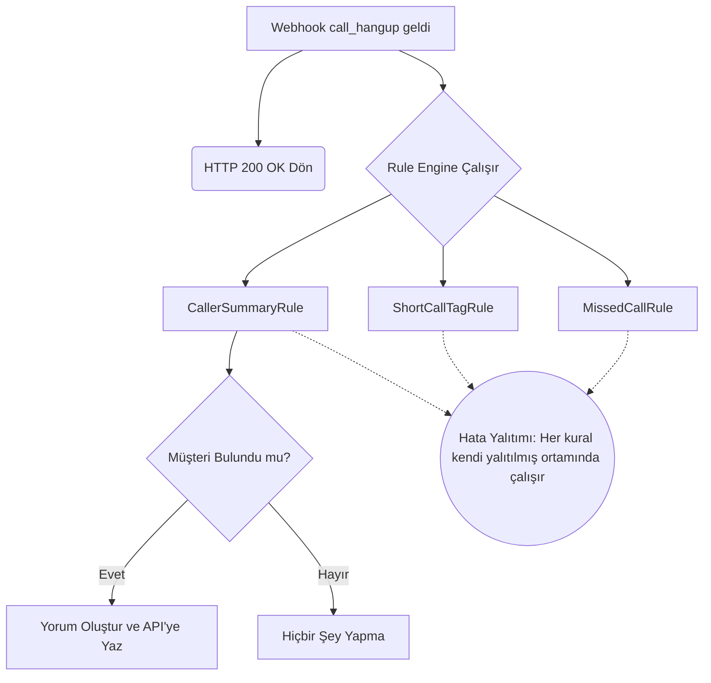

## Genel bakış

Ajanlarınız bir çağrıyı cevapladığında müşterinin kim olduğunu, açık siparişlerini veya güncel bakiyesini bilmeleri çağrı süresini kısaltır. Hipcall, her çağrı kaydına yorum eklenmesine olanak tanır. 

Webhook üzerinden gelen çağrıları kendi CRM veritabanınızla eşleştirip, arayanın özetini çağrı geçmişine bir yorum şeklinde yazdırın.

## Başlamadan önce

- Çağrı yorumlarını yazabilmek için yetkilendirilmiş bir Hipcall API anahtarı edinin.
- Uygulamanızın gelen `call_hangup` veya `call_bridged` webhook olaylarını dinleyebildiğinden emin olun.
- CRM sisteminizin telefon numarası üzerinden arama yapmaya uygun bir servisi (veya JSON çıktısı) olmalıdır.

## Arayanı tanımanın 3 yolu

Gelen çağrıda muhatabın kim olduğunu bulmak için üç farklı yöntem bulunur:

1. **Webhook üzerinden gelen `contact_id`:** Kişi Hipcall sisteminde zaten kayıtlıysa çağrı olayı size `contact_id` ve `company_id` alanlarını dolu gönderir. Hipcall API'sinden bu ID'ye ait `external_id` (kendi sisteminizdeki ID) değerini çekerek CRM'inizde nokta atışı arama yapabilirsiniz. İlk bu yöntemi tercih edin.
2. **`GET /api/v3/lookup/by_phone` kullanımı:** Kişi çağrıda boş geliyorsa veya Hipcall'a güvenmeyip tüm numaraları sorgulamak istiyorsanız bu arama API'sini kullanabilirsiniz.
3. **Kendi CRM'inizde telefon araması (Fallback):** Webhook'ta yalnızca `caller_number` varsa (Örn: `+90555XXXXXXX`), kendi veritabanınızda numaradan arama yapabilirsiniz. Ancak webhook üzerinden numaralar her zaman **E.164 formatında** gelir. Eğer CRM'inizdeki numaralar `0555...` formatındaysa, veritabanına sorgu atmadan önce uygulamanızın (C# kodunuzun) numarayı normalize etmesi şarttır.

## Yorum API'si ve tuzakları

Hipcall yorum API'si sadece metin tabanlı çalışır. Tasarım kuralları:

- **HTML geçersizdir:** `<br>` veya `<b>` gibi etiketler düz metin olarak basılır. Görsellik için sadece **Markdown** (`**kalın**`, `*eğik*`) ve satır sonu (`\n`) karakterlerini kullanın.
- **Yorum kime zimmetlenir?** API'ye attığınız istek, kullanılan API anahtarının sahibine zimmetlenir. Ajanların gerçek notlarıyla karışmaması için yorumunuzun en başına her zaman belirgin bir başlık (Örn: `**CRM Özeti:**`) koyun.
- **Zaman damgası ekleyin:** Çağrı kayıtları yıllarca saklanır. Aylar sonra kaydı açan bir ajanın bakiye bilgisini güncel sanmaması için yoruma metinsel bir tarih (Örn: `📅 29.09.2026 itibarıyla`) ekleyin.
- **Hassas verilerden kaçının:** Yorumlar kalıcıdır. Kredi kartı, parolalar, TC kimlik veya sağlık verileri gibi hassas bilgileri çağrı geçmişine **asla** yazdırmayın.

## Özette neler olmalı?

Ajanın çağrıyı hızla yönetmesi için özette şu maddelere yer verin:

- **İsim ve Firma:** Ajanın müşteriye ismiyle hitap edebilmesi ve hesap bağlamını kurabilmesi için.
- **Açık Sipariş ve Destek Kaydı:** Müşterinin arama sebebi muhtemelen yoldaki siparişi veya devam eden şikayetidir. Ajan bunu önden bilirse müşteri derdini baştan anlatmak zorunda kalmaz.
- **Bakiye:** Satış veya destek verilmeden önce finansal durumun bilinmesi ticari riskleri azaltır.

**Kısa ve okunabilir tutun:** Yorumlar 3-5 satırı geçmemeli ve bir bakışta okunabilmelidir. 20 satırlık uzun metinler operasyon yoğunluğunda okunmaz.

**Bulunamayan müşteriler için yorum yazmayın:** Arayan numara CRM sisteminizde yoksa, çağrıya "Sistemde bulunamadı" gibi bir yorum atmayın. Bu tür bir not ajana hiçbir iş değeri sunmaz, sadece çağrı geçmişini kirletir. Yalnızca eyleme dönüştürülebilir bir bilgi varsa yorum atın.

## Adım 1: Etkinliği yakalama (Webhook)

Sisteminiz çağrı kapandığında `call_hangup` olayı alır. Aşağıdaki `curl` komutuyla, dışarıdan gelen (inbound) örnek bir olay gövdesini yerel sunucunuza göndererek uygulamanızı test edebilirsiniz:

```bash
curl -X POST http://localhost:5000/hipcall/events/whsec_live_xxxxxxxxxxxxxxxx \
  -H "Content-Type: application/json" \
  -d '{
  "data": {
    "credited": false,
    "team_touch_at": null,
    "first_touch_duration": 10,
    "contact_id": null,
    "callee_id": null,
    "answered_at": "2026-09-29T14:13:33Z",
    "voicemail_url": null,
    "caller_number": "+90850XXXXXXX",
    "missing_call_reason": null,
    "call_duration": 12,
    "callback_time": null,
    "call_flow": [
      {
        "action": "hangup",
        "detail": {
          "hangup_by": "contact"
        },
        "timestamp": 1790691215
      },
      {
        "action": "bridge",
        "detail": {
          "id": 4200,
          "type": "user"
        },
        "timestamp": 1790691205
      },
      {
        "action": "init",
        "detail": {
          "id": null,
          "type": "contact"
        },
        "timestamp": 1790691203
      }
    ],
    "direction": "inbound",
    "callee_number": "+90530XXXXXXX",
    "voicemail_id": null,
    "callback_user_id": null,
    "callee_type": "contact",
    "ended_at": "2026-09-29T14:13:35Z",
    "missing_call": false,
    "channel_type": "number",
    "callback_cdr_uuid": null,
    "voicemail_type": null,
    "caller_id": 4200,
    "started_at": "2026-09-29T14:13:23Z",
    "bridged_at": "2026-09-29T14:13:33Z",
    "channel_id": 942,
    "caller_type": "user",
    "user_id": 4200,
    "hangup_by": "contact",
    "uuid": "410c92c5-...masked...",
    "record_url": "https://storage.hipcall.com.tr/recordings/...masked...",
    "number_id": 942,
    "company_id": 80719
  },
  "event": "call_hangup"
}'
```

## Adım 2: Yoruma veri yazma

CRM'den müşteriyi bulduktan sonra, çağrının `uuid` değerini kullanarak `POST /api/v3/calls/{call_id}/comments` endpoint'ine isteği atın.

```csharp
var apiToken = Environment.GetEnvironmentVariable("HIPCALL_API_TOKEN") 
    ?? throw new InvalidOperationException("HIPCALL_API_TOKEN ortam değişkeni bulunamadı.");

client.DefaultRequestHeaders.Authorization = new System.Net.Http.Headers.AuthenticationHeaderValue("Bearer", apiToken);

var commentBody = new { content = "**CRM Özeti:**\n\nAhmet Y. - XYZ Ltd." };
var jsonContent = new StringContent(JsonSerializer.Serialize(commentBody), Encoding.UTF8, "application/json");

var response = await client.PostAsync($"calls/{callUuid}/comments", jsonContent);
```

İstek başarılı olduğunda API size oluşturan kişinin ve yorumun id bilgisini döner (`200 OK` veya `201 Created`):

```json
{
  "data": {
    "id": 122409,
    "user": {
      "id": 4200,
      "email": "agent@example.com",
      "full_name": "Ajan Adi",
      "first_name": "Ajan",
      "last_name": "Adi"
    },
    "content": "**CRM Özeti:**\n\nAhmet Y. - XYZ Ltd."
  }
}
```

## Kural motoru ve yalıtım

Farklı iş kurallarınız (Cevapsız çağrıyı SMS atma, kısa çağrıyı etiketleme, özet ekleme) aynı webhook (Örn: `call_hangup`) üzerinde çalışabilir. Aşağıdaki şema, 3 farklı kuralın aynı webhook üzerinde nasıl birbirinden bağımsız ve asenkron çalıştığını göstermektedir.



Bir kuralın çökmesi (Örn: SMS servisinin yanıt vermemesi), diğer kuralların çalışmasını engellememelidir. Kuralları asenkron bir döngüde `try-catch` bloklarıyla yalıtın.

```csharp
// RuleEngine.cs
public async Task ProcessPayloadAsync(WebhookPayload payload, CancellationToken ct = default)
{
    foreach (var rule in _rules)
    {
        if (rule.Matches(payload))
        {
            try
            {
                await rule.ExecuteAsync(payload, ct);
            }
            catch (Exception ex)
            {
                // Bir kural çökse bile döngü diğerleriyle devam eder
                _logger.LogError(ex, "Kural başarısız oldu: {RuleName}", rule.RuleName);
            }
        }
    }
}
```
## C# uygulama kodları

Uygulamanızın ana yapı taşları aşağıdadır. Mock bir JSON dosyasından CRM verisini alıp, yorumu oluşturan örnek bir kural içerir.

**1. Mock CRM Verisi (`customers.json`)**

```json
[
  {
    "Phone": "+90555XXXXXXX",
    "FirstName": "Ahmet",
    "LastName": "Y.",
    "Company": "XYZ Ltd",
    "OpenOrders": 1,
    "OpenTickets": 0,
    "Balance": 1250.50
  }
]
```

**2. Hipcall API İstemcisi (`HipcallApiClient.cs`)**

```csharp
public async Task<bool> WriteCommentAsync(string callUuid, string content, CancellationToken ct = default)
{
    var body = new { content };
    var jsonContent = new StringContent(JsonSerializer.Serialize(body), Encoding.UTF8, "application/json");

    var response = await _http.PostAsync($"calls/{callUuid}/comments", jsonContent, ct);
    
    if (response.IsSuccessStatusCode)
    {
        return true;
    }

    var errorBody = await response.Content.ReadAsStringAsync(ct);
    _logger.LogError("Yorum yazılamadı: {Status} - {Body}", (int)response.StatusCode, errorBody);
    
    return false;
}
```

**3. Özet Kuralı Sınıfı (`CallerSummaryRule.cs`)**

```csharp
using System;
using System.Text;
using System.Threading;
using System.Threading.Tasks;
using Microsoft.Extensions.Logging;

public sealed class CallerSummaryRule : IPostCallRule
{
    public string RuleName => "CallerSummaryRule";

    private readonly HipcallApiClient _api;
    private readonly LocalCrmService _crm;
    private readonly ILogger<CallerSummaryRule> _logger;

    public CallerSummaryRule(HipcallApiClient api, LocalCrmService crm, ILogger<CallerSummaryRule> logger)
    {
        _api = api;
        _crm = crm;
        _logger = logger;
    }

    public bool Matches(WebhookPayload payload)
    {
        if (payload.Data == null) return false;
        if (payload.Event != "call_hangup") return false;
        if (!payload.Data.IsInbound) return false;

        return true;
    }

    public async Task ExecuteAsync(WebhookPayload payload, CancellationToken ct = default)
    {
        var call = payload.Data!;
        CrmCustomer? customer = null;

        if (!string.IsNullOrEmpty(call.CallerNumber))
        {
            customer = _crm.FindByPhone(call.CallerNumber);
        }

        if (customer == null)
        {
            _logger.LogInformation("Müşteri CRM'de bulunamadı, yorum atlanıyor.");
            return;
        }

        var summary = BuildSummary(customer);

        await _api.WriteCommentAsync(call.Uuid, summary, ct);
        _logger.LogInformation("Özet yazıldı — UUID: {Uuid}", call.Uuid);
    }

    private static string BuildSummary(CrmCustomer customer)
    {
        var sb = new StringBuilder();
        sb.AppendLine("**CRM Özeti:**\n");
        sb.AppendLine($"- **Müşteri:** {customer.FirstName} {customer.LastName}");
        
        if (!string.IsNullOrEmpty(customer.Company))
            sb.AppendLine($"- **Firma:** {customer.Company}");
            
        sb.AppendLine($"- **Açık Sipariş:** {customer.OpenOrders}");
        sb.AppendLine($"- **Açık Destek Kaydı:** {customer.OpenTickets}");
        
        var dateStr = DateTime.UtcNow.ToString("dd.MM.yyyy HH:mm");
        sb.AppendLine($"- **Bakiye:** {customer.Balance} TL (📅 {dateStr} itibarıyla)");

        return sb.ToString();
    }
}
```

## Hata aldığınızda

**404 Not Found**

```json
{
  "errors": {
    "detail": "Not Found"
  }
}
```
Geçersiz veya silinmiş bir çağrı UUID değeri gönderdiniz. URL yolunda gönderdiğiniz UUID formatını kontrol edin.

**422 Unprocessable Entity**

```json
{
  "errors": {
    "content": [
      "Shorter than minimum length 1."
    ]
  }
}
```
Yorum gövdesi (content alanı) boş bırakılmış veya gönderilmemiş. JSON gövdesini doğru oluşturduğunuzdan emin olun.

## Parametre listesi

| Parametre | Tip | Zorunlu | Açıklama |
|---|---|---|---|
| `content` | string | evet | Eklenecek yorumun metni. Yalnızca Markdown formatını ve satır sonlarını (\n) destekler. HTML desteklenmez. |

## Sonraki adımlar

Tebrikler, çağrı merkezinizi bir CRM ile tam entegre ettiniz! Artık kısa çağrıları etiketleyebilir, cevapsız çağrıları takip edebilir ve çağrıları özetleyebilirsiniz. Daha fazla entegrasyon fikri için [Hipcall API Dokümantasyonunu](https://developer.hipcall.com) inceleyin.
