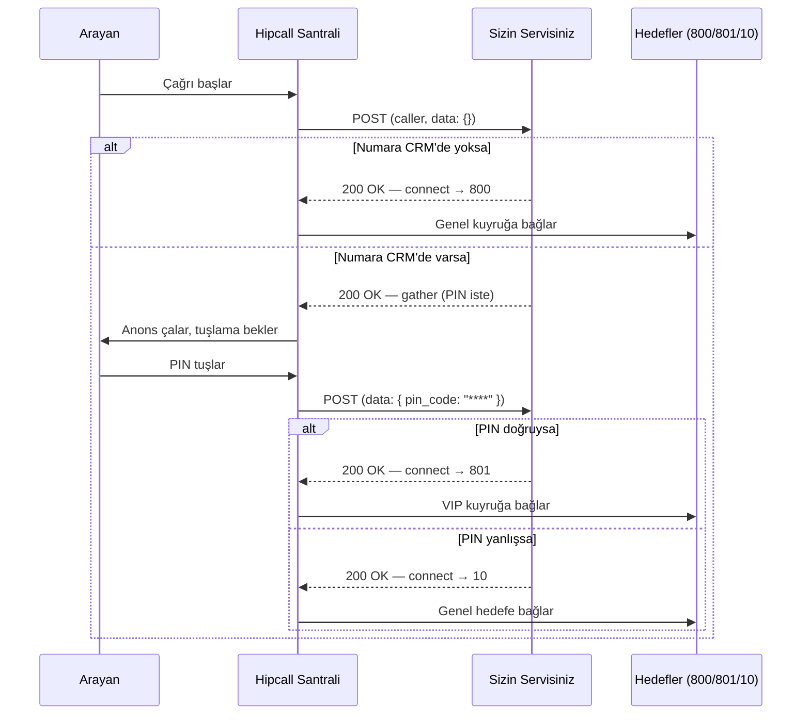

## Genel bakış

Standart santral menüleri sabit kurallara göre çalışır: "1'e basın satış, 2'ye basın destek" gibi. Arayanın kim olduğuna veya CRM'deki durumuna göre çağrıyı farklı kuyruklara yönlendirmek istediğinizde bu menüler yetersiz kalır.

Hipcall'ın External Management özelliği, gelen her çağrıda sizin web servisinize bir POST isteği atar. Servisiniz arayanı tanır, gerekirse PIN sorar ve çağrıyı istediğiniz hedefe yönlendirir. Santral akışının tüm kontrolü sizin kodunuzdadır.

## Başlamadan önce

- Hipcall panelinde **Ayarlar > Geliştirici > Harici yönetimler** menüsüne gidin ve yeni bir kayıt oluşturun. Sizden bir ad, dahili numara, webhook URL'si ve varsayılan hedef (servisiniz yanıt vermezse çağrının düşeceği yer) istenecektir.
- Servisiniz internet üzerinden erişilebilir olmalıdır. Geliştirme aşamasında ngrok veya benzeri bir tünel aracı kullanabilirsiniz.
- İsteğe bağlı olarak **Webservis kimlik doğrulama** seçeneğini işaretleyerek Basic Auth etkinleştirebilirsiniz. Bu durumda Hipcall, isteklerini `Authorization: Basic <Base64>` başlığı ile gönderir.
- Kaydı oluşturduktan sonra **Ayarlar > Telefon sistemi > Telefon numaraları** menüsünden test edeceğiniz numaranın **Mesai içi hedef** alanına bu kaydı atayın.
- Geliştirme sırasında hata ayıklamak için paneldeki harici yönetim kaydınızın **Kayıtlar** sekmesinden "Hata Ayıklama Modu"nu açın. Bu mod en fazla 2 saat aktif kalır ve süre dolunca logları siler.

## External Management nasıl çalışır?

Bir çağrı geldiğinde Hipcall santralinin servisinizle konuşma şekli şu adımları izler:



Servisiniz her zaman HTTP `200 OK` döner. Çağrının nereye gideceğini JSON gövdesindeki aksiyonlar belirler, HTTP durum kodu değil.

## Adım 1: Gelen isteği anlama

Hipcall, servisinize her çağrı adımında aşağıdaki yapıda bir POST isteği gönderir:

```json
{
  "caller": "+90551XXXXXXX",
  "callee": "90850XXXXXXX",
  "uuid": "beee****-****-****-****-********f3c",
  "direction": "inbound",
  "external_manager_id": 99,
  "call_flow": [
    {
      "action": "init",
      "detail": {
        "id": 99,
        "type": "external_manager"
      },
      "timestamp": 1790789254
    }
  ],
  "data": {}
}
```

İlk istekte `data` nesnesi boştur. Servisiniz bir `gather` aksiyonu döndürüp tuşlama istediğinde, Hipcall ikinci istekte tuşlanan değeri `data` içinde geri gönderir:

```json
{
  "caller": "+90551XXXXXXX",
  "callee": "90850XXXXXXX",
  "uuid": "efa3****-****-****-****-********bd98",
  "direction": "inbound",
  "external_manager_id": 99,
  "call_flow": [
    {
      "action": "init",
      "detail": {
        "id": 99,
        "type": "external_manager"
      },
      "timestamp": 1790789779
    }
  ],
  "data": {
    "pin_code": "****"
  }
}
```

### İstek alanları

| Alan | Tip | Açıklama |
|---|---|---|
| `caller` | string | Arayanın numarası (E.164 formatında). |
| `callee` | string | Aranan Hipcall numarası. |
| `uuid` | string | Çağrıyı benzersiz kılan kimlik. |
| `direction` | string | Çağrının yönü. Gelen çağrılar için `inbound`. |
| `external_manager_id` | integer | Tetiklenen harici yönetim kaydının ID'si. |
| `call_flow` | array | Çağrının o anki adımını belirten dizi. |
| `data` | object | Bağlam verileri. İlk istekte boş, `gather` sonrası tuşlanan değeri içerir. |

## Adım 2: Cevap sözleşmesini öğrenme

Servisinizden dönen JSON'un en dışında `"version": "1"` bulunması ve aksiyonların `"seq"` dizisi içinde iletilmesi zorunludur.

### Hedefe bağlama (connect)

Çağrıyı bir dahili numaraya yönlendirmek için `connect` aksiyonunu kullanın. `destination` alanına paneldeki dahili numarayı yazın (ID değil, numara):

```json
{
  "seq": [
    {
      "action": "connect",
      "args": {
        "destination": "800"
      }
    }
  ],
  "version": "1"
}
```

### Tuşlama isteme (gather)

Arayana bir ses dosyası çalıp tuşlama beklemek için `gather` aksiyonunu kullanın. `variable_name` alanı, tuşlanan değerin `data` nesnesinde hangi anahtar altında döneceğini belirler:

```json
{
  "seq": [
    {
      "action": "gather",
      "args": {
        "ask": "https://storage.hipcall.com.tr/audio/tr/8000/ivr/ivr-please_enter_pin_followed_by_pound.wav",
        "max_digits": 4,
        "min_digits": 1,
        "variable_name": "pin_code"
      }
    }
  ],
  "version": "1"
}
```

### Sıralı aksiyonlar

`seq` dizisine birden fazla aksiyon ekleyerek bunları sırayla çalıştırabilirsiniz. Örneğin önce bir bekleme anonsu çalıp ardından çağrıyı bağlamak:

```json
{
  "seq": [
    {
      "action": "play",
      "args": {
        "url": "https://storage.hipcall.com.tr/audio/tr/8000/ivr/ivr-please_hold_while_party_contacted.wav"
      }
    },
    {
      "action": "connect",
      "args": {
        "destination": "800"
      }
    }
  ],
  "version": "1"
}
```

## Adım 3: CRM verisini hazırlama

Servisiniz arayanı tanımak için bir veri kaynağına ihtiyaç duyar. Bu örnekte yerel bir JSON dosyası (`crm.json`) kullanılmaktadır. Üretim ortamında bu veri bir veritabanından veya CRM API'sinden gelecektir.

```json
[
  {
    "external_id": "CRM-2",
    "phone": "+90555XXXXXXX",
    "first_name": "Ali",
    "last_name": "Y.",
    "company": "Örnek A.Ş.",
    "balance": 0.0,
    "open_orders": 0,
    "open_tickets": 2,
    "pin": "0000"
  },
  {
    "external_id": "CRM-3",
    "phone": "+90532XXXXXXX",
    "first_name": "Ayşe",
    "last_name": "K.",
    "company": "Demo Ltd.",
    "balance": 340.50,
    "open_orders": 3,
    "open_tickets": 1,
    "pin": "1111"
  }
]
```

## Adım 4: Servisi yazma

Aşağıdaki ASP.NET Core Minimal API uygulaması, gelen çağrıyı CRM verisine göre değerlendirir ve üç senaryoyu yönetir:

1. **Numara CRM'de yok:** Çağrı genel kuyruğa (800) bağlanır.
2. **Numara CRM'de var, PIN doğru:** Çağrı VIP kuyruğa (801) bağlanır.
3. **Numara CRM'de var, PIN yanlış:** Çağrı genel hedefe (10) bağlanır.

```csharp
using Microsoft.AspNetCore.Mvc;
using System.Text.Json;
using System.Text.Json.Serialization;

var builder = WebApplication.CreateBuilder(args);
var app = builder.Build();

var crmFilePath = Path.Combine(builder.Environment.ContentRootPath, "crm.json");
List<CrmRecord> crmData = new();

try
{
    if (File.Exists(crmFilePath))
    {
        var json = File.ReadAllText(crmFilePath);
        crmData = JsonSerializer.Deserialize<List<CrmRecord>>(json,
            new JsonSerializerOptions { PropertyNameCaseInsensitive = true }) ?? new List<CrmRecord>();
        Console.WriteLine($"{crmData.Count} adet müşteri kaydı yüklendi.");
    }
    else
    {
        Console.WriteLine("Uyarı: crm.json dosyası bulunamadı!");
    }
}
catch (Exception ex)
{
    Console.WriteLine($"Hata: crm.json yüklenirken bir sorun oluştu: {ex.Message}");
}

app.MapPost("/hipcall/external-management", async (HttpContext context) =>
{
    try
    {
        using var reader = new StreamReader(context.Request.Body);
        var body = await reader.ReadToEndAsync();

        Console.WriteLine($"\n--- GELEN ISTEK ---");
        Console.WriteLine(body);

        var options = new JsonSerializerOptions { PropertyNameCaseInsensitive = true };
        var request = JsonSerializer.Deserialize<HipcallRequest>(body, options);

        if (request == null || string.IsNullOrEmpty(request.Caller))
        {
            Console.WriteLine("Geçersiz istek veya arayan numarası eksik.");
            return GetConnectResponse("800");
        }

        CrmRecord? customer = null;

        if (!string.IsNullOrEmpty(request.ContactExternalId))
        {
            customer = crmData.FirstOrDefault(c => c.ExternalId == request.ContactExternalId);
        }

        if (customer == null)
        {
            customer = crmData.FirstOrDefault(c => c.Phone == request.Caller);
        }

        if (customer == null)
        {
            Console.WriteLine("Müşteri bulunamadı. Genel kuyruğa (800) yönlendiriliyor.");
            return GetConnectResponse("800");
        }

        string? pinCode = null;
        if (request.Data.ValueKind == JsonValueKind.Object)
        {
            if (request.Data.TryGetProperty("pin_code", out var pinElement))
            {
                pinCode = pinElement.GetString();
            }
        }

        if (string.IsNullOrEmpty(pinCode))
        {
            Console.WriteLine($"Müşteri bulundu ({customer.FirstName} {customer.LastName}). PIN girmesi isteniyor.");
            return GetGatherResponse(
                "https://s3.amazonaws.com/freecodecamp/simonSound1.mp3",
                "pin_code");
        }
        else
        {
            if (pinCode == customer.Pin)
            {
                Console.WriteLine("PIN doğru girildi. VIP kuyruğa (801) yönlendiriliyor.");
                return GetConnectResponse("801");
            }
            else
            {
                Console.WriteLine("PIN yanlış girildi. Genel hedefe (10) yönlendiriliyor.");
                return GetConnectResponse("10");
            }
        }
    }
    catch (Exception ex)
    {
        Console.WriteLine($"İstek işlenirken hata oluştu: {ex.Message}");
        return GetConnectResponse("800");
    }
});

IResult GetConnectResponse(string destination)
{
    var response = new HipcallResponse
    {
        Seq = new List<object>
        {
            new
            {
                action = "connect",
                args = new { destination = destination }
            }
        },
        Version = "1"
    };

    Console.WriteLine("--- GIDEN CEVAP (Connect) ---");
    Console.WriteLine(JsonSerializer.Serialize(response));
    return Results.Json(response);
}

IResult GetGatherResponse(string askUrl, string variableName)
{
    var response = new HipcallResponse
    {
        Seq = new List<object>
        {
            new
            {
                action = "gather",
                args = new
                {
                    ask = askUrl,
                    max_digits = 4,
                    min_digits = 1,
                    variable_name = variableName
                }
            }
        },
        Version = "1"
    };

    Console.WriteLine("--- GIDEN CEVAP (Gather) ---");
    Console.WriteLine(JsonSerializer.Serialize(response));
    return Results.Json(response);
}

app.Run();

public record CrmRecord(
    [property: JsonPropertyName("external_id")] string ExternalId,
    [property: JsonPropertyName("phone")] string Phone,
    [property: JsonPropertyName("first_name")] string FirstName,
    [property: JsonPropertyName("last_name")] string LastName,
    [property: JsonPropertyName("company")] string Company,
    [property: JsonPropertyName("balance")] decimal Balance,
    [property: JsonPropertyName("open_orders")] int OpenOrders,
    [property: JsonPropertyName("open_tickets")] int OpenTickets,
    [property: JsonPropertyName("pin")] string Pin
);

public record HipcallRequest(
    [property: JsonPropertyName("caller")] string Caller,
    [property: JsonPropertyName("callee")] string Callee,
    [property: JsonPropertyName("uuid")] string Uuid,
    [property: JsonPropertyName("direction")] string Direction,
    [property: JsonPropertyName("external_manager_id")] int ExternalManagerId,
    [property: JsonPropertyName("contact_external_id")] string? ContactExternalId,
    [property: JsonPropertyName("data")] JsonElement Data
);

public record HipcallResponse
{
    [JsonPropertyName("seq")]
    public List<object> Seq { get; init; } = new();

    [JsonPropertyName("version")]
    public string Version { get; init; } = "1";
}
```

Uygulamayı test etmek için aşağıdaki `curl` komutuyla CRM'de bulunan bir arayanın ilk çağrı isteğini simüle edebilirsiniz:

```bash
curl -X POST http://localhost:5262/hipcall/external-management \
  -H "Content-Type: application/json" \
  -d '{
  "caller": "+90551XXXXXXX",
  "callee": "90850XXXXXXX",
  "uuid": "beee****-****-****-****-********f3c",
  "direction": "inbound",
  "external_manager_id": 99,
  "call_flow": [
    {
      "action": "init",
      "detail": {
        "id": 99,
        "type": "external_manager"
      },
      "timestamp": 1790789254
    }
  ],
  "data": {}
}'
```

PIN tuşlandıktan sonra Hipcall'ın göndereceği ikinci isteği simüle etmek için:

```bash
curl -X POST http://localhost:5262/hipcall/external-management \
  -H "Content-Type: application/json" \
  -d '{
  "caller": "+90551XXXXXXX",
  "callee": "90850XXXXXXX",
  "uuid": "efa3****-****-****-****-********bd98",
  "direction": "inbound",
  "external_manager_id": 99,
  "call_flow": [
    {
      "action": "init",
      "detail": {
        "id": 99,
        "type": "external_manager"
      },
      "timestamp": 1790789779
    }
  ],
  "data": {
    "pin_code": "9999"
  }
}'
```

## Güvenlik ağı: Servis çökerse ne olur?

Hipcall, servisinizle iletişim kurarken her zaman bir güvenlik ağı sağlar. Bu davranışları bilmek hata ayıklamada zaman kazandırır.

### Zaman aşımı

Servisiniz 15 saniye içinde yanıt vermezse Hipcall çağrıyı "Varsayılan hedef" olarak ayarladığınız kuyruğa yönlendirir. Arayan bu süre boyunca standart telefon çalma sesi duyar.

### Sunucu hatası (5xx)

Servisiniz `500 Internal Server Error` döndüğünde Hipcall çağrıyı düşürmez. Çağrıyı varsayılan hedefe bağlar ve paneldeki loglara hatayı kaydeder.

### Geçersiz JSON

Servisiniz `200 OK` döndürse bile JSON gövdesi boş (`{}`), `seq` yerine farklı bir anahtar içeriyorsa veya yapısal olarak bozuksa Hipcall bunu işleyemez. Paneldeki loglarda `422 Unprocessable Entity` ve `Invalid payload format` hatası görünür. Çağrı yine varsayılan hedefe aktarılır.

## Hata aldığınızda

**422 Unprocessable Entity — Invalid payload format**

```json
{
  "errors": {
    "detail": "Invalid payload format"
  }
}
```
Servisinizin döndüğü JSON'da `seq` dizisi veya `version` alanı eksik ya da yanlış adlandırılmış. Cevap JSON'unuzun `{"seq": [...], "version": "1"}` yapısına uyduğunu kontrol edin.

**Zaman aşımı (Timeout)**

Hipcall 15 saniye boyunca yanıt alamazsa çağrıyı varsayılan hedefe yönlendirir. Paneldeki loglarda zaman aşımı kaydı düşer. Servisinizin yanıt süresini kontrol edin; dış servis çağrıları (veritabanı, CRM API) varsa bunları asenkron ve zaman sınırlı tutun.

**Boş gather döngüsü**

`gather` aksiyonundaki `ask` URL'si erişilemez bir ses dosyasına işaret ediyorsa Hipcall anonsu çalamadan boş bir `data` ile geri döner. Kodunuz PIN'in boş geldiğini görüp tekrar `gather` komutu gönderirse bu döngü saniyede defalarca tekrarlanır. `ask` alanındaki ses dosyasının erişilebilir olduğundan ve 404 dönmediğinden emin olun.

## Parametre listesi

### İstek parametreleri (Hipcall → Servis)

| Parametre | Tip | Açıklama |
|---|---|---|
| `caller` | string | Arayanın numarası (E.164). |
| `callee` | string | Aranan Hipcall numarası. |
| `uuid` | string | Çağrının benzersiz kimliği. |
| `direction` | string | Çağrı yönü (`inbound`). |
| `external_manager_id` | integer | Harici yönetim kaydının ID'si. |
| `call_flow` | array | Çağrının o anki adım bilgisi. |
| `data` | object | Tuşlama ve bağlam verileri. |

### Cevap parametreleri (Servis → Hipcall)

| Parametre | Tip | Zorunlu | Açıklama |
|---|---|---|---|
| `version` | string | evet | Sözleşme sürümü. Her zaman `"1"`. |
| `seq` | array | evet | Aksiyonlar dizisi. Sırayla çalıştırılır. |
| `seq[].action` | string | evet | Aksiyon tipi: `connect`, `gather` veya `play`. |
| `seq[].args.destination` | string | connect için evet | Hedef dahili numara. |
| `seq[].args.ask` | string | gather için evet | Çalınacak ses dosyasının URL'si. |
| `seq[].args.variable_name` | string | gather için evet | Tuşlanan değerin `data` içindeki anahtar adı. |
| `seq[].args.max_digits` | integer | hayır | Kabul edilecek en fazla hane sayısı. |
| `seq[].args.min_digits` | integer | hayır | Kabul edilecek en az hane sayısı. |

## Sonraki adımlar

- Farklı müşteri segmentlerine göre (bakiye, açık destek kaydı sayısı, VIP durumu) çağrıları özel kuyruklara yönlendirin.
- `gather` aksiyonunu kullanarak müşterilerden sipariş numarası veya hesap kodu girişi isteyin ve bu bilgiyi ajan ekranındaki Insight Card'a yansıtın.
- Daha fazla entegrasyon fikri için [Hipcall API Dokümantasyonunu](https://www.hipcall.com/tr/developers/) inceleyin.
