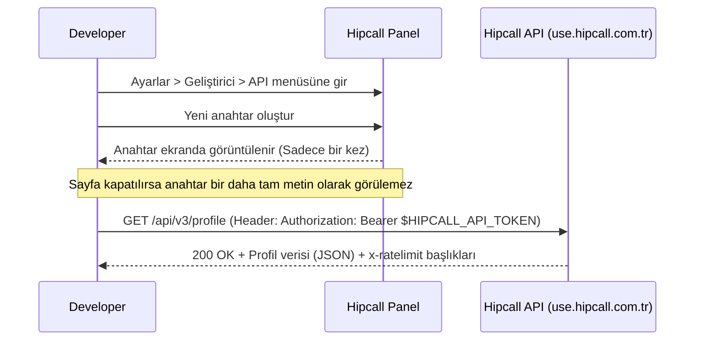

# Ödev 01: API Anahtarı ve İlk İstek - Çalışma Notları

## Bölüm A — Keşif (DEMO Ortamı Bulguları)

**1. Menü Adımları ve URL'ler**
* **Sisteme Giriş:** `https://use.hipcall.com.tr/`
* **Ana Menü Yolu:** Ayarlar > Geliştirici (`https://use.hipcall.com.tr/portal/settings/?section=developer`)
* **API Sekmesi:** Ayarlar > Geliştirici > API (`https://use.hipcall.com.tr/portal/settings/developer/api-tokens/`)
* **Oluşturma İşlemi:** "Yeni" butonu (`https://use.hipcall.com.tr/portal/settings/developer/api-tokens/new/`)

**2. Zorunlu ve Opsiyonel Alanlar**
* API anahtarı oluşturulurken "Ad" ve "Son geçerlilik tarihi" alanları istenmektedir. 
* Opsiyonel alan bulunmamaktadır; her iki alan da zorunludur. Alanlar boş bırakıldığında işleme devam edilemez.
* **Süre Kuralı:** Sistem varsayılan olarak 1 yıllık geçerlilik süresi atamaktadır. Maksimum 3 yıla kadar seçim yapılabilir. 3 yıldan daha ileri bir tarih seçilmek istendiğinde, sistem tarihi otomatik olarak 1 yıla çekmektedir.

**3. Kayıt Sonrası Görünürlük**
* Anahtar oluşturulduktan sonra ekranda anahtar kodu, "Tamam" butonu ve şu uyarı metni yer alır:
  > "Lütfen bu gizli anahtarı güvenli ve erişilebilir bir yere saklayın. Güvenlik nedeniyle bunu Hipcall hesabınız üzerinden tekrar görüntüleyemeyeceksiniz. Bu gizli anahtarı kaybederseniz yeni bir tane oluşturmanız gerekecektir."
* İlgili sayfa kapatıldıktan sonra API anahtarının tam hâli bir daha görüntülenemez. Liste ekranında anahtarın tam metni yerine maskelenmiş bir versiyonu yer alır.

**4. Anahtar Silme İşlemi**
* **İzlenen Yol:** Ayarlar > Geliştirici > API > [Token Adı] > Sil
* Silme işlemi başlatıldığında sistem şu uyarı gösterir:
  > "Bu API gizli anahtarı hemen silinecek. Bu anahtar kullanılarak yapılan API istekleri reddedilecek ve bu durum, hâlâ ona bağlı olan sistemlerin bozulmasına neden olabilir. İptal edildikten sonra artık bu API anahtarını görüntüleyemeyecek veya değiştiremeyeceksiniz."
* Ekranda anahtarın adı, son 4 hanesi ile "Sil" ve "İptal" butonları görünür. İşlem onaylandığında anahtar anında iptal edilir.

**5. Yetki Kısıtlamaları**
* "Yönetici" ve "Kurucu" rollerine sahip kullanıcılar "Ayarlar > Geliştirici" menüsüne ve API ayarlarına tam erişim sağlayabilir.
* "Standart" ve "Yetkili" rollerindeki kullanıcıların bu menüye erişim izni yoktur; menü ilgili kullanıcıların ekranında görüntülenmez.

## Bölüm B — Doğrulama (curl ile, ölçerek)

### B1. Doğru adresi bul

Referansta belirtilen adresler test edildi:

**Deneme 1 (`api.hipcall.com`):**
```bash
curl -sS -i https://api.hipcall.com/api/v3/profile
```
**Çıktı:**
```text
curl: (6) Could not resolve host: api.hipcall.com
```

**Deneme 2 (`use.hipcall.com`):**
```bash
curl -sS -i https://use.hipcall.com/api/v3/profile
```
**Çıktı:**
```text
HTTP/1.1 401 Unauthorized
Alt-Svc: h3=":443"; ma=2592000
Cache-Control: max-age=0, private, must-revalidate
Content-Length: 96
Content-Type: application/json; charset=utf-8
Date: Wed, 16 Sep 2026 09:38:50 GMT
Server: Caddy
Server: Cowboy
Strict-Transport-Security: max-age=63072000; includeSubDomains; preload
X-Content-Type-Options: nosniff
X-Frame-Options: SAMEORIGIN
X-Request-Id: GNXDov6PAKEhxZUAAKKC
X-Xss-Protection: 1; mode=block

{"errors":{"detail":"Authentication required. Provide either OAuth Bearer token or API token."}}
```

**Doğru Adres:** Türkiye lokasyonlu DEMO hesapları için uç nokta adresi `https://use.hipcall.com.tr/api/v3/profile` olarak tespit edilmiştir.

### B2. Anahtarsız istek
```bash
curl -sS -i https://use.hipcall.com.tr/api/v3/profile
```
**Çıktı Özeti:**
* **HTTP Durum Kodu:** 401 Unauthorized
* **Cevap Gövdesi:**
```json
{"errors":{"detail":"Authentication required. Provide either OAuth Bearer token or API token."}}
```

### B3. Bozuk anahtarla istek
```bash
curl -sS -i -H "Authorization: Bearer bu-anahtar-sahte" https://use.hipcall.com.tr/api/v3/profile
```
**Çıktı Özeti:**
* **HTTP Durum Kodu:** 401 Unauthorized
* **Cevap Gövdesi (B2'den farklı):**
```json
{"errors":{"detail":"Not authorized. Check your API token is valid and not expired."}}
```

### B4. Doğru anahtarla istek
```bash
curl -sS -i -H "Authorization: Bearer $HIPCALL_API_TOKEN" https://use.hipcall.com.tr/api/v3/profile
```
**Çıktı Özeti:**
* **HTTP Durum Kodu:** 200 OK
* **Dönen Alanlar:** `data` objesi altında; `user`, `permissions`, `capabilities`, `account`, `roles` ve `subscription` alanları dönmektedir.

**Tam Cevap Gövdesi (Maskelenmiş):**
```json
{"data":{"user":{"id":4200,"owner":true,"suspended":false,"state":"available","title":null,"email":"ornek@firma.com","locale":"tr_TR","timezone":"Europe/Istanbul","created_at":"2026-07-21T10:55:30","full_name":"Ahmet Y.","numbers":[{"id":939,"name":"Alt yönetici","number":"+90850XXXXXXX","country":"TR"},{"id":938,"name":"Üst yönetici","number":"+90850XXXXXXX","country":"TR"}],"default_number":{"id":938,"name":"Üst yönetici","number":"+90850XXXXXXX","country":"TR"},"first_name":"Ahmet","last_logged_in":"2026-09-15T13:10:07","last_name":"Y.","phone_countries":["AR","AU","BR","CA","CN","FR","DE","IN","ID","IT","JP","MX","RU","SA","ZA","TR","GB","US","KR"],"phone_prefix":"TR","avatar_url":null},"permissions":[],"capabilities":{"cdr":{"label_feature":true,"note_feature":true},"features":{"api":true,"ticket":true,"webhook":true,"deal":true,"automation":true,"smartbcc":true},"contact_center":{"label_feature":true,"note_feature":true}},"account":{"id":1412,"name":"Demo","status":"active","options":{"auto_available_on_login":false,"auto_away_on_logout":false},"locale":"tr_TR","timezone":"Europe/Istanbul","created_at":"2026-07-21T10:55:30","contact_center":{"b2b":true},"limits":{"max_channel":5},"slug":null},"roles":[],"subscription":{"id":1189,"starts_at":"2026-07-21T23:59:59","canceled_at":null,"ends_at":"2027-07-21T23:59:59","limit_cdr_call_history_mounth_count":3,"limit_phone_number_count":5,"limit_phone_simultaneous_call_count":30,"limit_user_count":50,"trial_ends_at":"2026-07-21T23:59:59","plan_name":null}}}
```

### B5. Anahtarın biçimi
* Ekrandan kopyalanan anahtar doğrudan isteğe eklendiğinde API `200 OK` yanıtını vermekte ve sorunsuz çalışmaktadır.
* Kopyalanan anahtarın başına `SFMyNTY.` ön eki (prefix) manuel olarak eklendiğinde de API yine `200 OK` yanıtı vermektedir.
* **Sonuç:** Sistem her iki formatı da (ön ekli ve ön eksiz) geçerli kabul etmektedir.

### B6. Cevap başlıkları
Başarılı isteğin başlıklarında (Headers) limit bilgileri dönmektedir:
* `x-ratelimit-limit: 60` (Dakikada 60 isteğe izin var).
* `x-ratelimit-remaining: 59` (Kalan istek sayısı).
* `x-ratelimit-reset: 1789490696` (Limitin sıfırlanacağı zaman damgası).

---

## Bulgular
1. **API Adresi Uyuşmazlığı:** Resmi API referansında belirtilen `api.hipcall.com` ve `use.hipcall.com` adresleri Türkiye (DEMO) hesapları için geçersizdir. Doğru kök adres `use.hipcall.com.tr` olmalıdır.
2. **Anahtar Formatı Esnekliği:** Panelden alınan anahtarın tek bir doğru kullanım formatı yoktur. İstek atarken anahtarın saf hâli de, başına `SFMyNTY.` eklenmiş hâli de sistem tarafından yetkili kabul edilmektedir.

---

## İlk Başarılı İstek Akışı (Mermaid Diyagramı)

