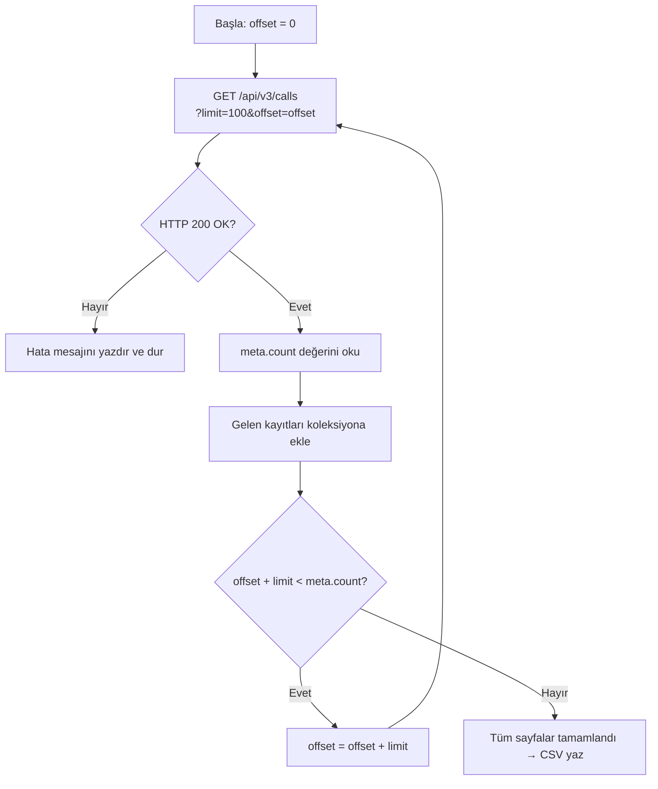

# Ödev 02: Listeleri Çekmek — Çalışma Notları

## Bölüm A — Sayfalama

### A1. Hiç parametre vermeden çağrı

**Komut:**

```bash
curl -X "GET" \
  "https://use.hipcall.com.tr/api/v3/calls" \
  -H "accept: application/json" \
  -H "Authorization: Bearer $HIPCALL_API_TOKEN"
```

**Çıktı:**

İstek herhangi bir sayfalama parametresi verilmeden gönderildiğinde varsayılan olarak 10 kayıt döndürmektedir. Cevabın en üst düzey yapısı bir JSON nesnesidir. Nesne içerisinde `data` ve `meta` alanları bulunmaktadır.

**Tam cevap gövdesi (telefon numaraları maskelenmiştir):**

```json
{
  "data": [
    {
      "caller_type": "user",
      "missing_call_reason": null,
      "first_touch_duration": 3,
      "ended_at": "2026-09-15T11:18:09Z",
      "uuid": "ff111433-dd1d-4d61-abd3-4b06fa9cd43f",
      "started_at": "2026-09-15T11:17:56Z",
      "user_id": 4200,
      "number_id": 938,
      "caller_id": 4200,
      "direction": "outbound",
      "voicemail_id": null,
      "answered_at": null,
      "company_id": null,
      "missing_call": false,
      "call_duration": 0,
      "callee_type": "contact",
      "callback_user_id": null,
      "callee_id": null,
      "voicemail_url": null,
      "callback_cdr_uuid": null,
      "bridged_at": "2026-09-15T11:17:59Z",
      "team_touch_at": null,
      "call_flow": [
        {
          "action": "hangup",
          "detail": {
            "hangup_by": "user"
          },
          "timestamp": 1789471089
        },
        {
          "action": "bridge",
          "detail": {
            "id": 4200,
            "type": "user"
          },
          "timestamp": 1789471079
        },
        {
          "action": "init",
          "detail": {
            "id": null,
            "type": "contact"
          },
          "timestamp": 1789471076
        }
      ],
      "callback_time": null,
      "callee_number": "+90XXXXXXXXXX",
      "voicemail_type": null,
      "channel_id": 938,
      "hangup_by": "user",
      "credited": false,
      "caller_number": "+90XXXXXXXXXX",
      "record_url": null,
      "channel_type": "number",
      "contact_id": null
    },
  ],
  "meta": {
    "count": 34,
    "offset": 0,
    "limit": 10
  }
}
```
Not: Dönen cevap gövdesi (data dizisi) çok uzun olduğu için okunabilirliği korumak adına sadece ilk çağrı kaydı örneği alınmış ve güvenlik amacıyla telefon numaraları maskelenmiştir.

---

### A2. `data` dışında ne var?

Cevapta `data` dışında `meta` nesnesi bulunmaktadır.

`meta` nesnesindeki alanlar:

| Alan | Açıklama |
|---|---|
| `count` | Sorguya ve uygulanan filtrelere uyan toplam kayıt sayısını belirtir. |
| `offset` | Listelemenin başlayacağı noktayı, yani kaç kaydın atlandığını belirtir. |
| `limit` | Tek bir istekte döndürülen kayıt sayısını belirtir. |

Bu çağrının cevabında `count` değeri `34`, `offset` değeri `0` ve `limit` değeri `10` olarak dönmüştür.

---

### A3. `limit` parametresinin üst sınırı

`limit` parametresinin üst sınırı **100** olarak tespit edilmiştir. `limit=101` gönderildiğinde API isteği reddetmektedir.

**Test komutu:**

```bash
curl -X "GET" \
  "https://use.hipcall.com.tr/api/v3/calls?limit=101" \
  -H "accept: application/json" \
  -H "Authorization: Bearer $HIPCALL_API_TOKEN"
```

**Çıktı:**

```json
{
  "errors": {
    "limit": [
      "101 is larger than inclusive maximum 100"
    ]
  }
}
```

API, sınırı aşan değeri 100'e kırpmak yerine isteği hata ile reddetmektedir.

---

### A4. `limit=0` ve `limit=-5`

**`limit=0` testi:**

```bash
curl -X "GET" \
  "https://use.hipcall.com.tr/api/v3/calls?limit=0" \
  -H "accept: application/json" \
  -H "Authorization: Bearer $HIPCALL_API_TOKEN"
```

**Çıktı:**

```json
{
  "errors": {
    "limit": [
      "0 is smaller than inclusive minimum 1"
    ]
  }
}
```

**`limit=-5` testi:**

```bash
curl -X "GET" \
  "https://use.hipcall.com.tr/api/v3/calls?limit=-5" \
  -H "accept: application/json" \
  -H "Authorization: Bearer $HIPCALL_API_TOKEN"
```

**Çıktı:**

```json
{
  "errors": {
    "limit": [
      "-5 is smaller than inclusive minimum 1"
    ]
  }
}
```

Her iki durumda da API isteği reddetmektedir. Bu testlere göre `limit` değeri 1'den küçük olamaz.

---

### A5. `offset` ile ikinci sayfayı çekme

İlk istekte `limit` varsayılan olarak 10 olduğu için ikinci sayfayı almak amacıyla `offset=10` kullanılmalıdır. `offset=2`, ikinci sayfa anlamına gelmez; yalnızca ilk iki kaydı atlayarak listelemeyi üçüncü kayıttan başlatır.

**İkinci sayfa için kullanılacak komut:**

```bash
curl -X "GET" \
  "https://use.hipcall.com.tr/api/v3/calls?offset=10" \
  -H "accept: application/json" \
  -H "Authorization: Bearer $HIPCALL_API_TOKEN"
```

---

### A6. Toplam kayıt sayısı ve sayfa hesabı

Toplam kayıt sayısı `meta` nesnesindeki `count` alanından öğrenilir.

Bu testte:

```text
meta.count = 34
meta.limit = 10
```

Toplam sayfa sayısı, toplam kayıt sayısının sayfa başına kayıt sayısına bölünüp yukarı yuvarlanmasıyla bulunur.

```text
Toplam Sayfa = ceil(meta.count / meta.limit)
Toplam Sayfa = ceil(34 / 10)
Toplam Sayfa = 4
```

Formül:

```text
Toplam Sayfa = ceil(meta.count / meta.limit)
```

C# tarafında:

```csharp
Math.Ceiling((double)meta.count / meta.limit)
```

Bu nedenle 34 kayıt ve sayfa başına 10 kayıt için toplam **4 sayfa** çekilmelidir.

---

## Bölüm B — Arama ve sıralama

### B1. `q` parametresiyle arama

`/api/v3/contacts` üzerinde hem isim hem de telefon numarası parçasıyla arama yapılabildiği görüldü.

**İsim araması (`q=Bill`):**

```bash
curl -X "GET" \
  "https://use.hipcall.com.tr/api/v3/contacts?q=Bill" \
  -H "accept: application/json" \
  -H "Authorization: Bearer $HIPCALL_API_TOKEN"
```

**Çıktı:**

```json
{
  "data": [
    {
      "id": 190987,
      "user": {
        "id": 4200,
        "email": "ornek@firma.com",
        "full_name": "Ahmet Y.",
        "first_name": "Ahmet",
        "last_name": "Y."
      },
      "source": null,
      "external_id": null,
      "full_name": "Bill Gates",
      "first_name": "Bill",
      "last_name": "Gates",
      "company": {
        "id": 80684,
        "name": "Ornek Firma",
        "linkedin_url": "https://www.linkedin.com/search/...",
        "website_url": "https://ornek.firma.com/"
      },
      "custom_url": "https://custom.com",
      "linkedin_url": "https://linkedin.com/in/williamhgates",
      "emails": [
        {
          "order": 1,
          "email": "ornek@firma.com"
        }
      ],
      "life_cycle": null,
      "phones": [
        {
          "id": 246084,
          "number": "+1XXXXXXXXXX",
          "order": 1,
          "country": "US"
        }
      ],
      "sector": null,
      "job_title": "Co-founder",
      "custom_fields": {}
    }
  ],
  "meta": {
    "count": 1,
    "offset": 0,
    "limit": 10
  }
}
```

**Telefon numarası parçası araması (`q=2964`):**

```bash
curl -X "GET" \
  "https://use.hipcall.com.tr/api/v3/contacts?q=2964" \
  -H "accept: application/json" \
  -H "Authorization: Bearer $HIPCALL_API_TOKEN"
```

**Çıktı özeti:**

```json
{
  "data": [
    {
      "id": 190953,
      "user": {
        "id": 4200,
        "email": "ornek@firma.com",
        "full_name": "Ahmet Y.",
        "first_name": "Ahmet",
        "last_name": "Y."
      },
      "source": null,
      "external_id": null,
      "full_name": "Ahmet Y.",
      "first_name": "Ahmet",
      "last_name": "Y.",
      "company": {
        "id": 80684,
        "name": "Ornek Firma",
        "linkedin_url": "https://www.linkedin.com/search/...",
        "website_url": "https://ornek.firma.com/"
      },
      "custom_url": "https://www.linkedin.com/search/...",
      "linkedin_url": "https://www.linkedin.com/search/...",
      "emails": [
        {
          "order": 1,
          "email": "ornek@firma.com"
        }
      ],
      "life_cycle": null,
      "phones": [
        {
          "id": 246052,
          "number": "+90XXXXXXXXXX",
          "order": 1,
          "country": "TR"
        }
      ],
      "sector": null,
      "job_title": "fabsava",
      "custom_fields": {}
    }
  ],
  "meta": {
    "count": 8,
    "offset": 0,
    "limit": 10
  }
}
```

Telefon numarası parçasıyla yapılan aramada 8 eşleşen kayıt döndü.

### B2. Sonuç bulunamadığında `q` davranışı

Hiçbir kayıtla eşleşmeyen bir arama yapıldığında API `404 Not Found` döndürmez. Bunun yerine başarılı bir cevap döndürür, `data` dizisi boş olur ve `meta.count` değeri `0` olur.

**Test komutu:**

```bash
curl -X "GET" \
  "https://use.hipcall.com.tr/api/v3/contacts?q=xyz123abc" \
  -H "accept: application/json" \
  -H "Authorization: Bearer $HIPCALL_API_TOKEN"
```

**Çıktı:**

```json
{
  "data": [],
  "meta": {
    "count": 0,
    "offset": 0,
    "limit": 10
  }
}
```

### B3. `sort` parametresi

`sort` parametresi, sıralanacak alan ile sıralama yönü arasına nokta (`.`) konularak kullanılır.

Örnek:

```text
sort=id.asc
```

Artan sıralama için `asc`, azalan sıralama için `desc` kullanılır.

Birden fazla sıralama alanı kullanılacaksa alanlar virgül (`,`) ile ayrılır. Ayrıca `asc_nulls_last` ve `desc_nulls_first` gibi null değerlerin konumunu belirleyen varyasyonlar da desteklenmektedir.

### B4. Endpoint'lere göre sıralama alanları

Sıralama alanları endpoint'e göre değişmektedir.

| Endpoint | Desteklenen sıralama alanları |
|---|---|
| `/api/v3/calls` | `started_at` |
| `/api/v3/contacts` | `id`, `first_name`, `last_name`, `full_name` |

Örneğin `/api/v3/calls` üzerinde desteklenmeyen `user_id` alanıyla sıralama yapılmak istendiğinde API isteği reddetmektedir:

```bash
curl -X "GET" \
  "https://use.hipcall.com.tr/api/v3/calls?offset=2&sort=user_id.asc" \
  -H "accept: application/json" \
  -H "Authorization: Bearer $HIPCALL_API_TOKEN"
```

**Çıktı:**

```json
{
  "errors": {
    "sort": [
      "Invalid sort fields: [\"user_id.asc\"]"
    ]
  }
}
```

`/api/v3/contacts` üzerinde de desteklenmeyen bir sıralama alanı kullanıldığında aynı şekilde `422 Unprocessable Entity` hatası ve `Invalid sort fields` mesajı döndürülmektedir.

### B5. Desteklenmeyen bir sıralama alanı

Desteklenmeyen bir `sort` alanı gönderildiğinde API isteği reddeder ve `422 Unprocessable Entity` döndürür.

**Örnek:**

```bash
curl -X "GET" \
  "https://use.hipcall.com.tr/api/v3/contacts?sort=telefon_numarasi.asc" \
  -H "accept: application/json" \
  -H "Authorization: Bearer $HIPCALL_API_TOKEN"
```

**Cevap:**

```json
{
  "errors": {
    "sort": [
      "Invalid sort fields: [\"telefon_numarasi.asc\"]"
    ]
  }
}
```

### B6. Varsayılan sıralama

`sort` parametresi gönderilmediğinde her endpoint aynı varsayılan sıralamayı kullanmamaktadır.

`/api/v3/contacts` sonuçları varsayılan olarak `id.asc` sırasıyla döndürülmektedir.

`/api/v3/calls` sonuçları ise varsayılan olarak `started_at` alanına göre azalan sırada, yani yeni çağrılar önce gelecek şekilde döndürülmektedir.

## Bölüm C — Filtreleme

### C1. Tarih aralığı filtresi

`/api/v3/calls` endpoint'inde tarih filtrelemek için `started_at` alanı üzerinde `gte` (büyük veya eşit) ve `lte` (küçük veya eşit) operatörleri kullanılabilmektedir.

`eq` operatörü ise `started_at` alanında desteklenmemektedir ve kullanıldığında `Unexpected field: eq` hatası döndürmektedir.

**Tarih aralığı testi:**

```bash
curl -X "GET" \
  "https://use.hipcall.com.tr/api/v3/calls?started_at%5Bgte%5D=2026-09-17T00%3A00%3A00Z&started_at%5Blte%5D=2026-09-17T16%3A00%3A00Z" \
  -H "accept: application/json" \
  -H "Authorization: Bearer $HIPCALL_API_TOKEN"
```

**Çıktı:**

```json
{
  "data": [
    {
      "caller_type": "user",
      "missing_call_reason": null,
      "first_touch_duration": 9,
      "ended_at": "2026-09-17T10:43:40Z",
      "uuid": "54cb143f-11d9-4a81-9eaf-5ada7b953e19",
      "started_at": "2026-09-17T10:43:30Z",
      "user_id": 4200,
      "number_id": 939,
      "caller_id": 4200,
      "direction": "outbound",
      "voicemail_id": null,
      "answered_at": "2026-09-17T10:43:39Z",
      "company_id": 80681,
      "missing_call": false,
      "call_duration": 10,
      "callee_type": "contact",
      "callback_user_id": null,
      "callee_id": null,
      "voicemail_url": null,
      "callback_cdr_uuid": null,
      "bridged_at": "2026-09-17T10:43:39Z",
      "team_touch_at": null,
      "call_flow": [
        {
          "action": "hangup",
          "detail": {
            "hangup_by": "contact"
          },
          "timestamp": 1789641820
        },
        {
          "action": "bridge",
          "detail": {
            "id": 4200,
            "type": "user"
          },
          "timestamp": 1789641811
        },
        {
          "action": "init",
          "detail": {
            "id": null,
            "type": "contact"
          },
          "timestamp": 1789641810
        }
      ],
      "callback_time": null,
      "callee_number": "+90XXXXXXXXXX",
      "voicemail_type": null,
      "channel_id": 939,
      "hangup_by": "contact",
      "credited": false,
      "caller_number": "+90XXXXXXXXXX",
      "record_url": null,
      "channel_type": "number",
      "contact_id": 190988
    }
  ],
  "meta": {
    "count": 1,
    "offset": 0,
    "limit": 10
  }
}
```

Bu aralık içinde `count: 1` olacak şekilde tek çağrı kaydı döndü.

### C2. Çağrı yönüne göre filtreleme

Çağrı yönü filtresinde değer olarak sayı yerine metin kullanılmalıdır. Desteklenen değerler arasında `inbound` ve `outbound` bulunmaktadır.

**Metin değeriyle test:**

```bash
curl -X "GET" \
  "https://use.hipcall.com.tr/api/v3/calls?direction%5Beq%5D=inbound" \
  -H "accept: application/json" \
  -H "Authorization: Bearer $HIPCALL_API_TOKEN"
```

`inbound` değeriyle gönderilen istek başarılı şekilde sonuç döndürmektedir.

**Sayısal değerle test:**

```bash
curl -X "GET" \
  "https://use.hipcall.com.tr/api/v3/calls?direction%5Beq%5D=1" \
  -H "accept: application/json" \
  -H "Authorization: Bearer $HIPCALL_API_TOKEN"
```

**Çıktı:**

```json
{
  "errors": {
    "direction": [
      "Value must be a string."
    ]
  }
}
```

Sonuç olarak `direction` filtresinde değer metin olarak gönderilmelidir.

### C3. Birden fazla değerle filtreleme

`in` operatörü ile birden fazla değer filtrelenebilmektedir. Değerler virgül (`,`) ile ayrılır.

**Test komutu:**

```bash
curl -X "GET" \
  "https://use.hipcall.com.tr/api/v3/calls?direction%5Bin%5D=inbound,outbound" \
  -H "accept: application/json" \
  -H "Authorization: Bearer $HIPCALL_API_TOKEN"
```

Test sonucunda kayıt listesi beklenen şekilde filtrelenmektedir.

### C4. Cevapsız çağrıları filtreleme

Cevapsız çağrıları filtrelemek için `missing_call` alanı kullanılmaktadır. Bu alan `eq` operatörünü kabul eder.

Örnek kullanım:

```text
missing_call[eq]=true
```

**Test komutu:**

```bash
curl -X "GET" \
  "https://use.hipcall.com.tr/api/v3/calls?missing_call%5Beq%5D=true" \
  -H "accept: application/json" \
  -H "Authorization: Bearer $HIPCALL_API_TOKEN"
```

Test sonucunda ayrı bir kayıt çıktısı gözlenmedi.

### C5. Birden fazla filtreyi aynı anda kullanma

Tarih ve yön filtreleri aynı istekte birlikte kullanılabilmektedir. Filtreler URL içerisinde `&` işaretiyle birleştirilir.

**Test komutu:**

```bash
curl -X "GET" \
  "https://use.hipcall.com.tr/api/v3/calls?started_at%5Bgte%5D=2026-09-17T00%3A00%3A00Z&direction%5Beq%5D=outbound" \
  -H "accept: application/json" \
  -H "Authorization: Bearer $HIPCALL_API_TOKEN"
```

Bu istek başarılı şekilde çalışmakta ve filtrelenmiş çağrı kayıtlarını döndürmektedir. Test sonucunda `200 OK` ile cevap alınmıştır.

### C6. `/api/v3/contacts` üzerinde tarih filtresi

`/api/v3/contacts` endpoint'inde `created_at` alanı ile tarih filtresi desteklenmemektedir.

Filtre sessizce yok sayılmak yerine API isteği reddetmektedir.

**Test komutu:**

```bash
curl -X "GET" \
  "https://use.hipcall.com.tr/api/v3/contacts?created_at%5Bgte%5D=2026-01-01T00%3A00%3A00Z" \
  -H "accept: application/json" \
  -H "Authorization: Bearer $HIPCALL_API_TOKEN"
```

**Çıktı:**

```json
{
  "errors": {
    "created_at": [
      "Unexpected field: created_at"
    ]
  }
}
```

Sonuç olarak `/api/v3/contacts` endpoint'i desteklenmeyen `created_at` filtresini yok saymamakta, bunun yerine hata döndürmektedir.

### C7. Var olmayan bir filtre operatörü

Desteklenmeyen bir operatör kullanıldığında API isteği reddetmektedir.

**Test komutu:**

```bash
curl -X "GET" \
  "https://use.hipcall.com.tr/api/v3/calls?started_at%5Byakin%5D=2026-09-01T00%3A00%3A00Z" \
  -H "accept: application/json" \
  -H "Authorization: Bearer $HIPCALL_API_TOKEN"
```

**Çıktı:**

```json
{
  "errors": {
    "started_at": [
      "#/started_at/yakin: Unexpected field: yakin"
    ]
  }
}
```

Sonuç olarak desteklenmeyen `yakin` operatörü kabul edilmemekte ve API hata döndürmektedir.

### C8. Bozuk tarih değeri

`started_at` filtresinde tarih değerinin ISO 8601 formatında olması gerekir.

**Test komutu:**

```bash
curl -X "GET" \
  "https://use.hipcall.com.tr/api/v3/calls?started_at%5Bgte%5D=dün" \
  -H "accept: application/json" \
  -H "Authorization: Bearer $HIPCALL_API_TOKEN"
```

**Çıktı:**

```json
{
  "errors": {
    "started_at": [
      "Invalid datetime format (expected ISO8601)"
    ]
  }
}
```

API, geçersiz tarih formatını kabul etmemekte ve ISO 8601 formatında bir değer beklediğini açıkça belirtmektedir.

---


## Bulgular

### C6, C7 ve C8 Karşılaştırması

API'nin filtreleme parametrelerindeki hatalara verdiği tepkiler yan yana konulduğunda, sistemin oldukça katı ve güvenli bir validasyon mekanizmasına sahip olduğu görülmektedir:

1. **Bozuk Değer (C8):** Beklenen format (ISO 8601) dışında bir veri gönderildiğinde API anında hata vermektedir.
2. **Geçersiz Operatör (C7):** Desteklenmeyen bir operatör (`[yakin]`) kullanıldığında API işlemi reddetmektedir.
3. **Desteklenmeyen Filtre Alanı (C6):** Bir endpoint'te karşılığı olmayan bir alanla (`created_at`) filtreleme yapılmaya çalışıldığında, API filtreyi sessizce yok sayıp tüm veriyi getirmek yerine `Unexpected field` hatası fırlatarak akışı durdurmaktadır.

**Görüş:** Ortaya çıkan bu katı davranış modeli, bir developer için **çok iyi bir haberdir**. Eğer API yanlış yazılan veya desteklenmeyen bir filtreyi sessizce yok saysaydı, developer filtresinin çalıştığını zannedip eksik veya yanlış verilerle (Örn: "Son 1 ayın verisini çektim" sanarak tüm veritabanını çekmek) işlem yapabilirdi. Sistemin her yanlış adımda hata fırlatması, hatalı raporlamaların ve aylar sonra fark edilecek veri tutarsızlıklarının önüne geçmektedir.

---

## Endpoint Karşılaştırma Tablosu

| Endpoint | `q` (arama) | `sort` alanları | Bracket filtreler |
|---|---|---|---|
| `/api/v3/calls` | ❌ Desteklenmiyor | `started_at` | `started_at[gte/lte]`, `direction[eq/in]`, `missing_call[eq]` |
| `/api/v3/contacts` | ✅ İsim, telefon | `id`, `first_name`, `last_name`, `full_name` | ❌ Tarih filtreleri yok (`created_at` desteklenmiyor) |
| `/api/v3/companies` | ✅ Destekleniyor | `id`, `name` | ❌ Desteklenmiyor |
| `/api/v3/tasks` | ✅ Destekleniyor | `id` | ❌ Desteklenmiyor |

---

## Sayfalama Akışı



> **Not:** "Boş sayfa gelene kadar dön" yerine `meta.count` tabanlı döngü tercih edildi. Sebebi: veri sayfalama sırasında değişirse boş sayfa yöntemi son sayfayı atlayabilir ya da fazladan istek atar. `meta.count` döngüde bir kez hesaplanır ve sabit kalır.

---


## Teslim Edilen Araç

C# konsol uygulaması: `submissions/02-liste-ve-filtreleme/Hipcall.MissedCalls/`

Son 7 günün cevapsız çağrılarını çekip CSV'ye yazar. `dotnet run` ile çalıştırılır. API anahtarı `HIPCALL_API_TOKEN` ortam değişkeninden okunur.
