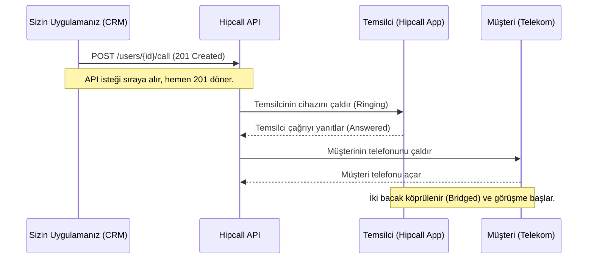

# Ödev 03: Çağrı Başlatma ve Numara Maskeleme — Çalışma Notları

## Bölüm A — Hazırlık: Kimin çağrısı?

### A1. Kullanıcıları Listeleme (`GET /api/v3/users`)

**Komut:**

```bash
curl -X "GET" "https://use.hipcall.com.tr/api/v3/users" \
  -H "accept: application/json" \
  -H "Authorization: Bearer $HIPCALL_API_TOKEN"
```

**Çıktı (Maskelenmiş):**

```json
{
  "data": [
    {
      "id": 4200,
      "owner": true,
      "suspended": false,
      "state": "available",
      "signature": "--  Ahmet Y.",
      "title": null,
      "redirect": "never",
      "email": "ornek@firma.com",
      "locale": "tr_TR",
      "timezone": "Europe/Istanbul",
      "full_name": "Ahmet Y.",
      "default_number": {
        "id": 943,
        "name": "Alt yönetici",
        "number": "+90850XXXXXXX",
        "country": "TR"
      },
      "first_name": "Ahmet",
      "last_name": "Y.",
      "phone_countries": [
        "AR",
        "AU",
        "TR"
      ],
      "phone_prefix": "TR",
      "redirect_number": null,
      "redirect_to": null,
      "voicemail": false,
      "voicemail_action": "none",
      "avatar_url": null
    }
  ],
  "meta": {"count": 3, "offset": 0, "limit": 10}
}
```


### A2. Dış Numaraları Listeleme (`GET /api/v3/numbers`)

**Komut:**

```bash
curl -X "GET" "https://use.hipcall.com.tr/api/v3/numbers" \
  -H "accept: application/json" \
  -H "Authorization: Bearer $HIPCALL_API_TOKEN"
```

**Çıktı:**

```json
{
  "data": [
    {
      "id": 938,
      "name": "Üst yönetici",
      "state": "passive",
      "number": "+90850XXXXXXX",
      "locale": "tr_TR",
      "business_hours": "open",
      "user_case": "all"
    },
    {
      "id": 939,
      "name": "Alt yönetici",
      "state": "passive",
      "number": "+90850XXXXXXX",
      "locale": "tr_TR",
      "business_hours": "open",
      "user_case": "all"
    },
    {
      "id": 942,
      "name": "Üst yönetici",
      "state": "active",
      "number": "+90850XXXXXXX",
      "locale": "tr_TR",
      "business_hours": "open",
      "user_case": "all"
    },
    {
      "id": 943,
      "name": "Alt yönetici",
      "state": "active",
      "number": "+90850XXXXXXX",
      "locale": "tr_TR",
      "business_hours": "open",
      "user_case": "all"
    }
  ],
  "meta": {"count": 4, "offset": 0, "limit": 10}
}
```

### A3. Dahilileri Listeleme (`GET /api/v3/extensions`)

**Komut:**

```bash
curl -X "GET" "https://use.hipcall.com.tr/api/v3/extensions" \
  -H "accept: application/json" \
  -H "Authorization: Bearer $HIPCALL_API_TOKEN"
```

**Çıktı:**
```json
{
  "data": [
    {
      "name": "Ahmet Y.",
      "number": 1000,
      "target_type": "user",
      "target_id": 4200
    },
    {
      "name": "Tüm kullanıcılar",
      "number": 801,
      "target_type": "team",
      "target_id": 2228
    },
    {
      "name": "Mesai saatleri dışında",
      "number": 802,
      "target_type": "greeting",
      "target_id": 3372
    }
  ],
  "meta": {
    "count": 3,
    "offset": 0,
    "limit": 10
  }
}
```

**Çıktı Özeti:**
`target_type` alanı bir dahilinin neyi işaret ettiğini gösteriyor. Gelen cevapta dahililer `user` (kullanıcı), `team` (takım/kuyruk) ve `greeting` (karşılama anonsu) olarak farklı hedefleri işaret edebiliyor.

### A4. İki Çağrı Yöntemi Arasındaki Fark

- `POST /api/v3/users/{user_id}/call`: Doğrudan belirli bir kullanıcının (ajanın) o an bağlı olduğu cihaza çağrı başlatır. Ajanın o anki aktif durumuna odaklıdır.
- `POST /api/v3/extensions/{extension_id}/call`: Bir dahili numaraya çağrı başlatır. A3'te görüldüğü üzere bu bir kullanıcı olabileceği gibi, bir destek ekibi (team) de olabilir. Eğer çağrıyı tek bir kişiye değil de sıradaki uygun bir ekibe bağlamak istiyorsak bu endpoint tercih edilmelidir.

---

## Bölüm B — İlk çağrını başlat

### B1-B3. Temel Çağrı İstekleri ve Davranışı

**Komut:**

```bash
curl -X 'POST' \
  'https://use.hipcall.com.tr/api/v3/users/4200/call' \
  -H 'accept: application/json' \
  -H 'Authorization: Bearer $HIPCALL_API_TOKEN' \
  -H 'Content-Type: application/json' \
  -d '{
  "callee_number": "+90530XXXXXXX",
  "ring_user_first": true
}'
```

**Çıktı:** Durum Kodu `201 Created`.

```json
{
  "data": {
    "id": "19d354e6-2be8-4c4e-bd49-fd12545f71a4"
  }
}
```

**Gözlemlenen Sıra:** `ring_user_first: true` olduğunda önce Hipcall uygulaması (benim bilgisayarımdaki/telefonumdaki temsilci ekranı) çalıyor. Arama ekranında hedefin numarası yazıyor. Ben (temsilci) çağrıyı açtığım an, sistem karşı tarafı aramaya başlıyor.

### B4. 201 Created Ne Anlama Geliyor? (Çok Önemli)

Cevap geldiği anda çağrı bağlanmış **olmuyor**.

- **Ne Söyler:** `201` kodu, santralin çağrı isteğini başarıyla kabul ettiğini ve sıraya (telephony layer) aldığını söyler. Çağrı takibi için benzersiz bir UUID döner.
- **Ne Söylemez:** Karşı tarafın telefonu açtığını, müsait olduğunu veya çağrının fiziksel olarak gerçekleştiğini söylemez. Karşı taraf telefonu açmasa da API anında 201 döner. Temsilcinin o an çevrimiçi veya ses alabilir durumda olduğunu da garanti etmez.

### B5. `ring_user_first` Davranışı

- `true`: Önce temsilcinin telefonu çalar, temsilci açtıktan sonra müşteri aranır. (En güvenli ve yaygın senaryo).
- `false`: Ajanın cihazı çalmadan direkt bağlantı kurulmaya çalışılır. Sistem arka planda temsilciyi anında bağlayıp karşı tarafı çaldırmaya başlar. Testlerde uçak modundayken false yapıldığında çağrı anında kapanıp düşmüştür.

### B6 — `number_id` ile kullanılacak arayan numarayı değiştirme

`/users/{user_id}/call` endpoint'inde `number_id` parametresi kullanılarak çağrının hangi kayıtlı Hipcall numarasından başlatılacağı belirlenebilir.

Örnek istek:

```http
POST https://use.hipcall.com.tr/api/v3/users/{user_id}/call
{
  "call_masking": true,
  "call_masking_name": "Support Team",
  "callee_number": "+90530XXXXXXX",
  "ring_user_first": false,
  "number_id": 943
}
```

Buradaki parametrelerin görevleri:

| Parametre | Açıklama |
| --- | --- |
| `user_id` | Çağrıyı başlatacak Hipcall kullanıcısının ID'si |
| `callee_number` | Aranacak dış telefon numarası |
| `number_id` | Çağrının kullanılacağı kayıtlı Hipcall numarasının ID'si |
| `ring_user_first` | Önce kullanıcının cihazının çalıp çalmayacağını belirler |
| `call_masking` | Numara maskelemenin etkin olup olmadığını belirler |
| `call_masking_name` | Maskeleme sırasında gösterilecek adı belirler |

`number_id`, `/api/v3/numbers` endpoint'inden alınan kayıtlı numaralardan biri olmalıdır. Örneğin kullanıcının kayıtlı numaraları arasında 942 ve 943 ID'leri varsa bu değerlerden biri seçilebilir.

Yapılan testlerde:

- `number_id` gönderilmediğinde, kullanıcının Hipcall profilinde varsayılan numara olarak seçilmiş numara kullanılmıştır.
- `number_id: 942` gönderildiğinde, 942 ID'li kayıtlı numara kullanılmıştır.
- `number_id: 943` gönderildiğinde, 943 ID'li kayıtlı numara kullanılmıştır.

Bu nedenle `number_id`, `callee_number` ile karıştırılmamalıdır. `callee_number` aranan kişiyi, `number_id` ise çağrının hangi kayıtlı Hipcall numarası üzerinden başlatılacağını belirtir.

Kullanıcının varsayılan numarası profil üzerinden değiştirilebilir:

https://use.hipcall.com.tr/portal/profile/default_number_settings

Buradaki varsayılan numara değiştirilirse, `number_id` gönderilmeyen `/users/{user_id}/call` isteklerinde kullanılan numara da değişir.

Extension endpoint'inde de benzer şekilde `number_id` kullanılabilir:

```http
POST https://use.hipcall.com.tr/api/v3/extensions/{extension_id}/call
{
  "callee_number": "+90530XXXXXXX",
  "number_id": 942
}
```

Sonuç olarak, `/users/{user_id}/call` endpoint'inde `number_id` isteğe bağlıdır. Gönderilmezse profil üzerinde tanımlı varsayılan kayıtlı numara kullanılır; gönderilirse belirtilen geçerli `number_id` kullanılır. `/extensions/{extension_id}/call` testinde ise `number_id` zorunlu olarak gözlemlenmiştir.

---

## Bölüm C — Hata Durumları

### C1. Var Olmayan `user_id`

**Komut:**

```bash
curl -X 'POST' \
  'https://use.hipcall.com.tr/api/v3/users/21212212/call' \
  -H 'accept: application/json' \
  -H 'Authorization: Bearer $HIPCALL_API_TOKEN' \
  -H 'Content-Type: application/json' \
  -d '{
  "callee_number": "+90530XXXXXXX",
  "ring_user_first": true
}'
```

**Durum:** `404 Not Found`

```json
{
  "errors": {
    "user_id": ["No result for user_id: 21212212"]
  }
}
```

### C2. `callee_number` Göndermeden

**Komut:**

```bash
curl -X 'POST' \
  'https://use.hipcall.com.tr/api/v3/users/4200/call' \
  -H 'accept: application/json' \
  -H 'Authorization: Bearer $HIPCALL_API_TOKEN' \
  -H 'Content-Type: application/json' \
  -d '{
  "ring_user_first": true
}'
```

**Durum:** `422 Unprocessable Entity`

```json
{
  "errors": {
    "callee_number": ["can't be blank"]
  }
}
```

### C3. E.164 Olmadan (Örn: 05551112233)

**Komut:**

```bash
curl -X 'POST' \
  'https://use.hipcall.com.tr/api/v3/users/4200/call' \
  -H 'accept: application/json' \
  -H 'Authorization: Bearer $HIPCALL_API_TOKEN' \
  -H 'Content-Type: application/json' \
  -d '{
  "callee_number": "05551112233",
  "ring_user_first": true
}'
```

**Çıktı:** `201 Created`

```json
{
  "data": {
    "id": "0d914221-d7af-4a4e-814b-00bbae4cc161"
  }
}
```

Numara tam E.164 formatında gönderilmese bile (Örn: 05551112233 veya boşluklu 555 111 22 33), API `201 Created` döndürür ve çağrı başarıyla bağlanır. Hipcall santrali numaradaki boşlukları ve baştaki yerel 0'ı temizler; numarayı kullanıcının ve hesabın profilinde tanımlı olan telefon ülke ön eki (`phone_prefix: "TR"`) ve yerel ayarı (`locale: "tr_TR"`) doğrultusunda Türkiye (+90) ülke koduna tamamlayarak yorumlar. API yerel formatı reddetmez ve çağrı şebekede düşmez. Yine de küresel standart ve dokümantasyon uyumluluğu (best-practice) açısından kod tarafında E.164 kullanılması tavsiye edilir.

### C4. Cihaz Kapalı / Uçak Modundayken Çağrı Başlatma

**Komut:**

```bash
curl -X 'POST' \
  'https://use.hipcall.com.tr/api/v3/users/4200/call' \
  -H 'accept: application/json' \
  -H 'Authorization: Bearer $HIPCALL_API_TOKEN' \
  -H 'Content-Type: application/json' \
  -d '{
  "callee_number": "+90530XXXXXXX",
  "ring_user_first": false
}'
```

Kendi cihazımı uçak moduna alıp çağrı başlattım.
**Çıktı:** `201 Created` — Hiçbir hata vermedi.

```json
{
  "data": {
    "id": "7c51a2d7-f0fe-459e-8b5f-c066ce08faee"
  }
}
```

`ring_user_first: false` ile denediğimde ne Hipcall'da ne de telefonda çağrı düştü. `true` ile denediğimde ise Hipcall çaldı ama açtığımda ses yoktu.

**Developer'lar için uyarı:** API çağrının başlatıldığını teyit eder ama temsilcinin o an internetinin kesik olmasını dert etmez. Çağrının bağlanıp bağlanmadığını, düştüğünü veya başarılı olduğunu anlamak için HTTP cevap koduna güvenilmemelidir. Mutlaka Webhook'lar dinlenmeli veya sonrasında `GET /api/v3/calls` ile çağrının `bridged_at`, `call_duration` gibi detayları kontrol edilmelidir.

### C5. Gövdeye Uydurma Alan Eklemek

**Komut:**

```bash
curl -X 'POST' \
  'https://use.hipcall.com.tr/api/v3/users/4200/call' \
  -H 'accept: application/json' \
  -H 'Authorization: Bearer $HIPCALL_API_TOKEN' \
  -H 'Content-Type: application/json' \
  -d '{
  "callee_number": "+90530XXXXXXX",
  "ring_user_first": true,
  "foo": "bar"
}'
```

**Çıktı:** `201 Created`

```json
{
  "data": {
    "id": "7c51a2d7-f0fe-459e-8b5f-c066ce08faee"
  }
}
```

`"foo": "bar"` eklendiğinde API 422 vermez. Tanımadığı alanları sessizce yok sayar ve geçerli alanlarla işlemi işleme alıp `201 Created` döndürür.

---

## Bölüm D — Numara Maskeleme (`call_masking`)

### D1 ve D2. Maskeleme Davranışı

**Komut (maskeli çağrı):**

```bash
curl -X 'POST' \
  'https://use.hipcall.com.tr/api/v3/users/4200/call' \
  -H 'accept: application/json' \
  -H 'Authorization: Bearer $HIPCALL_API_TOKEN' \
  -H 'Content-Type: application/json' \
  -d '{
  "call_masking": true,
  "call_masking_name": "Support Team",
  "callee_number": "+90530XXXXXXX",
  "ring_user_first": true
}'
```

**Çıktı:** `201 Created`

- `call_masking: true` gönderildiğinde, Hipcall arayüzünde aranan gerçek numara yerine `0000000000` görünür. Temsilci kiminle konuştuğunu (numara bazında) göremez. Aranan müşteri ise şirketin dış numarasını görür; temsilcinin şahsi numarası iletilmez.
- `call_masking_name` parametresine değer (Örn: "Support Team") verildiğinde, arayüzdeki o anlamsız sıfırların yerini bu metin alır. Hem gizlilik sağlanır hem de temsilci kimi aradığını ismen bilir.

### D3. Çağrı Kaydındaki (CDR) Durum

**Komut:**

```bash
curl -X 'GET' \
  'https://use.hipcall.com.tr/api/v3/calls?limit=5&sort=started_at.desc' \
  -H 'accept: application/json' \
  -H 'Authorization: Bearer $HIPCALL_API_TOKEN'
```

Çağrı bittikten sonra `GET /api/v3/calls` ile çağrı geçmişine bakıldığında:

```json
{
  "callee_number": "+90530XXXXXXX",
  "caller_number": "+90850XXXXXXX",
  "direction": "outbound",
  "number_id": 943,
  "call_duration": 8
}
```

**Bulgu:** Maskeleme sadece arayüzde (temsilcinin ekranında) gerçekleşir. Veritabanında (CDR loglarında) iletişim raporlamalarının ve faturalandırmanın bozulmaması için gerçek E.164 numaralar olduğu gibi tutulur.

### D4. İş Senaryoları (Kullanım Durumları)

1. **Saha Hizmetleri ve Bayi Yönetimi (Halı Yıkama / Teknik Servis vb.):** Saha personeli veya bayiler adrese giderken müşteriyi aramak zorunda kaldığında şahsi cep telefonunu kullanır. Maskeleme sayesinde müşterinin numarası personelin cihazında kalmaz (KVKK ihlali önlenir), müşteri de arayanın personelin şahsi numarası değil, doğrudan firmanın kurumsal numarası olduğunu görür.
2. **İnsan Kaynakları ve Mülakat Süreçleri:** Dışarıdan destek veren (freelance) yetenek avcıları veya İK uzmanları adayları ararken şahsi numaralarını gizlemek ister. Aynı şekilde üst düzey / yönetici bir adayın numarası da mülakatı yapan ilk aşama uzmanından gizlenerek işe alım sürecinin uçtan uca gizliliği korunur.

---

## Maskeli ve Maskesiz Çağrı Karşılaştırması

| Özellik | Maskesiz Çağrı | Maskeli Çağrı (`call_masking: true`) |
|---|---|---|
| Temsilci ekranında görünen numara | Gerçek numara | `0000000000` veya `call_masking_name` değeri |
| Karşı tarafın ekranında görünen numara | Şirketin dış numarası | Şirketin dış numarası (değişmez) |
| CDR kaydındaki numara | Gerçek numara | Gerçek numara (maskelenmez) |
| `call_masking_name` etkisi | Yok | Sıfırların yerini verilen isim alır |
| API cevabı | `201 Created` + UUID | `201 Created` + UUID (fark yok) |

---

## Çağrı Akışı Diyagramı

Gözlemlenen sıralamaya göre hazırlanan, `ring_user_first: true` olduğu temel senaryo akışı:



---

## Teslim Edilen Araç

C# konsol uygulaması: `submissions/03-click-to-call/Hipcall.ClickToCall/`

Hipcall API üzerinden çağrı başlatma ve numara maskeleme işlemlerini gerçekleştirir. `dotnet run` ile çalıştırılır. API anahtarı `HIPCALL_API_TOKEN` ortam değişkeninden okunur.

```bash
# Projeyi derle
dotnet build submissions/03-click-to-call/Hipcall.ClickToCall

# Kullanım kılavuzunu görüntüle
dotnet run --project submissions/03-click-to-call/Hipcall.ClickToCall

# Maskeli çağrı başlatma örneği
dotnet run --project submissions/03-click-to-call/Hipcall.ClickToCall -- 4200 +90530XXXXXXX --mask --mask-name "Destek" --ring-first
```
