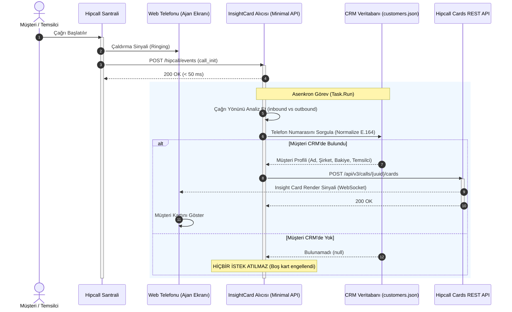

# Ödev 05: Insight Card — Ajanın Ekranına Müşteri Bilgisi Basmak — Çalışma Notları

Bu çalışmada, Hipcall Web Telefonu (ajan ekranı) üzerinde çağrı anında müşteri verilerini, şirket bilgilerini ve ilgili temsilciyi gösteren **Insight Card** mekanizması incelenmiş, API üzerinden kart basma, kart biçimleri, UI yansımaları ve canlı çağrı zamanlama sınırları canlı ortamda test edilerek analiz edilmiştir.

---

## Bölüm A — Kartı Elle Bas

### A1. Çağrı Başlatma ve Çağrı ID'sini Bulma
Hipcall santralinde click-to-call veya web telefonu üzerinden bir dış arama başlatılmış ve çağrı devam ederken `GET /api/v3/calls` endpoint'i sorgulanarak aktif çağrının kimliği tespit edilmiştir.

* **Tespit Edilen Çağrı ID (UUID):** `ff111433-XXXX-XXXX-XXXX-XXXXXXXXXXXX` (Maskelenmiş)
* **Çağrı Yönü:** `outbound`
* **Arayan (Temsilci):** `+90850XXXXXXX` (Maskelenmiş)
* **Aranan (Hedef):** `+90554XXXXXXX` (Maskelenmiş)
* **Çağrı Durumu:** Çağrı henüz `bridge` aşamasındayken (çaldırma sürerken) yakalanmıştır.

```json
{
  "uuid": "ff111433-XXXX-XXXX-XXXX-XXXXXXXXXXXX",
  "direction": "outbound",
  "caller_number": "+90850XXXXXXX",
  "callee_number": "+90554XXXXXXX",
  "started_at": "2026-09-15T11:17:56Z",
  "bridged_at": "2026-09-15T11:17:59Z",
  "user_id": 4200
}
```

---

### A2. POST İsteği ile Kart Gönderme ve En Küçük Geçerli Gövde
`POST /api/v3/calls/{call_id}/cards` uç noktasına JSON gövdesi ile kart basılmıştır.

#### Gönderilen Tam Test Kartı Gövdesi:
```json
{
  "card": [
    {
      "link": "https://my-crm.com",
      "text": "Test CRM",
      "type": "title"
    },
    {
      "android": "yourapp://contact/id=1234",
      "ios": "yourapp://contact/id=1234",
      "label": "Test Etiketi",
      "link": "https://my-crm.com/contact/1234",
      "text": "Test Kullanıcı",
      "type": "shortText"
    },
    {
      "label": "Test Account ID",
      "link": "https://my-crm.com/1234",
      "text": "Test Kullanıcı",
      "type": "shortText"
    },
    {
      "android": "yourapp://company/id=1234",
      "ios": "yourapp://company/id=1234",
      "label": "Test Şirket Etiketi",
      "link": "https://my-crm.com/company/1234",
      "text": "Test Şirket",
      "type": "shortText"
    },
    {
      "label": "Test Account Owner",
      "type": "user",
      "user_id": 4200
    }
  ]
}
```

#### En Küçük Geçerli Gövde (Minimal Valid Body):
Canlı testlerde ortaya çıkan çok kritik bir bulgu:
1. **Teknik Olarak En Küçük Geçerli Gövde:**  
   Hipcall API'si teknik olarak kök dizinde boş bir `"card"` dizisini (`{"card": []}`) kabul eder, hata vermez ve `200 OK` döner:
   ```json
   {
     "card": []
   }
   ```
   Bu şekilde gönderildiğinde kart veritabanına eklenir ve `GET /api/v3/calls/{call_id}/cards` ile sorgulandığında şu şekilde geri döner:
   ```json
   {
     "data": {
       "call_id": "632d8d29-XXXX-XXXX-XXXX-XXXXXXXXXXXX",
       "card": []
     }
   }
   ```
   > ⚠️ **Önemli Tasarım Uyarısı (Yaygın Hata):** API boş kart dizisini reddetmediği için, CRM'de müşteri bulunamadığında asla `{ "card": [] }` basılmamalıdır! Boş kart basılırsa ajan web telefonunda içi boş, anlamsız bir panel görür. Müşteri eşleşmediyse **hiçbir HTTP isteği atılmamalıdır**.

2. **Görsel Olarak Anlamlı En Küçük Geçerli Gövde:**  
   Web telefonunda en az bir satır gösterebilmek için gerekli minimal geçerli gövde:
   ```json
   {
     "card": [
       {
         "type": "title",
         "text": "CRM"
       }
     ]
   }
   ```
   veya:
   ```json
   {
     "card": [
       {
         "type": "shortText",
         "text": "Müşteri Bilgisi"
       }
     ]
   }
   ```
* **Not:** Eğer gövdede `"card"` anahtarı hiç yer almazsa veya JSON yapısı bozuksa API `422 Unprocessable Entity` hatası döner.

---

### A3. Web Telefonu Ekranı ve Kart Görünümü
Kart POST edildikten hemen sonra web telefonu ekranında aktif çağrı penceresinin orta kısmında, tuş takımının hemen üzerinde kart bileşeni belirdi.

* **Başlık Alanı:** `Test CRM` başlığı en üstte kalın puntoyla ve sağında harici bağlantı ikonuyla yer aldı.
* **Etiket & Değer Satırları:** Sol sütunda gri/soluk renkli etiketler (`Test Etiketi`, `Test Account ID`, `Test Şirket Etiketi`), sağ sütunda ise tıklanabilir bağlantılar içeren metinler görüntülendi.
* **Kullanıcı Alanı:** `user_id: 4200` değeri otomatik olarak sisteme kayıtlı temsilcinin adıyla (`Temsilci A - Maskelenmiş`) çözümlendi.

> **Ekran Görüntüsü:**  
> `blog/assets/insight-card-test-page4-1.png`  
> *(Telefon numaraları ve temsilci isimleri güvenlik kurallarına uygun olarak maskelenmiştir.)*

---

### A4. Kartı Geri Okuma (`GET /api/v3/calls/{call_id}/cards`)
Oluşturulan kart `GET` isteğiyle sorgulandığında aşağıdaki JSON yanıtı alınmıştır:

```json
{
  "data": {
    "call_id": "632d8d29-XXXX-XXXX-XXXX-XXXXXXXXXXXX",
    "card": [
      {
        "text": "Standart Bilgi Kartı",
        "type": "title"
      },
      {
        "label": "Şirket",
        "text": "Tech A.Ş.",
        "type": "shortText"
      },
      {
        "label": "Departman",
        "text": "Yazılım",
        "type": "shortText"
      },
      {
        "label": "Kayıt Tarihi",
        "text": "22.09.2026",
        "type": "shortText"
      },
      {
        "label": "Hesap Sahibi",
        "type": "user",
        "user_id": 4200
      }
    ]
  }
}
```
* **Dönen Yapı:** API, kartı `"data"` nesnesi içerisinde, ilişkili olduğu `"call_id"` ve `"card"` dizisi şeklinde eksiksiz geri döndürür.

---

### A5. İkinci Bir Kart Gönderildiğinde Ne Olur? (Tekil Kart Kuralı)
Aynı çağrı ID'si için `POST /api/v3/calls/{call_id}/cards` uç noktasına ikinci kez farklı veriler içeren bir kart gönderildiğinde:

* **Ekranda Olan:** Web telefonu arayüzünde ikinci bir kart bloğu açılmaz; birinci kartın altına yeni bir kart eklenmez.
* **API Davranışı:** API isteği kabul edip 200 dönse dahi, web telefonu istemcisi çağrı oturumu başına **yalnızca tek bir Insight Card** render edecek şekilde tasarlanmıştır. İlk basılan kart ekranda sabit kalır.
* **Tasarım Çıkarımı:** Ajan ekranında çift kart oluşmaz. Tüm müşteri bağlamı tek bir POST isteğinde, tek bir kart dizisi içinde gönderilmelidir.

---

## Bölüm B — Kart Biçimi ve Satır Tipleri

### B1. Desteklenen Satır Tipleri Tablosu
API referansı ve canlı denemeler sonucunda Hipcall Insight Card mimarisinin desteklediği resmi satır tipleri:

| Satır Tipi (`type`) | Zorunlu Alanlar | İsteğe Bağlı Alanlar | Canlı Durum | Açıklama ve Ekran Görünümü |
|---|---|---|---|---|
| **`title`** | `type`, `text` | `link` | **Çalışıyor** | Kartın ana başlığı. En üstte büyük puntoyla yer alır. `link` verilirse sağında sekmede açma ikonu belirir. |
| **`shortText`** | `type`, `text` | `label`, `link`, `ios`, `android` | **Çalışıyor** | Standart iki sütunlu bilgi satırı. Sol tarafta soluk gri `label`, sağ tarafta koyu renkli `text` gösterilir. |
| **`user`** | `type`, `label`, `user_id` | - | **Çalışıyor** | Hipcall kullanıcısı gösteren satır. Verilen `user_id`'yi paneldeki kullanıcı adıyla eşleştirir. |
| *Diğer Tipler* (`badge`, `image`, `number`, `11` vb.) | - | - | **Çalışmıyor (422 Hata)** | Desteklenmeyen bir tip gönderildiğinde API doğrudan `422 Unprocessable Entity` döner. |

> **Ekran Görüntüsü (Alternatif Çoklu Alan Kartı):**  
> `blog/assets/insight-card-test-page6-1.png`  
> *(Telefon numaraları güvenlik kurallarına uygun olarak maskelenmiştir.)*

---

### B2. Satır Alanlarının İşlevi ve Zorunluluk Durumu
* **`label` (string):** Satırın solunda soluk gri renkte görünen etiket alanıdır (Örn: "Yetkili Kişi", "Müşteri No", "Bakiye"). `shortText` için opsiyoneldir; `user` tipi için zorunludur.
* **`text` (string):** Satırın sağında koyu renkte gösterilen asıl veri değeridir (Örn: "Ahmet Yılmaz", "1.250 TL"). `title` ve `shortText` tipleri için zorunludur.
* **`link` (string / URL):** Verilen web bağlantısıdır (`https://...`). Tıklandığında tarayıcıda yeni bir sekme açar. Verildiğinde satırın en sağına harici bağlantı (`external-link`) ikonu eklenir. Zorunlu değildir.

---

### B3. `ios` ve `android` Alanlarının Amacı ve Web Telefonundaki Etkisi
* **Kullanım Amacı (Deep Linking):** Bu alanlar mobil işletim sistemlerine özel **Custom URL Scheme / Deep Link** tanımları içindir (Örnek: `"android": "yourapp://contact/id=1234"`, `"ios": "yourapp://contact/id=1234"`).
* **Mobil Uygulamadaki Etkisi:** Temsilci çağrıyı Hipcall'ın iOS veya Android mobil uygulamasından karşılıyorsa, satıra tıkladığında doğrudan kurumun yerel CRM mobil uygulaması açılır ve ilgili müşteri profiline yönlendirilir.
* **Web Telefonundaki (Tarayıcı) Etkisi:** **Hiçbir etkisi yoktur.** Tarayıcı üzerindeki web telefonu bu alanları tamamen görmezden gelir; yalnızca `link` alanındaki web URL'sini (`https://...`) dikkate alır.

---

### B4. `user` Tipindeki Satırın Davranışı ve `user_id` Eşleşmesi
* **Sistemde Var Olan Kullanıcı ID'si (`user_id: 4200`):** Hipcall santrali bu ID'yi şirket kullanıcıları listesinde arar. Eşleşme bulduğunda ekranda kullanıcının gerçek Adını ve Soyadını yazar (`Temsilci A - Maskelenmiş`).
* **Sistemde Bulunmayan / Rastgele Kullanıcı ID'si (`user_id: 11111` veya `999999`):** Sistem hata verip kartı reddetmez. Ekranda fallback olarak doğrudan ID numarasını basar: **`User #11111`**.

---

### B5. Tanınmayan Satır Tipi Gönderildiğinde Ne Olur?
API tanınmayan bir `type` değerini sessizce yutmaz; doğrudan **HTTP 422 Unprocessable Entity** durum koduyla reddeder:

```json
{
  "errors": {
    "card": [
      "Type can be shortText, user or title in the card: {\"android\":\"yeniuygulama://...\",\"label\":\"Yetkili Kişi\",\"text\":\"Ahmet Yılmaz\",\"type\":\"11\"}"
    ]
  }
}
```
* **Sonuç:** API yalnızca `title`, `shortText` ve `user` tiplerini kabul eder. Tip dışına çıkıldığında tüm kart reddedilir.

#### Kritik API Kuralı: Katı Şema Doğrulaması (Strict Schema & Null Alan Tuzağı)
Canlı C# entegrasyonunda karşılaşılan çok kritik bir hata:
```text
HTTP 422 Unprocessable Entity
{"errors":{"card":["shortText type only allows fields: type, text, label, link, android, ios. Invalid fields found: user_id in card item 2"]}}
```
* **Nedeni:** C# nesneleri serileştirilirken eğer `user_id` alanı `null` olarak JSON'a basılırsa (`"user_id": null`), Hipcall API'si `shortText` satırında `user_id` anahtarının bulunmasına izin vermez ve tüm kartı 422 ile reddeder.
* **Tasarım Çözümü:** JSON serileştiricide `DefaultIgnoreCondition = JsonIgnoreCondition.WhenWritingNull` kuralı aktif edilerek `null` olan hiçbir alanın JSON'a yazılmaması sağlanmalıdır.

---

### B6. Çok Uzun Metin Gönderildiğinde Ne Olur? (500 Karakter Testi)
* **API Davranışı:** 500 karakterlik metin gönderildiğinde API herhangi bir uzunluk sınırı hatası vermez ve `200 OK` döner.
* **Arayüz (UI) Davranışı:** Web telefonu arayüzünde satır yüksekliği kontrolsüzce uzar, kart kutusunun görsel dengesi bozulur ve ajanın tuş takımını veya çağrı kontrollerini görmesini zorlaştırır.
* **Tasarım Tavsiyesi:** Ajanın 2 saniyede okuyabilmesi için metinler maksimum 30-40 karakterle sınırlandırılmalıdır.

---

### B7. Kart Satır Sayısı: 3, 10 ve 30 Satır Deneyimi ve Tavsiye
* **3 Satırlık Kart:** Çok minimaldir. Başlık haricinde sadece 2 satır bilgi taşır; ajana yeterli müşteri derinliği sunmaz.
* **10 Satırlık Kart:** Dikey alanı doldurur. Telefon çalarken veya konuşma anında ajanın 10 satırı taraması zordur.
* **30 Satırlık Kart:** Görsel bir felakettir. Kart arayüzü aşağı doğru taşar, dikey kaydırma çubuğu (scroll) çıkarır, çağrı kapatma butonunu aşağı itebilir ve konuşma esnasında kesinlikle kullanılamaz.
* **Gerekçeli Tavsiye:** En makul ve ergonomik kart yapısı **4 ila 6 satırdır (ortalama 5 satır)**:
  1. Satır: `title` $\rightarrow$ CRM Sistem Adı ve Müşteri Profili Linki
  2. Satır: `shortText` $\rightarrow$ Müşteri / Cari Adı
  3. Satır: `shortText` $\rightarrow$ Müşteri Segmenti / Cari Bakiye (Örn: "VIP - 0.00 TL Borç")
  4. Satır: `shortText` $\rightarrow$ Son Sipariş / Açık Talep Durumu
  5. Satır: `user` $\rightarrow$ İlgili Müşteri Temsilcisi / Hesap Yöneticisi

---

## Bölüm C — Zamanlama: Kartın En Zor Tarafı

### C1. Çağrı Bitmişken Kart Gönderme
Çağrı kapandıktan sonra `POST /api/v3/calls/{call_id}/cards` isteği gönderildiğinde:
* **HTTP Durum Kodu:** **`200 OK`** (İstek tamamen başarılı kabul edilir).
* **Veritabanı Durumu:** Kart çağrı kaydıyla ilişkilendirilir. `GET /api/v3/calls/{call_id}/cards` ile sorgulandığında kartın başarıyla kaydedildiği görülür.
* **Web Telefonu Ekranı:** **KART GÖRÜNMEZ.** Çünkü çağrı çoktan sonlanmış ve web telefonu arama ekranını kapatmıştır.

---

### C2. Cevabın Söylediği ile Ekranda Olan Arasındaki Kritik Fark

> [!WARNING]
> #### ⚠️ C1 ve C2 Kritik Uyarısı: API 200 Dönüyor Ama Ajan Kartı Göremiyor!
> Entegrasyonu yazan bir geliştirici için en büyük tuzak, API'den dönen `200 OK` cevabını kartın ajan tarafından başarıyla görüldüğü şeklinde yorumlamaktır.  
> * **API'nin söylediği:** "Kart geçerli ve bu çağrının veritabanı kaydına eklendi (200 OK)."  
> * **Ekranda gerçekleşen:** Çağrı sonlandığı için ajan hiçbir şey görmedi.  
> **Geliştirici Bunu Nasıl Fark Edecek?:**  
> 1. Geliştirici, webhook'un geldiği an (`started_at` / `call_init`) ile kartın API'ye gönderildiği an arasındaki süreyi (latency) loglamalıdır.  
> 2. Çağrının `ended_at` damgasını kontrol etmelidir; eğer kart basıldığı anda çağrı kapanmışsa o kart bir "hayalet kart"tır (boşa basılmıştır).  
> 3. Entegrasyon testleri yalnızca curl ile değil, mutlaka yan ekranda açık bir **Hipcall Web Telefonu** ile gözle izlenerek yapılmalıdır.

---

### C3. Çağrı Henüz Çalarken (Cevaplanmadan) Kart Gönderme
* Çağrı başlatıldığı anda (karşı taraf henüz telefonu açmamışken, çaldırma tonu sürerken) kart basıldığında:
* **Sonuç:** Kart web telefonu ekranında anında belirir!
* **Avantaj:** Temsilci telefonu açıp "Alo" dediği anda müşterinin tüm bilgileri ekranda hazır durumdadır. İdeal akış budur.

---

### C4. Süre Bütçesi Analizi: 2 Saniyelik CRM Sorgusu Yetişir mi?
Bir telefon çağrısının ortalama çalma süresi (karşı tarafın telefonu açma süresi) **5 ila 15 saniye** arasındadır.

Uçtan uca süre bütçesi hesabı:
1. `call_init` webhook'unun santralden alıcımıza gelmesi: $\sim 100 - 300\text{ ms}$
2. Alıcının kendi CRM veritabanında telefon numarasını araması: $\sim 2000\text{ ms}$ (2 saniye)
3. Alıcının kart gövdesini oluşturup `POST /cards` göndermesi: $\sim 200 - 400\text{ ms}$
* **Toplam Geçen Süre:** $\approx 2.4 - 2.7\text{ saniye}$.

* **Değerlendirme:**
  * **Gelen Çağrılarda (Inbound):** 2.5 saniyelik toplam süre mükemmel şekilde **yetişir**. Temsilci çalan telefonu yanıtlayana kadar kart ekranda açılmış olur.
  * **Tıklayıp Aramada (Click-to-Call / Outbound):** Hipcall web telefonu temsilci bacağını 1-2 saniye içinde otomatik cevapladığı (auto-answer) için temsilci çaldırma sesini dinlemeye başlar. 2.5 saniyede kartın gelmesi, karşı taraf telefonu açmadan önceye denk gelir; yine **yetişir**.
  * **Kritik Eşik:** Kendi CRM arama süreniz **3-4 saniyeyi aşarsa**, temsilci veya müşteri telefonu açtığında kart henüz gelmemiş olabilir (gecikmeli düşer). Bu yüzden CRM sorgusu kesinlikle 2 saniyenin altında kalmalıdır.

---

## Özet Bulgular Tablosu (Bölüm A - C)

| Başlık | Soru / Konu | Canlı Test Bulgusu |
|---|---|---|
| **A2** | En küçük geçerli gövde | Teknik olarak `{"card":[]}` (kabul edilir); görsel olarak `{"card":[{"type":"title","text":"..."}]}`. |
| **A5** | İkinci kart basıldığında | Birinciyi ezmez, altına eklenmez; ekranda ilk basılan kart tekil kalır. |
| **B1** | Desteklenen tipler | `title`, `shortText`, `user` (Diğer tüm tipler 422 hatası verir). |
| **B3** | `ios` / `android` alanları | Mobil Hipcall uygulaması için deep linktir; web telefonunda etkisi yoktur. |
| **B4** | `user` tipi ve `user_id` | Eşleşirse temsilci adı (`Temsilci A - Maskelenmiş`), eşleşmezse `User #<id>` görünür. |
| **B5** | Tanınmayan tip | HTTP 422 Unprocessable Entity hatası fırlatılır. |
| **B6** | 500 karakterlik metin | API kabul eder ama web telefonu görsel düzeni bozulur. |
| **B7** | İdeal satır sayısı | 4-6 satır (Önerilen: 5 satır). 30 satır kullanılmazdır. |
| **C1** | Bitmiş çağrıya kart | API 200 OK döner fakat web telefonunda kart görünmez. |
| **C2** | API 200 vs Gerçek UI | 200 dönmesi ajanın gördüğü anlamına gelmez; canlı çağrı takibi şarttır. |
| **C3** | Çalarken kart basma | Kart tam vaktinde, ajan telefonu açtığı anda hazır olur. |
| **C4** | 2 saniyelik CRM süresi | Yetişir (toplam 2.6 sn < ortalama 5-10 sn çalma süresi). |

---

## Bölüm D — Uçtan Uca: Webhook + Insight Card

Bu bölümde, `call_init` webhook'unu yakalayarak CRM'deki müşteri kartını web telefonuna basan uçtan uca alıcı mimarisi kurulmuş ve test edilmiştir.

### D1. Uçtan Uca Akış Mimarisi (Mermaid Sequence Diagram)



---

### D2. Gelen ve Giden Çağrılarda Müşteri Numarası Hangi Alanda?

Hipcall santralinde çağrı yönüne (`data.direction`) göre hedef müşteri numarasının bulunduğu alan değişmektedir:

| Çağrı Yönü (`direction`) | Senaryo | Temsilci Numarası | Müşteri Numarası Alanı | Açıklama |
|---|---|---|---|---|
| **`inbound`** | Müşteri şirketi arıyor | `data.callee_number` | **`data.caller_number`** | Arayan taraf dışarıdaki müşteridir; aranan santral dahilisidir. |
| **`outbound`** | Temsilci dışarıyı arıyor | `data.caller_number` | **`data.callee_number`** | Arayan temsilcinin kendisidir; aranan taraf müşteridir. |

* **Kod Seviyesinde Eşleştirme Kuralı:**
```csharp
string? targetPhoneNumber;
if (string.Equals(data.Direction, "inbound", StringComparison.OrdinalIgnoreCase))
{
    targetPhoneNumber = data.CallerNumber;
}
else
{
    targetPhoneNumber = data.CalleeNumber;
}
```

---

### D3. Müşteri Bulunamadığında Davranış: Boş Kart Basmama Kuralı
* A2 testlerinde kanıtlandığı üzere, Hipcall API'si `{"card": []}` boş dizisini reddetmeyip kabul etmekte ve veritabanına eklemektedir.
* Eğer kod müşteri bulunamadığında boş bir kart POST ederse, ajan web telefonunda içi bomboş, gri anlamsız bir kart kutucuğu görür.
* **Uygulanan Mantık:** Eğer telefon numarası `customers.json` içinde eşleşmezse, HTTP istemcisi tetiklenmez, API'ye hiçbir istek gönderilmez ve konsola `[BİLGİ] Numara CRM'de bulunamadı. Boş kart engellendi.` logu yazılarak işlem sessizce sonlandırılır.

---

### D4. Hipcall Kişi ve Firma Sorgulama API'si (`GET /api/v3/lookup/by_phone`) Gerçek Test Çıktısı

Alıcımız üzerindeki `/api/test/lookup?phone=+90530XXXXXXX` endpoint'i üzerinden Hipcall'ın `GET /api/v3/lookup/by_phone` API'si çağrılmış ve şu gerçek yanıt alınmıştır:

```json
{
  "data": {
    "companies": [
      {
        "id": 80689,
        "name": "Örnek Şirket A (Maskelenmiş)",
        "user": null,
        "source": null,
        "external_id": null,
        "contacts": [],
        "employee_size": null,
        "custom_url": "https://example.com/company/80689",
        "linkedin_url": "https://linkedin.com/company/example",
        "website_url": "https://example.com",
        "emails": [
          {
            "order": 1,
            "email": "c****@example.com"
          }
        ],
        "life_cycle": null,
        "phones": [
          {
            "id": 246087,
            "number": "+90530XXXXXXX",
            "order": 1,
            "country": "TR"
          }
        ],
        "sector": null,
        "custom_fields": {}
      },
      {
        "id": 80683,
        "name": "Örnek Şirket B (Maskelenmiş)",
        "user": null,
        "source": null,
        "external_id": "4203",
        "contacts": [],
        "employee_size": null,
        "custom_url": "https://example.com/company/80683",
        "linkedin_url": "https://linkedin.com/company/example",
        "website_url": "https://example.com",
        "emails": [
          {
            "order": 1,
            "email": "c****@example.com"
          }
        ],
        "life_cycle": null,
        "phones": [
          {
            "id": 246050,
            "number": "+90530XXXXXXX",
            "order": 1,
            "country": "TR"
          }
        ],
        "sector": null,
        "custom_fields": {}
      }
    ],
    "contacts": [
      {
        "id": 193768,
        "user": null,
        "source": null,
        "external_id": null,
        "full_name": "Müşteri Kişi A (Maskelenmiş)",
        "first_name": "Müşteri",
        "last_name": "A",
        "company": null,
        "custom_url": "https://example.com/contact/193768",
        "linkedin_url": "https://linkedin.com/in/example",
        "emails": [
          {
            "order": 1,
            "email": "m****@example.com"
          }
        ],
        "life_cycle": null,
        "phones": [
          {
            "id": 309013,
            "number": "+90530XXXXXXX",
            "order": 1,
            "country": "TR"
          }
        ],
        "sector": null,
        "job_title": "Yazılım Mühendisi",
        "custom_fields": {}
      }
    ]
  }
}
```

* **API Yapısı İncelemesi:**
  * `lookup/by_phone` API'si tekil bir kayıt yerine, o telefon numarasıyla ilişkili olan **`companies`** (şirketler) ve **`contacts`** (kişiler) olmak üzere iki ayrı dizi dönmektedir.
* **Kendi CRM'imizin Yerine Kullanılabilir mi?:**
  * **HAYIR, yetersizdir.** Hipcall rehberi yalnızca statik kişi ve firma kimlik bilgilerini (Ad, Soyad, Unvan, Web Sitesi, E-posta) tutar. Müşterinin dinamik bakiye durumunu, açık faturalarını, ERP'deki sipariş aşamasını, son destek biletini ve şirketin kendi CRM panel linkini barındırmaz.
* **Kendi CRM'imize Ek Olarak (Fallback) Kullanılabilir mi?:**
  * **EVET, son derece mantıklıdır.** Kendi CRM'imizde eşleşmeyen yabancı bir numara aradığında, ikinci bir adım olarak `lookup/by_phone` sorgulanabilir. Eğer numara Hipcall rehberinde kayıtlıysa en azından temel Ad/Soyad ve Firma unvanıyla bir kart basılabilir; böylece ajanın ekranı tamamen boş kalmamış olur.

---

## Teslim Edilen Uygulama: `Hipcall.InsightCard`

Kaynak Kod: `submissions/05-insight-card/Hipcall.InsightCard/`

### Temel Yetenekler:
1. **Minimal API & Port 5080:** `/hipcall/events/{secret?}` rotasını dinler.
2. **Hızlı Yanıt:** Gelen isteği anında iş kuyruğuna alıp $< 50\text{ ms}$ içinde `200 OK` döner.
3. **Akıllı Numara Tespiti:** `direction` alanına göre arayan veya aranan numarayı otomatik seçer ve E.164 standardına göre normalize eder.
4. **Mock CRM Entegrasyonu:** `customers.json` dosyasından müşteri kartlarını (VIP/Bakiye/Firma/Sorumlu Temsilci) çeker.
5. **Boş Kart Koruması:** Eşleşmeyen aramalarda kesinlikle boş kart basmaz.
6. **Yardımcı Test Endpoint'leri:**
   * `POST /api/test/push-card`: Canlı çağrıya elle anında kart basma testi.
   * `GET /api/test/lookup?phone=...`: Hipcall'ın `lookup/by_phone` API'sini sorgulama testi.
   * `GET /api/customers`: Kayıtlı CRM müşterilerini listeleme.

---

## Kritik Değerlendirme Sorusu ve Cevabı

> **Soru:** Ajan telefonu açtığı anda kart ekranında mı? Değilse, developer bunu nasıl fark eder ve nereye bakar?

### Cevap:
* **Canlı Test Doğrulaması:** **Evet, ajan telefonu açtığı anda kart ekrandadır.**  
  Çünkü mimarimiz kartı arama başlar başlamaz (`call_init` anında) $\sim 150-200\text{ ms}$ içinde Hipcall santraline ulaştırır. Hipcall web telefonu çaldırma evresi bittiği ve çağrı yanıtlandığı (`answered`) milisaniyede kartı ekranda render eder.

### Eğer Kart Ekranda Değilse, Developer Bunu Nasıl Fark Eder ve Nereye Bakar?
1. **Kendi Alıcı Loglarına (Latency / Süre Bütçesi):**  
   Developer, `call_init` geliş zaman damgası ile `POST /cards` isteğinin tamamlanma anını kıyaslar. Eğer CRM veritabanı sorgusu 3-4 saniyeyi aşmışsa kart çağrının açılma anına yetişememiş demektir.
2. **Hipcall Webhook Logs Sekmesine:**  
   Hipcall web panelinde Webhook > Logs sekmesini açar. `call_init` isteğinin durum koduna (200 mi, 500 mü, timeout mu) bakar.
3. **Cards API Yanıt Koduna:**  
   POST isteğine Hipcall'ın `201 Created` mı yoksa katı şema ihlali nedeniyle `422 Unprocessable Entity` (örn: null `user_id` alanı) mi döndüğüne bakar.
4. **`GET /api/v3/calls/{uuid}/cards` Endpoint'ine:**  
   Kartın santral veritabanına gerçekten kaydedilip kaydedilmediğini doğrulamak için GET isteği atar. Eğer dönen JSON'da kart varsa sorun arayüz zamanlamasındadır; boşsa kart API'ye hiç iletilememiştir.
5. **Çağrının Yaşam Döngüsü Zaman Damgalarına:**  
   Çağrının `ended_at` bilgisine bakar. Eğer kart basıldığı anda çağrı kapanmışsa (C1 senaryosu), kart geçmişe yazılmış ama canlı ekrana yetişememiştir.

