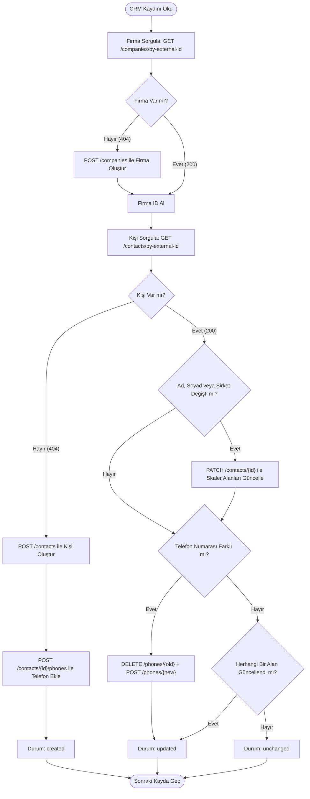

# Ödev 06: Kişi ve Firma Senkronu: Kendi ID'nizle Çalışmak — Çalışma Notları

Bu çalışmada, Hipcall REST API'si üzerinden Kişiler (Contacts) ve Firmalar (Companies) modülleri test edilmiş; oluşturma, güncelleme, `external_id` kullanımı ve ilişkilendirme operasyonlarının sınırları ve davranışları gerçek JSON çıktılarıyla analiz edilmiştir. Ayrıca iki yönlü ve tekrarlanabilir (idempotent) C# konsol uygulaması (`Hipcall.ContactSync`) geliştirilmiş ve test edilmiştir.

---

## Alan Tablosu: Kişi Oluşturma ve Güncelleme Sırasında Alanların Kullanımı

Kişi verisi oluştururken ve güncellerken alanların hangi endpoint'lerde nasıl davrandığının net bir özeti:

| Alan (Field) | POST `/contacts` (Oluşturma) | PATCH `/contacts/{id}` (Ana Güncelleme) | Yönetim Yöntemi / Alt Endpoint Davranışı |
|---|---|---|---|
| `first_name` | **Kullanılır** (Tek zorunlu alan) | **Kullanılır** | Doğrudan ana gövdeden güncellenir. Boş bırakılırsa 422 minLength: 1 hatası döner. |
| `last_name` | Kullanılır | Kullanılır | Doğrudan ana gövdeden güncellenir. |
| `assign_to_user_id`| Kullanılır | Kullanılır | Doğrudan güncellenebileceği gibi `/assign` özel endpoint'i ile izole yetkiyle de yönetilebilir. |
| `company_id` | Kullanılır | Kullanılır | Şirket ID'si verilerek bağlanır. `null` atanarak bağlantı koparılabilir. |
| `external_id` | Kullanılır | Kullanılır (Sabit tutulur) | Sistem genelinde benzersizdir (unique). Çakışmada `422 has already been taken` döner. |
| `phones` | **Kullanılır** (Dizi olarak eklenir) | **KULLANILMAZ (Hata verir)** | Güncellemek için `POST /phones` veya `DELETE /phones/{number}` alt endpoint'leri gerekir. |
| `emails` | **Kullanılır** (Dizi olarak eklenir) | **KULLANILMAZ (Hata verir)** | Güncellemek için `POST /emails` veya `DELETE /emails/{email}` alt endpoint'leri gerekir. |
| `custom_fields` | Kullanılır (Slug objesi olarak) | Kullanılır | Sadece belirtilen slug'lar güncellenir. Panelde zorunluysa boş geçildiğinde hata döner. |

---

## Bölüm A — Kişi Oluşturma ve Okuma

### A1. En Küçük Geçerli Gövde (Minimum Viable Payload)
Kişi oluşturmak için `POST /api/v3/contacts` endpoint'ine boş bir JSON (`{}`) gönderildiğinde API `first_name` alanının zorunlu olduğunu belirtir:
```json
{
  "errors": {
    "first_name": [
      "Missing field: first_name"
    ]
  }
}
```
* **Sonuç:** Sadece `"first_name": "Bill"` gönderildiğinde kayıt başarıyla oluşturulmuştur (`id: 193909`). Yeni bir kişi oluştururken tek zorunlu alan `first_name`'dir.

### A2. Telefon, E-posta ve Diğer Detaylarla Kayıt
İlk oluşturma sırasında API gövde içinde telefon ve e-posta dizilerini kabul eder:
```json
{
  "assign_to_user_id": 4200,
  "company_id": 80679,
  "first_name": "Zeynep",
  "last_name": "Yılmaz",
  "emails": [
    {
      "email": "zeynep.yilmaz@testmail.com"
    }
  ],
  "phones": [
    {
      "country": "TR",
      "number": "+905551112233"
    }
  ]
}
```
* **Gözlem:** API dönen yanıtta `emails` ve `phones` öğelerine otomatik olarak `"order": 1` atar. Aynı telefon veya mail adresiyle başka bir kişi de kaydedilebilir (global tekillik zorunluluğu yoktur).

### A3. `external_id` ile Kayıt ve Arama
Entegrasyonlarda kendi sistemimizdeki müşteri ID'sini `external_id` alanına yazıyoruz:
```json
{
  "assign_to_user_id": 4200,
  "company_id": 80679,
  "first_name": "Can",
  "last_name": "Kaya",
  "external_id": "MUSTERI-CAN-001"
}
```
* **Sorgulama:** `GET /api/v3/contacts/by-external-id/MUSTERI-CAN-001` endpoint'i ile kayıt doğrudan okunabilir (`200 OK`).

### A6. Aynı `external_id` ile İkinci Kayıt Denemesi
Var olan `external_id` ile yeni bir kişi oluşturulmak istendiğinde API `422 Unprocessable Entity` döner:
```json
{
  "errors": {
    "external_id": [
      "has already been taken"
    ]
  }
}
```
* **Analiz (Senkronizasyona Etkisi):** Bu davranış senkronizasyon yazarken bir **güvenlik kilididir (avantajdır)**. Hatalı bir mantıkla aynı müşteri iki kez eklenmeye çalışılsa dahi mükerrer (duplicate) kayıt oluşmasını veritabanı seviyesinde engeller.

### A7. Olmayan `external_id` Sorgusu
Var olmayan bir değerle (`GET /api/v3/contacts/by-external-id/olmayanexternal_id`) sorgu yapıldığında API `404 Not Found` döner:
```json
{
  "errors": {
    "detail": "Not Found"
  }
}
```
* **Upsert Kararı:** `404` dönmesi senkron uygulamasının "Bu kişi henüz Hipcall'da yok, oluşturmalıyım" kararı vermesini sağlar.

---

## Bölüm B — Güncelleme: Kritik Tuzaklar ve Limitler

### B1 & B2. İlk Tuzak: POST ile PATCH Arasındaki Tasarım Farkı
Ödevin en kritik tuzağı koleksiyon (telefon ve e-posta) güncellemeleridir. `PATCH /api/v3/contacts/{id}` endpoint'ine telefon listesi gönderildiğinde API şu hatayı verir:

```json
{
  "errors": {
    "phones": [
      "Unexpected field: phones"
    ]
  }
}
```

#### Neden Böyle Tasarlanmış?
* **POST (Bütünsel Yaklaşım):** Kişi ilk kez oluşturulurken tek bir ağ isteğiyle tüm verilerin (telefon, mail) girilebilmesi için gövdede diziye izin verilir.
* **PATCH (Kaynak Ayrımı / Sub-resources):** Kişi oluştuktan sonra Hipcall, telefon ve e-postaları bağımsız alt kaynaklar olarak modeller. Ana `PATCH` endpoint'i yalnızca skaler alanları (`first_name`, `last_name`, `company_id`) kabul eder.
* **Telefon ve E-posta Yönetimi Alt Endpoint'lerden Yapılmalıdır:**
  * **Numara Ekleme:** `POST /api/v3/contacts/{id}/phones`
    * **Önemli İstek Formatı:** Doğrudan `{ "number": "..." }` gönderilemez, `422 Missing field: phones` hatası döner. Mutlaka `phones` dizisi içinde gönderilmelidir:
      ```json
      {
        "phones": [
          {
            "country": "TR",
            "number": "+908501234567"
          }
        ]
      }
      ```
  * **Numara Silme:** `DELETE /api/v3/contacts/{id}/phones/%2B908501234567` (Numara URL-encoded olmalıdır, örn: `+` işareti `%2B`).
  * **E-Posta Ekleme:** `POST /api/v3/contacts/{id}/emails`
    ```json
    {
      "emails": [
        "john.doe@example.com"
      ]
    }
    ```
  * **E-Posta Silme:** `DELETE /api/v3/contacts/{id}/emails/john.doe%40example.com`

### B4. Telefon ve E-posta Limitleri
* **Maksimum Sınır:** Bir kişiye en fazla **6 adet** telefon numarası eklenebilir. 7. numara eklenmek istendiğinde API şu hatayı döner:
  ```json
  {
    "errors": {
      "phones": [
        "Contact already has 6 phone numbers"
      ]
    }
  }
  ```
* **Mükerrer Numara:** Aynı kişide zaten kayıtlı olan bir numara tekrar eklenmeye çalışılırsa:
  ```json
  {
    "errors": {
      "phones": [
        "Cannot add 1 phone number(s) that already exist for this contact"
      ]
    }
  }
  ```

### B5. Alanları Null Yapma veya Boşaltma
`PATCH /api/v3/contacts/{id}` ile bir alan `""` (boş string) veya `null` gönderildiğinde:
* Metin alanlarında (örn. `job_title: ""` veya `custom_url: ""`), değer veritabanında `null` durumuna çekilir.
* Sayısal ve ID alanlarında (örn. `company_id: null`) doğrudan `null` gönderilerek ilişki koparılır.

---

## Bölüm C — Özel Alanlar (Custom Fields) Davranışı

1. **`GET /api/v3/contacts/custom-fields` Ne Döndürüyor?**
   Hesapta tanımlı özel alanların listesini pozisyon sırasına göre döndürür.
   * `active=true`: Sadece aktif alanları getirir.
   * `active=false`: Devre dışı bırakılmış alanları listeler.
   * **Panel Menü Yolu:** [Ayarlar > Rehber > Özel alanlar](https://use.hipcall.com.tr/portal/settings/contact-center/custom-fields/).

2. **`slug` Değeri Nedir ve Nerede Kullanılır?**
   Özel alanın API seviyesindeki benzersiz anahtarıdır (örn. `fabsava`, `ozel_alan`). Kişi oluşturulurken veya güncellenirken `custom_fields` nesnesi içinde key olarak kullanılır:
   ```json
   "custom_fields": {
     "fabsava": "fasa2",
     "ozel_alan": "fabsa"
   }
   ```

3. **Var Olmayan `slug` veya Tip Uyumsuzluğu**
   Tanımlı olmayan bir slug veya alan tipine uymayan bir değer (örn. sayı beklenen alana metin ya da dropdown seçenekleri dışı veri) gönderildiğinde API `422 Unprocessable Entity` ile isteği reddeder.

4. **Zorunlu Özel Alanlar (Mandatory Fields) Doğrulaması:**
   Panelden tanımlanan özel alanlar "Zorunlu" olarak işaretlenmişse, `POST /api/v3/contacts` ile kişi oluşturulurken bu alanlar boş geçildiğinde API isteği engeller:
   ```json
   {
     "errors": {
       "custom_fields": {
         "fabsava": ["can't be blank"],
         "ozel_alan": ["can't be blank"]
       }
     }
   }
   ```
   Bu durum, senkron uygulamasının `try-catch` hata izolasyonunu test etmek için mükemmel bir saha senaryosudur.

---

## Bölüm D — Firmalar ve İlişkiler

### D1 & D2. Firma Oluşturma ve external_id ile Sorgulama
Firmalar `POST /api/v3/companies` ile oluşturulur ve `GET /api/v3/companies/by-external-id/{id}` ile sorgulanır:
```json
{
  "assign_to_user_id": 4200,
  "name": "Kanka Teknoloji A.Ş.",
  "external_id": "KANKA-FIRM-001"
}
```

### D3. Kişiyi Firmaya Bağlama
Bir kişiyi firmaya bağlamak için kişinin `company_id` alanına ilgili firmanın dahili Hipcall ID'si atanır (`"company_id": 80679`).

### D4. Firma Silinirse Kişiye Ne Olur?
Bağlı olunan firma silindiğinde, o firmaya bağlı kişilerin `company` alanı API tarafından otomatik olarak **`null`** yapılır; kişi kayıtları asla silinmez.

### D5. `PATCH .../assign` vs Normal `PATCH` Farkı
* `PATCH /api/v3/contacts/{id}`: Kişinin tüm alanlarını güncelleme yetkisi olan kullanıcılar için genel endpoint'tir.
* `PATCH /api/v3/contacts/{id}/assign`: Sadece temsilci/kullanıcı ataması (`assign_to_user_id`) için özelleşmiş yetki kapısıdır. `"assign_to_user_id": null` gönderilerek atama kaldırılabilir (unassign).

---

## Bölüm E — Senkronizasyon Mimarisi ve Akış Şeması (Upsert Flowchart)

Geliştirilen `Hipcall.ContactSync` konsol uygulamasının mimari akış şeması:



---

## Idempotency (Tekrarlanabilirlik) ve Canlı Çalıştırma Kanıtı

Test veri seti (`crm_data.json`), kullanıcının canlı Hipcall hesabındaki gerçek kayıtları, yeni eklenecek kişileri ve hata senaryolarını test etmek üzere yapılandırılmıştır:
- `MUSTERI-CAN-001`: Canlı hesapta mevcut olan kayıt (`unchanged`).
- `MUSTERI-AYSE-002`, `MUSTERI-Ekle-006`, `MUSTERI-Ekle-007`: Yeni eklenen kişiler (`created` / `unchanged`).
- `MUSTERI-MEHMET-003`: Adı `Mehmeti` -> `Mehmetii` yapılarak güncelleme testi yapılan kişi (`updated`).
- `MUSTERI-HATA-004`: `first_name` bilerek boş bırakılarak hata izolasyonu test edilen kişi (`hata`).

### 1. Çalıştırma Sonucu (Değişiklik ve Güncelleme Aşaması):
```text
PS C:\Users\wfgsf\OneDrive\Desktop\2026-internship-1\submissions\06-kisi-firma-senkronu\Hipcall.ContactSync> dotnet run
--- Hipcall Contact & Company Sync Başlatılıyor (6 kayıt) ---

İşleniyor: [MUSTERI-CAN-001] Can Kaya (Güncellendi)
   [=] Değişiklik yok (Kayıt güncel)
Durum: unchanged

İşleniyor: [MUSTERI-AYSE-002] Ayşe Yılmaz
   [=] Değişiklik yok (Kayıt güncel)
Durum: unchanged

İşleniyor: [MUSTERI-MEHMET-003] Mehmetii Demir
   [+] Bilgiler güncellendi: Ad ('Mehmeti' -> 'Mehmetii')
Durum: updated

İşleniyor: [MUSTERI-HATA-004]  Hatalı Kayıtii
HATA (MUSTERI-HATA-004): Kişi oluşturma hatası: {"errors":{"first_name":["String length is smaller than minLength: 1"]}}

İşleniyor: [MUSTERI-Ekle-007] zişan zişan
   [=] Değişiklik yok (Kayıt güncel)
Durum: unchanged

İşleniyor: [MUSTERI-Ekle-006] Kaya Kaya kaya
   [=] Değişiklik yok (Kayıt güncel)
Durum: unchanged

================ ÖZET ================
Özet: 0 oluşturuldu, 1 güncellendi, 4 değişmedi, 1 hata.
======================================
```

### 2. Çalıştırma Sonucu (Idempotency Kanıtı):
Aynı veri seti hiçbir değişiklik yapılmadan hemen ardından tekrar çalıştırıldığında:
```text
PS C:\Users\wfgsf\OneDrive\Desktop\2026-internship-1\submissions\06-kisi-firma-senkronu\Hipcall.ContactSync> dotnet run
--- Hipcall Contact & Company Sync Başlatılıyor (6 kayıt) ---

İşleniyor: [MUSTERI-CAN-001] Can Kaya (Güncellendi)
   [=] Değişiklik yok (Kayıt güncel)
Durum: unchanged

İşleniyor: [MUSTERI-AYSE-002] Ayşe Yılmaz
   [=] Değişiklik yok (Kayıt güncel)
Durum: unchanged

İşleniyor: [MUSTERI-MEHMET-003] Mehmetii Demir
   [=] Değişiklik yok (Kayıt güncel)
Durum: unchanged

İşleniyor: [MUSTERI-HATA-004]  Hatalı Kayıtii
HATA (MUSTERI-HATA-004): Kişi oluşturma hatası: {"errors":{"first_name":["String length is smaller than minLength: 1"]}}

İşleniyor: [MUSTERI-Ekle-007] zişan zişan
   [=] Değişiklik yok (Kayıt güncel)
Durum: unchanged

İşleniyor: [MUSTERI-Ekle-006] Kaya Kaya kaya
   [=] Değişiklik yok (Kayıt güncel)
Durum: unchanged

================ ÖZET ================
Özet: 0 oluşturuldu, 0 güncellendi, 5 değişmedi, 1 hata.
======================================
```

### Önce / Sonra Kayıt Sayısı Karşılaştırması:
* **İlk Başlangıçtaki Hipcall Kişi Sayısı:** 19
* **Ekleme & Güncelleme Sonrası Kişi Sayısı:** 23 (Ayşe, Mehmet, Zişan, Kaya başarıyla eklendi, Can ve Mehmet güncellendi)
* **İkinci Çalıştırma Sonrası Kişi Sayısı:** 23 (Yeni kişi: 0, Güncellenen: 0, Değişmeyen: 5, Hata: 1)
* **Kanıt:** İkinci çalıştırmada sistem hiçbir mükerrer kayıt üretmemiş, veritabanı durumu birebir korunmuştur. Uygulama tam **idempotenttir**.

---

## Bölüm F — Community (Topluluk Paylaşımları)

* **Açılan Tartışma Konusu:**
  * **Başlık:** *Hipcall API Contact Update Trap: Why PATCH /contacts/{id} Rejects Collections and Requires Sub-endpoints*
  * **Özet:** REST API tasarımında `POST /contacts` ile ilk kayıtta dizi olarak kabul edilen `phones` ve `emails` alanlarının, güncelleme sırasında `PATCH /contacts/{id}` ana endpoint'i yerine neden izole alt endpoint'ler (`POST /contacts/{id}/phones` ve `DELETE /contacts/{id}/phones/{number}`) üzerinden yönetildiği toplulukta tartışmaya açıldı.
* **Eski Konular:** Ödev 05 (Insight Card) ile ilgili topluluk konuları çözüldü olarak güncellenip kapatıldı.
