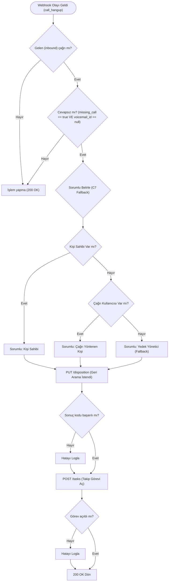

# Ödev 07: Cevapsız Çağrıyı Kaydetmek ve Takibe Almak — Çalışma Notları

Bu çalışmada, Hipcall REST API'si üzerinden gelen cevapsız çağrıların tespiti, çağrı sonucunun (disposition) atanması ve ilgili sorumluya otomatik takip görevinin oluşturulması senaryoları analiz edilmiştir. Ayrıca, düzenleme penceresi süresi ve yön uyuşmazlığı gibi API'nin koruma mekanizmaları gerçek JSON çıktılarıyla test edilmiştir.

---

## Bölüm A — Cevapsızı Tanı

### A1. Dört Senaryonun Çağrı Çıktıları ve Tablosu

Aşağıda 4 farklı durum için üretilen örnek çağrıların temel alanları yer almaktadır:

#### 1. Cevaplanmış Çağrı
```json
{
  "callback_cdr_uuid": null, "missing_call": false, "bridged_at": "2026-09-25T11:15:46Z",
  "missing_call_reason": null, "record_url": "https://storage.hipcall.com.tr/recordings/...masked...",
  "callee_number": "+90850XXXXXXX", "call_duration": 18, "direction": "inbound",
  "voicemail_id": null, "hangup_by": "user", "answered_at": "2026-09-25T11:15:32Z",
  "ended_at": "2026-09-25T11:15:50Z", "started_at": "2026-09-25T11:15:32Z",
  "caller_number": "+90555XXXXXXX"
}
```

#### 2. Hiç Açılmayan (Ajan Açtı ama Müşteri Hemen Kapattı)
```json
{
  "callback_cdr_uuid": null, "missing_call": true, "bridged_at": null,
  "missing_call_reason": "abandoned", "record_url": null,
  "callee_number": "+90850XXXXXXX", "call_duration": 46, "direction": "inbound",
  "voicemail_id": null, "hangup_by": "system", "answered_at": "2026-09-25T11:18:17Z",
  "ended_at": "2026-09-25T11:19:03Z", "started_at": "2026-09-25T11:18:17Z",
  "caller_number": "+90555XXXXXXX"
}
```

#### 3. Müşteri Kapattı
```json
{
  "callback_cdr_uuid": null, "missing_call": true, "bridged_at": null,
  "missing_call_reason": "abandoned", "record_url": null,
  "callee_number": "+90850XXXXXXX", "call_duration": 12, "direction": "inbound",
  "voicemail_id": null, "hangup_by": "contact", "answered_at": "2026-09-25T11:19:58Z",
  "ended_at": "2026-09-25T11:20:10Z", "started_at": "2026-09-25T11:19:58Z",
  "caller_number": "+90555XXXXXXX"
}
```

#### 4. Sesli Mesaj
```json
{
  "callback_cdr_uuid": null, "missing_call": true, "bridged_at": null,
  "missing_call_reason": "abandoned", "record_url": null,
  "callee_number": "+90850XXXXXXX", "call_duration": 16, "direction": "inbound",
  "voicemail_id": 95, "hangup_by": "contact", "answered_at": "2026-09-25T11:35:31Z",
  "voicemail_url": "https://storage.hipcall.com.tr/voicemails/...masked...",
  "ended_at": "2026-09-25T11:35:43Z", "started_at": "2026-09-25T11:35:27Z",
  "caller_number": "+90555XXXXXXX"
}
```

**Senaryoların Karşılaştırmalı Tablosu:**

| Senaryo | `missing_call` | `missing_call_reason` | `answered_at` | `bridged_at` | `hangup_by` | `voicemail_id` / `url` |
|---|---|---|---|---|---|---|
| **1. Cevaplanmış** | `false` | `null` | Dolu | Dolu | `"user"` | `null` |
| **2. Hiç açılmayan** | `true` | `"abandoned"` | Dolu | `null` | `"system"` | `null` |
| **3. Müşteri kapattı** | `true` | `"abandoned"` | Dolu | `null` | `"contact"` | `null` |
| **4. Sesli mesaj** | `true` | `"abandoned"` | Dolu | `null` | `"contact"` | Dolu (Örn: 95 / URL) |

### A2. Cevapsızlığı Ayıran Alanlar ve Ödevin Tuzağı
Cevapsız çağrıyı tespit etmek için iki ana aday alan öne çıkıyor:
1. **`missing_call` (Boolean):** Çağrının temsilci ile görüşülüp görüşülmediğini belirtir. Ancak tek başına kullanıldığında **sesli mesaja düşen çağrılar da `true` döner.**
2. **`voicemail_id` veya `voicemail_url`:** Çağrının sesli mesaja gidip gitmediğini gösterir.
3. *(Alternatif Aday)* **`bridged_at`:** Sadece temsilci ile karşılıklı ses akışı başladığında dolar. Cevapsızların tamamında `null` döner.

**Tuzak Noktası:** Sadece `missing_call == true` koşuluna bakarsan, 4. senaryodaki (sesli mesaj) çağrıya da "cevapsız çağrı" görevi açarsın. Santral zaten sesli mesajlar için ayrı bir akış/görev yaratıyorsa, aynı çağrı için iki görev açılmış olur.
**Doğru Formül:** Gerçek bir cevapsız çağrıyı (sesli mesaj bırakılmamış ve kimseyle görüşülmemiş) yakalamak için `missing_call == true` VE `voicemail_id == null` koşullarını birlikte kullanmalısın.

### A3. Cevapsızlık Sebebini Taşıyan Alan ve Alabildiği Değerler
Sebebi taşıyan alan **`missing_call_reason`** alanıdır.
Alabildiği değerler şunlardır:
*   **`null`:** Çağrı başarıyla temsilci tarafından yanıtlandığında (`missing_call: false`).
*   **`"abandoned"`:** Cevapsız kalan çağrılarda döner. Karşı tarafın (müşterinin) telefonu kapatması, santralin zaman aşımı / köprü kurulamaması (`bridge_fail`) veya çağrının sesli mesaja yönlenmesi durumunda API bu alanı `"abandoned"` (terk edilmiş/vazgeçilmiş) olarak etiketler.

### A4. `answered_at` ve `bridged_at` Arasındaki Kritik Fark
*   **`answered_at`:** Dört senaryonun **hepsinde doludur**. Çünkü müşteri aramayı başlattığı an, Hipcall santrali (karşılama anonsu, IVR veya zil sesi çalması için) telekom bacağını otomatik olarak "cevaplar" (answer). Bu alanın dolu olması bir insanla konuşulduğu anlamına gelmez.
*   **`bridged_at`:** Sadece 1. senaryoda doludur. Santral (system) ile müşteri (contact) arasındaki köprünün ötesine geçilip, temsilci (user) ile müşteri arasında çift yönlü ses köprüsü (bridge) kurulduğu milisaniyeyi temsil eder.

### A5. Giden Çağrı da "Cevapsız" Olabilir mi? Neden Sadece Gelenle İlgileniyoruz?
*   **Giden Çağrının Durumu:** Biz bir müşteriyi aradığımızda ve müşteri telefonu açmadığında bu çağrı elbette "cevapsız" kalır. Ancak PBX mantığı bulgularına göre, giden aramalarda (outbound) `missing_call` alanı API tarafından her zaman `false` bırakılır.
*   **Neden Sadece Gelen (Inbound):** İşin mantığı gereği, bizi arayan bir müşteri ulaşamıyorsa ortada bir mağduriyet, kaçan bir fırsat veya şikayet vardır; bu yüzden acilen görev açıp geri dönmeliyiz. Ancak biz müşteriyi arayıp ulaşamadıysak, inisiyatif zaten bizdedir. Ajanın açmadığı giden çağrı için müşteriye görev açmak tamamen anlamsızdır (task spam olur).

### A6. API Filtresi ve Elle Ayıklamanın Karşılaştırması
*   **Filtre:** `?missing_call[eq]=true`
*   **Farkı:** API'ye bu filtreyi gönderirsen sana **sesli mesaja düşen çağrıları da getirir**. Oysa bizim elle ayıklama kuralımıza göre "saf cevapsız" kategorisine girmesi için ayrıca `voicemail_id == null` olması gerekir. Eğer sadece API filtresine güvenirsen mükerrer işlerle boğuşursun.

---

## Bölüm B — Sonuç Kodu Yaz

### B1 & B2. Sonuç Kodları: `id` vs `code` Tercihi
`GET /api/v3/dispositions` endpoint'i hesapta tanımlı kodları getirir. 

```json
{
  "data": [
    {
      "active": true,
      "code": "geri_arama_istendi",
      "id": 495,
      "name": "Geri Arama İstendi",
      "direction": "both"
    }
  ]
}
```

Her kaydın sayısal bir `id`'si ve metin tabanlı bir `code` değeri vardır.
**Neden `code` Kullanılmalı?**
Entegrasyon yazılırken sabit bir id (495 gibi) kodlamak büyük bir hatadır. Bir sonuç kodunun id değeri, geliştirme (DEMO) ortamı ile müşterinin canlı üretim ortamında birbirinden tamamen farklı olacaktır. Ancak `code` değeri ("geri_arama_istendi" gibi) ortamlar arası taşınabilen, hesaptan bağımsız, insan tarafından okunabilir benzersiz bir anahtardır. Sistemin farklı hesaplarda kırılmadan çalışabilmesi için her zaman `disposition_code` kullanılmalıdır.

### B3, B4 & B5. İstek Gövdesi Doğrulamaları (`PUT /api/v3/calls/{call_id}/disposition`)
*   **Boş Gövde (B5):** Hiçbir alan gönderilmediğinde API `422` döner:
    ```json
    { "errors": { "disposition_id": [ "can't be blank" ] } }
    ```
*   **İkisi Birden (B4):** Gövdede hem `id` hem de `code` aynı anda gönderildiğinde API isteği reddeder:
    ```json
    { "errors": { "disposition_id": [ "provide either disposition_id or disposition_code, not both" ] } }
    ```
*   **Bulgu (B3):** En küçük geçerli gövde, `disposition_id` veya `disposition_code` alanından **sadece birini** içermek zorundadır. API olası bir veri uyuşmazlığını engellemek için "ya biri ya diğeri" kuralını kesin olarak uygular.

### B6 & B7. Sonuç Kodunu Geri Okuma ve Değiştirme
*   Başarıyla atanan bir sonuç kodu geri okunduğunda şu yanıt döner:
    ```json
    {
      "data": {
        "code": "geri_arama_istendi",
        "name": "Geri Arama İstendi",
        "disposition_id": 495,
        "edit_window_minutes": 15,
        "editable_until": "2026-09-25T11:50:43Z",
        "editable": true
      }
    }
    ```
*   Yeni kapanmış bir çağrıya atanan sonuç kodu, farklı bir kod ile tekrar `PUT` edildiğinde işlem **başarılı olmuştur**. Bunun sebebi `editable: true` bayrağı ve o anki zamanın `editable_until` zamanından önce olmasıdır.

### B8. Düzenleme Penceresi Süresi ve Eski Çağrıyı Değiştirme Sınırı (API Tuzağı 1)
Bir çağrının sonuç kodunu sonsuza kadar değiştiremezsiniz. API, `edit_window_minutes` kuralını uygular. Yetkisi olmayan bir kullanıcı, çağrı kapandıktan sonra sadece o hesap için tanımlanan süre (örn: 15 dakika) içerisinde kodu değiştirebilir. Günler önceki bir çağrının kodunu değiştirmeye kalktığınızda (yön doğru olsa bile) süre aşıldığı için API `editable: false` kuralını işleterek düzenlemeyi reddeder (422 döner).

Resmi PBX/API Kuralı:
> *"Enforces the account's edit-window rule: users without the communication::settings permission may only edit the disposition within the configured edit_window_minutes after the call ends."*

### B9. Yön Uyuşmazlığı (Direction Mismatch — API Tuzağı 2)
Gelen (inbound) bir çağrıya, sadece giden (outbound) çağrılar için tanımlı bir sonuç kodu yazılmaya çalışıldığında API şu hatayı (422) döner:
```json
{
 "errors": {
   "direction": [ "does not apply to this call" ]
 }
}
```
Sistem, çağrının yönü (CDR verisindeki `direction`) ile sonuç kodunun yönünün (`disposition.direction`) eşleşmesini zorunlu tutar.

---

## Bölüm C — Takip Görevi Aç

### C1, C2 & C3. Görev Oluşturma Zorunlu Alanları ve Atamalar
*   **Zorunlu Alanlar:** `POST /api/v3/tasks` ile yeni bir görev oluştururken `name` (görevin başlığı) zorunludur. Boş veya eksik gönderildiğinde API şu hatayı döner:
    ```json
    { "errors": { "data": [ "#/data/name: Missing field: name" ] } }
    ```
    `description`, `due_date`, `assign_to_user_id` gibi alanlar isteğe bağlıdır.
*   **Kullanıcıya Atama:** Gövdeye `assign_to_user_id` alanı eklenir. Geçersiz bir ID gönderilirse `{"assign_to": ["Not exist"]}` hatası döner.
*   **Kişi/Firma Bağlama:** Görevler rehberdeki kişi ve firmalarla ilişkilendirilebilir (`contact_ids`, `company_ids`). Bu ID'lerin sistemde var olması zorunludur. UI yansımasında, görev sayfasında "İlgili Kişiler" ve "İlgili Şirketler" bloklarında görünür.

### C4. Son Tarih (Due Date) Saat Dilimi Yorumu (Tuzak Çözümü)
*   **Beklenen Format:** ISO 8601 ("date-time") formatı zorunludur. Sadece yerel tarih/saat gönderildiğinde "Invalid format" fırlatılır.
*   **Saat Dilimi:** Gönderilen verinin sonuna `+03:00` (yerel saat dilimi sapması) veya `Z` (UTC) eklenmelidir. İstekte `+03:00` gönderilse bile API bunu arka planda UTC'ye dönüştürür ve `Z` ekleyerek kaydeder.
*   **Bulgu:** Geliştiriciler karışıklığı önlemek için tüm `due_date` atamalarını doğrudan UTC (Z) formatında göndermelidir.

### C5 & C6. Listeleme ve Tamamlama
*   **Listeleme:** `GET /api/v3/tasks` (limit, offset, sort, assign_to_user_id vb. filtrelerle süzülebilir). `done[eq]=false` ile açık görevler listelenir.
*   **Tamamlama:** Görevi kapatmak için `PATCH /api/v3/tasks/{id}` endpoint'ine `"done": true` gönderilir. İşlem başarılı olduğunda `done_at` alanı zaman damgasıyla dolar.

### C7. Kritik Tasarım Kararı: Sorumlu (Yedek) Belirleme Stratejisi
Webhook alıcısı cevapsız bir çağrı yakaladığında yeni açılacak görevi kime atayacağına (`assign_to_user_id`) karar vermelidir. Üç ana veri kaynağı bulunur: `data.user_id` (çağrının yönlendiği, genelde null'dur), `contact.user_id` (müşterinin CRM'deki sahibi, yeni numaraysa boştur).

**Önerilen "Fallback" (Yedekleme) Mantığı / Tasarım Kararı:**
Kod yazılırken öncelik sırası şu şekilde kurulmalıdır:
1. Öncelikle, arayan kişinin (`caller_number`) Hipcall veya CRM'deki kişi kartında bir "Sahip/Temsilci" ataması var mı diye bakılır. Varsa görev ona atanır.
2. Yoksa, çağrı webhook'unda `data.user_id` dolu mu (çağrı spesifik birine mi çaldı?) diye bakılır. Doluysa ona atanır.
3. Her ikisi de boşsa: Görev ortada kalmasın diye yapılandırma dosyasında (`appsettings.json`) önceden belirlenmiş sabit bir **"Yedek Sorumlu"** (Fallback User ID, örn: Çağrı Merkezi Yöneticisi) ID'sine atanır. Böylece sahipsiz çağrılar her zaman yönetici ekranına düşer ve oradan manuel olarak ekibe dağıtılabilir.

---

## Bölüm D — Kuralı Yaz (Kod ve Mimari)

### D1. Akış Diyagramı

Webhook alıcısında çalışacak akış kuralları aşağıdaki diyagramla modellenmiştir:



### D2. Proje Yapısı

```
submissions/07-cevapsiz-cagri/Hipcall.PostCall/
├── Hipcall.PostCall.csproj      # ASP.NET Core 8 Minimal API
├── Program.cs                   # Giriş noktası, DI kayıtları, webhook endpoint
├── appsettings.json             # Yapılandırma (disposition_code, fallback_user_id, vb.)
├── Models/
│   ├── WebhookPayload.cs        # Webhook zarfı + CallData (tüm alanlar)
│   └── HipcallSettings.cs       # Strongly-typed ayarlar
├── Services/
│   ├── HipcallApiClient.cs      # REST API istemcisi (disposition, task, vb.)
│   ├── IdempotencyStore.cs      # UUID tabanlı tekil işlem deposu
│   └── RuleEngine.cs            # Kuralları toplayan ve bağımsız çalıştıran motor
└── Rules/
    ├── IPostCallRule.cs          # Kural arayüzü (Matches + ExecuteAsync)
    └── MissedCallRule.cs         # Ödev 07 kuralı (cevapsız → disposition + görev)
```

### D3. Mimari Kararları

**Kural Motoru (Rule Engine) Deseni:**
Her kural `IPostCallRule` arayüzünü uygulayan bir sınıftır. Motor (`RuleEngine`) DI'dan tüm kuralları alır, her birini ayrı `try-catch` içinde çalıştırır:

```csharp
foreach (var rule in _rules)
{
    try
    {
        if (!rule.Matches(payload)) continue;
        await rule.ExecuteAsync(payload, ct);
    }
    catch (Exception ex)
    {
        _logger.LogError(ex, "[RuleEngine] {Rule} başarısız!", rule.RuleName);
    }
}
```

**Fire-and-Forget (HTTP Cevabını Bekletmeme):**
Webhook endpoint'i olayı alır almaz `200 OK` döner. Kurallar `Task.Run` ile arka planda çalışır:

```csharp
_ = Task.Run(async () => await ruleEngine.EvaluateAsync(payload));
return Results.Ok();
```

**Bağımsız Aksiyonlar (Disposition & Task):**
`MissedCallRule` içinde disposition yazma ve görev açma ayrı `try-catch` bloklarında. Disposition patlarsa bile görev açılır:

```csharp
bool dispositionOk = false;
try { dispositionOk = await _api.WriteDispositionAsync(...); }
catch (Exception ex) { _logger.LogError(ex, "Disposition hatası"); }

try { await _api.CreateTaskAsync(...); }
catch (Exception ex) { _logger.LogError(ex, "Görev açma hatası"); }
```

**Idempotency (Tekrar Koruması):**
Her kural kendi ön ekiyle anahtar üretir. Aynı olay iki kez gelirse ikinci işlem engellenir:

```csharp
if (_idempotency.IsAlreadyProcessed($"missed:{call.Uuid}"))
    return;
```

**Sonuç Kodu: Code ile Seçim (B2):**
Yapılandırmada `MissedCallDispositionCode: "geri_arama_istendi"` tutulur. API'ye `disposition_code` gönderilir, `disposition_id` asla kodlanmaz:

```json
{
  "Hipcall": {
    "MissedCallDispositionCode": "geri_arama_istendi"
  }
}
```

### D4. Yeni Kural Ekleme Rehberi (Ödev 08 ve 09 İçin)

Ödev 08 (Kısa Çağrı Etiketleme) veya Ödev 09 (Arayan Özeti) için yeni kural eklemek:

**1. Kural sınıfı yaz** (`Rules/ShortCallTagRule.cs`):
```csharp
public sealed class ShortCallTagRule : IPostCallRule
{
    public string RuleName => "ShortCallTagRule (Ödev 08)";
    public bool Matches(WebhookPayload payload) { }
    public Task ExecuteAsync(WebhookPayload payload, CancellationToken ct) { }
}
```

**2. DI'a kaydet** (`Program.cs` — tek satır):
```csharp
builder.Services.AddSingleton<IPostCallRule, ShortCallTagRule>();
```

**3. Yapılandırmaya ekle** (`appsettings.json` + `HipcallSettings.cs`):
```json
{ "ShortCallThresholdSeconds": 10 }
```

Başka hiçbir dosya değişmez. Motor yeni kuralı otomatik keşfeder ve diğer kurallarla yan yana çalıştırır.

### D5. Kabul Kriterleri Kontrolü

| Kriter | Durum |
|---|---|
| Bir aksiyonun hatası diğerini durdurmuyor, hata loglanıyor | ✅ Disposition ve Task ayrı try-catch'te. RuleEngine'de her kural bağımsız try-catch'te. `_logger.LogError` ile loglanıyor. |
| Aynı olay iki kez gelince ikinci görev açılmıyor | ✅ `IdempotencyStore` ile `"missed:{uuid}"` anahtarı kontrol ediliyor. `IsAlreadyProcessed` true dönerse `return` ile çıkılıyor. (Bkz. Idempotency Test Kanıtı) |
| Sonuç kodu sabit id ile değil code ile seçiliyor | ✅ `appsettings.json → MissedCallDispositionCode: "geri_arama_istendi"`, API'ye `disposition_code` gönderiliyor. |
| Aksiyonlar HTTP cevabını bekletmiyor | ✅ `Task.Run` ile fire-and-forget, endpoint hemen `200 OK` dönüyor. |
| Proje 08 ve 09'da genişlemeye uygun | ✅ `IPostCallRule` arayüzü, DI'a tek satır ekleme, HipcallApiClient'a metod ekleme. |

#### Idempotency (Tekrar Koruma) Test Kanıtı

Aynı `call_hangup` olayı (aynı UUID ile) kural motoruna iki kez geldiğinde, ikinci işlem otomatik olarak reddedilir ve CRM üzerinde ikinci kez görev açılmaz:

```text
info: Program[0]
      [Webhook] call_hangup alındı — UUID: 7eba7c38..., Yön: inbound
info: Hipcall.PostCall.Services.RuleEngine[0]
      [RuleEngine] MissedCallRule eşleşti, çalıştırılıyor...
info: Hipcall.PostCall.Services.IdempotencyStore[0]
      [Idempotency] Tekrar tespit edildi, atlanıyor: missed:7eba7c38-9050-40e4-9f8c-dcfba9ac3d4f        
info: Hipcall.PostCall.Services.RuleEngine[0]
      [RuleEngine] MissedCallRule tamamlandı.
```

