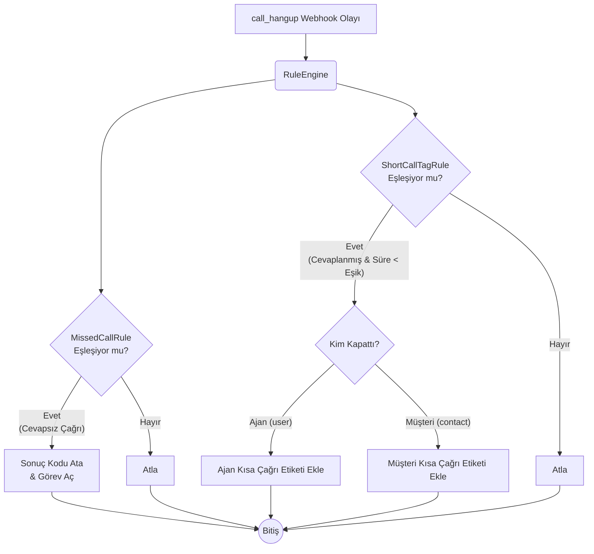

# Ödev 8 — Çalışma Notları (Bölüm A, B, C)

## Bölüm A — "Kısa" tam olarak ne?

### A1. Süre Alanları Listesi
Çağrı çıktılarında süre ve zamanlamayı belirten 6 farklı alan dönmektedir:
- `call_duration` (Toplam saniye)
- `first_touch_duration` (İlk temasa kadar geçen saniye)
- `started_at` (Çağrının santrale ulaştığı an)
- `answered_at` (Santralin veya ajanın çağrıyı açtığı an)
- `bridged_at` (Müşteri ile ajanın köprülendiği an)
- `ended_at` (Hattın kapandığı an)

### A2 & A3. Süre Alanları ve Senaryo Tablosu

| Senaryo | call_duration | first_touch_duration | bridged_at | Gerçek Konuşma (ended_at - bridged_at) |
|---|---|---|---|---|
| **1. Açılmayan (Sistem kapattı)** | 45 | null | null | Hesaplanamaz (0 saniye) |
| **2. Kısa Konuşulan** | 21 | 15 | Dolu (08:50:07) | 6 saniye |
| **3. Uzun Konuşulan** | 95 | 34 | Dolu (08:51:42) | 61 saniye |

**Alanların Ölçüm Mantığı:**
- **`call_duration`**: Çağrının başlangıcından sonuna kadar geçen toplam faturalandırılabilir süreyi (anons + çalma + konuşma) ölçer.
- **`first_touch_duration`**: Çağrının santrale düştüğü an (`started_at`) ile temsilcinin telefonu açıp köprünün kurulduğu an (`bridged_at`) arasındaki süredir. Sadece anons ve çalma evresini kapsar.

### A4. "10 Saniyeden Kısa Konuşma" Hangi Alanla Ölçülür? (Asıl Tuzak)
"10 saniyeden kısa konuşma"yı doğrudan veren hazır bir alan **yoktur**.

**Neden `call_duration` kullanılamaz? (Gerekçe):**
Kısa çağrıyı yakalamak için `call_duration < 10` kuralını kullanmak çok yaygın ve tehlikeli bir hatadır. Çünkü:
- 45 saniye boyunca sadece çalıp açılmayan ilk çağrı `call_duration = 45` olduğu için "kısa" sayılmaz ve etiketlenmez.
- 15 saniye anons dinleyip sadece 6 saniye konuştuğun ikinci çağrı `call_duration = 21` olduğu için eşiği geçer ve etiketlenmekten kurtulur.

Gerçek konuşma süresini ölçmek için kod tarafında **`ended_at` ile `bridged_at`** zaman damgaları arasındaki fark hesaplanmalıdır.

### A5. Süre Hesaplaması ve Tutarlılık
Zaman damgalarından süre hesaplandığında sistemin döndüğü hazır süre alanlarıyla birebir örtüştüğü görülmektedir:
- `ended_at` - `started_at` = `call_duration` (21 saniye)
- `bridged_at` - `started_at` = `first_touch_duration` (15 saniye)

---

## Bölüm B — Kim kapattı?

### B1 & B2. Hattı Kimin Kapattığını Söyleyen Alan ve Değerleri
Çağrı kaydında hattı kimin kapattığını veren alan **`hangup_by`** alanıdır. Çıkan sonuçlara göre 3 farklı değer alabiliyor:
- **`"contact"` (Müşteri/Arayan):** Telefondan çağrıyı kapattığım senaryoda döndü.
- **`"user"` (Ajan/Temsilci):** Web telefonundan çağrıyı kapattığım senaryoda döndü.
- **`"system"` (Santral/Sistem):** 45 saniye boyunca açmadığım senaryoda, köprü kurulamadığı ve zaman aşımına uğradığı için döndü.

### B3. İş Anlamı Farkı: Ajan mı Müşteri mi?
"Ajan 5 saniyede kapattı" ile "Müşteri 5 saniyede kapattı" aynı şey değildir:
- **Müşteri kapattıysa:** Yanlış numarayı aramış, "pardon" deyip kapatmış veya ortam müsait olmadığı için vazgeçmiş olabilir. Doğal bir düşmedir.
- **Ajan kapattıysa:** Bu çok kritik bir durumdur. Ajan müşterinin yüzüne bilerek kapatmış, çalışmaktan kaçmış olabilir veya donanım sorunu vardır. QA için anında müdahale edilmesi gereken bir kırmızı alarmdır.

### B4. Tek Etiket mi, İki Ayrı Etiket mi?
Kesinlikle **iki ayrı etiket** (Örn: `short-call-agent` ve `short-call-customer`) kullanılmalıdır.
**Gerekçe:** Ekip lideri "Kısa Çağrılar" yığınını topluca görmek istemez. Sadece "Ajanlarımın yüzüne kapattığı sorunlu çağrılar hangileri?" diye filtrelemek ister. Tek bir etiket basarsak müşteri hatalarıyla ajan kasti kapatmaları birbirine karışır.

---

## Bölüm C — Etiket API'si (Çıktılar)

### C3 & C4. Olmayan Etiketi Göndermek ve Tanımlama Zorunluluğu
Var olmayan (uydurma) bir `tag_id` gönderildiğinde API `404 Not Found` döner ve **yeni etiket oluşturmaz**.
**Entegrasyon Uyarısı:** Etiketlerin önceden panelden tanımlanması zorunludur. Entegrasyonu kuran kişiye, panelden Ayarlar > Çağrı Merkezi > Etiketler menüsüne gidip etiketleri oluşturması ve id değerlerini yapılandırma dosyasına yazması söylenmelidir.

### C5 ve C8. Aynı Etiketi İki Kez Eklemek ve Sınırlar
- **C5:** Aynı `tag_id` ile aynı çağrıya ikinci kez POST isteği atıldığında, API hata fırlatmaz, başarılı sonucu döner ve mükerrer bir etiket eklenmez. Bu uç nokta **idempotent**'tir (tekrarlanabilir).
- **C8:** Bir çağrıya eklenebilecek etiket sayısında bir limit yoktur, çok sayıda etiket atanabilir.

### C9. Etiketli Çağrıları Filtreleme (Dürüst Analiz)
**Dürüst Bulgu:** `GET /api/v3/calls` endpoint'i üzerinden etiketlere göre (Örn: `?tag_id[eq]=5617` veya `?tags[eq]=5617`) filtreleme **yapılamamaktadır**. Sistem bu parametreleri desteklemez ve `422 Unexpected field` hatası verir.

**Alternatif Öneriler:**
1. **Panel İçi Raporlama:** Ekip lideri Hipcall Web Paneli'ne girerek arayüzdeki gelişmiş filtreler üzerinden etiketli çağrıları manuel olarak süzebilir.
2. **Yerel Veritabanında (CRM) İşaretleme:** Webhook alıcımız kısa çağrıyı yakalayıp Hipcall'a etiketi bastığı anda, kendi yerel veritabanımızdaki çağrı kaydına da bir işaret koymalıdır (Örn: `is_short_call = true`). Böylece raporu Hipcall'dan değil, kendi CRM'imizden çekebiliriz.

---

## Bölüm D — Kuralı Ekleme (Mermaid Diyagramı)

Yeni kural (`ShortCallTagRule`) ve önceki kural (`MissedCallRule`), `RuleEngine` içerisinde ortak bir `IPostCallRule` arayüzü arkasında aynı anda değerlendirilir. Her kural kendi eşleşme mantığını (`Matches`) kontrol eder ve birbirinden bağımsız olarak çalışır.

**Uygulama Notları:**
- **Esneklik:** Eşik değeri koda gömülmedi, `appsettings.json` üzerinden ayarlanabilir yapıldı (`ShortCallThresholdSeconds = 10`).
- **Genişletilebilirlik:** `IPostCallRule` arayüzü sayesinde kod `if` zincirlerine boğulmadı, her kural kendi sınıfında izole edildi.
- **İdempotency:** API'nin aynı `tag_id`'yi ikinci kez atıldığında hata vermemesi ve işlemi tekrar etmemesi (C5 bulgusu) kullanılarak karmaşık kod mantığından kaçınıldı.
