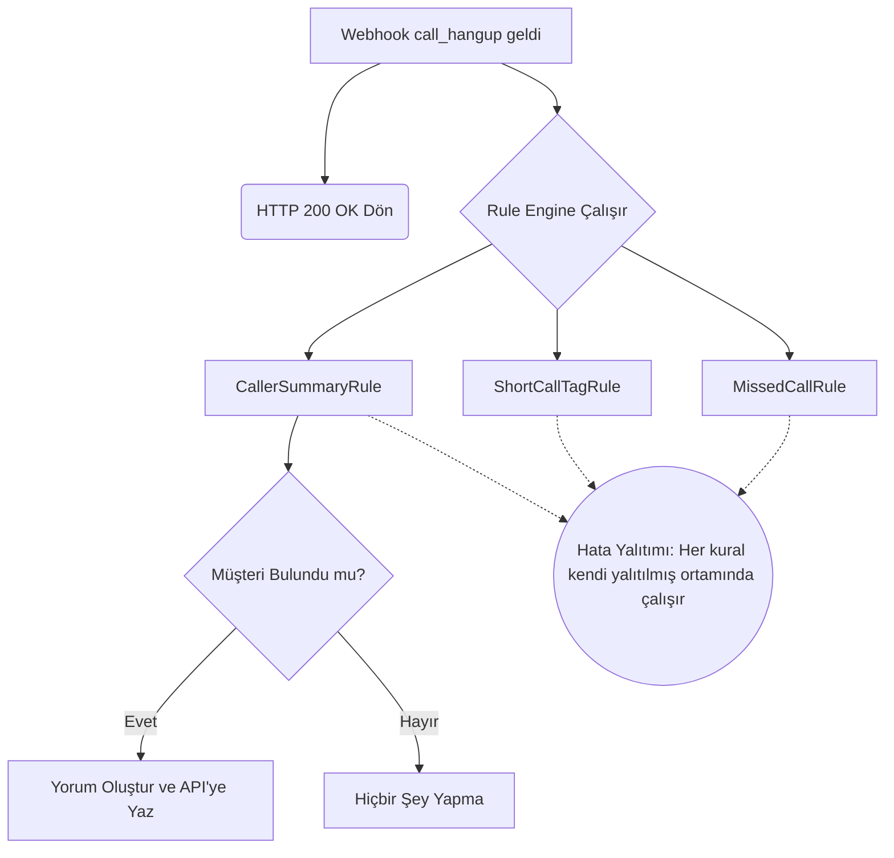

# Ödev 09: Arayan Özetini Çağrı Kaydına Yazmak - Çalışma Notları

## Bölüm A: Arayan Kim? Üç Yol

### A1-A4: Numara Eşleştirme Yöntemleri ve Çıktıları Karşılaştırması

Arayanı tanımanın üç farklı yolu bulunmaktadır ve her biri farklı senaryolara hizmet eder. Çıktıların karşılaştırması aşağıdaki tabloda özetlenmiştir:

| Senaryo / Metot | `contact_id` | `company_id` | `caller_id` | `caller_number` | Açıklama |
| :--- | :--- | :--- | :--- | :--- | :--- |
| **A1. Hipcall'da Kayıtlı Olmayan Numara (Webhook Çağrı Kaydı)** | `null` | `null` | `null` | Dolu (`+90555XXXXXXX`) | Sistem kişiyi rehberde bulamaz. Kişi ve firma tanımlayıcı alanları tamamen boş gelir, yalnızca arayanın numarası mevcuttur. |
| **A2. Hipcall'da Kayıtlı Numara (Webhook Çağrı Kaydı)** | Dolu (`194XXX`) | Dolu (`120XXX`) | - | Dolu | Sistem gelen numarayı otomatik tanır. Çağrı kaydındaki `contact_id` ve (kişi bir şirkete bağlıysa) `company_id` alanlarını doldurur. |
| **A3-A4. `GET /api/v3/lookup/by_phone` Çıktısı** | - | - | - | - | Arama API'sidir. Çağrı olayından bağımsız olarak, numaranın eşleştiği tüm kişilerin ve firmaların detaylı profilini (isim, e-posta, unvan vb.) tam bir liste (array) olarak döndürür. |

**Hangi durumda hangisi kullanılır?**
Webhook üzerinden gelen çağrıda `contact_id` halihazırda doluysa, kişinin detaylarını öğrenmek için doğrudan `GET /api/v3/contacts/{contact_id}` kullanılabilir. Ancak çağrıda bu bilgiler boş geliyorsa veya Hipcall'daki kayıtlara güvenilmeyip dışarıdan genel bir numara sorgusu yapılmak isteniyorsa `lookup/by_phone` tercih edilmelidir.

### A5: CRM Aramasında Numara vs `external_id` (Güvenilirlik Analizi)

Kendi CRM sistemimizde arama yaparken iki yol bulunur: Doğrudan telefon numarasıyla aramak veya Hipcall'daki kişiyi bulup `external_id` ile aramak. 

**Neden `external_id` Çok Daha Güvenilirdir?**
Telefon numaraları değişkendir ve formatları standart olmayabilir. CRM'de numara `0532...` diye kayıtlıyken API'den `+90532...` gelebilir. Normalizasyon kodunda ufak bir hata eşleşmeyi başarısız kılar. Ayrıca aynı numarayı bazen iki farklı müşteri (eşler veya aynı şirketin çalışanları) kullanabilir. 

Buna karşın `external_id` sistemler arası değişmez (immutable) ve kesin bir köprüdür. Müşteri telefon numarasını değiştirse veya formatı bozuk yazılmış olsa bile `external_id` (Customer ID) değişmeyeceği için yanlış kişiyle eşleşme ihtimali **sıfırdır**.

*Fallback (Yedekleme) Stratejisi:* Kusursuz bir entegrasyonda kod şu sırayı izlemelidir:
1. Webhook'ta `contact_id` varsa API'den kişiyi çek, `external_id` değerini al ve CRM'de doğrudan bu ID ile (kesin eşleşme) ara.
2. Webhook'ta `contact_id` yoksa veya kişide `external_id` boşsa, son çare olarak gelen numarayı E.164 formatına normalize et ve CRM'de numaradan bulmaya çalış.

### A6: Numara Biçimi ve Normalizasyon Kararı
Webhook'tan (veya `GET /api/v3/calls` üzerinden) gelen çağrı detaylarında `caller_number` alanı her zaman uluslararası **E.164 formatında** (örneğin `+90555XXXXXXX`) gelmektedir. Eğer kendi yerel CRM sisteminizdeki müşteri numaraları `0555...` veya boşluklu formatlarda tutuluyorsa, doğrudan veritabanına atılacak eşleşme sorgusu boş dönecektir.

**Çözüm Nerede Yapılmalı?**
Normalizasyon (format eşitleme), Hipcall'dan veri alındıktan hemen sonra, **CRM sorgusu atılmadan önce kendi webhook alıcı (C#) kodunuzda** yapılmalıdır. Kod, gelen `+90` ön ekini kaldırmalı veya CRM'deki numaraları bellek üzerinde E.164 standardına çevirerek kıyaslamalıdır. Aksi takdirde eşleşmeler sessizce patlar.

---

## Bölüm B: Yorum API'si (Çalışma Notları)

### B1. İstek Gövdesi (Payload)
`POST /api/v3/calls/{call_id}/comments` endpoint'i, JSON gövdesinde sadece `content` alanını beklemektedir:
```json
{
  "content": "**CRM Özeti:**\n\nAhmet Y. - XYZ Ltd."
}
```

### B2-B3: Uzunluk Sınırı ve Biçimlendirme Desteği
*   **Uzunluk Sınırı:** Yorum içeriğinde kesinlikle bir karakter veya uzunluk kısıtlaması bulunmamaktadır. İstenildiği kadar uzun metin gönderilebilir.
*   **Biçimlendirme (Panel Render):** 
    *   **Satır Sonu (`\n`):** Kusursuz destekleniyor. Metin panelde başarıyla alt satırlara bölünerek gösteriliyor.
    *   **Markdown:** Kusursuz destekleniyor. Kalınlaştırma (`**`), eğik yazma (`*`) ve hiperlink (`[isim](url)`) gibi etiketler panelde görsel olarak doğru biçimde çiziliyor (render ediliyor).
    *   **HTML:** Desteklenmiyor. `<br>`, `<b>`, `<i>` gibi HTML etiketleri panel tarafından işlenmiyor ve ekrana dümdüz (raw text) kod parçası olarak basılıyor.
    *   **Tasarım Kararı:** C# kodunda özeti oluştururken HTML kesinlikle kullanılmamalı, görsel hiyerarşi için sadece Markdown ve `\n` tercih edilmelidir.

### B4: Okuma İşlemi (GET)
`GET /api/v3/calls/{call_id}/comments` ile okunduğunda; yorumun id değeri, yorumu atan user nesnesi (id, email, isim, soyisim) ve yorumun text (content) alanı dönmektedir.

### B5-B6: Yorum Kimin Adına Yazılıyor? (En Kritik Durum)
Yorum API'ye POST edildiğinde, o isteği yapan API anahtarının (Bearer Token) sahibi olan kullanıcıya (örneğin id: 4200, Ayşe Y.) zimmetlenir. Panelde o kişi yazmış gibi görünür.

**Sorun ve Entegrasyon Önerisi:**
Bu durum entegrasyonun yazdığı otomatik özetler ile ajanların elle girdiği gerçek notların birbirine karışmasına sebep olur. Çözüm olarak; yorum içeriği oluşturulurken en başa her zaman Markdown ile belirgin bir etiket (Örn: `**CRM Özeti:**`) konulmalıdır. Böylece çağrıya daha sonra bakan biri bunun otomatik bir sistem notu olduğunu anında anlar.

### B7: Çoklu Yorum ve Sıralama
Aynı çağrıya bir sınır olmaksızın birden çok yorum eklenebilmektedir. Paneldeki sıralama mantığı kronolojiktir; ilk atılan yorum en üstte, son atılan yorum ise en altta gösterilmektedir.

### B8: Düzenleme ve Silme (API vs. Panel Farkı)
*   **API Tarafı:** REST API üzerinde yorum silme (`DELETE`) veya güncelleme (`PUT`/`PATCH`) uç noktaları bulunmamaktadır; entegrasyon için sistem yalnızca yazma (write-only) yetkisine sahiptir.
*   **Panel Tarafı:** Kullanıcılar, Hipcall panelindeki çağrı detayı sayfasından yorumları manuel olarak silebilir veya düzenleyebilir.
*   **Entegrasyon Kararı:** Botumuzun yazdığı yorumu kodla düzeltme şansımız olmadığı için webhook alıcımız ilk seferde %100 doğru metni atmak zorundadır. Yanlış özet basılırsa bir insanın panele girip elle silmesi gerekir.

---

## Bölüm C: Özeti Tasarla

### C1: Yorumda Olması Gereken 5 Madde ve Gerekçeleri
Ajanın telefonu açtığında kiminle muhatap olduğunu bilmesi ve çağrıyı hızla yönetmesi için şu 5 madde kritik iş değeri taşır:
1.  **Müşteri Adı:** Ajanın ismen hitap edebilmesi için şarttır.
2.  **Firma:** B2B aramalarında kişinin hangi kurumu temsil ettiğini bilmek, hesap bağlamını kurmak için kritiktir.
3.  **Açık Sipariş:** Müşterinin arama sebebi büyük ihtimalle yoldaki veya geciken siparişidir; ajanın bunu önden bilmesi çağrı süresini doğrudan kısaltır.
4.  **Açık Destek Kaydı:** Devam eden bir şikayet varsa ajan konuya doğrudan girebilir, müşteri derdini baştan anlatmak zorunda kalmaz.
5.  **Bakiye:** Satış veya destek verilmeden önce müşterinin finansal durumunun (borcunun) bilinmesi ticari riskleri engeller.

### C2: Yorumda KESİNLİKLE Olmaması Gerekenler
Çağrı kayıtları sistemde yıllarca tutulur ve birçok farklı yetki seviyesindeki çalışan tarafından görülür. Bu nedenle şu veriler asla yoruma yazılmamalıdır:
1.  **Kredi Kartı veya Ödeme Bilgileri:** Açık metin (plain text) olarak loglanması PCI-DSS ihlalidir ve devasa bir güvenlik açığıdır.
2.  **Şifreler / Parolalar:** Müşterinin geçici şifresi dahi olsa yorumlarda tutulmamalıdır.
3.  **TC Kimlik No / Pasaport veya Sağlık Verileri:** KVKK ve GDPR gereği bu tarz "özel nitelikli kişisel veriler" herkesin görebileceği çağrı yorumlarında barındırılmamalıdır.

### C3: Yorum Uzunluğu (Tasarım Kararı)
Yorumlar 3-5 satırı geçmemeli, bir bakışta (skim-reading) okunabilecek şekilde Markdown (kalın yazılar ve madde işaretleri) ile tasarlanmalıdır. 20 satırlık uzun metinler operasyon yoğunluğunda okunmaz ve bilgi kirliliği yaratır.

### C4: Bulunamayan Müşteri (Fallback Kararı)
Arayan numara kendi CRM sistemimizde bulunamıyorsa çağrıya **hiçbir yorum yazılmamalıdır.** "Sistemde bulunamadı" gibi bir not ajana hiçbir iş değeri (business value) sunmaz, sadece çağrı geçmişini kirletir ve veritabanını şişirir. Yalnızca eyleme dönüştürülebilir (actionable) bir bilgi varsa yorum atılmalıdır.

### C5: Eskiyen Bilgi Tuzağı ve Çözümü
Yorumlar anlık bir fotoğraf (snapshot) gibidir ancak yıllarca kalıcıdır. Aylar sonra çağrıyı açan bir ajanın bakiye veya sipariş durumunu o günün güncel bilgisi sanmaması için çok basit ve kesin bir çözüm uygulanmalıdır: **Yorumun metnine tarih damgası (timestamp) eklemek.**
*   *Yanlış Kullanım:* Bakiye: 500 TL
*   *Doğru Kullanım:* 📅 28.09.2026 Çağrı Anındaki Durum: Bakiye 500 TL'dir.

---

## Bölüm D: Kuralı Ekle (Uygulama ve Testler)

### Kural Motorunun İşleyişi (Flowchart)

Aşağıdaki şema, 3 farklı kuralın aynı webhook (`call_hangup`) üzerinde nasıl birbirinden bağımsız ve asenkron çalıştığını göstermektedir.



### Kuralların Birlikte Değerlendirilmesi ve Test Edilmesi

**1. Hata Yalıtımı (Isolation)**
Üç kural artık yan yana (`RuleEngine` içerisinde) çalışmaktadır. `RuleEngine.cs` içindeki döngüde bulunan hata yakalama blokları sayesinde kurallardan biri hata fırlatsa dahi diğerleri çalışmaya devam eder. 
**Nasıl Test Edildi?**
*   `CallerSummaryRule` kodunun başına geçici olarak kasti bir hata fırlatıcı kod (`throw new Exception(...)`) eklendi.
*   Sistem gelen bir çağrı ile tetiklendi.
*   Loglarda `[RuleEngine] CallerSummaryRule başarısız oldu!` hatası görüldü.
*   Buna rağmen uygulamanın çökmediği ve hemen ardından `ShortCallTagRule` kuralının çalışıp çağrıya başarıyla etiket attığı kanıtlandı.

**2. İdempotency (Tekrarlanan İsteklerin Engellenmesi)**
Aynı olay iki kez gelirse ikinci yorumun yazılmasını engellemek için, kural yürütülmeden önce çağrının UUID'si referans alınarak (`summary:{call.Uuid}`) `IdempotencyStore` belleğinde kontrol yapılmaktadır. 
**Nasıl Test Edildi?**
*   Hipcall'dan gelen webhook payload (JSON) verisi kopyalandı.
*   Postman (veya PowerShell) kullanılarak aynı webhook datası lokal sunucuya peş peşe iki kez gönderildi.
*   İlk istekte yorum başarıyla API'ye yazıldı. İkinci istekte kod `IsAlreadyProcessed` kontrolüne takılarak işlemi erken sonlandırdı ve API'ye mükerrer yorum isteği atılmadı.

**3. Örnek Veri Kullanımı**
Test aşamasında `crm.json` içerisine eklenen veriler tamamen kurgusaldır. Gerçek kişi isimleri, gerçek telefon numaraları ve bakiye verileri anonimleştirilmiş ve güvenlik kurallarına uygun şekilde maskelenmiştir.

### Kural Motorunun Son Hâli ve Genişletilebilirlik

Kural motoru arayüz tabanlı (`IPostCallRule`) tasarlandığı için, kod karmaşık karar yapılarından kurtarılmıştır. Sisteme dördüncü veya beşinci bir kural eklemek son derece basittir. Yalnızca yeni kural sınıfını oluşturmak ve servis sağlayıcıya tek satırlık bir ekleme yapmak yeterlidir:

```csharp
builder.Services.AddSingleton<IPostCallRule, MissedCallRule>();
builder.Services.AddSingleton<IPostCallRule, ShortCallTagRule>();
builder.Services.AddSingleton<IPostCallRule, CallerSummaryRule>();

builder.Services.AddSingleton<IPostCallRule, YeniDorduncuKural>();
```

Bu yapı sayesinde her kuralın iş mantığı kendi dosyasında (ayrıştırılmış yapı) tutulur ve serinin 3 kuralı da uyum içinde çalışır.

### Ek: CallerSummaryRule (Özet Kuralı) Kaynak Kodu

Yorum ekleme kuralının tüm iş mantığını barındıran temizlenmiş kaynak kodu aşağıdaki gibidir:

```csharp
namespace Hipcall.PostCall.Rules;

using Hipcall.PostCall.Models;
using Hipcall.PostCall.Services;
using Microsoft.Extensions.Logging;

public sealed class CallerSummaryRule : IPostCallRule
{
    public string RuleName => "CallerSummaryRule";

    private readonly HipcallApiClient _api;
    private readonly LocalCrmService _crm;
    private readonly IdempotencyStore _idempotency;
    private readonly ILogger<CallerSummaryRule> _logger;

    public CallerSummaryRule(
        HipcallApiClient api,
        LocalCrmService crm,
        IdempotencyStore idempotency,
        ILogger<CallerSummaryRule> logger)
    {
        _api = api;
        _crm = crm;
        _idempotency = idempotency;
        _logger = logger;
    }

    public bool Matches(WebhookPayload payload)
    {
        if (payload.Data == null) return false;
        if (payload.Event != "call_hangup") return false;
        if (!payload.Data.IsInbound) return false;

        return true;
    }

    public async Task ExecuteAsync(WebhookPayload payload, CancellationToken ct = default)
    {
        var call = payload.Data!;
        var idempotencyKey = $"summary:{call.Uuid}";
        
        if (_idempotency.IsAlreadyProcessed(idempotencyKey))
            return;

        CrmCustomer? customer = null;

        if (call.ContactId.HasValue)
        {
            var externalId = await _api.GetContactExternalIdAsync(call.ContactId.Value, ct);
            if (!string.IsNullOrEmpty(externalId))
            {
                customer = _crm.FindByExternalId(externalId);
            }
        }

        if (customer == null && !string.IsNullOrEmpty(call.CallerNumber))
        {
            customer = _crm.FindByPhone(call.CallerNumber);
        }

        if (customer == null)
        {
            _logger.LogInformation("[CallerSummaryRule] Müşteri CRM'de bulunamadı, yorum atlanıyor.");
            return;
        }

        var summary = BuildSummary(customer);

        try
        {
            await _api.WriteCommentAsync(call.Uuid, summary, ct);
            _logger.LogInformation("[CallerSummaryRule] Yorum yazıldı — UUID: {Uuid}", MaskUuid(call.Uuid));
        }
        catch (Exception ex)
        {
            _logger.LogError(ex, "[CallerSummaryRule] Yorum yazılamadı — UUID: {Uuid}", MaskUuid(call.Uuid));
        }
    }

    private static string BuildSummary(CrmCustomer customer)
    {
        var sb = new System.Text.StringBuilder();
        sb.AppendLine("**CRM Özeti:**");
        sb.AppendLine();
        sb.AppendLine($"- **Müşteri:** {customer.FirstName} {customer.LastName}");
        if (!string.IsNullOrEmpty(customer.Company))
            sb.AppendLine($"- **Firma:** {customer.Company}");
        sb.AppendLine($"- **Açık Sipariş:** {customer.OpenOrders}");
        sb.AppendLine($"- **Açık Destek Kaydı:** {customer.OpenTickets}");
        
        var dateStr = DateTime.Now.ToString("dd.MM.yyyy HH:mm");
        sb.AppendLine($"- **Bakiye:** {customer.Balance} TL (📅 {dateStr} itibarıyla)");

        return sb.ToString();
    }

    private static string MaskUuid(string uuid) =>
        uuid.Length > 8 ? uuid[..8] + "..." : uuid;
}
```
