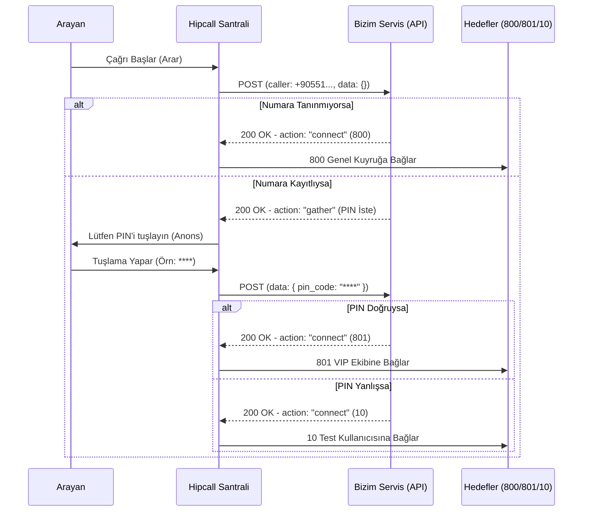

# Ödev 10 — External Management: Çağrıyı Kendi Servisinizle Yönlendirmek - Çalışma Notları

Bu doküman, External Management görevinde **A, B, C ve D bölümleri** için yapılan keşifleri, elde edilen sözleşmeleri ve uygulanan kod mantığını içermektedir.

---

## Bölüm A — Keşif: Panel Tarafı

### A1. External Management Nerede?
- **Menü Yolu:** Ayarlar > Geliştirici > Harici yönetimler
- **Liste URL'si:** [External Managers Listesi](https://use.hipcall.com.tr/portal/settings/communication/phone/external-managers/)
- **Oluşturma URL'si:** [Yeni External Manager Ekle](https://use.hipcall.com.tr/portal/settings/communication/phone/external-managers/new/)
> **Not:** Ödevdeki ipucu eskimiş, özellik doğrudan "Geliştirici" menüsü altında bulunuyor.

### A2. Hangi Alanlar İsteniyor ve Kimlik Doğrulama Var mı?
- **İstenen Alanlar:** Ad, İç hat numarası, URL (Webhook adresiniz) ve Varsayılan hedef (servis hata verirse çağrının düşeceği yer, örn: "800 - Hoş geldiniz").
- **Kimlik Doğrulama (Auth):** Evet, var. "Webservis kimlik doğrulama?" onay kutusu işaretlendiğinde **Basic Auth** (Kullanıcı adı ve Parola) isteniyor. Bu bilgiler, Hipcall sunucusundan istek atarken HTTP Header (`Authorization: Basic ...`) içine eklenecektir.

### A3. Kaydın Durumu
- **Değerler:** Başlangıçta kaydın durumu **Aktif** olarak gelir. Sayfanın altındaki "Devredışı" butonuna basılırsa durum **Pasif** (Devre dışı) olur.

### A4 ve A5. Kayıtlar (Logs) Sekmesi ve Hata Ayıklama Modu
- **Log Sekmesi İlk Görünüm:** İlk tıklandığında ekran boştur ve loglama kapalıdır.
- **Ayar:** "Hata Ayıklama Modu" (Debug Mode) ayarını "Aç ve logları kaydet" butonuna basarak aktifleştirmek gerekir.
- **Ne İşe Yarar:** Geliştirme amacıyla Hipcall'un sizin sunucunuza attığı istekleri ve aldığı cevapları görmenizi sağlar. En fazla **2 saat** açık kalır, süre dolunca sistem loglamayı otomatik kapatır ve mevcut logları siler.

### A6. Oluşturulan Kaydı Gelen Çağrı Akışına Bağlama (Test İçin)
1. Hipcall panelinde **Ayarlar > Telefon sistemi** menüsüne gidin.
2. **Telefon numaraları** sekmesine tıklayın.
3. Listeden test edeceğiniz numarayı bulup sağdaki eylemler menüsünden **"Göster"** butonuna basın.
4. Açılan numara detay sayfasında sol menüden **Çalışma saatleri** sekmesine geçin.
5. **Mesai içi hedef** açılır menüsünden, az önce oluşturduğunuz Harici Yönetim kaydını (örn. `WebExternal`) seçip kaydedin.

---

## Bölüm B — İlk İsteği Yakala (Keşif Notları)

### B1. HTTP Metodu
- Gelen istek her zaman **POST** metodunu kullanır.

### B2. İstek Gövdesi (Payload) ve Parametreler
Gelen JSON gövdesindeki alanlar:

| Alan Adı | Tip | Örnek Veri | Açıklama |
| --- | --- | --- | --- |
| `caller` | String | `+90551***9984` | Arayanın numarası. |
| `callee` | String | `908508850436` | Aranan Hipcall numarası. |
| `uuid` | String | `beee0a73-b8a4...` | Çağrıyı benzersiz kılan kimlik. |
| `direction` | String | `inbound` | Çağrının yönü (Gelen çağrılar için inbound). |
| `external_manager_id` | Integer | `44` | Tetiklenen harici yönetim kaydının ID'si. |
| `call_flow` | Array | `[{"action": "init"}]` | Çağrının o anki adımını belirten dizi. |
| `data` | Object | `{"pin_code": "1234"}` | O anki bağlam verilerini tutan obje (başlangıçta boş). |

### B3. Kimlik Doğrulama
- Arayüzden Webservis kimlik doğrulaması açıldığında, istek `Authorization: Basic <Base64_KullanıcıAdı:Şifre>` başlığı (Header) ile gelir.

### B4. Zaman Aşımı (Timeout) Davranışı
- Servis kasıtlı olarak 15 saniye veya daha fazla bekletildiğinde, arayan kişi bu süre boyunca telefonda normal çalma/bekleme sesi duyar. Süre sonunda Hipcall **zaman aşımına uğrar** ve çağrıyı "Varsayılan Hedef"e yönlendirir.
> **Sonuç:** Kodumuz hızlı çalışmalı, arayanı boş yere bekletmemelidir.

### B5. Sunucu Hatası (500 Error) Davranışı
- Sunucu `500` hatası döndüğünde, Hipcall çağrıyı **düşürmez**; güvenlik ağı olarak hemen "Varsayılan Hedef"e (örn. 800) bağlar. Paneldeki loglara 500 hatası düşer.

### B6. Geçersiz JSON (422 Error) Davranışı
- Servis `200 OK` dönse bile, eğer JSON gövdesi boş `{}` veya geçersizse Hipcall ne yapacağını bilemediği için **422 Unprocessable Entity** hatası yazar ve çağrıyı yine "Varsayılan Hedef"e atar.

### B7. Kaydın Durum Değişimi (Art Arda Hata Durumu)
- Yapılan testlerde, sunucu tarafında kasıtlı olarak art arda 10 kez `500 Internal Server Error` (Sunucu Hatası) döndürülmesine rağmen, Hipcall panelindeki External Manager kaydı otomatik olarak "Devredışı" (Pasif) duruma düşmemiştir. Sistem, servisin bozuk olduğunu varsaymasına rağmen çağrıları "Varsayılan Hedef"e (800 vb.) yönlendirmeye (fallback) inatla devam etmektedir. Otomatik bir devredışı bırakma mekanizması (circuit breaker) bulunmamaktadır.

### B8. Durum Yönetimi (Stateless Tasarım) ve Yeniden Başlatma
- Hipcall'un sunduğu bu API tamamen durumsuz (stateless) çalışmaya uygundur. Çağrının o anki durumu ve tuşlanan veriler (`data` objesi) Hipcall tarafından her istekte tekrar gönderilir.
- **Sonuç:** Uygulama `gather` komutunu gönderdikten sonra (kullanıcı tuşlama yaparken) yeniden başlatılırsa veya çökerse, ikinci istek geldiğinde hiçbir çağrı kopmaz veya hata alınmaz. Kodunuz sadece gelen `data`'ya bakarak bellek (in-memory) kullanmadan doğrudan yönlendirmeyi yapmaya devam eder.

**Gerçek Telefon Testi (02.10.2026):**

1. **Servis kapalıyken (Fallback testi):** Kayıtlı numaradan arandı → servis `gather` gönderdi → PIN girmeden uygulama kapatıldı (yeniden başlatılmadı) → Hipcall karşıda sunucu bulamadı → çağrıyı varsayılan hedefe (800 - "Firmamıza hoş geldiniz") yönlendirdi. **Çağrı kopmadı, güvenlik ağı çalıştı.** ✅
2. **Stateless restart testi:** Kayıtlı numaradan arandı → servis `gather` gönderdi → PIN girmeden uygulama kapatılıp hemen yeniden başlatıldı (`dotnet run`) → PIN tuşlandı → yeni kalkan sunucu `data.pin_code` değerini okudu ve çağrıyı doğru hedefe yönlendirdi. **Çağrı kopmadı, stateless tasarım kanıtlandı.** ✅

---

## Bölüm C — Cevap Sözleşmesi (Keşif Notları)

### C1. JSON'un Tam Şekli ve Zorunlu Alanlar
Geçerli bir Hipcall External Management cevap sözleşmesinde en dışta `"version": "1"` bulunması ve aksiyonların `"seq"` (sequence) isimli bir dizi içinde iletilmesi **zorunludur**.

Desteklendiği bizzat ölçülerek doğrulanan aksiyonların tam JSON şekilleri şöyledir:

**1. Hedefe Bağlama (Dial / Connect)**
Zorunlu alanlar: `action: "connect"` ve bağlanacak hedefin numarasını belirten `destination` alanıdır.

```json
{
  "seq": [
    {
      "action": "connect",
      "args": {
        "destination": "800"
      }
    }
  ],
  "version": "1"
}
```

**2. Anons Çalıp Tuşlama İsteme (Gather)**
Zorunlu alanlar: Çalınacak anonsun `ask` adresi ve girilen değerin Hipcall tarafından saklanıp bize geri döndürüleceği `variable_name` alanıdır.

```json
{
  "seq": [
    {
      "action": "gather",
      "args": {
        "ask": "https://storage.hipcall.com.tr/audio/tr/8000/ivr/ivr-please_enter_pin_followed_by_pound.wav",
        "max_digits": 4,
        "min_digits": 1,
        "variable_name": "pin_code"
      }
    }
  ],
  "version": "1"
}
```

### C2. Hedef Nasıl İfade Ediliyor?
Servisimizden çağrıyı bir hedefe yönlendirirken, hedef `"destination": "..."` şeklinde ifade ediliyor. `/extensions` API çıktısındaki id değerleri (örneğin `target_id: 3373`) yönlendirme için **kullanılmaz**. Bunun yerine, hedefin panelde görünen ve aramalarda kullanılan **dahili numarası** (number: 800, number: 801, number: 1000 vb.) kullanılır.

### C3. Aksiyon Bozuk Gönderildiğinde Ne Oluyor?
Eğer servisten dönen JSON gövdesi eksikse, boşsa (`{}`) veya yanlış anahtarlar (örneğin `seq` yerine `actions`) içeriyorsa sistem bunu işleyemez.
- Paneldeki loglar sekmesinde bu cevap **422 (Unprocessable Entity)** durumu ve `"Invalid payload format"` hatası ile listelenir.
- Bu hata durumunda **çağrı kapanmaz**; sistem entegrasyonu korumak için çağrıyı otomatik olarak panelde belirlenen "Varsayılan hedef"e (örneğin 800 - Hoş geldiniz anonsuna) aktarır.

### C4. Birden Fazla Aksiyon Sırayla Verilebiliyor mu?
**Evet.** `"seq"` dizisi içine birden fazla aksiyon eklendiğinde sistem bunları sırayla (sequence) işletir. Örneğin önce `play` aksiyonu ile bekleme anonsu dinletilip, hemen ardından `connect` ile çağrı aktarımı yapılabilir:

```json
{
  "seq": [
    {
      "action": "play",
      "args": {
        "url": "https://storage.hipcall.com.tr/audio/tr/8000/ivr/ivr-please_hold_while_party_contacted.wav"
      }
    },
    {
      "action": "connect",
      "args": {
        "destination": "800"
      }
    }
  ],
  "version": "1"
}
```

---

### Çalışmayan Denemeler
- **Sonsuz Döngü Hatası:** `gather` aksiyonunda `ask` parametresine verdiğim URL'de ses dosyası bulunamadığı için (404 hatası), Hipcall santrali anonsu çalamadan anında boş `data` ile geri döndü. Kod, PIN'in boş geldiğini görünce tekrar `gather` komutu gönderdi. Bu döngü saniyede defalarca tekrarlandı! Çözüm olarak `%100` çalışan bir AWS S3 ses dosyası linki verildi.
- **Tip (Type) Uyuşmazlığı:** `external_manager_id` değeri JSON'dan string olarak alınmaya çalışıldığında 500 hatası alındı (JSON'da bu değer int olarak `44` dönüyor). C# nesnesinde tipi `int` olarak değiştirilince düzeldi. (Hata anında Hipcall çağrıyı düşürmedi, güvenlik ağı olarak 800 hedefine yönlendirme yaptı.)

---

## Bölüm D — Uçtan Uca PIN Doğrulama Akışı (Test Raporu)

Sistem `crm.json` üzerinden arayan numarayı kontrol ederek üç farklı senaryoyu başarıyla işletmektedir. Hipcall santrali, her tuşlama (gather) sonrası uygulamanın belirlediği webhook adresine çağrının son durumu (data objesi içi dolu olarak) ile birlikte yeni bir POST isteği atarak akışın devam etmesini sağlamaktadır.

### 1. Tanınmayan Numara Senaryosu (CRM'de Yok)
Sistem, veritabanında bulunmayan bir numaradan (+90542***2292) gelen çağrıyı doğrudan varsayılan genel hedefe (800) bağlamıştır.

**Hipcall'dan Gelen İstek (data boş):**
```json
{
  "call_flow": [
    {
      "action": "init",
      "detail": {
        "id": 99,
        "type": "external_manager"
      },
      "timestamp": 1790789254
    }
  ],
  "callee": "90850***0436",
  "caller": "+90542***2292",
  "data": {},
  "direction": "inbound",
  "external_manager_id": 99,
  "timestamp": 1790789254,
  "uuid": "8d53****-****-****-****-********1ac8"
}
```

**Servisten Dönen Cevap (800'e Bağla):**
```json
{
  "seq": [
    {
      "action": "connect",
      "args": {
        "destination": "800"
      }
    }
  ],
  "version": "1"
}
```

### 2. Tanınan Numara ve Doğru PIN (VIP Hedefi - 801)
Sistem kayıtlı numarayı (+90551***9984) tanır ve önce gather komutu ile PIN ister. Doğru PIN (****) girildiğinde çağrıyı özel kuyruğa (801) aktarır.

**İlk İstek ve Tuşlama Bekleme (Gather) Cevabı:**
```json
{
  "seq": [
    {
      "action": "gather",
      "args": {
        "ask": "https://s3.amazonaws.com/freecodecamp/simonSound1.mp3",
        "max_digits": 4,
        "min_digits": 1,
        "variable_name": "pin_code"
      }
    }
  ],
  "version": "1"
}
```

**İkinci İstek (Tuşlanan PIN ile) ve Başarılı Yönlendirme Cevabı:**
```json
{
  "call_flow": [
    {
      "action": "init",
      "detail": {
        "id": 99,
        "type": "external_manager"
      },
      "timestamp": 1790789779
    }
  ],
  "callee": "90850***0436",
  "caller": "+90551***9984",
  "data": {
    "pin_code": "****"
  },
  "direction": "inbound",
  "external_manager_id": 99,
  "timestamp": 1790789795,
  "uuid": "efa3****-****-****-****-********bd98"
}
```

**Servisten Dönen Cevap (801'e Bağla):**
```json
{
  "seq": [
    {
      "action": "connect",
      "args": {
        "destination": "801"
      }
    }
  ],
  "version": "1"
}
```

### 3. Tanınan Numara ve Yanlış PIN (Test Kullanıcısı - 10)
Sistem numarayı tanıyıp PIN sorar. Tuşlanan PIN (****) veri tabanındakiyle eşleşmediği için güvenlik adımı olarak çağrıyı görseldeki Test Kullanıcısı hedefine (10) aktarır.

**İkinci İstek (Yanlış PIN ile):**
```json
{
  "call_flow": [
    {
      "action": "init",
      "detail": {
        "id": 99,
        "type": "external_manager"
      },
      "timestamp": 1790790293
    }
  ],
  "callee": "90850***0436",
  "caller": "+90551***9984",
  "data": {
    "pin_code": "****"
  },
  "direction": "inbound",
  "external_manager_id": 99,
  "timestamp": 1790790298,
  "uuid": "beee****-****-****-****-********f3c"
}
```

**Servisten Dönen Cevap (10'a Bağla):**
```json
{
  "seq": [
    {
      "action": "connect",
      "args": {
        "destination": "10"
      }
    }
  ],
  "version": "1"
}
```
### 4. Boş Tuşlama ve Gecikme Senaryosu (Kenar Durumlar)
- **Hiç Tuşlama Yapılmazsa:** Sistem boş bir PIN yanıtı (`data.pin_code` = `""`) aldığında, `gather` işlemi tekrar edilerek PIN istenmeye devam eder. Hipcall, arayan telefonu kapatana kadar (veya sistemsel timeout'a kadar) aynı akışı tekrarlar.
- **Servisin Yavaş Olma Durumu (5 Saniye Gecikme):** Testler sırasında kasıtlı olarak 5 saniye gecikme uygulandığında (Bölüm B4'te ölçüldüğü gibi) arayan kişi bu sürede sadece standart telefon çalma sesini duymaktadır; herhangi bir özel anons veya sessizlik olmaz. 5 saniye dolup servisten `gather` komutu döndüğü an doğrudan bip sesiyle PIN istenir. (Servis 15 saniye boyunca cevap veremezse Hipcall zaman aşımına uğrar ve çağrıyı Varsayılan Hedef'e atar veya sonlandırır).

---

## PIN Doğrulama Akışı (Sequence Diagram)


